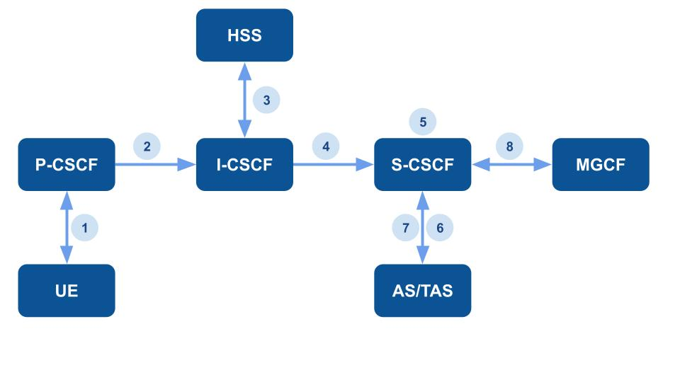

# Introduction of IP Multimedia Subsystem Part 2

In the rapidly evolving landscape of telecommunications, the IP Multimedia Subsystem (IMS) stands as a linchpin for delivering advanced multimedia and voice services over IP networks. As explored in the preceding introduction (IMS Part 1), IMS serves as a standardized and open architectural framework defined by the 3rd Generation Partnership Project (3GPP). Its role in facilitating seamless communication services, including voice, video, messaging, and data, highlights its pivotal position in modern network infrastructures. Building upon the foundational knowledge established in IMS Part 1, this section will delve into the IMS registration.

## Interaction and flow of Registration

### Procedures related to Proxy-CSCF discovery

P-CSCF is the initial point of contact for UE when establishing communication sessions. Therefore, P-CSCF discovery is a crucial step in IMS architecture. It involves the process of determining the network address of P-CSCF that the UE should contact during the initiation of the communication session. 

The Proxy-CSCF discovery shall be performed using the following mechanisms:

   - During the establishment of connectivity to the IP-Connectivity Access Network, provided that the IP-Connectivity Access Network supports such procedures.
   - Alternatively, the P-CSCF discovery may take place after the IP connectivity has been established. To enable P-CSCF discovery after the establishment of IP connectivity, the IP-Connectivity Access Network shall provide the following P-CSCF discovery option to the UE:
       - Utilizing DHCP to furnish the UE with the domain name and/or IP address of a Proxy-CSCF, along with the address of a Domain Name Server (DNS) capable of resolving the Proxy-CSCF name
       - The UE may be configured (e.g., during initial provisioning or via a 3GPP IMS Management Object (MO), or in the ISIM) to be aware of the fully qualified domain name (FQDN) of the P-CSCF or its IP address. If the domain name is known, DNS resolution is employed to obtain the IP address.

### DHCP/DNS procedure for P-CSCF discovery

When DNS is employed to retrieve the IP address of the P-CSCF, the name-address resolution mechanism is permitted to take the load information of the P-CSCFs. This load information, obtained through network management procedures, is factored in when determining the address of the P-CSCF for the UE.

1. Initiate the establishment of an IP-Connectivity Access Network bearer, utilizing the procedures available in the IP-Connectivity Access Network, if it is not already in place.

2. The UE initiates a request to a DHCP server, seeking the domain name and/or IP address of the P-CSCF, along with the IP addresses of DNS servers. This may involve multiple DHCP Query/Response message exchanges to obtain the necessary information.

3. The UE conducts a DNS query to retrieve a list of IP addresses for the P-CSCF(s), from which one is selected. If the response lacks IP addresses, an additional DNS query becomes necessary to resolve a FQDN to an IP address.
      - If the UE is aware of multiple P-CSCF addresses, the selection process is determined based on the home operator's configured policy for P-CSCF selection. The policy dictates the criteria or rules according to which one P-CSCF address is chosen over others in such scenarios.
      - Depending on the policy set by the home operator, the UE chooses the Home Proxy-CSCF by using a preconfigured Home P-CSCF FQDN. This selection can be made without the UE initially conducting local P-CSCF discovery.

### Assigning a Serving-CSCF for a user

When an UE attaches itself and becomes available for access to IMS services through explicit registration within the IMS, a S-CSCF shall be assigned to serve the UE. The S-CSCF plays a central role in call control and service execution for the registered UE within the IMS network.

The assignment of a S-CSCF is carried out within the I-CSCF. The selection of the S-CSCF requires the following information:

1. Required capabilities for user services: 
      - Provided by the HSS, this information outlines the necessary capabilities for the user's services.

2. Operator preference on a per-user basis: 
      - Also provided by the HSS, this information reflects the operator's preferences specific to each user.

3. Capabilities of individual S-CSCFs in the home network: 
      - This internal information within the operator's network, pertaining to the capabilities of individual S-CSCFs, may influence the S-CSCF selection.

4. Topological (i.e. P-CSCF) information of where the user is located
      - This internal information within the operator's network, concerning the topological details of the user's location, may be utilized in the S-CSCF selection process. The P-CSCF name is received in the registration request.

5. Topological information of where the S-CSCF is located
      - Another internal aspect within the operator's network, this information regarding the topological details of the S-CSCF's location may play a role in S-CSCF selection. 

6. Availability of S-CSCFs
      - Internal to the operator's network, information about the availability of S-CSCFs may be considered in the S-CSCF selection process. This information is obtained by the I-CSCF.

### Registration Flow:

1. UE (User Equipment) to P-CSCF (Proxy-Call Session Control Function):
      - After establishing IP connectivity, the UE, such as a mobile device, initiates IM registration by sending a SIP (Session Initiation Protocol) REGISTER request to the P-CSCF. This flow includes essential details such as the Public User Identity, Private User Identity, home network domain name, UE IP address, Instance Identifier, and GRUU (Globally Routable User Agent) Support Indication.
      - Upon receiving the Register information flow, the P-CSCF examines the "home domain name" to identify the entry point to the home network, which is the I-CSCF. 

2. P-CSCF to I-CSCF (Interrogating-CSCF):
      - The P-CSCF forwards the Register information flow to the I-CSCF, including details such as the P-CSCF address/name, Public User Identity, Private User Identity, P-CSCF network identifier, and UE IP address. 

3. I-CSCF to HSS (Home Subscriber Server):
      - The I-CSCF initiates the Cx-Query/Cx-Select-Pull information flow, sending relevant information to the HSS to perform user authentication and retrieve the user's location information. This flow includes the Public User Identity, Private User Identity, and P-CSCF network identifier.
         - The HSS verifies if the user is already registered and assesses whether the user is permitted to register in the specified P-CSCF network based on user subscription and operator limitations/restrictions.
      - Upon receiving Cx-Query Resp/Cx-Select-Pull Resp from the HSS, which includes the S-CSCF name or capabilities, the I-CSCF constructs a name from the capabilities, if necessary. The registration attempt is rejected if the HSS checking is unsuccessful.

4. I-CSCF to S-CSCF (Serving-CSCF):
      - The I-CSCF, using the S-CSCF name, determines the address of the S-CSCF through a name-address resolution mechanism. The load information of the S-CSCFs is considered in the resolution process. The I-CSCF also identifies the name of a suitable home network contact point, potentially based on information received from the HSS. The I-CSCF then sends the register information flow (P-CSCF address/name, Public User Identity, Private User Identity, P-CSCF network identifier, UE IP address) to the selected S-CSCF.

      - The S-CSCF rejects the registration if the number of registered contact addresses for a Public User Identity exceeds the configured limit. The S-CSCF stores the P-CSCF address/name supplied by the visited network, representing the address/name that the home network uses to forward subsequent terminating session signaling to the UE. The S-CSCF stores the P-CSCF Network ID information.

5. S-CSCF to HSS:
      - The S-CSCF communicates with the HSS to retrieve user profiles and perform tasks like registration and authentication.
         - The S-CSCF sends Cx-Put/Cx-Pull (Public User Identity, Private User Identity, S-CSCF name) to the HSS.
         - The HSS stores the S-CSCF name for the user and returns the information flow Cx-Put Resp/Cx-Pull Resp (user information) to the S-CSCF. The user information includes one or more names/addresses that can be used to access the platforms used for service control while the user is registered. Security information may also be sent for use within the S-CSCF.

6. S-CSCF to AS (Application Server):
      - The S-CSCF may interact with Application Servers for additional services.

7. S-CSCF to TAS (Telephony Application Server):
      - The S-CSCF interfaces with the TAS for services related to MMTel (MultiMedia Telephony) supplementary services.

8. S-CSCF to MGCF (Media Gateway Control Function):
      - The S-CSCF may communicate with the MGCF for signaling purposes.

## Conclusion

IMS registration is a fundamental process in the IMS that establishes connectivity for UE to access advanced multimedia and voice services over IP networks. The IMS operates as a standardized and open architectural framework defined by the 3GPP. Through standardized protocols, IMS ensures secure and seamless communication services, making it a crucial framework in modern telecommunications.

## Reference
3GPP TS 22.228: "Service requirements for the Internet Protocol (IP) multimedia core network subsystem (IMS) - Stage 1"

3GPP TS 23.218: "IP Multimedia (IM) session handling; IM call model; Stage 2"

3GPP TS 23.228: "IP Multimedia Subsystem (IMS) - Stage 2"

3GPP TS 29.228: "IP Multimedia (IM) Subsystem Cx and Dx Interfaces; Signalling flows and message contents"

## About
Hello, I am TzuChieh Huang. My ongoing research focuses on VoNR (Voice over New Radio). Feel free to reach out and share any inquiries or point out errors in the article. I welcome corrections and value your feedback. Please don't hesitate to contact me via email to contribute your insights.
