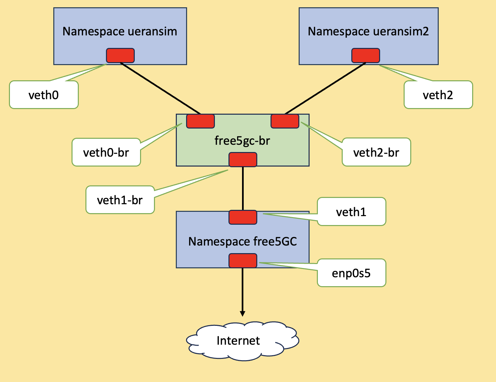

# Use network namespace to separate the 5GC and RAN simulator

## Overview

This article leverages namespace to run [UERANSIM](https://github.com/aligungr/UERANSIM), is an opensource applying 5G-UE and RAN(gNodeB) simulator, and connect to the free5GC. 
UERANSIM follows the 3GPP spec for developing, can support multiple 5GC including free5GC. 

Why are we using namespace? Well, you can follow [ULCL](https://github.com/s5uishida/free5gc_ueransim_ulcl_sample_config) and [free5GC compose](https://github.com/free5gc/free5gc-compose) to set up environment with VM and docker, but the hardware resources could meet limitation. With network namespace, you can have different and separate network instances of network 
interfaces and routing tables that operate independently. 

The environment is as follow. Suppose you have already installed as well as set up [free5GC](https://free5gc.org/guide/#information) and [UERANSIM](https://github.com/aligungr/UERANSIM/wiki/Installation) properly.

> [!NOTE] 
> *Namespace free5GC* represents host network namespace. And enp0s5 is an ethernet interface connectting to external.


```
Each devices as follow
| Device        | IP            |
| ------------- |:-------------:|
| veth0        | 10.200.200.1   |
| veth1        | 10.200.200.2   |
| br-veth0     | none           |
| br-veth1     | none           |
| enp0s5       | 10.211.55.23   |


UE information in UERANSIM as follow. Already 
| IMSI             | DNN           |
| ---------------- |:-------------:|
| 208930000000003  | internet      |
```

## Configuration file of free5GC and UERANSIM
### free5GC 
- **free5gc/config/amfcfg.yaml**
```yaml
info:
  version: 1.0.3
  description: AMF initial local configuration

configuration:
  amfName: AMF # the name of this AMF
  ngapIpList:  # the IP list of N2 interfaces on this AMF
    - 10.200.200.2 # 127.0.0.18
  sbi: # Service-based interface information
    scheme: http # the protocol for sbi (http or https)
    registerIPv4: 127.0.0.18 # IP used to register to NRF
    bindingIPv4: 127.0.0.18  # IP used to bind the service
    port: 8000 # port used to bind the service
    tls: # the local path of TLS key
      pem: config/TLS/amf.pem # AMF TLS Certificate
      key: config/TLS/amf.key # AMF TLS Private key
  serviceNameList: # the SBI services provided by this AMF, refer to TS 29.518
    - namf-comm # Namf_Communication service
    - namf-evts # Namf_EventExposure service
    - namf-mt   # Namf_MT service
    - namf-loc  # Namf_Location service
    - namf-oam  # OAM service
  servedGuamiList: # Guami (Globally Unique AMF ID) list supported by this AMF
    # <GUAMI> = <MCC><MNC><AMF ID>
    - plmnId: # Public Land Mobile Network ID, <PLMN ID> = <MCC><MNC>
        mcc: 208 # Mobile Country Code (3 digits string, digit: 0~9)
        mnc: 93 # Mobile Network Code (2 or 3 digits string, digit: 0~9)
      amfId: cafe00 # AMF identifier (3 bytes hex string, range: 000000~FFFFFF)
  supportTaiList:  # the TAI (Tracking Area Identifier) list supported by this AMF
    - plmnId: # Public Land Mobile Network ID, <PLMN ID> = <MCC><MNC>
        mcc: 208 # Mobile Country Code (3 digits string, digit: 0~9)
        mnc: 93 # Mobile Network Code (2 or 3 digits string, digit: 0~9)
      tac: 1 # Tracking Area Code (uinteger, range: 0~16777215)
  plmnSupportList: # the PLMNs (Public land mobile network) list supported by this AMF
    - plmnId: # Public Land Mobile Network ID, <PLMN ID> = <MCC><MNC>
        mcc: 208 # Mobile Country Code (3 digits string, digit: 0~9)
        mnc: 93 # Mobile Network Code (2 or 3 digits string, digit: 0~9)
      snssaiList: # the S-NSSAI (Single Network Slice Selection Assistance Information) list supported by this AMF
        - sst: 1 # Slice/Service Type (uinteger, range: 0~255)
          sd: 010203 # Slice Differentiator (3 bytes hex string, range: 000000~FFFFFF)
        - sst: 1 # Slice/Service Type (uinteger, range: 0~255)
          sd: 112233 # Slice Differentiator (3 bytes hex string, range: 000000~FFFFFF)
  supportDnnList:  # the DNN (Data Network Name) list supported by this AMF
    - internet
  nrfUri: http://127.0.0.10:8000 # a valid URI of NRF
  security:  # NAS security parameters
    integrityOrder: # the priority of integrity algorithms
      - NIA2
      # - NIA0
    cipheringOrder: # the priority of ciphering algorithms
      - NEA0
      # - NEA2
  networkName:  # the name of this core network
    full: free5GC
    short: free
  locality: area1 # Name of the location where a set of AMF, SMF and UPFs are located
  networkFeatureSupport5GS: # 5gs Network Feature Support IE, refer to TS 24.501
    enable: true # append this IE in Registration accept or not
    length: 1 # IE content length (uinteger, range: 1~3)
    imsVoPS: 0 # IMS voice over PS session indicator (uinteger, range: 0~1)
    emc: 0 # Emergency service support indicator for 3GPP access (uinteger, range: 0~3)
    emf: 0 # Emergency service fallback indicator for 3GPP access (uinteger, range: 0~3)
    iwkN26: 0 # Interworking without N26 interface indicator (uinteger, range: 0~1)
    mpsi: 0 # MPS indicator (uinteger, range: 0~1)
    emcN3: 0 # Emergency service support indicator for Non-3GPP access (uinteger, range: 0~1)
    mcsi: 0 # MCS indicator (uinteger, range: 0~1)
  t3502Value: 720  # timer value (seconds) at UE side
  t3512Value: 3600 # timer value (seconds) at UE side
  non3gppDeregistrationTimerValue: 3240 # timer value (seconds) at UE side
  # retransmission timer for paging message
  t3513:
    enable: true     # true or false
    expireTime: 6s   # default is 6 seconds
    maxRetryTimes: 4 # the max number of retransmission
  # retransmission timer for NAS Deregistration Request message
  t3522:
    enable: true     # true or false
    expireTime: 6s   # default is 6 seconds
    maxRetryTimes: 4 # the max number of retransmission
  # retransmission timer for NAS Registration Accept message
  t3550:
    enable: true     # true or false
    expireTime: 6s   # default is 6 seconds
    maxRetryTimes: 4 # the max number of retransmission
  # retransmission timer for NAS Authentication Request/Security Mode Command message
  t3560:
    enable: true     # true or false
    expireTime: 6s   # default is 6 seconds
    maxRetryTimes: 4 # the max number of retransmission
  # retransmission timer for NAS Notification message
  t3565:
    enable: true     # true or false
    expireTime: 6s   # default is 6 seconds
    maxRetryTimes: 4 # the max number of retransmission
  # retransmission timer for NAS Identity Request message
  t3570:
    enable: true     # true or false
    expireTime: 6s   # default is 6 seconds
    maxRetryTimes: 4 # the max number of retransmission

# the kind of log output
# debugLevel: how detailed to output, value: trace, debug, info, warn, error, fatal, panic
# ReportCaller: enable the caller report or not, value: true or false
logger:
  AMF:
    debugLevel: info
    ReportCaller: false
  NAS:
    debugLevel: info
    ReportCaller: false
  FSM:
    debugLevel: info
    ReportCaller: false
  NGAP:
    debugLevel: info
    ReportCaller: false
  Aper:
    debugLevel: info
    ReportCaller: false
```
- **free5gc/config/smfcfg.yaml**
```yaml
info:
  version: 1.0.2
  description: SMF initial local configuration

configuration:
  smfName: SMF # the name of this SMF
  sbi: # Service-based interface information
    scheme: http # the protocol for sbi (http or https)
    registerIPv4: 127.0.0.2 # IP used to register to NRF
    bindingIPv4: 127.0.0.2  # IP used to bind the service
    port: 8000 # Port used to bind the service
    tls: # the local path of TLS key
      key: config/TLS/smf.key # SMF TLS Certificate
      pem: config/TLS/smf.pem # SMF TLS Private key
  serviceNameList: # the SBI services provided by this SMF, refer to TS 29.502
    - nsmf-pdusession # Nsmf_PDUSession service
    - nsmf-event-exposure # Nsmf_EventExposure service
    - nsmf-oam # OAM service
  snssaiInfos: # the S-NSSAI (Single Network Slice Selection Assistance Information) list supported by this AMF
    - sNssai: # S-NSSAI (Single Network Slice Selection Assistance Information)
        sst: 1 # Slice/Service Type (uinteger, range: 0~255)
        sd: 010203 # Slice Differentiator (3 bytes hex string, range: 000000~FFFFFF)
      dnnInfos: # DNN information list
        - dnn: internet # Data Network Name
          dns: # the IP address of DNS
            ipv4: 8.8.8.8
    - sNssai: # S-NSSAI (Single Network Slice Selection Assistance Information)
        sst: 1 # Slice/Service Type (uinteger, range: 0~255)
        sd: 112233 # Slice Differentiator (3 bytes hex string, range: 000000~FFFFFF)
      dnnInfos: # DNN information list
        - dnn: internet # Data Network Name
          dns: # the IP address of DNS
            ipv4: 8.8.8.8
  plmnList: # the list of PLMN IDs that this SMF belongs to (optional, remove this key when unnecessary)
    - mcc: "208" # Mobile Country Code (3 digits string, digit: 0~9)
      mnc: "93" # Mobile Network Code (2 or 3 digits string, digit: 0~9)
  locality: area1 # Name of the location where a set of AMF, SMF and UPFs are located
  pfcp: # the IP address of N4 interface on this SMF (PFCP)
    addr: 127.0.0.1
  userplaneInformation: # list of userplane information
    upNodes: # information of userplane node (AN or UPF)
      gNB1: # the name of the node
        type: AN # the type of the node (AN or UPF)
      UPF:  # the name of the node
        type: UPF # the type of the node (AN or UPF)
        nodeID: 127.0.0.8 # the IP/FQDN of N4 interface on this UPF (PFCP)
        sNssaiUpfInfos: # S-NSSAI information list for this UPF
          - sNssai: # S-NSSAI (Single Network Slice Selection Assistance Information)
              sst: 1 # Slice/Service Type (uinteger, range: 0~255)
              sd: 010203 # Slice Differentiator (3 bytes hex string, range: 000000~FFFFFF)
            dnnUpfInfoList: # DNN information list for this S-NSSAI
              - dnn: internet
                pools:
                  - cidr: 10.60.0.0/16
          - sNssai: # S-NSSAI (Single Network Slice Selection Assistance Information)
              sst: 1 # Slice/Service Type (uinteger, range: 0~255)
              sd: 112233 # Slice Differentiator (3 bytes hex string, range: 000000~FFFFFF)
            dnnUpfInfoList: # DNN information list for this S-NSSAI
              - dnn: internet
                pools:
                  - cidr: 10.61.0.0/16
        interfaces: # Interface list for this UPF
          - interfaceType: N3 # the type of the interface (N3 or N9)
            endpoints: # the IP address of this N3/N9 interface on this UPF
              - 10.200.200.2 # 127.0.0.8
            networkInstance: internet # Data Network Name (DNN)
    links: # the topology graph of userplane, A and B represent the two nodes of each link
      - A: gNB1
        B: UPF
  nrfUri: http://127.0.0.10:8000 # a valid URI of NRF

# the kind of log output
# debugLevel: how detailed to output, value: trace, debug, info, warn, error, fatal, panic
# ReportCaller: enable the caller report or not, value: true or false
logger:
  SMF:
    debugLevel: info
    ReportCaller: false
  NAS:
    debugLevel: info
    ReportCaller: false
  NGAP:
    debugLevel: info
    ReportCaller: false
  Aper:
    debugLevel: info
    ReportCaller: false
  PFCP:
    debugLevel: info
    ReportCaller: false
```
- **free5gc/config/upfcfg.yaml**
```yaml
version: 1.0.3
description: UPF initial local configuration

# The listen IP and nodeID of the N4 interface on this UPF (Can't set to 0.0.0.0)
pfcp:
  addr: 127.0.0.8   # IP addr for listening
  nodeID: 127.0.0.8 # External IP or FQDN can be reached
  retransTimeout: 1s # retransmission timeout
  maxRetrans: 3 # the max number of retransmission

gtpu:
  forwarder: gtp5g
  # The IP list of the N3/N9 interfaces on this UPF
  # If there are multiple connection, set addr to 0.0.0.0 or list all the addresses
  ifList:
    - addr: 10.200.200.2 # 127.0.0.8
      type: N3
      # name: upf.5gc.nctu.me
      # ifname: gtpif

# The DNN list supported by UPF
dnnList:
  - dnn: internet # Data Network Name
    cidr: 10.60.0.0/24 # Classless Inter-Domain Routing for assigned IPv4 pool of UE
    # natifname: eth0

logger: # log output setting
  enable: true # true or false
  level: info # how detailed to output, value: trace, debug, info, warn, error, fatal, panic
  reportCaller: false # enable the caller report or not, value: true or false

```
### UERANSIM
- **UERANSIM/config/free5gc-gnb.yaml**
```yaml
mcc: '208'          # Mobile Country Code value
mnc: '93'           # Mobile Network Code value (2 or 3 digits)

nci: '0x000000010'  # NR Cell Identity (36-bit)
idLength: 32        # NR gNB ID length in bits [22...32]
tac: 1              # Tracking Area Code

linkIp: 127.0.0.1   # gNB's local IP address for Radio Link Simulation (Usually same with local IP)
ngapIp: 10.200.200.1 # 127.0.0.1   # gNB's local IP address for N2 Interface (Usually same with local IP)
gtpIp: 10.200.200.1 # 127.0.0.1    # gNB's local IP address for N3 Interface (Usually same with local IP)

# List of AMF address information
amfConfigs:
  - address: 10.200.200.2 # 127.0.0.1
    port: 38412

# List of supported S-NSSAIs by this gNB
slices:
  - sst: 0x1
    sd: 0x010203

# Indicates whether or not SCTP stream number errors should be ignored.
ignoreStreamIds: true
```
- **UERANSIM/config/free5gc-ue.yaml**
```yaml
# IMSI number of the UE. IMSI = [MCC|MNC|MSISDN] (In total 15 or 16 digits)
supi: 'imsi-208930000000003'
# Mobile Country Code value
mcc: '208'
# Mobile Network Code value (2 or 3 digits)
mnc: '93'

# Permanent subscription key
key: '8baf473f2f8fd09487cccbd7097c6862'
# Operator code (OP or OPC) of the UE
op: '8e27b6af0e692e750f32667a3b14605d'
# This value specifies the OP type and it can be either 'OP' or 'OPC'
opType: 'OP'
# Authentication Management Field (AMF) value
amf: '8000'
# IMEI number of the device. It is used if no SUPI is provided
imei: '356938035643803'
# IMEISV number of the device. It is used if no SUPI and IMEI is provided
imeiSv: '4370816125816151'

# List of gNB IP addresses for Radio Link Simulation
gnbSearchList:
  - 127.0.0.1

# Initial PDU sessions to be established
sessions:
  - type: 'IPv4'
    apn: 'internet'
    slice:
      sst: 0x01
      sd: 0x010203

# List of requested S-NSSAIs by this UE
slices:
  - sst: 0x01
    sd: 0x010203

# Supported encryption and integrity algorithms by this UE
integrity:
  IA1: true
  IA2: true
  IA3: true
ciphering:
  EA1: true
  EA2: true
  EA3: true
```

## Environment set up of free5GC and UERANSIM
First, create a namespace. 

> [!NOTE]
> Assume that you are either running as root, or it behoves you to prepend ```sudo``` to commands as necessary.

```
ip netns add ueransim
```
Next, add the bridge.
```
ip link add free5gc-br type bridge
```
Add two pairs of veth.
```
ip link add veth0 type veth peer name br-veth0
ip link add veth1 type veth peer name br-veth1
```
Now, it could be like
```
root@free5gc:~# ip a
1: lo: <LOOPBACK,UP,LOWER_UP> mtu 65536 qdisc noqueue state UNKNOWN group default qlen 1000
    link/loopback 00:00:00:00:00:00 brd 00:00:00:00:00:00
    inet 127.0.0.1/8 scope host lo
       valid_lft forever preferred_lft forever
    inet6 ::1/128 scope host
       valid_lft forever preferred_lft forever
2: enp0s5: <BROADCAST,MULTICAST,UP,LOWER_UP> mtu 1500 qdisc fq_codel state UP group default qlen 1000
    link/ether 00:1c:42:b1:ba:f4 brd ff:ff:ff:ff:ff:ff
    inet 10.211.55.23/24 brd 10.211.55.255 scope global dynamic enp0s5
       valid_lft 1714sec preferred_lft 1714sec
    inet6 fdb2:2c26:f4e4:0:21c:42ff:feb1:baf4/64 scope global dynamic mngtmpaddr noprefixroute
       valid_lft 2591750sec preferred_lft 604550sec
    inet6 fe80::21c:42ff:feb1:baf4/64 scope link
       valid_lft forever preferred_lft forever
3: enp0s6: <BROADCAST,MULTICAST,UP,LOWER_UP> mtu 1500 qdisc fq_codel state UP group default qlen 1000
    link/ether 00:1c:42:f1:11:c6 brd ff:ff:ff:ff:ff:ff
    inet 10.37.129.20/24 brd 10.37.129.255 scope global enp0s6
       valid_lft forever preferred_lft forever
    inet6 fdb2:2c26:f4e4:1:21c:42ff:fef1:11c6/64 scope global dynamic mngtmpaddr noprefixroute
       valid_lft 2591750sec preferred_lft 604550sec
    inet6 fe80::21c:42ff:fef1:11c6/64 scope link
       valid_lft forever preferred_lft forever
4: free5gc-br: <BROADCAST,MULTICAST> mtu 1500 qdisc noop state DOWN group default qlen 1000
    link/ether 4e:f6:d7:9c:50:de brd ff:ff:ff:ff:ff:ff
5: br-veth0@veth0: <BROADCAST,MULTICAST,M-DOWN> mtu 1500 qdisc noop state DOWN group default qlen 1000
    link/ether c2:31:0c:5f:45:81 brd ff:ff:ff:ff:ff:ff
6: veth0@br-veth0: <BROADCAST,MULTICAST,M-DOWN> mtu 1500 qdisc noop state DOWN group default qlen 1000
    link/ether 4a:0f:1e:80:9b:be brd ff:ff:ff:ff:ff:ff
7: br-veth1@veth1: <BROADCAST,MULTICAST,M-DOWN> mtu 1500 qdisc noop state DOWN group default qlen 1000
    link/ether 56:99:b0:82:78:0d brd ff:ff:ff:ff:ff:ff
8: veth1@br-veth1: <BROADCAST,MULTICAST,M-DOWN> mtu 1500 qdisc noop state DOWN group default qlen 1000
    link/ether 12:5a:56:00:5b:be brd ff:ff:ff:ff:ff:ff
```

**Next**, assign interface to namespace.
```
ip link set dev veth0 netns ueransim
```
Set ip address.
```
ip netns exec ueransim ip a add 10.200.200.1/24 dev veth0
```
Enable both interface. Don't forget **lo**
```
ip netns exec ueransim ip link set lo up
ip netns exec ueransim ip link set veth0 up
```
Check with ```ip a```
```
root@free5gc:~# ip netns exec ueransim ip a
1: lo: <LOOPBACK,UP,LOWER_UP> mtu 65536 qdisc noqueue state UNKNOWN group default qlen 1000
    link/loopback 00:00:00:00:00:00 brd 00:00:00:00:00:00
    inet 127.0.0.1/8 scope host lo
       valid_lft forever preferred_lft forever
    inet6 ::1/128 scope host
       valid_lft forever preferred_lft forever
6: veth0@if5: <NO-CARRIER,BROADCAST,MULTICAST,UP> mtu 1500 qdisc noqueue state LOWERLAYERDOWN group default qlen 1000
    link/ether 4a:0f:1e:80:9b:be brd ff:ff:ff:ff:ff:ff link-netnsid 0
    inet 10.200.200.1/24 scope global veth0
       valid_lft forever preferred_lft forever
```
Set for veth1 as well.
```
ip a add 10.200.200.2/24 dev veth1
ip link set veth1 up
```
Let two interfaces attatch to bridge. 
```
ip link set dev br-veth0 master free5gc-br
ip link set dev br-veth1 master free5gc-br
ip link set br-veth0 up
ip link set br-veth1 up
ip link set free5gc-br up
```
Using ```bridge link``` to check.
```
root@free5gc:~# bridge link
5: br-veth0@if6: <BROADCAST,MULTICAST,UP,LOWER_UP> mtu 1500 master free5gc-br state forwarding priority 32 cost 2
7: br-veth1@veth1: <BROADCAST,MULTICAST,UP,LOWER_UP> mtu 1500 master free5gc-br state forwarding priority 32 cost 2
```
Now it looks like
```
1: lo: <LOOPBACK,UP,LOWER_UP> mtu 65536 qdisc noqueue state UNKNOWN group default qlen 1000
    link/loopback 00:00:00:00:00:00 brd 00:00:00:00:00:00
    inet 127.0.0.1/8 scope host lo
       valid_lft forever preferred_lft forever
    inet6 ::1/128 scope host
       valid_lft forever preferred_lft forever
2: enp0s5: <BROADCAST,MULTICAST,UP,LOWER_UP> mtu 1500 qdisc fq_codel state UP group default qlen 1000
    link/ether 00:1c:42:b1:ba:f4 brd ff:ff:ff:ff:ff:ff
    inet 10.211.55.23/24 brd 10.211.55.255 scope global dynamic enp0s5
       valid_lft 1000sec preferred_lft 1000sec
    inet6 fdb2:2c26:f4e4:0:21c:42ff:feb1:baf4/64 scope global dynamic mngtmpaddr noprefixroute
       valid_lft 2591870sec preferred_lft 604670sec
    inet6 fe80::21c:42ff:feb1:baf4/64 scope link
       valid_lft forever preferred_lft forever
3: enp0s6: <BROADCAST,MULTICAST,UP,LOWER_UP> mtu 1500 qdisc fq_codel state UP group default qlen 1000
    link/ether 00:1c:42:f1:11:c6 brd ff:ff:ff:ff:ff:ff
    inet 10.37.129.20/24 brd 10.37.129.255 scope global enp0s6
       valid_lft forever preferred_lft forever
    inet6 fdb2:2c26:f4e4:1:21c:42ff:fef1:11c6/64 scope global dynamic mngtmpaddr noprefixroute
       valid_lft 2591870sec preferred_lft 604670sec
    inet6 fe80::21c:42ff:fef1:11c6/64 scope link
       valid_lft forever preferred_lft forever
4: free5gc-br: <BROADCAST,MULTICAST,UP,LOWER_UP> mtu 1500 qdisc noqueue state UP group default qlen 1000
    link/ether 56:99:b0:82:78:0d brd ff:ff:ff:ff:ff:ff
    inet6 fe80::5499:b0ff:fe82:780d/64 scope link
       valid_lft forever preferred_lft forever
5: br-veth0@if6: <BROADCAST,MULTICAST,UP,LOWER_UP> mtu 1500 qdisc noqueue master free5gc-br state UP group default qlen 1000
    link/ether c2:31:0c:5f:45:81 brd ff:ff:ff:ff:ff:ff link-netns ueransim
    inet6 fe80::c031:cff:fe5f:4581/64 scope link
       valid_lft forever preferred_lft forever
7: br-veth1@veth1: <BROADCAST,MULTICAST,UP,LOWER_UP> mtu 1500 qdisc noqueue master free5gc-br state UP group default qlen 1000
    link/ether 56:99:b0:82:78:0d brd ff:ff:ff:ff:ff:ff
    inet6 fe80::5499:b0ff:fe82:780d/64 scope link
       valid_lft forever preferred_lft forever
8: veth1@br-veth1: <BROADCAST,MULTICAST,UP,LOWER_UP> mtu 1500 qdisc noqueue state UP group default qlen 1000
    link/ether 12:5a:56:00:5b:be brd ff:ff:ff:ff:ff:ff
    inet 10.200.200.2/24 scope global veth1
       valid_lft forever preferred_lft forever
    inet6 fe80::105a:56ff:fe00:5bbe/64 scope link
       valid_lft forever preferred_lft forever
```
**Let's test it**.

> [!NOTE]
> You can perform ```ip netns exec ueransim /bin/bash --rcfile <(echo "PS1=\"ueransim> \"")``` to enter namespace and modify shell prefix.

```
root@free5gc:~# ip netns exec ueransim /bin/bash --rcfile <(echo "PS1=\"ueransim> \"")
ueransim> ping -c2 10.200.200.2
PING 10.200.200.2 (10.200.200.2) 56(84) bytes of data.
64 bytes from 10.200.200.2: icmp_seq=1 ttl=64 time=0.089 ms
64 bytes from 10.200.200.2: icmp_seq=2 ttl=64 time=0.226 ms

--- 10.200.200.2 ping statistics ---
2 packets transmitted, 2 received, 0% packet loss, time 1020ms
rtt min/avg/max/mdev = 0.089/0.157/0.226/0.068 ms
```
Insert default routing rule.
```
ueransim> ip route add default via 10.200.200.2
ueransim> netstat -rn
Kernel IP routing table
Destination     Gateway         Genmask         Flags   MSS Window  irtt Iface
0.0.0.0         10.200.200.2    0.0.0.0         UG        0 0          0 veth0
10.200.200.0    0.0.0.0         255.255.255.0   U         0 0          0 veth0
```
Try to ping 8.8.8.8
```
ueransim> ping -c2 8.8.8.8
PING 8.8.8.8 (8.8.8.8) 56(84) bytes of data.

--- 8.8.8.8 ping statistics ---
2 packets transmitted, 0 received, 100% packet loss, time 1028ms

```
It is because the main host must translate the source addresses. Besides, the main host need to forward packet. 
```
root@free5gc:~# iptables -t nat -A POSTROUTING -o enp0s5 -j MASQUERADE
root@free5gc:~# sysctl -w net.ipv4.ip_forward=1
root@free5gc:~# sudo iptables -I FORWARD 1 -j ACCEPT
```
And then.
```
ueransim> ping -c2 8.8.8.8
PING 8.8.8.8 (8.8.8.8) 56(84) bytes of data.
64 bytes from 8.8.8.8: icmp_seq=1 ttl=127 time=13.9 ms
64 bytes from 8.8.8.8: icmp_seq=2 ttl=127 time=28.0 ms

--- 8.8.8.8 ping statistics ---
2 packets transmitted, 2 received, 0% packet loss, time 1002ms
rtt min/avg/max/mdev = 13.866/20.939/28.012/7.073 ms
```

After free5GC execute ```run.sh```, it's time for UERANSIM.

**In terminal 1**:
```
ueransim> build/nr-gnb -c config/free5gc-gnb.yaml
UERANSIM v3.1.0
[2023-07-05 19:58:26.368] [sctp] [info] Trying to establish SCTP connection... (10.200.200.2:38412)
[2023-07-05 19:58:26.373] [sctp] [info] SCTP connection established (10.200.200.2:38412)
[2023-07-05 19:58:26.374] [sctp] [debug] SCTP association setup ascId[3]
[2023-07-05 19:58:26.375] [ngap] [debug] Sending NG Setup Request
[2023-07-05 19:58:26.380] [ngap] [debug] NG Setup Response received
[2023-07-05 19:58:26.380] [ngap] [info] NG Setup procedure is successful
[2023-07-05 19:58:35.804] [mr] [info] New UE connected to gNB. Total number of UEs is now: 1
[2023-07-05 19:58:35.806] [rrc] [debug] Sending RRC Setup for UE[3]
[2023-07-05 19:58:35.807] [ngap] [debug] Initial NAS message received from UE 3
[2023-07-05 19:58:35.869] [ngap] [debug] Initial Context Setup Request received
[2023-07-05 19:58:36.108] [ngap] [info] PDU session resource is established for UE[3] count[1]
```
**In terminal 2**:
```
ueransim> sudo build/nr-ue -c config/free5gc-ue.yaml
UERANSIM v3.1.0
[2023-07-05 19:58:35.803] [nas] [debug] NAS layer started
[2023-07-05 19:58:35.803] [rrc] [debug] RRC layer started
[2023-07-05 19:58:35.804] [nas] [info] UE switches to state: MM-DEREGISTERED/PLMN-SEARCH
[2023-07-05 19:58:35.804] [nas] [info] UE connected to gNB
[2023-07-05 19:58:35.804] [nas] [info] UE switches to state: MM-DEREGISTERED/NORMAL-SERVICE
[2023-07-05 19:58:35.804] [nas] [info] UE switches to state: MM-REGISTERED-INITIATED/NA
[2023-07-05 19:58:35.805] [rrc] [debug] Sending RRC Setup Request
[2023-07-05 19:58:35.806] [rrc] [info] RRC connection established
[2023-07-05 19:58:35.806] [nas] [info] UE switches to state: CM-CONNECTED
[2023-07-05 19:58:35.838] [nas] [debug] Received rand[61262F32A617D0BAD716603B1CBDA477] autn[44778026F4238000FC14B59D68855328]
[2023-07-05 19:58:35.838] [nas] [debug] Calculated res[47759045F5ACEA59] ck[1C559301F29EF49572F5D150B3B99288] ik[D223317F752F233CE4C7AA253644D882] ak[528433D1FBE6] mac_a[FC14B59D68855328]
[2023-07-05 19:58:35.838] [nas] [debug] Used snn[5G:mnc093.mcc208.3gppnetwork.org] sqn[16F3B3F70FC5]
[2023-07-05 19:58:35.838] [nas] [debug] Derived kSeaf[7FC8B7FB1B141B6579B9C0FAEB9CCF1312FE9F9634868E234756DE49FD67C5F1] kAusf[FA0402A892E6046D52F4DECACA40B2A75B698FCEAD5EB320139FC69B77BD4C46] kAmf[3D4AD68E153B9642ACBECC67AD399015F7CB578F9DF4C88A35EED99C72C9B95B]
[2023-07-05 19:58:35.843] [nas] [debug] Derived kNasEnc[1F829EB2BA238DD0226C3484E6A79D1F] kNasInt[251C0412B1BAD88A9DD0008F32D6F216]
[2023-07-05 19:58:35.843] [nas] [debug] Selected integrity[2] ciphering[0]
[2023-07-05 19:58:35.869] [nas] [debug] T3512 started with int[3600]
[2023-07-05 19:58:35.869] [nas] [info] UE switches to state: MM-REGISTERED/NORMAL-SERVICE
[2023-07-05 19:58:35.869] [nas] [info] Initial Registration is successful
[2023-07-05 19:58:35.869] [nas] [info] Initial PDU sessions are establishing [1#]
[2023-07-05 19:58:35.869] [nas] [debug] Sending PDU session establishment request
[2023-07-05 19:58:36.108] [nas] [info] PDU Session establishment is successful PSI[1]
[2023-07-05 19:58:36.113] [app] [info] Connection setup for PDU session[1] is successful, TUN interface[uesimtun0, 10.60.0.1] is up.
```
**In terminal 3**:
```
ueransim> ip a
1: lo: <LOOPBACK,UP,LOWER_UP> mtu 65536 qdisc noqueue state UNKNOWN group default qlen 1000
    link/loopback 00:00:00:00:00:00 brd 00:00:00:00:00:00
    inet 127.0.0.1/8 scope host lo
       valid_lft forever preferred_lft forever
    inet6 ::1/128 scope host
       valid_lft forever preferred_lft forever
2: uesimtun0: <POINTOPOINT,MULTICAST,NOARP,UP,LOWER_UP> mtu 1500 qdisc fq_codel state UNKNOWN group default qlen 500
    link/none
    inet 10.60.0.1/32 scope global uesimtun0
       valid_lft forever preferred_lft forever
    inet6 fe80::b5ef:5b4:e3f6:af64/64 scope link stable-privacy
       valid_lft forever preferred_lft forever
6: veth0@if5: <BROADCAST,MULTICAST,UP,LOWER_UP> mtu 1500 qdisc noqueue state UP group default qlen 1000
    link/ether 4a:0f:1e:80:9b:be brd ff:ff:ff:ff:ff:ff link-netnsid 0
    inet 10.200.200.1/24 scope global veth0
       valid_lft forever preferred_lft forever
    inet6 fe80::480f:1eff:fe80:9bbe/64 scope link
       valid_lft forever preferred_lft forever
ueransim> ping -c2 -I uesimtun0 8.8.8.8
PING 8.8.8.8 (8.8.8.8) from 10.60.0.1 uesimtun0: 56(84) bytes of data.
64 bytes from 8.8.8.8: icmp_seq=1 ttl=127 time=19.5 ms
64 bytes from 8.8.8.8: icmp_seq=2 ttl=127 time=33.2 ms

--- 8.8.8.8 ping statistics ---
2 packets transmitted, 2 received, 0% packet loss, time 1006ms
rtt min/avg/max/mdev = 19.478/26.348/33.219/6.870 ms
```
Also ping to google.com.
```
ueransim> ping -c2 -I uesimtun0 google.com
PING google.com (172.217.160.110) from 10.60.0.1 uesimtun0: 56(84) bytes of data.
64 bytes from tsa03s06-in-f14.1e100.net (172.217.160.110): icmp_seq=1 ttl=127 time=17.3 ms
64 bytes from tsa03s06-in-f14.1e100.net (172.217.160.110): icmp_seq=2 ttl=127 time=29.5 ms

--- google.com ping statistics ---
2 packets transmitted, 2 received, 0% packet loss, time 1005ms
rtt min/avg/max/mdev = 17.295/23.385/29.476/6.090 ms
```
## What if two UERANSIMs with two namespaces?



Same as before, you should create another namespace for UERANSIM, called it ueransim2.
```
root@free5gc:~# ip netns ls
ueransim2 (id: 1)
ueransim (id: 0)
```
And then:
```
ip link add veth2 type veth peer name br-veth2
ip link set dev veth2 netns ueransim2
ip link set br-veth2 master free5gc-br
ip link set br-veth2 up
ip netns exec ueransim2 ip a add 10.200.200.3/24 dev veth2
ip netns exec ueransim2 ip link set lo up
ip netns exec ueransim2 ip link set veth2 up
ip netns exec ueransim2 ip route add default via 10.200.200.2
```

Copy **UERANSIM/config/free5gc-gnb.yaml** and **UERANSIM/config/free5gc-ue.yaml** to **free5gc-gnb2.yaml** and **free5gc-ue2.yaml**, modify:

**free5gc-gnb2.yaml**
```
...
ngapIp: 10.200.200.3 # 127.0.0.1   # gNB's local IP address for N2 Interface (Usually same with local IP)
gtpIp: 10.200.200.3 # 127.0.0.1    # gNB's local IP address for N3 Interface (Usually same with local IP)

# List of AMF address information
amfConfigs:
  - address: 10.200.200.2 # 127.0.0.1
    port: 38412
...
```
**free5gc-ue2.yaml**
```
...
# IMSI number of the UE. IMSI = [MCC|MNC|MSISDN] (In total 15 or 16 digits)
supi: 'imsi-208930000000004'
...
```
> [!NOTE]
> Should register ue to webconsole first.

The result:
```
ueransim> ip a
1: lo: <LOOPBACK,UP,LOWER_UP> mtu 65536 qdisc noqueue state UNKNOWN group default qlen 1000
    link/loopback 00:00:00:00:00:00 brd 00:00:00:00:00:00
    inet 127.0.0.1/8 scope host lo
       valid_lft forever preferred_lft forever
    inet6 ::1/128 scope host
       valid_lft forever preferred_lft forever
6: veth0@if5: <BROADCAST,MULTICAST,UP,LOWER_UP> mtu 1500 qdisc noqueue state UP group default qlen 1000
    link/ether 4a:0f:1e:80:9b:be brd ff:ff:ff:ff:ff:ff link-netnsid 0
    inet 10.200.200.1/24 scope global veth0
       valid_lft forever preferred_lft forever
    inet6 fe80::480f:1eff:fe80:9bbe/64 scope link
       valid_lft forever preferred_lft forever
7: uesimtun0: <POINTOPOINT,MULTICAST,NOARP,UP,LOWER_UP> mtu 1500 qdisc fq_codel state UNKNOWN group default qlen 500
    link/none
    inet 10.60.0.1/32 scope global uesimtun0
       valid_lft forever preferred_lft forever
    inet6 fe80::f6d7:dd81:fe7f:496a/64 scope link stable-privacy
       valid_lft forever preferred_lft forever
ueransim> ping -c2 -I uesimtun0 google.com
PING google.com (172.217.160.110) from 10.60.0.1 uesimtun0: 56(84) bytes of data.
64 bytes from tsa03s06-in-f14.1e100.net (172.217.160.110): icmp_seq=1 ttl=127 time=17.2 ms
64 bytes from tsa03s06-in-f14.1e100.net (172.217.160.110): icmp_seq=2 ttl=127 time=28.5 ms

--- google.com ping statistics ---
2 packets transmitted, 2 received, 0% packet loss, time 1003ms
rtt min/avg/max/mdev = 17.200/22.863/28.527/5.663 ms
```

```
ueransim2> ip a
1: lo: <LOOPBACK,UP,LOWER_UP> mtu 65536 qdisc noqueue state UNKNOWN group default qlen 1000
    link/loopback 00:00:00:00:00:00 brd 00:00:00:00:00:00
    inet 127.0.0.1/8 scope host lo
       valid_lft forever preferred_lft forever
    inet6 ::1/128 scope host 
       valid_lft forever preferred_lft forever
5: uesimtun0: <POINTOPOINT,MULTICAST,NOARP,UP,LOWER_UP> mtu 1500 qdisc fq_codel state UNKNOWN group default qlen 500
    link/none 
    inet 10.60.0.2/32 scope global uesimtun0
       valid_lft forever preferred_lft forever
    inet6 fe80::16a4:523a:a86:bf83/64 scope link stable-privacy 
       valid_lft forever preferred_lft forever
12: veth2@if11: <BROADCAST,MULTICAST,UP,LOWER_UP> mtu 1500 qdisc noqueue state UP group default qlen 1000
    link/ether fa:12:bb:9c:fa:40 brd ff:ff:ff:ff:ff:ff link-netnsid 0
    inet 10.200.200.3/24 scope global veth2
       valid_lft forever preferred_lft forever
    inet6 fe80::f812:bbff:fe9c:fa40/64 scope link 
       valid_lft forever preferred_lft forever
ueransim2> ping -c2 -I uesimtun0 google.com
PING google.com (172.217.160.110) from 10.60.0.2 uesimtun0: 56(84) bytes of data.
64 bytes from tsa03s06-in-f14.1e100.net (172.217.160.110): icmp_seq=1 ttl=127 time=18.9 ms
64 bytes from tsa03s06-in-f14.1e100.net (172.217.160.110): icmp_seq=2 ttl=127 time=15.8 ms

--- google.com ping statistics ---
2 packets transmitted, 2 received, 0% packet loss, time 1002ms
rtt min/avg/max/mdev = 15.786/17.353/18.921/1.567 ms
```

## About

Jimmy Chang

- Graduate student major in 5GC Research
- [LinkedIn](https://www.linkedin.com/in/%E5%BB%BA%E8%80%80-%E5%BC%B5-94591a235/)


## Reference
- https://github.com/s5uishida/free5gc_ueransim_ulcl_sample_config
- https://github.com/free5gc/free5gc/blob/main/test_ulcl.sh
- https://blog.scottlowe.org/2013/09/04/introducing-linux-network-namespaces/
- https://man7.org/linux/man-pages/man7/namespaces.7.html
- https://linux.die.net/man/8/iptables


