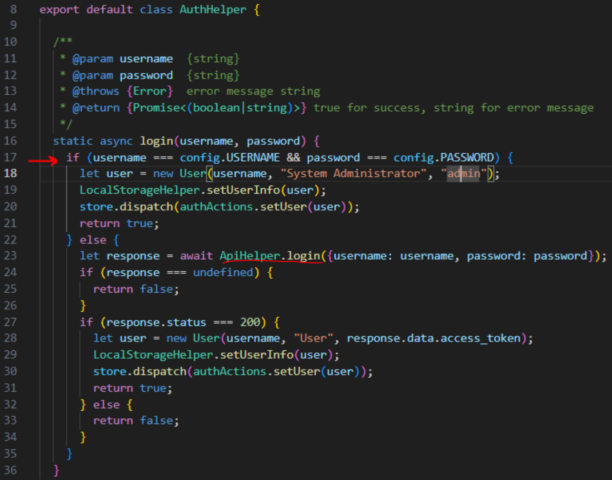

# Web security: CSRF vulnerability in webconsole

>[!NOTE]
> Author: Brian Chen (陳煜盛) 
> Date: 2023/8/23

## Abstract
This article is intended for individuals who possess an interest in free5gc/webconsole and hold concerns regarding security matters. It aims to provide a concise introduction to the webconsole, followed by an exposition of a significant security concern along with our corresponding solution. Within webconsole v1.2.0, aligning with the most recent iteration of free5gc v3.3.0, certain vulnerabilities have been identified that could potentially lead to the exposure of subscriber data. It is my responsibility to address and rectify these vulnerabilities, enhancing the webconsole's resilience against cyber attacks.

## Webconsole Overview

The Webconsole serves as a web-based tool designed to manage User Equipment (UE) subscription data. It plays a crucial role in aiding the free5GC Core Network manager by facilitating the configuration of UEs and providing the ability to monitor the status of activated UEs.

### Environment
- Frontend
    - React v17.0.2
    - node.js v20.2.0
    - yarn v1.22.19
- Backend
    - Golang v1.17
    - Gin v1.9.0
    - MongoDB v3.6.8

### Install & Run webconsole 

Prior to building webconsole, install nodejs and yarn package first:

```shell
sudo apt remove cmdtest
sudo apt remove yarn
curl -sS https://dl.yarnpkg.com/debian/pubkey.gpg | sudo apt-key add -
echo "deb https://dl.yarnpkg.com/debian/ stable main" | sudo tee /etc/apt/sources.list.d/yarn.list
sudo apt-get update
sudo apt-get install -y nodejs yarn
```

To run free5GC webconsole server. The following steps are to be considered.

```shell
git clone https://github.com/free5gc/webconsole.git
cd frontend
yarn install
yarn build
rm -rf ../public
cp -R build ../public
cd ..
go run server.go
```

Default account and password is `admin/free5gc`


### Pages

#### SUBSCRIBERS

Creation/deletion/editing the subscriber's data:


A Subscriber data contains these informations:

- PLMN ID
- SUPI (UE ID)
- AKA parameters
- S-NSSAI Configurations
    - Sst/Sd
    - DNN
        - Name
        - AMBR
        - Flow Rules
            - IP Filter
            - Precedence
            - 5QI
            - GBR
            - MBR


#### TENANT AND USER 

The Webconsole also allows for the creation, deletion, and editing of **tenants**. A **tenant** functions as an access control group, delineating specific permissions and boundaries. In this setup, if you do not possess admin privileges, you are unable to access subscriber data generated by other tenants, ensuring data privacy and security.


Furthermore, the capability to incorporate users within a tenant is available. To illustrate, by selecting the **brian1** tenant and clicking on the **New User** option, it becomes possible to introduce a new user. As an example, a user with the email address **aaabbb@gmail.com** can be added through this process.


The data within MongoDB can be accessed and reviewed using the [MongoDBCompass](https://www.mongodb.com/zh-cn/products/compass) tool.


## CSRF (Cross-Site Request Forgery) Vulnerability

The vulnerability was discovered by INCIBE, and they promptly notified the free5GC team via email.


The [corresponding issue](https://github.com/free5gc/free5gc/issues/387) related to this vulnerability is also documented in the free5gc repository. Despite the typical deployment of the webconsole within LAN or Docker environments, it's essential to exercise caution regarding users who operate this service on a public IP or within an insecure network environment.

In a nutshell, an attacker can gain unauthorized access to the database by merely setting the token to the term **'admin'**.
```
$ curl '<webconsole's IP>:5000/api/subscriber' -H 'User-Agent: Mozilla/5.0 (X11; Ubuntu; Linux x86_64; rv:103.0) Gecko/20100101 Firefox/103.0' -H 'Accept: application/json' -H 'Accept-Language: en-US,en;q=0.5' -H 'Accept-Encoding: gzip, deflate' -H 'Referer: http://<webconsole's IP>:5000/' -H 'Connection: keep-alive' -H 'X-Requested-With: XMLHttpRequest' -H 'Token: admin' -H 'Pragma: no-cache' -H 'Cache-Control: no-cache'
```

Subsequently, they can directly retrieve subscriber information from the server's MongoDB.
```
[{"plmnID":"20893","ueId":"imsi-208930000000003"}]
```

Undoubtedly, this vulnerability is of significant concern since the intended safeguard, allowing access solely to **admin**, has been compromised, thereby enabling easy access for anyone.

## Trace Code

### Frontend
In `webconsole/frontend/src/util/AuthHelper.js`

- In scenarios where the default username and password (admin/free5gc) are employed, the `ApiHelper.login()` function remains untouched. This practice might expedite agile development, but it comes at the cost of compromising security.



### Backend
In `webconsole/frontend/WebUI/api_webui.go`
- In situations where a webconsole client configures the `tokenStr` as **'admin'**, the backend process will omit the execution of `ParseJWT()`.


## JSON Web Token (JWT)

The Webconsole relies on [JSON Web Token (JWT)](https://jwt.io/) as its authentication mechanism, a specification outlined in [RFC 7519](https://tools.ietf.org/html/rfc7519). 


> JSON Web Token (JWT) is a compact, URL-safe means of representing claims to be transferred between two parties.  The claims in a JWT are encoded as a JSON object that is used as the payload of a JSON Web Signature (JWS) structure or as the plaintext of a JSON Web Encryption (JWE) structure, enabling the claims to be digitally signed or integrity protected with a Message Authentication Code (MAC) and/or encrypted.

When a client employs a web browser to initiate a login via the HTTP(s) protocol, the Web server is expected to furnish the client with a **JWT token** in response. Subsequently, the client employs this JWT token to interact with resources by sending requests through the **RESTful API** (such as GET, POST, PUT, etc.).

A JSON Web Token (JWT) consists of three distinct parts. In the context of the webconsole backend, the following fields are relevant:

- Header: This section contains information about the type of token and the signing algorithm used. It often includes the "alg" (algorithm) and "typ" (type) fields.
- Payload: The payload holds the actual claims or data that are being conveyed by the token. For the webconsole backend, specific fields within this section could include:
    - [Claim](https://datatracker.ietf.org/doc/html/rfc7519#section-4) (JSON object)
        - `sub`: identifies the principal that is the subject of the JWT.
        - `iat`: identifies the time at which the JWT was issued.
        - `exp`: identifies the expiration time onor after which the JWT MUST NOT be accepted for processing.
        - `email`
        - `tenantId`
        - ...(you can design the attribute yourself)
- Signature: This component is created by combining the encoded header and payload with a secret key (or a public/private key pair) to ensure the token's integrity and authenticity. The signature allows the recipient to verify that the token hasn't been tampered with.

> The JWT Claims Set represents a JSON object whose members are the claims conveyed by the JWT.  The Claim Names within a JWT Claims Set MUST be unique; JWT parsers MUST either reject JWTs with duplicate Claim Names or use a JSON parser that returns only the lexically last duplicate member name

The image depicted below illustrates the process of using jwt.io to both encode and decode JWT tokens. These tokens are segmented into distinct sections denoted by the <font color="red">red</font>, <font color="#FF00FF">purple</font> and <font color="	#2894FF">blue</font> divisions, separated by periods dots.


Given that the Payload can be decoded using the algorithm specified in the Header, it's essential to refrain from including sensitive details like passwords or credit card numbers within it. Instead, the Payload typically holds claims and application-specific metadata.

To maintain the security of the process, the server retains a confidential key used to validate the signature. In situations where a client endeavors to access a resource using a JWT token that possesses an incorrect Verify Signature, an error response will be generated. This stringent signature verification mechanism ensures that the authenticity and integrity of both the token and its enclosed data are upheld.

## Trace Code (Cont.)

In `webconsole/frontend/WebUI/api_webui.go`, we can find the implementation of JWT.

- `JWT()` is for encoding:
```go
func JWT(email, userId, tenantId string) string {
	token := jwt.New(jwt.SigningMethodHS256)

	claims := token.Claims.(jwt.MapClaims)
	claims["sub"] = userId
	claims["iat"] = time.Now()
	claims["exp"] = time.Now().Add(time.Hour * 24).Unix()
	claims["email"] = email
	claims["tenantId"] = tenantId

	if jwtKey == "" {
		return ""
	}

	tokenString, err := token.SignedString([]byte(jwtKey))
	if err != nil {
		logger.ProcLog.Errorf("JWT err: %+v", err)
		return ""
	}

	return tokenString
}
```
- `ParseJWT()` is for decoding:
```go
func ParseJWT(tokenStr string) (jwt.MapClaims, error) {
	token, err := jwt.Parse(tokenStr, func(token *jwt.Token) (interface{}, error) {
		return []byte(jwtKey), nil
	})
	if err != nil {
		return nil, errors.Wrap(err, "ParseJWT error")
	}

	claims, _ := token.Claims.(jwt.MapClaims)

	return claims, nil
}
```
- The function `CheckAuth()` serves the purpose of determining whether a user possesses the authorization to access a particular resource.

```go
func CheckAuth(c *gin.Context) bool {
	tokenStr := c.GetHeader("Token")
	if tokenStr == "admin" {
		return true
	} else {
		return false
	}
}
```

> [!WARNING] 
> - The secret key utilized for signature verification is obtained through `os.Getenv("SIGNINGKEY")`. However, there's a possibility that `SIGNINGKEY` might not be exported as an environment variable, leading to a potential return of an empty value. Under such circumstances, an implication arises: an admin in Webconsole A could potentially gain access to subscriber data within Webconsole B.
> 
> - Within the `CheckAuth()` function, if the client sets the JWT token to **'admin'**, the function will evaluate to true, effectively allowing the check to be passed.


## Implementation

### Check Authentication

Initially, I have revised the design of the `CheckAuth()` function to ensure the mandatory execution of `ParseJWT()`.
```go
func CheckAuth(c *gin.Context) bool {
	tokenStr := c.GetHeader("Token")
	claims, err := ParseJWT(tokenStr)

	if err == nil && claims["email"] == "admin" {
		return true
	} else {
		return false
	}
}
```
Furthermore, I've implemented a second change where, considering that the webconsole v1.2.0 doesn't inherently establish a tenant named **'admin'** or a user named **'admin'**, I propose a more effective approach. During the initialization of the webconsole backend, it is recommended to generate an **'admin'** tenant and user. This means that executing `go run server.go` within the `webconsole/` directory should consistently generate an admin user, thereby fulfilling the initial login requirement.


Certainly, in the `backend/WebUI/api_webui.go` file, I propose the addition of a function named `SetAdmin()`. To streamline the process and maintain consistency with the rest of the free5GC project, it is recommended to leverage the `mongoapi` module established within the `free5gc/util` repository. Given the project's heavy reliance on MongoDB, employing `mongoapi` over frequent calls to `mongo-driver` is essential to ensure efficiency and coherence.

```go
func SetAdmin() {
	err := mongoapi.RestfulAPIDeleteOne("tenantData", bson.M{"tenantName": "admin"})
	if err != nil {
		logger.InitLog.Errorf("RestfulAPIDeleteOne err: %+v", err)
	}
	err = mongoapi.RestfulAPIDeleteOne("userData", bson.M{"email": "admin"})
	if err != nil {
		logger.InitLog.Errorf("RestfulAPIDeleteOne err: %+v", err)
	}

	// Create Admin tenant
	logger.InitLog.Infoln("Create tenant: admin")

	adminTenantData := bson.M{
		"tenantId":   uuid.Must(uuid.NewRandom()).String(),
		"tenantName": "admin",
	}

	_, err = mongoapi.RestfulAPIPutOne("tenantData", bson.M{"tenantName": "admin"}, adminTenantData)
	if err != nil {
		logger.InitLog.Errorf("RestfulAPIPutOne err: %+v", err)
	}

	AmdinTenant, err := mongoapi.RestfulAPIGetOne("tenantData", bson.M{"tenantName": "admin"})
	if err != nil {
		logger.InitLog.Errorf("RestfulAPIGetOne err: %+v", err)
	}

	// Create Admin user
	logger.InitLog.Infoln("Create user: admin")

	hash, err := bcrypt.GenerateFromPassword([]byte("free5gc"), 12)
	if err != nil {
		logger.InitLog.Errorf("GenerateFromPassword err: %+v", err)
	}

	adminUserData := bson.M{
		"userId":            uuid.Must(uuid.NewRandom()).String(),
		"tenantId":          AmdinTenant["tenantId"],
		"email":             "admin",
		"encryptedPassword": string(hash),
	}

	_, err = mongoapi.RestfulAPIPutOne("userData", bson.M{"email": "admin"}, adminUserData)
	if err != nil {
		logger.InitLog.Errorf("RestfulAPIPutOne err: %+v", err)
	}
}
```

### JWT Verify Signature

Certainly, within the `backend/WebUI/api_webui.go` file, I recommend introducing a string variable named `jwtKey` to serve as the private key for JWT Verify Signature. Although the length of jwtKey is specified as **256 bytes**, it's worth noting that the distinction between **256 bytes** and **256 bits** is inconsequential in this context. The jwt module will adeptly transform the key to a 256-bit form. For further insights, you can refer to [issue 28](https://github.com/free5gc/free5gc/issues/28#issuecomment-1667491567).

```go
var jwtKey = "" // for generating JWT

/* ... */

func InitJwtKey() error {
	randomBytes := make([]byte, 256)
	_, err := rand.Read(randomBytes)
	if err != nil {
		return errors.Wrap(err, "Init JWT key error")
	} else {
		jwtKey = string(randomBytes)
	}
	return nil
}
```

### Backend Initialization
In `backend/webui_service/webui_init.go`:

```go
func (a *WebuiApp) Start(tlsKeyLogPath string) {
    /* ... */
    WebUI.SetAdmin()
	if err := WebUI.InitJwtKey(); err != nil {
		logger.InitLog.Errorln(err)
		return
	}
    /* ... */
}
```

### Frontend Login

Certainly, in the `frontend/src/util/AuthHelper.js` file, it is advised to remove the section of code that could be considered a "cheating snippet." To ensure a robust authentication process, all users should be required to successfully pass through the `ApiHelper.login` function and receive a response code of 200. This approach ensures a consistent and legitimate authentication mechanism.

```js
static async login(username, password) {
    let response = await ApiHelper.login({username: username, password: password});

    if (response !== undefined && response.status === 200) {
      var user = null
      if (username == "admin") {
        user = new User(username, "System Administrator", response.data.access_token);
      } else {
        user = new User(username, "User", response.data.access_token);
      }
      LocalStorageHelper.setUserInfo(user);
      store.dispatch(authActions.setUser(user));
      return true;
    } else {
      return false;
    }
  }
```

## Conclusion

In this endeavor, we've successfully addressed the CSRF vulnerability issue, as highlighted in [issue #387](https://github.com/free5gc/free5gc/issues/387) and acknowledged by INCIBE. Furthermore, I've introduced the concept of JWT tokens in this article, detailing their implementation and the corresponding adjustments made within the webconsole. You can locate the detailed implementation in the [merged PR #44](https://github.com/free5gc/webconsole/pull/44) of the webconsole repository. I'd like to extend my gratitude to the contributors kishiguro and LaumiH for their significant role in refactoring the webconsole. As a result of their efforts, the webconsole UI has been notably enhanced. Our upcoming focus involves the integration of the charging function, which we are actively pursuing.

## Reference
[free5gc/webconsole](https://github.com/free5gc/webconsole)
[merged PR #44](https://github.com/free5gc/webconsole/pull/44)
[free5gc issue #387](https://github.com/free5gc/free5gc/issues/387)
[free5gc issue #28](https://github.com/free5gc/free5gc/issues/28#issuecomment-1667491567)
[JSON Token](https://jwt.io/)
[RFC 7519](https://tools.ietf.org/html/rfc7519)
[MongoDBCompass](https://www.mongodb.com/zh-cn/products/compass)

## About

Hello everyone,

I'm Brian Chen (陳煜盛), and I've been immersed in the realm of 5G Core Network technologies. Over the course of seven months, I've had the privilege of serving as an intern at Saviah. In this role, my responsibilities encompass a spectrum of tasks including maintenance, development, and rigorous testing of the free5GC project.

Should any inquiries, questions, or bug reports regarding free5GC arise, I encourage you to reach out by creating an issue in the [free5gc repository](https://github.com/free5gc/free5gc/issues) or by participating in discussions on the [forum](https://forum.free5gc.org/top/yearly). I'm here to assist and collaborate with the community as we navigate the intricacies of this project.

Warm regards,
Brian Chen (陳煜盛)

- [Github](https://github.com/brianchennn)
- [LinkedIn](https://www.linkedin.com/in/brianchennn/)

>[!NOTE]
> If you are interested in supporting free5GC, we welcome your donation. Please visit this [link](https://free5gc.org/membership/) for more details.