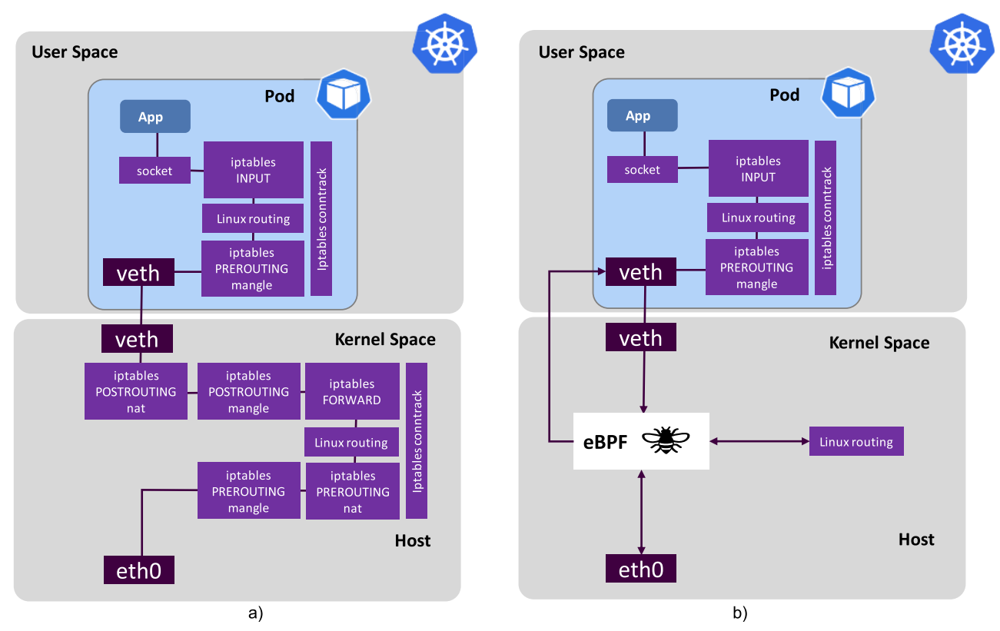
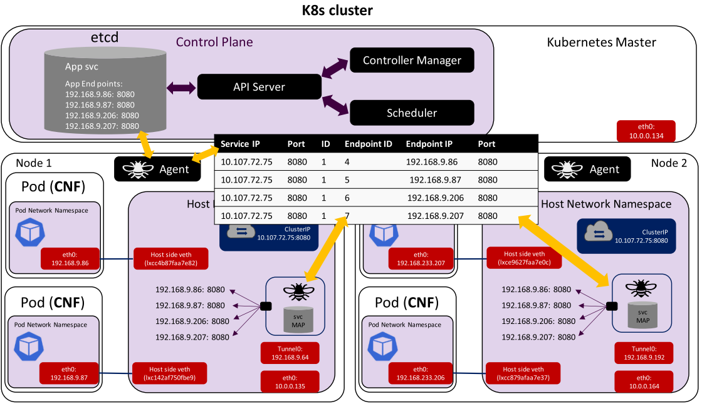

# Article Sharing: eBPF

Original Paper: [eBPF: A New Approach to Cloud-Native
Observability, Networking and Security for
Current (5G) and Future Mobile Networks (6G
and Beyond)](https://ieeexplore.ieee.org/document/10138542)

## Overview

This article shows why extended Berkeley Packet Filter (eBPF) is a powerful tool to use on cloud-native platforms. Using specific eBPF modules to improve network observability and runtime security. Also, present a platform named Sauron to demonstrate how eBPF allows us to write custom code and dynamically load eBPF programs into the kernel. These programs can be used to derive performance counters and gauges for transport networks, 5G applications, and non-access stratum protocols.

## Layout of eBPF

* eBPF programs: run in the kernel to react to events.
* User space programs: load eBPF programs to the kernel and interact with them.
* eBPF Maps: allow data storage and information sharing between eBPF/User space programs.

development phase:

1. A program is compiled into an object Executable and Linkable Format (ELF) file. Using compiler suites like clang/LLVM to compile it into eBPF bytecode.
2. The ELF file is loaded into the kernel using a monolithic approach enabled by bpf system calls.
3. Maps are created in the kernel space. The eBPF programs can utilize eBPF maps to share data and preserve the state.

runtime phase:

4. The eBPF program is loaded into the kernel to be verified by eBPF verifier and to be compiled by JIT Compiler into native instructions.
5. The eBPF program is attached to selected events (injected in the desired kernel hooks). The eBPF program is executed once the event has occurred.

Higher-level networking constructs can be created by combining the hooks below:

* Express Data Path (XDP): XDP BPF hook can be attached to the networking driver. The eBPF program is triggered when a packet arrives in the driver.
* Traffic Control ingress/egress: hooking eBPF programs to the traffic control ingress/egress.
* Socket operations

## eBPF's for Kubernetes

### Container Networking

In K8s, the kernel typically runs a networking stack for each pod. The data path is convoluted, as shown in a).
eBPF can simplify the networking stack in the kernel, and connect pods as endpoints.

This is an example of load balancing between four replicated pods on two worker nodes. Using eBPF service (svc) Map to replace the iptables rules. This allows operators to transport data directly from inbound sockets to outbound sockets, which enables super-fast service load balancing with eBPF.

### Service Mesh

A Service Mesh is a dedicated infrastructure layer that can be added to applications or CNF micro-services. Provides connectivity between applications at the service level, and offers features such as observability, security, and traffic management.

The traditional approach (left) was to use a Service Mesh Library. 
Then Service Mesh was achieved by implementing a cloud-native Sidecar Model (middle). 
Service Mesh which utilizes eBPF (right) has fewer resources used since duplicate copies of state configuration information within each pod are no longer needed. Also, there's no pod configuration to be modified. In addition, eBPF is aware of all activities carried out on that node, which can provide extra security.

## Sauron concept and architecture

The proposed eBPF platform, named Sauron, includes a Node Agent, a Controller to handle the NAs deployed in the clusters, and three eBPF modules for observability, security, and networking use cases. There's no installation of any specific K8s plug-in needed.

### Sauron eBPF module for transport

#### eBPF solutions for latency calculation

By leveraging the XDP hook, the programs can inspect or modify the content of the packets, but they can also decide whether to redirect or drop them. Moreover, through eBPF helpers, they can perform more advanced actions such as timestamping.

The eBPF program utilizes an XDP feature that allows it to redirect the synthetic packet through the same interface at which it was received. The program also adds a timestamp of each action (send or receive) is added to the packet payload. The packet will bounce between the receiving device and the original sender for a fixed number of times. After the final iteration, the original sender passes the packet to the Sauron Agent through the socket interface. The Sauron Agent then uses the collected timestamps to calculate both One-way and Two-way latency. Once the calculation is done, the data can be exported to a remote collector for processing and visualization.

### Sauron module for network observability

The Sauron Agent configures the necessary eBPF programs and collects the messages using a Ring buffer or throughout eBPF Maps. It also detects containers and pods of the 5GC network by querying the API server.
The Agent can be configured to collect information from all parts of the network (radio access and core domains) with minimal overhead.

### Sauron eBPF module for security

eBPF Traffic Control Programs are used to implement network security. The primary job is to detect policy violations and enforce configured rules on unwanted traffic.
Unwanted traffic could be:

1. Traffic directed to or coming from entities that are not allowed to communicate with the object pod.
2. Malicious traffic directed to or coming from sources that are allowed to communicate with the object pod but not authorized to perform certain tasks.
3. Malicious traffic that insists on a disallowed communication path.

eBPF tracepoints programs are attached to static markers defined by kernel developers in the kernel code. Tracepoints can be used to track events related to multiple subsystems, including sched, netlink, and system call (only syscall is shown in the graph). Static markers implementing the hook points guarantee the Application Binary Interface for tracepoints to be more stable than the one available for kprobes.
Even though kprobes are not as effective or stable as tracepoints, they allow the implementation of an additional layer of defense. By tapping deeper into the system calls implementation, it is possible to solve the well-known Time-Of-Check Time-Of-Use vulnerability of tracepoints.
eBPF LSM programs also add an additional layer of security to the kernel. They can detect malicious behaviors and deny the access and permission directly in the kernel. By doing this, they provide faster response than tracepoint and kprobe programs.
The agent in user space provides all rules for detecting malicious behavior to eBPF programs via eBPF maps. The eBPF programs in kernel space sent three kinds of data to the Agent: samples of normal events, suspicious events, and malicious events. Suspicious events will be classified in the agent. Then all collected data will be sent to a cluster-wide events collector, which can build an AI/ML model using the collected events to enforce rules in each agent or provide a plugin-based interface to a third-party system.

## eBPF for performance monitoring of 5G protocols

### NGAP and NAS performance monitoring

NAS messages are encapsulated into NGAP messages and NGAP relies on the SCTP of the 5G transport network layer. To extract information from NGAP messages, we need to parse SCTP packets containing multiple data chunks that can be fragmented.
since XDP and TC hooks are at the packet level, they're not suitable for handling NGAP messages. To have direct access to messages, using tracepoint hooks is the way to go.

Examples of NGAP and NAS metrics:

* NGAP Initial Context Setup Counters
* NGAP Setup Success Ratio
* NGAP Setup Time (ms)
* NGAP Procedure Duration (ms)
* NGAP Failed Procedures Cause Code
* PDU Session Establishment Attempts

### Packet capturing and forwarding

1. A libpcap probe is installed on the interface.
2. Packets pass through the BPF filter installed on the interface.
3. Matching packets flow to the agent.
4. The agent encodes incoming packets in PCAPNG format.
5. Send them to the processing probe.

### eBPF for estimating energy consumption

## Conclusion

Although the development of eBPF is challenging, it can be used to provide great observability, security, and networking in a cloud-native environment. Allow developers to dynamically program the kernel in a safe, performant, and scalable way.

## About

Poyi Lin

- Graduate student majoring in 5GC Research

## Reference

- [eBPF: A New Approach to Cloud-Native
Observability, Networking and Security for
Current (5G) and Future Mobile Networks (6G
and Beyond)](https://ieeexplore.ieee.org/document/10138542)

