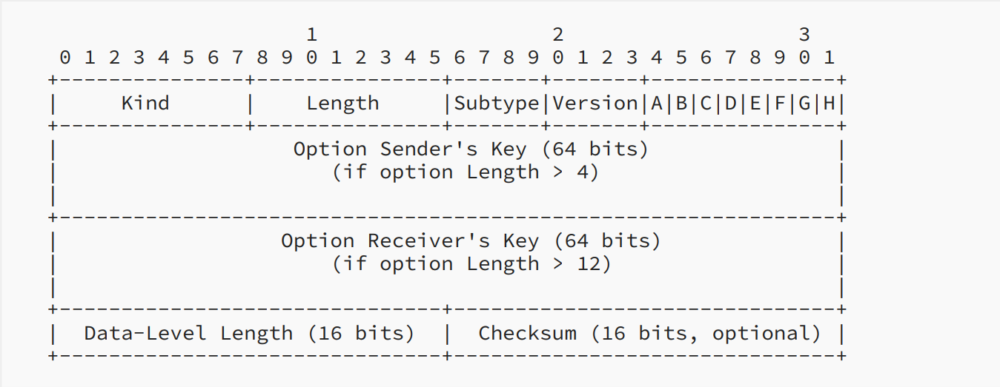
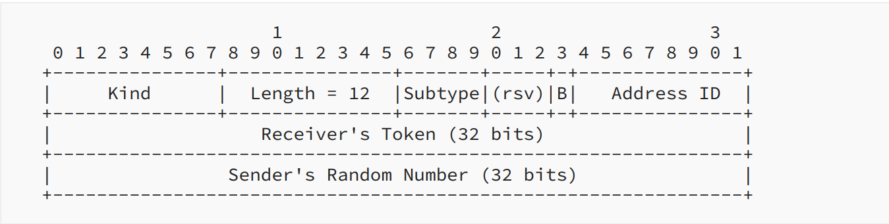

# Introduce of MPTCP
MPTCP (multipath TCP) is a set of extensions to regular TCP that allows a connection to use many paths to transport data simultaneously. The simultaneous use of these multiple paths for a TCP/IP session would improve resource usage within the network, and if one path is blocked, it can use another path to transport data, improving resilience to network failure. A common use of mptcp is: Most mobile phones today have the ability to connect to wifi or mobile networks (4G/5G), but regular TCP can't use two network resources simultaneously, and if the network we were originally using (for example, wifi) is disconnected, it cannot automatically switch to using the mobile network. Therefore, the connection at the application layer will also be disconnected.
In this article, I will introduce MPTCP, including how to establish an MPTCP connection, how to start a new subflow, the ack mechanism, and the congestion control algorithm it uses. 

### Initiating an MPTCP Connection
MPTCP implements multi-path transmission by creating multiple subflows; each subflow is similar to a general TCP connection. Use a 3-way handshake to establish the connection. But instead of a separate connection, the subflow is bound into an existing MPTCP session. MPTCP uses SYN, SYN/ACK, and ACK packets to establish connections. But these sockets also carry the MP_CAPABLE option (in the optional field of the tcp header), which is used to verify whether the remote host supports MPTCP and exchange some information to authenticate the establishment of additional subflows.

>[rfc8684 3.1](https://www.rfc-editor.org/rfc/pdfrfc/rfc6824.txt.pdf)

The above figure shows the structure of MP_CAPABLE. First, the initiator sends only 4 octets. If the listener also supports MPTCP v1, it will respond SYN/ACK, and the listener's key will be included in MP_CAPABLE. Then the initiator replies ACK, which contains the sender's key and the receiver's key. These keys are used to authenticate the addition of future subflows to this connection; all future subflows will identify the connection using a 32-bit "token". This token is a cryptographic hash of this key.
The use of flags in the fourth octets are as follow:

* A: Indicate "Checksum required".
* B: It is an extensibility flag, must be set to 0.
* C: Indicate that the sender of this option will not accept additional MPTCP subflows to the source address and port.
* D through H: The flags D through H, are used for crypto algorithm negotiation. In MPTCP v1, only the rightmost bit, labeled H, is assigned. Bit H indicates the use of HMAC-SHA256.

### Starting a New Subflow
Once an MPTCP connection has begun with the MP_CAPABLE exchange, further subflows can be added to the connection. A new subflow is started as a normal TCP SYN/ACK exchange. But these packets contain the Join Connection option. 

>[rfc8684 3.2](https://www.rfc-editor.org/rfc/pdfrfc/rfc6824.txt.pdf)

This is the first Join Connection (MP_join) Option for the initial SYN. The token is a crytographic hash of the receiver's key. The MP_join also contains an "Address ID", which is used to identify the source address of this packet. This mechanism allows addresses to be removed even if they are changed by NAT.
The last bit of the third byte (flag B) indicates that the sender (1) wishes this subflow to be used as a backup path (B=1) in the event of failure of other paths or (2) wants the subflow to be used as part of the connection immediately. MP_JOIN also contains a random number to prevent replay attacks.
If MP_JOIN contains a valid token, the recipient will respond with a SYN/ACK also containing an MP_JOIN option containing a random number and a truncated (leftmost 64-bit) HMAC. Transport HMAC is to have previously exchanged random data (in the first two SYN packets) that is used as the "message".

>[rfc8684 3.2](https://www.rfc-editor.org/rfc/pdfrfc/rfc6824.txt.pdf)

If the HMAC in SYN/ACK is valid, then the initiator will send its authentication in the third packet (ACK). This data needs to be sent reliably since it is the only time this HMAC is sent. Therefore, receipt of this packet triggers a regular TCP ACK in response, and the packet will be retransmitted if this ACK is not received.

>[rfc8684 3.2](https://www.rfc-editor.org/rfc/pdfrfc/rfc6824.txt.pdf)

This is total handshake procedure.

>[rfc8684 3.2](https://www.rfc-editor.org/rfc/pdfrfc/rfc6824.txt.pdf)

### MPTCP Operation and Data Transfer 

MPTCP takes one input data stream and splits it into subflows. It then uses a 64-bit data sequence number to number all the data and let the data be reassembled at the receiver. Each subflow has its own 32-bit sequence number space, utilizing the regular TCP sequence number header, and an MPTCP option (Data Sequence Signal optional) maps the subflow sequence space to the data sequence space.
MPTCP uses the Data Sequence Signal optional to carry the Data Sequence Mapping, which consists of the subflow sequence number, data sequence number, and length for which this mapping is valid. The Data Sequence Number is the starting sequence number for the subflow, and the Subflow Sequence Number is the sequence number only relevant to the subflow. The Data Ack in the Data Sequence Signal optional is used to ACK for the connection, indicating how much data has been successfully received.

>[rfc8684 3.3](https://www.rfc-editor.org/rfc/pdfrfc/rfc6824.txt.pdf)

### Coupled Congestion Control Algorithm
There are two goals that MPTCP congestion control needs to meet:
1.   A multipath flow should perform at least as well as a single-path flow would on the best of the paths available to it.
2.   A multipath flow should take no more capacity on any path or collection of paths than if it were a single-path TCP flow using the best of those paths.

The second goal is to prevent MPTCP traffic from occupying too many resources and harming other TCP flows on the bottleneck link. So if we combine the first goal and the second goal, it means that the total capacity that MPTCP occupies should equal the capacity that the best path can transport. (In the situation where there is some competitive TCP flow, if there is no other competitive flow, then MPTCP will occupy all the capacity it can use.)

The algorithm rule:
* Each ACK on subflow r, increase the window $w_r$ by $min(\dfrac{\alpha}{\omega_{total}}, \dfrac{1}{\omega_r})$.
* Each loss on subflow r, decrease the window $w_r$ by $\dfrac{w_r}{2}$.

$$\alpha = \hat{\omega}_{total}*\dfrac{max_r(\hat{\omega_r}/RTT_r^2)}{(\Sigma_r(\hat{\omega_r}/RTT_r))^2}$$

$w_r$ is the current window size on path r, $\hat{w_r}$ is equilibrium window size on path r, and similarly for the total window size.

And how $\alpha$ derived? Here I write down some of my thoughts after reading the paper. There may be errors. If you find any, please tell me directly.
First, we assume that $$\dfrac{\alpha}{\omega_{total}}<\dfrac{1}{\omega_r}$$, so if the transmission speed of subflow r is slower than tcp, then the increments of the window size r is $\dfrac{\alpha}{\omega_{total}}$. Because the increase and decrease of the window in the equilibrium state are equal to each other, so we have the fallowing equation.
$$\dfrac{\omega_r}{RTT_r}(1-p_r)\dfrac{\alpha}{\omega_{total}}=(\dfrac{\omega_r}{RTT_r}*p_r)\dfrac{\omega_r}{2}$$
$p_r$ is the loss rate of subflow r.Then we assume loss rate is small.
$$\dfrac{\alpha}{\omega_{total}}=p_r\dfrac{\omega_r}{2}, p_r=\dfrac{2\alpha}{\omega_{total}\omega_r}$$
Now assume that there is tcp on this subflow, then we have:
$$(1-p)\dfrac{1}{\omega^{TCP}_r} = p * \dfrac{\omega^{TCP}_r}{2}, (\omega^{TCP}_r)^2 = \dfrac{2}{p}$$ 
p is the loss rate. Here, assume p is equal to $p_r$.(But actually, they would not be equal if there was no other competitive flow. $p_r$ is smaller, so we measure a better tcp performence.) Substitute $p_r$ with p, then we have:
$$ (\omega^{TCP}_r)^2 = \dfrac{\omega_{total}\omega_r}{\alpha} $$
And we want the total capacity MPTCP occupies to equal the capacity that the best path can transport using TCP. So we have the equation:
$$ \Sigma_r\dfrac{\omega_r}{RTT_r} = max_r\dfrac{\omega^{TCP}_r}{RTT_r}$$
Window size divide by RTT is the traffic send on path per second.
$$ (\Sigma_r\dfrac{\omega_r}{RTT_r})^2 = (max_r\dfrac{\omega^{TCP}_r}{RTT_r})^2 = max_r(\dfrac{\omega_{total}}{\alpha})\dfrac{\omega_r}{RTT^2_r} = \dfrac{1}{\alpha}max_r\dfrac{\omega_{total}\omega_r}{RTT^2_r}$$
Finally, we can derive $\alpha$. 
$$\alpha = \hat{\omega}_{total}*\dfrac{max_r(\hat{\omega_r}/RTT_r^2)}{(\Sigma_r(\hat{\omega_r}/RTT_r))^2}$$
Because tcp performance on path r is measured by loss rate $p_r$, if there is no competitive flow, mptcp can use more resources, and the increments of the window finally bounded by $\dfrac{1}{\omega_r}$. So if we only run mptcp on many paths, it's like we have many TCP connecion, the total traffic is sum of every subflow's max transmission capability.

### How to use MPTCP
As for how to use mptcp under Linux system, you can refer to this [article](https://hpnpl.net/posts/mptcp-ubuntu/). It describes how to use mptcpize to change the original tcp connection to mptcp.

### About
Hello! My name is 張哲睿, and my current research topic is ATSSS (Access Traffic Steering, Switching and Splitting).  If you find any mistakes in my articles, please contact me.
* [Linkedln](https://www.linkedin.com/in/%E5%93%B2%E7%9D%BF-%E5%BC%B5-77096621a/)

### Reference
* [rfc 8684](https://www.rfc-editor.org/rfc/pdfrfc/rfc6824.txt.pdf)
* [rfc 6356](https://www.rfc-editor.org/rfc/pdfrfc/rfc6356.txt.pdf)
* [Coupled Congestion Control Algorithm](https://www.usenix.org/legacy/events/nsdi11/tech/full_papers/Wischik.pdf)
* [MPTCP congestion control](https://zhuanlan.zhihu.com/p/421877742)
* [How to use MPTCP](https://hpnpl.net/posts/mptcp-ubuntu/)