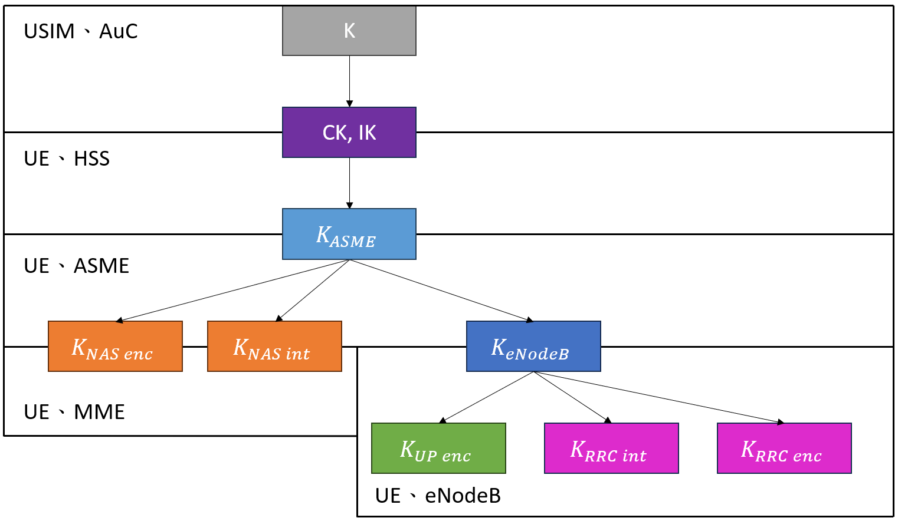

# LTE Authentication Introduction: EPS-AKA'

>[!NOTE]
> Author: Wilson
> Date: 2023/10/19

## Abstract
Regarding this free5GC tech blog article, the topic of this article is EPS-AKA'. I want to share this topic with you. EPS-AKA' is related to the field of 4G **security network**. Regarding the content of this article, I briefly introduce EPS-AKA' first. Second, I explain the definition of authentication. Third, I explain the key hierarchy generation in 4G because these keys are used in the EPS-AKA' procedure. Fourth, I start to introduce the EPS-AKA' procedure in detail. Finally, I compare 4G AKA with 5G. I explain the similarity and difference between 4G and 5G AKA.

## Introduction
In our daily life, the people send the message by using Line, watch the video on Youtube, or send the letter by using Gmail. The user must establish a connection with the Internet before sending the message. The user successfully establishes a connection with the Internet. The place that the packet is transmitting must have the risk of being stolen. In order to protect the confidentiality of the data and know whether the data is manipulated, the LTE Security Procedure will be executed when the mobile phone is going online and sending the message.

The LTE Security Procedure is divided into the three stages. The three stages are:

- EPS-AKA'
- NAS Security
- AS Security

The full English name of EPS-AKA' is Evolved Packet System-Authentication and Key Agreement. From the full English name of AKA, we can know that the AKA mainly does two things. The two things are:

- Authentication
- Key Agreement
 
The EPS-AKA' is also the focus of this free5GC tech blog article. EPS-AKA' can be subdivided into the two steps:

- In the first step, the network **generate the authentication vector**, and some information in this authentication vector is used for authentication.
- In the second step, it is **mutual authentication** between the user and the network.

## About the Definition of Authentication
Regarding the authentication, I believe everyone has heard it, and the definition of authentication also has various explanations. According to the content of this free5GC tech blog article and my own understanding, I give examples from life to explan the definition of authentication.

During the summer or winter vacation, the family wants to travel abroad. You have to go through customs before boarding the plane. The customs officer decides whether you can board based on the content of your passport. This action is actually similar to the authentication. As shown in the Figure 1, a passenger takes his passport to the customs officer, and the customs officer checks his passport with the information on the computer. If the content of his passport is the same as the information on the computer, you will be allowed to pass. The most important thing about authentication is the action of checking.

**The EPS-AKA' procedure performs authentication twice.** The first time, the HSS gives the $AUTN_{HSS}$ to the UE, and the UE checks the $AUTN_{HSS}$ that is given by the HSS with the $AUTN_{UE}$. If $AUTN_{HSS}$ is same as $AUTN_{UE}$, it will mean the authentication is successful. The first authentication is to authenticate to the HSS. The first authentication is also to authenticate the network.

The second time, the UE gives the RES to the MME, and MME checks the RES that is given by the UE with the XRES. If RES is same as XRES, it will mean the authentication is successful. The second authentication is to authenticate to the UE. 

 **Figure 1. The Definition of Authentication**

## Key Hierarchy Generation in 4G
The Figure 2 is the key hierarchy generation in 4G. When an UE is generated, the `IMSI` and `K` value are stored in the USIM card, and the `IMSI` and `K` value are regarded as the permanent value. When an UE subscribes to the operator's network, the HSS will get the permanent value of the UE's `IMSI` and `K`.

The USIM and HSS use the `K` as the base to generate the `CK` and `IK` in the EPS-AKA' stage of the LTE Security Procedure. The HSS uses the `CK` and `IK` as the base to generate the $K_{ASME}$ and transmits the $K_{ASME}$ to the MME. The USIM transmits the `CK` and `IK` to the UE, and UE uses the `CK` and `IK` as the base to generate the $K_{ASME}$.

The UE and MME use the $K_{ASME}$ as the base and generate separately three keys in the NAS Security stage of the LTE Security Procedure. Three keys are the $K_{NASenc}$, $K_{NASint}$, and $K_{eNodeB}$. The $K_{NASenc}$ and $K_{NASint}$ are used in the NAS Security stage, and the $K_{eNodeB}$ is transmitted to the eNodeB.

The UE and eNodeB use the $K_{eNodeB}$ as the base and generate separately three keys in the AS Security stage of the LTE Security Procedure. Three keys are the $K_{UPenc}$, $K_{RRCint}$, and $K_{RRCenc}$.

 **Figure 2. Key Hierarchy Generation in 4G**

## EPS-AKA' Procedure

 **Figure 3. EPS-AKA' Procedure**

#### The UE sends the `Attach Request` to the MME
The Figure 3 shows the entire EPS-AKA' procedure. The UE sends the `Attach Request` to the MME. The `Attach Request` contains the `IMSI`, `UE Network Capability`, and $KSI_{ASME}$. The `IMSI` is like the ID number of this UE. The `UE Network Capability` is what encryption and integrity protection algorithms the UE supports. The UE sends `UE Network Capability` to tell MME. The content of `UE Network Capability` is like EEA0=on, EEA1=on, EEA2=off, ..., EIA1=on, EIA2=on, ... The on and off symbols are represented by one bit. The $KSI_{ASME}$ represents the number corresponding to the $K_{ASME}$. The $KSI_{ASME}$ is represented by 3 bits. The value of $KSI_{ASME}$ is 7, which means that the UE does not have the $K_{ASME}$ yet.

#### The MME sends the `Authentication Information Request` to the HSS
The MME sends the `Authentication Information Request` to the HSS after receiving the `Attach Request`. The `Authentication Information Request` contains the `IMSI`, `SN ID`, `n`, and `Network Type`. The full English name of `SN ID` is Serving Network ID, which refers to the network that the user wants to connect to. The value of `SN ID` is usually composed of the MCC and MNC (PLMN ID). The `n` represents how many verifcation vectors are sent to the HSS. The `Network Type` is what kind of wireless network the user wants to connect to the Internet from my understanding.

#### The HSS sends the `Authentication Information Answer` to the MME
The HSS automatically generates the `RAND` and `SQN` after receiving the `Authentication Information Request`. The HSS inputs the `K`, `SQN`, and `RAND` into the Cryptographic Function. The Cryptographic Function uses the EPS AKA algorithm and outputs the `XRES`, $AUTN_{HSS}$, `CK`, and `IK`. The HSS inputs the `CK`, `IK`, `SQN`, and `SN ID` into the KDF (Key Derivation Function). The KDF outputs $K_{ASME}$. Then, the `RAND` that is generated by the HSS itself, the $AUTN_{HSS}$ and `XRES` that are generated by the Cryptographic Function, and the $K_{ASME}$ that is generated by KDF are combined into the AV. The `Authentication Information Answer` includes AV and is sent to the MME.

#### The MME sends the `Authentication Request` to the UE
The MME selects an AV among multiple AVs and sends the `Authentication Request` to the UE after receiving the `Authentication Information Answer`. The `Authentication Request` contains the `RAND`, $AUTN_{HSS}$, and $KSI_{ASME}$.

#### The UE sends the `Authentication Response` to the MME
The UE receives the `Authentication Request`. Why do you see the `SQN` is generated by the HSS in the Figure 3? The $AUTN_{HSS}$ carries the `SQN`. The UE can find the `SQN` in the $AUTN_{HSS}$. The USIM inputs the `K`, `SQN`, and `RAND` into the Cryptographic Function. The Cryptographic Function uses the EPS AKA algorithm and outputs the `RES`, $AUTN_{UE}$, `CK`, and `IK`. When the UE gets $AUTN_{UE}$, it compares the $AUTN_{UE}$ with the $AUTN_{HSS}$. If the authentication is successful, the UE will generate the `RES`. The `Authentication Response` contains the `RES` and is returned to the MME.

#### The MME receives the `Authentication Response`
The MME compares the `XRES` with `RES` after receiving the `Authentication Response`. If the content of the `XRES` and `RES` are the same, it means that the authentication is successful. The authentication stage has come to an end.

Finally, the UE inputs the `CK`, `IK`, `SQN`, and `SN ID` into the KDF. The KDF outputs $K_{ASME}$. The UE and MME have the same $K_{ASME}$. The $K_{ASME}$ doesn't be transmitted between the UE and MME. The $K_{ASME}$ is transmitted in the form of the $KSI_{ASME}$ to prevent the $K_{ASME}$ from being stolen by a third party.

## 4G vs 5G AKA
Finally, we compare the AKA of 4G with 5G. The similarities are as follows:

- UE uses the same Universal Subscriber Identity Module (USIM)
- All use shared symmetric keys

The differences are as follows:

- Authentication Mechanism
    - 4G: EPS-AKA'
    - 5G: 5G-AKA and EAP-AKA'

- Serving Network
    - 4G: MME
    - 5G: SEAF

- Home Network
    - 4G: HSS
    - 5G: AUSF, UDM, ARPF, and SIDF

- Network Function for Authentication Vector Generation
    - 4G: HSS
    - 5G: UDM and ARPF

- Network Function to Verify UE Identity
    - 4G: MME
    - 5G
        - 5G-AKA: SEAF and AUSF
        - EAP-AKA': AUSF

- Key Hierarchy Generation
    - 4G: K -> CK + IK -> $K_{ASME}$
    - 5G
        - 5G-AKA: K -> CK + IK -> $K_{ASME}$ -> $K_{SEAF}$
        - EAP-AKA': K -> CK + IK -> CK' + IK' -> $K_{MSK}$ -> $K_{SEAF}$

## Reference
- [LTE Security I: Concept and Authentication](https://www.netmanias.com/en/?m=view&id=techdocs&no=5902)
- [LTE Security II: NAS and AS Security](https://www.netmanias.com/en/?m=view&id=techdocs&no=5903)
- [https://kknews.cc/zh-tw/code/65y6x9l.html](https://kknews.cc/zh-tw/code/65y6x9l.html)
- [https://nccnews.com.tw/202010/ch4.html](https://nccnews.com.tw/202010/ch4.html)

## About
Hi, my name is Wilson. I am a master’s student. My main area of research is network slicing. In the future, I will introduce more information about 5G. Hope you enjoy it.
