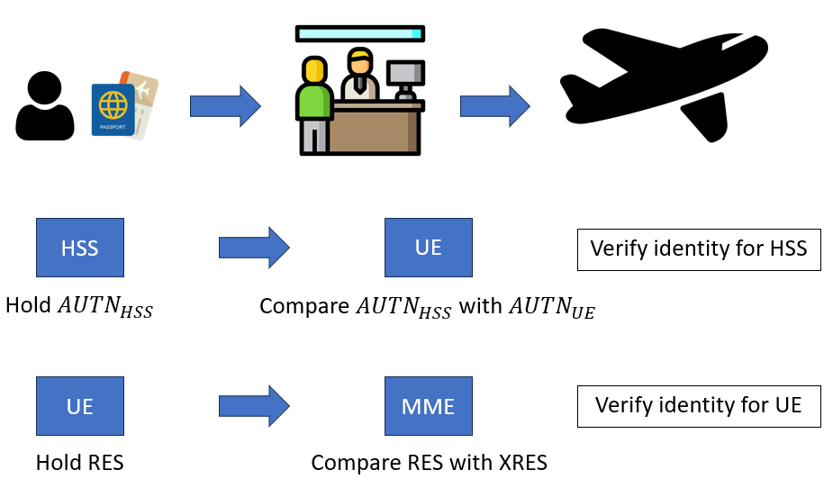
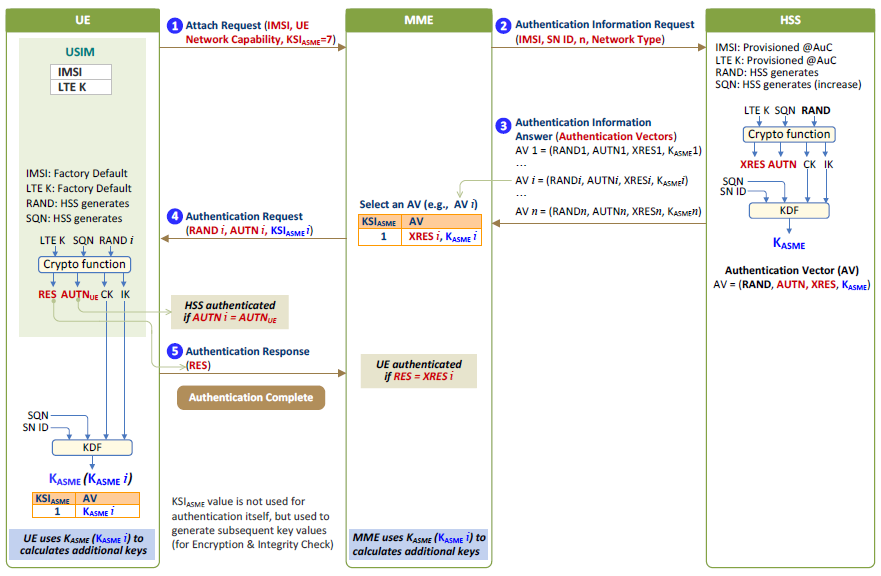

# LTE Authentication Introduction: EPS-AKA'

>[!NOTE]
> Author: Wilson
> Date: 2023/10/18

## Abstract
In this article, I will delve into the topic of EPS-AKA', a subject closely related to 4G network security. The article is structured as follows:

1. An introduction to EPS-AKA'.
2. An explanation of the concept of authentication.
3. An exploration of key hierarchy generation in the 4G network, emphasizing its relevance to the EPS-AKA' procedure.
4. A detailed examination of the EPS-AKA' procedure.
5. A comparison between 4G AKA and 5G AKA, highlighting both their similarities and differences.

## Introduction
Every day, people use apps like Line to send messages, watch videos on YouTube, and send emails via Gmail. To do any these activities, a connection to the Internet must be established. However, once a connection is made, the data packets transmitted are at risk of being intercepted. To ensure the confidentiality of the data and to verify its integrity, the LTE Security Procedure is initiated whenever a mobile phone goes online or sends a message.

The LTE Security Procedure is categorized into three stages :

- EPS-AKA'
- NAS Security
- AS Security

EPS-AKA' stands for "Evolved Packet System-Authentication and Key Agreement". As suggested by its full name, AKA primarily involves two key actions:

- Authentication
- Key Agreement

The focus of this article will be on EPS-AKA', which is further divided into two main steps:

1. In the first step, the network **generate an authentication vector**. Some of the information within this vector is used for authentication.
2. The second step involves **mutual authentication** between the user and the network.

## Understanding the Definition of Authentication
Most people have come across the term "authentication", and its definition varies depending on context and interpretation. For the purposes of this article, and based on my own understanding, I'll use an everyday analogy to explain the concept of authentication.

Imagine during summer of winter vacation, your family decides to travel abroad. Before you board the plane, you must clear customs. The customs officier determines if you can proceed by examining your passport. This procedure resembles the process of authentication. As illustrated in Figure 1, a traveler presents their passport to a customs officer who then compares the passport details with information on their computer. If the passport's contents match the computer's records, you are granted passage. At the heart of authentication is this act of verification.

In the context of the EPS-AKA' procedure, authentication occurs twice:

1. Initially, the HSS provides the $AUTN_{HSS}$ to the UE. The UE then compares the received $AUTN_{HSS}$ whith its $AUTN_{UE}$. If the $AUTN_{HSS}$ mathes the $AUTN_{UE}$, it indicates sucessful authentication. This step verifies the authenticity of the HSS and, by extension, the network.
2. In the second instance, the UE forwards the RES to the MME. The MME then compares the provided RES with the XRES. If the RES aligns with the XRES, authentication is successful. This stage confirms the authenticity of the UE.

 **Figure 1. The Definition of Authentication**

## Key Hierarchy Generation in 4G
The Figure 2 is the key hierarchy generation in 4G. When an UE is generated, the `IMSI` and `K` value are stored in the USIM card, and the `IMSI` and `K` value are regarded as the permanent value. When an UE subscribes to the operator's network, the HSS will get the permanent value of the UE's `IMSI` and `K`.

The USIM and HSS use the `K` as the base to generate the `CK` and `IK` in the EPS-AKA' stage of the LTE Security Procedure. The HSS uses the `CK` and `IK` as the base to generate the $K_{ASME}$ and transmits the $K_{ASME}$ to the MME. The USIM transmits the `CK` and `IK` to the UE, and UE uses the `CK` and `IK` as the base to generate the $K_{ASME}$.

The UE and MME use the $K_{ASME}$ as the base and generate separately three keys in the NAS Security stage of the LTE Security Procedure. Three keys are the $K_{NASenc}$, $K_{NASint}$, and $K_{eNB}$. The $K_{NASenc}$ and $K_{NASint}$ are used in the NAS Security stage, and the $K_{eNB}$ is transmitted to the eNodeB.

The UE and eNodeB use the $K_{eNB}$ as the base and generate separately three keys in the AS Security stage of the LTE Security Procedure. Three keys are the $K_{UPenc}$, $K_{RRCint}$, and $K_{RRCenc}$.

 **Figure 2. Key Hierarchy Generation in 4G**

## EPS-AKA' Procedure

 **Figure 3. EPS-AKA' Procedure**

#### The UE sends the `Attach Request` to the MME
The Figure 3 shows the entire EPS-AKA' procedure. The UE sends the `Attach Request` to the MME. The `Attach Request` contains the `IMSI`, `UE Network Capability`, and $KSI_{ASME}$. The `IMSI` is like the ID number of this UE. The `UE Network Capability` is what encryption and integrity protection algorithms the UE supports. The UE sends `UE Network Capability` to tell MME. The content of `UE Network Capability` is like EEA0=on, EEA1=on, EEA2=off, ..., EIA1=on, EIA2=on, ... The on and off symbols are represented by one bit. The $KSI_{ASME}$ represents the number corresponding to the $K_{ASME}$. The $KSI_{ASME}$ is represented by 3 bits. The value of $KSI_{ASME}$ is 7, which means that the UE does not have the $K_{ASME}$ yet.

#### The MME sends the `Authentication Information Request` to the HSS
The MME sends the `Authentication Information Request` to the HSS after receiving the `Attach Request`. The `Authentication Information Request` contains the `IMSI`, `SN ID`, `n`, and `Network Type`. The full English name of `SN ID` is Serving Network ID, which refers to the network that the user wants to connect to. The value of `SN ID` is usually composed of the MCC and MNC (PLMN ID). The `n` represents how many verifcation vectors are sent to the HSS. The `Network Type` is what kind of wireless network the user wants to connect to the Internet from my understanding.

#### The HSS sends the `Authentication Information Answer` to the MME
The HSS automatically generates the `RAND` and `SQN` after receiving the `Authentication Information Request`. The HSS inputs the `K`, `SQN`, and `RAND` into the Cryptographic Function. The Cryptographic Function uses the EPS AKA algorithm and outputs the `XRES`, $AUTN_{HSS}$, `CK`, and `IK`. The HSS inputs the `CK`, `IK`, `SQN`, and `SN ID` into the KDF (Key Derivation Function). The KDF outputs $K_{ASME}$. Then, the `RAND` that is generated by the HSS itself, the $AUTN_{HSS}$ and `XRES` that are generated by the Cryptographic Function, and the $K_{ASME}$ that is generated by KDF are combined into the AV. The `Authentication Information Answer` includes AV and is sent to the MME.

#### The MME sends the `Authentication Request` to the UE
The MME selects an AV among multiple AVs and sends the `Authentication Request` to the UE after receiving the `Authentication Information Answer`. The `Authentication Request` contains the `RAND`, $AUTN_{HSS}$, and $KSI_{ASME}$.

#### The UE sends the `Authentication Response` to the MME
The UE receives the `Authentication Request`. Why do you see the `SQN` is generated by the HSS in the Figure 3? The $AUTN_{HSS}$ carries the `SQN`. The UE can find the `SQN` in the $AUTN_{HSS}$. The USIM inputs the `K`, `SQN`, and `RAND` into the Cryptographic Function. The Cryptographic Function uses the EPS AKA algorithm and outputs the `RES`, $AUTN_{UE}$, `CK`, and `IK`. When the UE gets $AUTN_{UE}$, it compares the $AUTN_{UE}$ with the $AUTN_{HSS}$. If the authentication is successful, the UE will generate the `RES`. The `Authentication Response` contains the `RES` and is returned to the MME.

#### The MME receives the `Authentication Response`
The MME compares the `XRES` with `RES` after receiving the `Authentication Response`. If the content of the `XRES` and `RES` are the same, it means that the authentication is successful. The authentication stage has come to an end.

Finally, the UE inputs the `CK`, `IK`, `SQN`, and `SN ID` into the KDF. The KDF outputs $K_{ASME}$. The UE and MME have the same $K_{ASME}$. The $K_{ASME}$ doesn't be transmitted between the UE and MME. The $K_{ASME}$ is transmitted in the form of the $KSI_{ASME}$ to prevent the $K_{ASME}$ from being stolen by a third party.

## 4G vs. 5G AKA: A Comparison
**Similarities:**

1. Both 4G and 5G UEs utilize the same Universal Subscriber Identity Module (USIM).
2. Both systems rely on shared symmetric keys for authentication.

**Differences:**

1. Authentication Mechanism:
    - 4G: EPS-AKA'
    - 5G: 5G-AKA and EAP-AKA'

2. Serving Network:
    - 4G: MME
    - 5G: SEAF

3. Home Network:
    - 4G: HSS
    - 5G: AUSF, UDM, ARPF, and SIDF

4. Network Function for Authentication Vector Generation:
    - 4G: HSS
    - 5G: UDM and ARPF

5. Network Function to Verify UE Identity:
    - 4G: MME
    - 5G
        - 5G-AKA: SEAF and AUSF
        - EAP-AKA': AUSF

6. Key Hierarchy Generation:
    - 4G: K -> CK + IK -> $K_{ASME}$
    - 5G
        - 5G-AKA: K -> CK + IK -> $K_{ASME}$ -> $K_{SEAF}$
        - EAP-AKA': K -> CK + IK -> CK' + IK' -> $K_{MSK}$ -> $K_{SEAF}$

## Reference
- [LTE Security I: Concept and Authentication](https://www.netmanias.com/en/?m=view&id=techdocs&no=5902)
- [LTE Security II: NAS and AS Security](https://www.netmanias.com/en/?m=view&id=techdocs&no=5903)
- [https://kknews.cc/zh-tw/code/65y6x9l.html](https://kknews.cc/zh-tw/code/65y6x9l.html)
- [https://nccnews.com.tw/202010/ch4.html](https://nccnews.com.tw/202010/ch4.html)

## About
Hi, my name is Wilson. I am a master’s student. My main area of research is network slicing. In the future, I will introduce more information about 5G. Hope you enjoy it.

>[!NOTE]
> If you are interested in supporting free5GC, we welcome your donation. Please visit this [link](https://free5gc.org/membership/) for more details.