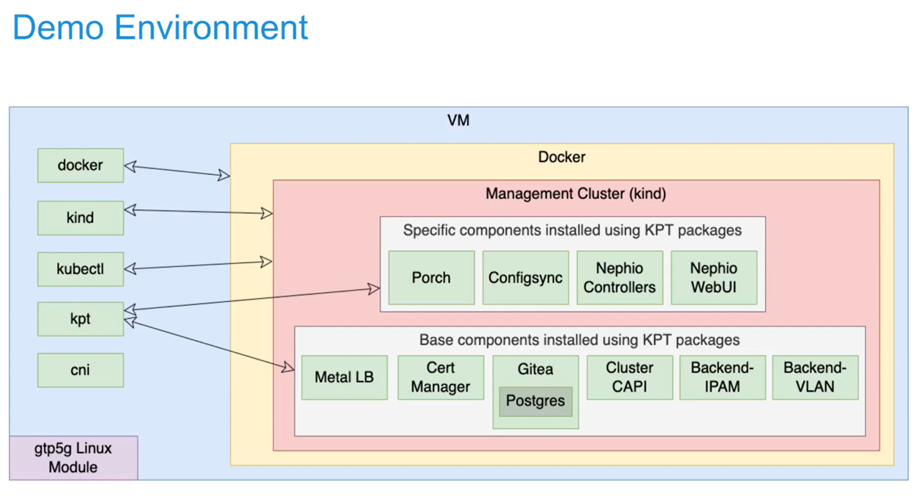
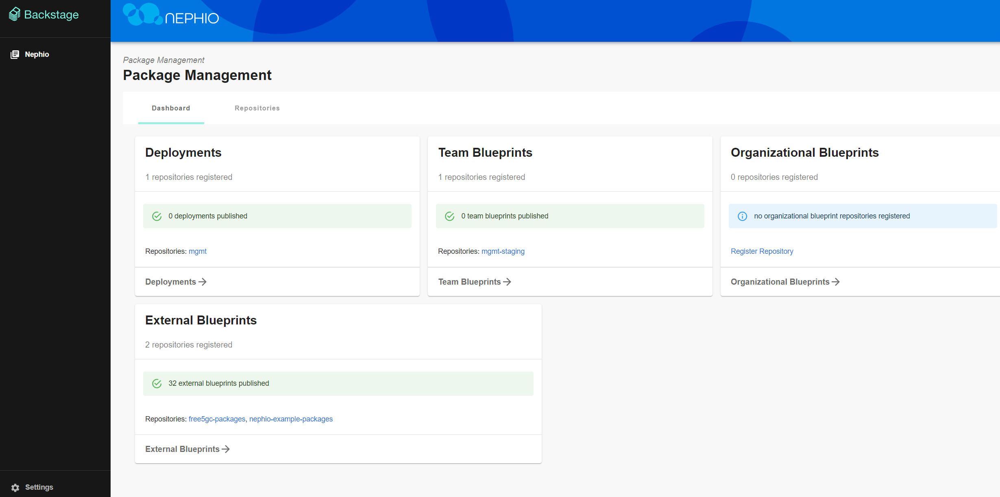

# Nephio: a Cloud Native Network Automation Linux Foundation Project

>[!NOTE]
> Author: Brian Chen (陳煜盛)
> Date: 2023/11/08

As a free5GC maintainer, I'm excited to see a Linux Foundation project that utilizes our open-source software. Let's explore what Nephio can do. I will briefly introduce what is Nephio and then demonstrate how to install the free5gc-operator.

## Nephio's Goal

Nephio delivers carrier-grade, simple, open, Kubernetes-based cloud native intent automation and common automation templates that materially simplify the deployment and management of multi-vendor cloud infrastructure and network functions across large-scale edge deployments. It brings zero-touch provisioning of cloud infrastructure and network functions, which can offer increased network availability and resiliency while reducing maintenance downtime.

## What Problem Does Nephio Solve?

Distributed cloud technologies facilitate edge access through on-demand, API-driven mechanisms. Regrettably, prevailing imperative, fragile, and fire-and-forget orchestration techniques face challenges in fully exploiting the dynamic capabilities inherent in these innovative infrastructure platforms. To achieve success in this domain, Nephio employs novel methodologies capable of navigating the intricacies associated with provisioning and overseeing a **distributed, multi-vendor, multi-site deployment of interconnected network functions within on-demand distributed cloud environments**.

The objective of the solution is to handle the initial provisioning of network functions and the underlying cloud infrastructure. Additionally, it incorporates **Kubernetes-enabled** reconciliation to ensure network resilience amid failures, scaling occurrences, and alterations within the distributed cloud.

## Benefits of Kubernetes Based Cloud Native Automation

It enables multi-vendor support, faster onboarding, easier lifecycle management, embedded control-loop, active reconciliation, and service assurance, reducing costs through efficiency and agility. A common cloud-based automation framework, based on well-proven Kubernetes technology, minimizes the need for custom automation solutions for each application. Multi-vendor integration is enabled, improving customer experience.

## Kubernetes as a Uniform Automation Control Plane
We can broadly think of three layers in the stack:

1. cloud infrastructure
Nephio releases **Custom Resource Definitions (CRDs)** and operators built on Kubernetes for automation in both public and private cloud infrastructures, aligning with industry standards like the **O-RAN O2 interface**. These CRDs and operators have the capability to leverage established projects within the Kubernetes ecosystem as interchangeable southbound interfaces (such as **Google Config Connector**, **AWS Controllers** for Kubernetes, and **Azure Service Operator**). This establishes an open integration point, ensuring a more consistent approach to automation across various service providers.

2. workload (network function) resources
It covers configuring the provisioning of network function containers and the associated requirements for nodes and network fabric. This encompasses native Kubernetes primitives and industry extensions like **multi-network Pods**, **SR-IOV**, and similar technologies. 
Currently, efficient utilization of these features demands intricate **Infrastructure-as-Code** templates tailored to specific network functions. Nephio aims to simplify this process by adopting a **Configuration-as-Data** approach, utilizing Kubernetes CRDs and well-structured schemas to enable robust, standards-based automation for network function configuration.

3. workload (network function) configuration.
Nephio starts by offering tools and libraries to support vendors in merging their current **Yang** and other industry models with Nephio, complying with standards (e.g., 01, 3GPP interface specs). To completely grasp the advantages of cloud-native automation, these models must transition to Kubernetes CRDs since these configurations are closely linked to those elucidated in (2). Nephio furnishes identical tooling across each stratum, facilitating the automation of interconnected configurations amidst these layers.


> Configuration Layers


## Nephio Release 1

Project Nephio announced the availability of Release 1 (R1) on August, 2023.

Nephio R1 brings revolutionary advancements in deployment, life cycle management and scaling of telecom cloud infrastructure and network functions by using Kubernetes cloud native technologies and intent-based automation.

For more details, see [Learning Nephio R1](https://wiki.nephio.org/display/HOME/Learning+with+Nephio+R1).

Release 1 highlights:

- A framework to orchestrate **cloud native network functions (CNF)**, infrastructure, and cross-domain lifecycle management
- Core Nephio principles and Kubernetes integration with **custom resource definitions (CRDs)**.
- Enhanced user experience and sandbox environment.

## Prove-of-Concept: free5gc-operator

You can refer to the [PowerPoint presentations](https://docs.google.com/presentation/d/1IIrKVZYXXuNqCD8BSNNqYNu92TtzwvRoEzKWadLrgWQ/edit?usp=sharing) and [YouTube videos](https://www.youtube.com/watch?v=dUJopjY5F08) they have posted to fully grasp the entire concept and architecture. Here, I attach some architectural diagrams of **free5gc-operator** below, but for more detailed information, I recommend watching the videos. Actually, Nephio heavily relies on [KPT](https://kpt.dev/guides/rationale), an open source tool by Google that lets you work with Kubernetes configurations. You will also use it when do the exercises below.




### What does Nephio free5gc-operator do?

1. Reconciles **{AMF,SMF,UPF}Deployment CustomResources (CRs)**
2. For all three NFs, they each have a **Deployment** and a **ConfigMap** Kubernetes object, and for AMF and SMF, they also have a **Service resource**
    - Determines resource needs based on capacity input
    - Builds these K8s objects with XXXDeployment CRs fields as input
3. Manages dependencies
    - Ensures that the corresponding **NADs** exist in namespace
    - Creates **ConfigMap** before applying **Deployment**
4. Associates objects with CR
5. Updates status for XXXDeployment
6. Ensures **ConfigMap** updates will lead to **Deployment** update

### Environment Setup

Before cloning and launching a free5gc-operator, you need to setup an environment which matches the official demonstration. The official recommendation includes two installation methods: 

- through the **Google Compute Engine (GCE)** to set up the environment with an account of Google Cloud Platform, 
- directly preparing a Pre-Provisioned **VM** to set up the environment required for free5gc-operator.

>[!WARNING]
>Due to the mandatory hardware resource requirements set by the official guidelines, which include an **8-core CPU, 16 GB of memory, 200 GB disk**, the resources needed are quite >substantial. If you operate on the Google Cloud Native platform, you may incur significant charges on your credit card. Therefore, I recommend installing the environment on a virtual >machine (VM) on your local machine for follow-on exercises.


### Installation on Pre-Provisioned VM

After completing the Ubuntu 20.04 focal installation, you need to get a sudo passwordless permissions. Edit `/etc/sudoers`:
```
$ sudo vim /etc/sudoers
```

Add 2 lines:

```
<linux username>   ALL=(ALL:ALL) NOPASSWD:ALL
sudo    ALL=(ALL:ALL) NOPASSWD:ALL
```

#### Kick Off an Installation on VM:

```
wget -O - https://raw.githubusercontent.com/nephio-project/test-infra/v1.0.1/e2e/provision/init.sh |  \
sudo NEPHIO_DEBUG=false   \
     NEPHIO_BRANCH=v1.0.1 \
     NEPHIO_USER=<linux username>   \
     bash
```
The next step is to wait for **Ansible** to automatically set up the environment. The entire process may take approximately 10 minutes, so please be patient. Once it is completed, ssh in and port forward the port to the UI (7007) and to Gitea's HTTP interface, if desired (3000):

```
ssh <user>@<vm-address> \
                -L 7007:localhost:7007 \
                -L 3000:172.18.0.200:3000 \
                kubectl port-forward --namespace=nephio-webui svc/nephio-webui 7007
```
You can now navigate to:

- [http://localhost:7007/config-as-data](http://localhost:7007/config-as-data) to browse the Nephio Web UI


- [http://localhost:3000/nephio](http://localhost:3000/nephio) to browse the Gitea UI


### free5GC AMF/SMF/UPF Deployment's Prerequisite (automatically done in environment setup)

1. Install **multus**
2. Install **CNI binary (macvlan)** on all hosts that can possibly run free5gc AMF, SMF, or UPF
3. Install **gtp5g** on nodes that could run UPF
4. Install **sctp** on nodes that could run AMF
5. Connectivity:
    a. IP address allocation and reachability
6. **Network Attachment Definitions (NADs)** for all the secondary interfaces
7. 3GPP related configs (PLMN, S-NSSAI info)
8. free5gc SMF config requires connected UPF information
9. Client (such as **UERANSIM**) set up with corresponding IP addresses and 3GPP info

### Quick Start Exercises
You can follow the tutorial steps in this [page]( https://github.com/nephio-project/docs/blob/main/user-guide/exercises.md). I won't show all detail in this article. I only list the action of all steps:

- Step 1: Create the Regional cluster
- Step 2: Check the Regional cluster installation
- Step 3: Deploy two Edge clusters
- Step 4: Deploy Free5GC Control Plane Functions
- Step 5: Deploy Free5GC Operator in the Workload clusters
- Step 6: Check Free5GC Operator Deployment
- Step 7: Deploy the AMF, SMF and UPF NFs
- Step 8: Deploy UERANSIM
- Step 9: Change the Capacities of the UPF and SMF NFs

## Reference
- [https://nephio.org/](https://nephio.org/)
- [https://nephio.org/about/](https://nephio.org/about/)
- [https://github.com/nephio-project/docs/blob/main/install-guide/README.md#demonstration-environment-installation](https://github.com/nephio-project/docs/blob/main/install-guide/README.md#demonstration-environment-installation)
- [https://github.com/nephio-project/docs/blob/main/user-guide/exercises.md](https://github.com/nephio-project/docs/blob/main/user-guide/exercises.md)

## About
Hello everyone, I'm Brian Chen (陳煜盛). Currently, I am pursuing a master's degree and have been interning at Saviah for 10 months. My current role involves maintaining free5GC and reviewing issues and PR. Additionally, I am researching Kubernetes with the aim of improving the efficiency of deployment experiences for free5GC. There is still a lot of knowledge for me to acquire, so please feel free to contact me if you have any questions or would like to discuss anything.

- [My GitHub](https://github.com/brianchennn)
- [LinkedIn](https://www.linkedin.com/in/brianchennn/)