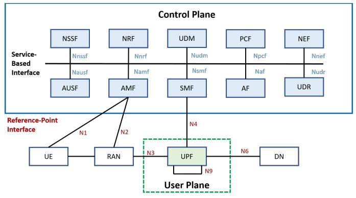
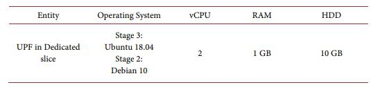
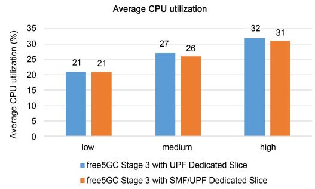

# Article Sharing: Evaluating Dedicated Slices of Different Configurations in 5G Core

>[!NOTE]
> Author:Leon Sawada(澤田博久)
> Date: 2023/12/13

## Overview

Network slicing is a new concept born after the emergence of 5G. Network slicing and edge computing (Multi-access Edge) are both key technologies in 5G networks. Network slicing uses virtualization technology to cut the network into multiple virtual end-to-end networks, and the equipment, access, transmission, and core network between each virtual network are all independent. Dynamic demand, resource adjustment, and improved network flexibility can also reduce the construction cost of hardware resources and network construction time, and achieve hardware resource sharing.
Since one of the characteristics of network slicing is its flexibility, this article verifies this very well. In this article, the author uses free5GC, ETSI NFV MANO framework, and other tools, and designs three different slices to show how different configurations of dedicated slices will affect the performance of the 5G core. Finally, discussed which slice should be used in different situations to provide the best service to users.

### NFV MANO

The management and scheduling of the core network mainly uses NFV MANO (Management and Orchestration) technology, which is an architecture proposed by the European Telecom Standards Institute (ETSI) and later adopted by 3GPP to manage 5G core network virtualization. Network function (Virtual Network Function, VNF) specification, NFV MANO allows the core network to adopt a fully virtualized VNF design and better schedule various network slicing functions. MANO of the 5G core network has the ability to manage and schedule VNFs belonging to different slices for different slice services. As shown in the figure, NFV MANO can manage and schedule VNFs of the 5G core network such as AMF, NSSF, NRF, AUSF, and PCF, SMF, UDM, UPF, etc. This will also be paired with the core network in free5GC that we will only use. As you can see: NFV Orchestrator (NFVO), VNF Management (VNFM), and Virtualized Infrastructure Managers (VIM) are three major components in the MANO architecture framework.

*NFV Orchestrator: Responsible for supporting new network services (NS) suites and virtual network functions (VNF). Nuclear submarine life cycle management. Global resource management. Review and approve requests for Network Functions Virtualization Infrastructure (NFVI) resources.

*VNF Manager: Controls the life cycle management of VNF instances. Performs the function of coordinating and coordinating configuration and event reporting between the NFV infrastructure (NFVI) and network element/network management systems.

*Virtualization Infrastructure Manager (VIM): Monitors and manages NFVI compute, storage, and network resources.

 **Figure 1. NFV MANO architecture**

According to the definition of 3GPP, network slices are composed of multiple network slice sub-networks such as core network, access network, and transport network. NFV MANO plays an important role in mapping each network slice network to network services.

### free5GC
free5GC is an open-source project for fifth-generation (5G) mobile networks. The ultimate goal of this project is to implement the 5G Core Network (5GC) defined in 3GPP Release 15 (R15) and later.

As shown in the figure, NYCU free5GC provides all the functions of a 5G network and is divided into the control plane and the user plane. The control plan includes NSSF, NRF, UDM, PCF, NEF, AUSF, AMF, SMF, UDR, and AF. In the user plane, there is only one network function called UPF. The separation of the user plane and the control plane allows each aircraft to be deployed and evolved independently. NYCU free5GC has also modulated its functional design to make the deployment of network functions in an NFV environment more flexible and efficient.

 **Figure 2. free5GC architecture**

In addition to free5GC, use MANO open source including OpenStack and Tacker. OpenStack is an open-source cloud operating system that virtualizes resources such as storage, computing, and networking. Most of these virtualized resources are deployed in the cloud as Infrastructure-as-a-service (IaaS). OpenStack provides a web-based interface dashboard. This dashboard allows us to efficiently configure, manage and monitor our virtualization resources. Tacker is an OpenStack project that provides NFVO and VNFM functionality to configure, deploy, manage, and schedule NS and VNFs on NFV infrastructure platforms such as OpenStack. The Tacker API can be used not only by NFV Orchestrator but also by OSS/BSS to deploy VNFs.

## Three different types of slice

### free5GC Stage 3 with UPF Dedicated Slices

The image below shows the architecture of free5GC Stage 3, each dedicated slice consisting of only UPF. It uses three dedicated slices to handle three different types of test traffic. Each dedicated slice is connected to a specific data network (DN) server. These UPFs in different dedicated slices share the same SMF in the common slice.

 **Figure 3. free5GC with different configurations of dedicated slices**

Three traffic generators are provided to simulate the packets that will be sent to the 5GC by the 5G UEs and RAN. Each traffic generator will transmit two types of packets: UDP and ICMP (Internet Control Message Protocol). Each traffic generator Each traffic generator sends UDP packets at different rates: high, medium, and low. All traffic generators send both UDP packets and ICMP packets. This can estimate the throughput of UDP traffic and calculate the response time of ICMP packets. Each network cutter routes packets to a different data network (DN) server. (DN) servers so that can verify successful transmission through the selected UPF.

Firstly, the UE will be connected to the RAN within the traffic generator. Secondly, the traffic generator transmits the NGAP Initial UE message to the AMF. This message carries the registration request and the UE information (including UE address IP, SST (Slice/Service Type), and SD (Slice Differentiator)). Thirdly, AMF requests UE authentication from AUSF. If the UE is a valid user, the AUSF accepts the request and transmits the response to the AMF. After that, the AMF transmits the UE information to the NSSF, which then provides a list of available SMFs to the AMF based on the information received. Next, AMF will select a suitable SMF for UE and create a smContext for SMF to establish a new session. Finally, the SMF will select a suitable UPF and establish a PDU (Protocol Data Unit) session between the UE and the selected UPF.

 **Figure 4. Registration workflow of free5GC Stage 3**

After the registration is complete, the UE can start transmitting packets to its DN server. The transmission workflow is shown in the following figure. First, the UE sends UDP packets and ICMP packets to the UPF through its PDU session. Second, the UPF will forward these packets to a specific DN. Third, the DN will calculate the throughput of the UDP packets received from the UPF. Fourth, when the DN receives an ICMP packet, it will send the ICMP response back to the UPF. Finally, the UPF will forward this ICMP response to the UE; this will allow the UE to calculate the ICMP response time.

 **Figure 5. Transmission workflow**

### free5GC Stage 3 with SMF/UPF Dedicated Slices

The architecture of this slice is similar to the previous one, as shown in part b of the figure. Each dedicated slice is composed of SMF and UPF It also uses three dedicated slices to handle different data rate requirements, each connected to a specific DN server. All VNFs use the same resources as the previous VNF. Unlike the previous one, we move the SMF from the common slice to the dedicated slice. Each UPF connects to an SMF in the same dedicated slice and both need to share resources. The traffic generators and DN servers are the same as those used in the previous architecture. The registration workflow is also similar to Fig. 4; the only difference is that in the last step, the SMFs do not need to select the UPFs because the UPFs have already been assigned to each SMF. The SMFs only need to set up PDU sessions between the UEs and the UPFs. After the registration is completed, the transmission workflow is also the same as the previous architecture, as shown in the above figure.

 **Figure 3.free5GC with different configurations of dedicated slices**

###  free5GC Stage 2 with UPF Dedicated Slice

The architecture of this slice, with each dedicated shard consisting only of UPFs, is the same as that shown in Figure 3 part(a). The only difference is that the VNF version in this architecture is free5GC Stage 2. VNFs in Stage 2 are less optimized than in Stage 3
The traffic generator and DN server are also the same as in free5GC Stage 3. However, the registration workflow is very different from Stage 3. This is because, in free5GC Stage 2, the NSSF is not utilized to select a dedicated and exclusive slice to serve the requesting UE. It is assumed that the UE will deliver the traffic directly to the allocated slice as shown in Fig. 6. First, the UE will connect to the RAN within the traffic generator. Second, the traffic generator will send a registration request and assign the UPF. Third, the AMF requests the UE authentication from the AUSF. If the UE is a valid user, the AUSF accepts the request and transmits the response to the AMF. Next, the AMF transmits the UE message to the SMF. Finally, the SMF locates the UPF specified by the UE and establishes a PDU session between the UE and the UPF. The transmission workflow in Stage 2 is the same as that in Stage 3, as shown in Fig. 5.

 **Figure 6. Registration workflow of free5GC Stage 2**

## Experiment 

There are two sumptions: 1st, all the dedicated slices are allocated with the same amount of resources, i.e., to use the same number of vCPU and the same amount of memory and storage. 2nd, all three systems under evaluation are allocated the same amount of resources. We use two identical rack servers, one for OpenStack and one for Tacker. Follow the ETSI MANO framework to build this slicing environment.

For the first assumption, the specification of VNFs is divided into two parts:  common slice and dedicated slice. For the common slice, the specifications of all VNFs in the common slice are the same for different systems. As shown in Table 2. For the dedicated slices, we show the VNFs with different specifications in Table 3. Three traffic generators and three DN servers are configured with 2 vCPUs, 1 GB RAM, and 10 GB disks, and mirrored with Ubuntu 18.04.

 **Table 1. Specification of implementation environment**

 **Table 2. Specification of VNF in a common slice for the first assumption**

 **Table 3. Specification of VNF in the dedicated slice for the first assumption**

For the second assumption, the specification of VNFs is also divided into two parts: common slices and dedicated slices. For common slices, the resource specifications of VNFs other than SMFs are the same as in Table 2. On the other hand, the resource specifications of SMFs in different configurations are shown in Table 4. Correspondingly, the resource specifications of UPFs in different configurations are shown in Table 5.

 **Table 4. Specification of SMF for second assumption**

 **Table 5. Specification of UPF for second assumption**

## Result and conclusion
Figures 7 and 8 show the average throughput results for three different systems at three UDP packet data rates: low (80 Mbps), medium (200 Mbps), and high (400 Mbps).

 **Figure 7. Average throughput under the first assumption**

 **Figure 8. Average throughput under the second assumption**

Based on the graph, we can see that under the first assumption, free5GC Stage 3 with UPF-specific cuts provides higher throughput than free5GC Stage 3 with SMF/UPF-specific cuts because the former has more vCPU resources than the latter. Compared with free5GC Stage 2, the free5GC Stage 3 system is more optimized.

Figures 9 and 10 show the average response time of the three different systems under the two assumptions. As the design of our proposed system is more complicated than that of the comparator system, the average response time becomes more modest. Under the second assumption, both systems have similar response times. However, under the first assumption, the response time of free5GC Stage 3 with UPF-specific slice is shorter because UPF has more vCPU resources.

 **Figure 9. Average response time under the first assumption**

 **Figure 10. Average response time under the second assumption**

Figures 11 and 12 show the average CPU utilization of the two free5GC Stage 3 systems at the three data rates. Under the second assumption, there is no difference in CPU usage between the two free5GC Stage 3 systems. However, under the first assumption, the CPU usage rate is almost the same even if the number of vCPUs used in the UPF is different. However, in both assumptions, if we send more packets from the traffic generator, the CPU usage rate will be higher. This is because CPU usage depends only on the number of packets transmitted. On the other hand, the CPU usage of free5GC Stage 3 with the UPF dedicated cutter is slightly higher than that of free5GC Stage 3 with the SMF/UPF dedicated cutter, because the use of more vCPU resources results in more competitive conditions among CPUs.

 **Figure 11. Average response time under the second assumption**

 **Figure 12. Average CPU utilization under the first assumption**

Figures 13 and Figures 14 show the average registration time in our proposed system. In free5GC Stage 3 with SMF/UPF dedicated slices, SMF does not require the choice of UPF, and thus the registration time is lower under both assumptions. Even though we provide more powerful SMF and UPF dedicated slices in free5GC Stage 3 under the second assumption, the registration process still takes longer. This is because SMF takes extra time to select UPF.

 **Figure 13. Average registration time under the first assumption**

 **Figure 14. Average registration time under the second assumption**

Based on these results lead to the following conclusions: Under the first assumption, moving the SMF from the common slice to the dedicated slice will shorten the registration time, but it will deteriorate the performance of the UPF because fewer resources are allocated to the UPF than before. However, under the second assumption, only the registration time is affected; the performance of the UPF is not affected. This is because the functions in the control plane are no longer involved in the operation when the transfer starts. Therefore, if a large number of connections are required in a short period, moving the SMF from the common slice to the dedicated slice will be a better choice because the registration time of the system is shorter; it can handle a large number of registrations more efficiently. In addition, if users want to get better throughput and shorter response time under the first assumption, it is recommended to keep the SMF in the common slice so that more resources can be allocated to the UPF for better performance. Therefore we know we need to use different network slices based on different scenarios, which is the best proof of the convenience of network slicing.

Network slicing is a crucial concept in 5G networks, allowing virtual network functions to form interconnected network services, with dedicated slices being evaluated to determine the best-performing configuration based on various factors.
Fuchun Joseph Lin and Yu-Herng Chai described evaluating dedicated slices of different configurations in the 5G core. The text discusses the creation of a common slice and three dedicated slices in a network architecture. The performance of these systems is evaluated based on throughput, response time, CPU utilization, and registration time. The deployment of dedicated slices is experimented with using open-source projects. Moving the SMF from the common slice to the dedicated slice is recommended for handling a large number of connections efficiently. Different resource allocations to dedicated slices are also considered. The performance of the three systems is compared based on registration time, response time, throughput, resource cost, and CPU utilization. The testbed is built using the ETSI NFV MANO framework, free5GC, OpenStack, and Tacker. The goal is to evaluate the performance of different configurations of 5G core dedicated slices. The response time of free5GC Stage 3 with UPF dedicated slice is shorter under the first assumption, while a more powerful SMF in free5GC Stage 3 still takes longer during registration under the second assumption.

## About

Leon Sawada

NYCU CS Graduate student, today I introduce an article written by my professor Fuchun Joseph Lin. I hope this article could help you understand more about the attributes of different network slices.

## Reference

What Is NFV MANO -SDxCentral Studios

free5GC Offical website

Li, X., et al. (2017) Network Slicing for 5G: Challenges and Opportunities. IEEE Internet Computing, 21, 20-27

V. K. Choyi, A. Abdel-Hamid, Y. Shah, S. Ferdi, and A. Brusilovsky, "Network slice selection, assignment and routing within 5G Networks," 2016 IEEE Conference on Standards for Communications and Networking (CSCN), Berlin, Germany, 2016, pp. 1-7, doi: 10.1109/CSCN.2016.7784887.

Liao, C.W., Lin, F.J. and Sato, Y. (2020) Evaluating NFV-enabled Network Slicing
for 5G Core. 2020 21st Asia-Pacific Network Operations and Management Symposium (APNOMS), Daegu, Korea (South), 22-25 September 2020, 401-404. 

Chai, Y.-H. and Lin, F.J. (2021) Evaluating Dedicated Slices of Different Configurations in 5G Core. Journal of Computer and Communications, 9, 55-72

>[!NOTE]
> If you are interested in supporting free5GC, we welcome your donation. Please visit this [link](https://free5gc.org/membership/) for more details.