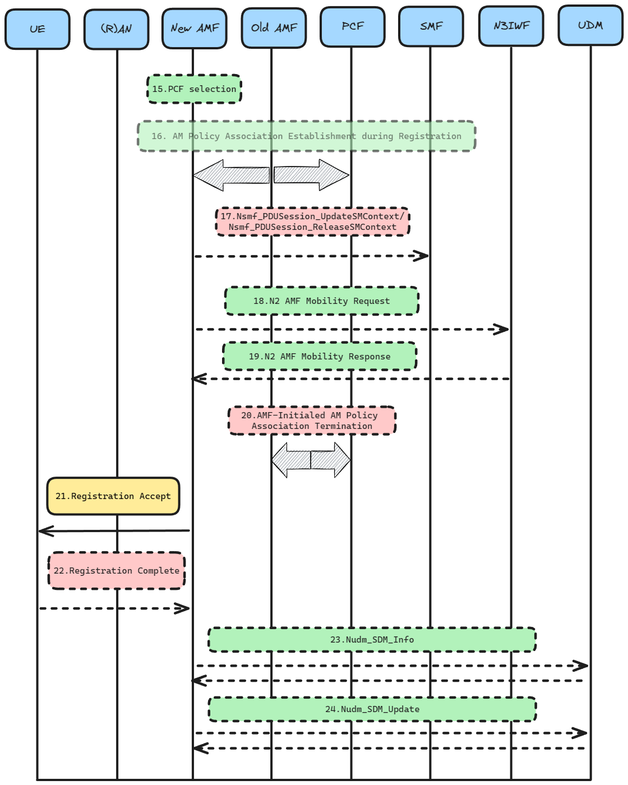

# Registration procedures

>[!NOTE]  
>Author: Tim Lin (tim1207)  
>Author: Donald Shih (donald1218)  
>Date: 2024/1/19

## Introduction
The purpose of registration procedures is to allow UEs to register for specific service access rights in 5G. They can be divided into four main type:

**1. Initial Registration** is a mandatory procedure that UEs must execute when they are first powered on. After completing this procedure, the core network will allocate the corresponding resources to the UE. If the UE is in the Idle state (CM-Idle) for a long period of time, causing the core network to lose the UE Context, the UE must also initiate this procedure.  
**2. Mobility Registration** is a procedure that UEs must initiate when they move to a new Tracking Area (TA) that is not included in the UE's TAI List. This procedure is used to update the TA information.  
**3. Periodic Registration** is similar to the Periodic TAU in 4G.  
**4. Emergency Registration** is a procedure that UEs can use to register for emergency services, even if they do not have a valid 5G subscription.

### Registration Procedure with New AMF

### <u>Description</u>

- [1] The UE initiates a Registration Request to the (R)AN, which includes an (R)AN message.  
    - AN message has:  
        - Registration Type 
        - SUCI or 5G-GUTI or PEI
        - Last visited TAI (if available)
        - Security parameters
        - Requested NSSAI
        - Mapping of Requested NSSAI
        - PDU Session status
        - List of PDU Sessions To Be Activated

- [2] The base station selects the AMF that will service the UE based on the GUAMI information.If the UE does not provide a GUAMI, the core network uses the Requested NSSAI to find an AMF that supports those needs.

- [3] Ran will send N2 Message to New AMF:
    - N2 Message with :
        - N2 parameters
        - Registration Request
        - UE Policy Container
>If the Registration type is Periodic Registration Update, then steps 4 to 20 may be omitted.

- [4] [Conditional] In step 4, the following actions are taken depending on the deployment status of UDSF:  
    - **UDSF is deployed**: The new AMF does not need to get data from the old AMF. Instead, the new AMF can call the Nudsf_UnstructuredDataManagement_Query service to directly retrieve the UE's SUPI and UE context from the UDSF.

    - **UDSF is not deployed**: The new AMF will invoke the Namf_Communication_UEContextTransfer message provided by the old AMF, to request the UE's SUPI and UE context.

- [5] [Conditional] 
    - **UDSF is deployed**: The UDSF responds to the new AMF for the Nudsf_Unstructured_Data_Management_Query invocation with the related contexts.

    - **UDSF is not deployed**: Old AMF responds to the new AMF for the Namf_Communication_UEContextTransfer invocation by including the UE's SUPI and UE Context.
        - UE Context with :
            - information about established PDU Session(s)
            - information about active NGAP UE-TNLA bindings to N3IWF
            - information about AM Policy Association

- [6] [Conditional] If the SUCI is not provided by the UE, and it is not retrieved from the old AMF, then the new AMF will send an Identity Request message to the UE to obtain the SUCI.

- [7] [Conditional] The UE uses the HPLMN-provided public key and SUPI to derive the SUCI. The UE then includes the SUCI in the Identity Response message to the new AMF.

### <u>Description</u>

- [8] UEs can initiate UE authentication by calling AUSF. In this example, the AMF will use the SUPI or SUCI to select the AUSF.

- [9] Authentication and Security  
Due to the complexity of this section of the process, it will be described in detail in another section.

- [10] [Conditional]  
    **If the conversion of AMF is completed**, New AMF will call Namf_Communication_RegistrationCompleteNotify to notify Old AMF registration is completed.

    **If the S-NSSAIs used in the old Registration Area cannot be served in the target Registration Area**, the new AMF determines which PDU Session cannot be supported in the new Registration Area.The new AMF invokes the Namf_Communication_RegistrationCompleteNotify service operation to notify the old AMF.Then the new AMF modifies the PDU Session Status.  

    **If new AMF received in the UE context transfer in step 2 the information about the AM Policy Association**, It will inform the old AMF that the AM Policy Association in the UE context is no longer in use.

- [11] [Conditional]  
    **If the PEI is not provided by the UE nor obtained from Old AMF**, New AMF will obtain the PEI by sending an Identity Request message to the UE to initiate the Identity Request procedure.

- [12] [Optional]  
The new AMF initiates ME identity check by invoking the N5g-eir_EquipmentIdentityCheck_Get service operation

### <u>Description</u>

- [13] If Step 14 is to be executed, New AMF will select the UDM based on the SUPI and the UDM will select a UDR Instance.

- [14a] If the AMF changes, or the SUPI provided by the UE is invalid, or the UE registers to the same AMF but this AMF is already registered for non-3GPP access, the new AMF is registered with the UDM using Nudm_UECM_Registration, and subscribes to be notified when the UDM deregisters this AMF, the UDM stores the AMF identity assciated to the Access Type, and the UDM can store the information in the UDR via Nudr_DM_Update.

- [14b] The AMF retrieves the SMF Selection Subscription data and Access and Mobility Subscription data and UE context using Nudm_SDM_Get, and the UDM retrieves that information from the UDR via Nudr_DM_Query.

- [14c] After receiving a successful response, AMF calls Nudm_SDM_Subscribe to subscribe to the notification when the requested data has been modified, and UDM can subscribe to the UDR via Nudr_DM_Subscribe.

- [14d] [Conditional] After the UDM stores the Access type information, it causes the UDM to initiate a Nudm_UECM_DeregistrationNotification to the Old AMF so that the Old AMF deletes the corresponding UE context.      
    - **If the UDM indicates the deletion reason is Initial Registration**, the old AMF will send a Nsmf_PDUSession_ReleaseSMContext message to all the SMFs associated with the UE to notify them that the UE has deregistered from the old AMF. The SMFs will then release the PDU sessions after receiving this notification.

    - **If the Old AMF has an N2 connection against that UE**, the Old AMF will perform an (R)AN Release indicating that the UE has locally released the RRC Connection for the NG-RAN.

- [14e] The Old AMF unsubscribes with the UDM for subscription data using Nudm_SDM_unsubscribe.

### <u>Description</u>

- [15] The New AMF can be contacted to the (V-)PCF using the PCF ID in the UE context received in Step 5.

- [16] [Optional] If the New AMF contacts (V-)PCF using the PCF ID in the UE context received in Step 5. the New AMF shall put the PCF ID(s) in the call to Npcf_AMPolicyControl Create operation.

- [17] [Conditional]
    - **Nsmf_PDUSession_UpdateSMContext**  
    The AMF invokes the Nsmf_PDUSession_UpdateSMContext in the following scenario(s):
        - **If the registration request in Step 1 contains List Of PDU Sessions To Be Activated**, the AMF sends an Nsmf_PDUSession_UpdateSMContext request to the SMFs associated with the PDU Session(s) to activate the User Plane connections of these PDU Session(s). 
    - **Nsmf_PDUSession_ReleaseSMContext**  
    The AMF invokes the Nsmf_PDUSession_ReleaseSMContext service operation towards the SMF in the following scenario:
        - **If any PDU Session status indicates that it has been released on the UE side**, the AMF will use this to notify the SMF to release the resources associated with that PDU Session.

- [18-19] If the AMF has changed and the Old AMF indicates a pre-existing NGAP UE association to the N3IWF, the New AMF creates an NGAP UE association to the N3IWF to which the UE is already connected and automatically releases the previous NGAP UE associations of the Old AMF and the N3IWF , and N3IWF will response to AMF.

- [20] [Optional] **If the Old AMF previously initiated a Policy Association for the PCF and the Old AMF did not transfer the PCF ID(s) to the New AMF**, the Old AMF performs an AMF-initiated Policy Association Termination to remove the association with the PCF.

- [21] The AMF sends a Registration Accept message to the UE indicating that the registration request has been accepted. If the AMF assigns a new 5G-GUTI, it will include the 5G-GUTI.

- [22] [Conditional] After receiving any of [Configured NSSAI for the Serving PLMN], [Mapping Of Configured NSSAI] and Network Slicing Subscription Change Indication in Step 21, the UE sends a Registration Complete message (to confirm whether the new 5G-GUTI is allocated) to the AMF. sends a Registration Complete message (to confirm whether the new 5G-GUTI has been allocated).
    - **If the List Of PDU Sessions To Be Activated is not included in the Registration Request**, the AMF releases the signalling connection with the UE.
    - **If Follow-on request is included in the Registration Request**, AMF shall not release the signalling connection after completing the registration process.
    - **If AMF knows that there is a pending signalling in AMF or between UE and 5GC**, AMF shall not release the signalling connection immediately after completing the registration process.

- [23] [Conditional] The AMF also uses Nudm_SDM_Info to confirm to the UDM that the UE has received and acted upon the Network Slicing Subscription Change Indication (see Step 21 and step 22).
    - **If the Access and Mobility Subscription data provided by the UDM to the AMF in Step 14b includes Steering of Roaming information with an indication that the UDM is requesting to receive an acknowledgement of that information from the UE**, the AMF uses Nudm_SDM_Info to provide a UE acknowledgement to the UDM. AMF uses Nudm_SDM_Info to provide a UE acknowledgement to the UDM.

- [24] [Conditional] This step occurs after Step 14a will send Homogeneous Support of IMS Voice over PS Sessions to the UDM using Nudm_UECM_Update.  
    - **If the AMF has evaluated the support of IMS Voice over PS Sessions**, see TS 23.501.
    - **If the AMF determines that it needs to update the Homogeneous Support of IMS Voice over PS Sessions**, see TS 23.501.

## Reference
- *3GPP TS 23.502*: Registration Management procedures

## About
Thank you for reading.We are members of the free5GC team who joined last year. This post is our first blog.If you find any errors in the article or have any questions about the content, don't hesitate to reach out via email to share your insights.

### Connect with Me
- Linkedin: [Donald](https://www.linkedin.com/in/%E6%9D%B1%E7%81%9D-%E7%9F%B3-b8a3b323b/)
- Github: [https://github.com/donald1218](https://github.com/donald1218)
- Linkedin: [Tim](https://www.linkedin.com/in/%E5%B3%BB%E9%9C%86-%E6%9E%97-a285bb282/)
- Github: [https://github.com/tim1207](https://github.com/tim1207)
>[!NOTE]
> If you are interested i# Registration procedures

>[!NOTE]  
>Author: Tim Lin (tim1207)  
>Author: Donald Shih (donald1218)  
>Date: 2024/1/19

## Introduction

The purpose of registration procedures is to allow UEs to register for specific service access rights in 5G. They can be divided into four main type:

**1. Initial Registration**
is a mandatory procedure that UEs must execute when they are first powered on. After completing this procedure, the core network will allocate the corresponding resources to the UE. If the UE is in the Idle state (CM-Idle) for a long period of time, causing the core network to lose the UE Context, the UE must also initiate this procedure.

**2. Mobility Registration** Update is a procedure that UEs must initiate when they move to a new Tracking Area (TA) that is not included in the UE's TAI List. This procedure is used to update the TA information.

**3. Periodic Registration** Update is similar to the Periodic TAU in 4G.

**4. Emergency Registration** is a procedure that UEs can use to register for emergency services, even if they do not have a valid 5G subscription.

### Registration Procedure with New AMF

### <u>Description</u>

- [1]
The UE initiates a Registration Request to the (R)AN, which includes an (R)AN message.  
    - AN message has:  
        - Registration Type 
        - SUCI or 5G-GUTI or PEI
        - Last visited TAI (if available)
        - Security parameters
        - Requested NSSAI
        - Mapping of Requested NSSAI
        - PDU Session status
        - List of PDU Sessions To Be Activated

- [2] The base station selects the AMF that will service the UE based on the GUAMI information.If the UE does not provide a GUAMI, the core network uses the Requested NSSAI to find an AMF that supports those needs.

- [3] Ran will send N2 Message to New AMF:
    - N2 Message with :
        - N2 parameters
        - Registration Request
        - UE Policy Container
>>If the Registration type is Periodic Registration Update, then steps 4 to 20 may be omitted.

- [4] [Conditional] In step 4, the following actions are taken depending on the deployment status of UDSF:

    - **UDSF is deployed**: The new AMF does not need to get data from the old AMF. Instead, the new AMF can call the Nudsf_UnstructuredDataManagement_Query service to directly retrieve the UE's SUPI and UE context from the UDSF.

    - **UDSF is not deployed**: The new AMF will invoke the Namf_Communication_UEContextTransfer message provided by the old AMF, to request the UE's SUPI and UE context.

- [5] [Conditional] 

    - **UDSF is deployed**: The UDSF responds to the new AMF for the Nudsf_Unstructured_Data_Management_Query invocation with the related contexts.
    - **UDSF is not deployed**: Old AMF responds to the new AMF for the Namf_Communication_UEContextTransfer invocation by including the UE's SUPI and UE Context.
        
        - UE Context with :
            - information about established PDU Session(s)
            - information about active NGAP UE-TNLA bindings to N3IWF
            - information about AM Policy Association

- [6] [Conditional] If the SUCI is not provided by the UE, and it is not retrieved from the old AMF, then the new AMF will send an Identity Request message to the UE to obtain the SUCI.

- [7] [Conditional] The UE uses the HPLMN-provided public key and SUPI to derive the SUCI. The UE then includes the SUCI in the Identity Response message to the new AMF.

### <u>Description</u>

- [8] UEs can initiate UE authentication by calling AUSF. In this example, the AMF will use the SUPI or SUCI to select the AUSF.

- [9] Authentication and Security   
Due to the complexity of this section of the process, it will be described in detail in another section.

- [10] [Conditional]  
    **If the conversion of AMF is completed**, New AMF will call Namf_Communication_RegistrationCompleteNotify to notify Old AMF registration is completed.

    **If the S-NSSAIs used in the old Registration Area cannot be served in the target Registration Area**, the new AMF determines which PDU Session cannot be supported in the new Registration Area.The new AMF invokes the Namf_Communication_RegistrationCompleteNotify service operation to notify the old AMF.Then the new AMF modifies the PDU Session Status.  

    **If new AMF received in the UE context transfer in step 2 the information about the AM Policy Association**, It will inform the old AMF that the AM Policy Association in the UE context is no longer in use.

- [11] [Conditional]  
**If the PEI is not provided by the UE nor obtained from Old AMF**, New AMF will obtain the PEI by sending an Identity Request message to the UE to initiate the Identity Request procedure.

- [12] [Optional]  
The new AMF initiates ME identity check by invoking the N5g-eir_EquipmentIdentityCheck_Get service operation

### <u>Description</u>

- [13] If Step 14 is to be executed, New AMF will select the UDM based on the SUPI and the UDM will select a UDR Instance.

- [14a] If the AMF changes, or the SUPI provided by the UE is invalid, or the UE registers to the same AMF but this AMF is already registered for non-3GPP access, the new AMF is registered with the UDM using Nudm_UECM_Registration, and subscribes to be notified when the UDM deregisters this AMF, the UDM stores the AMF identity assciated to the Access Type, and the UDM can store the information in the UDR via Nudr_DM_Update.

- [14b] The AMF retrieves the SMF Selection Subscription data and Access and Mobility Subscription data and UE context using Nudm_SDM_Get, and the UDM retrieves that information from the UDR via Nudr_DM_Query.

- [14c] After receiving a successful response, AMF calls Nudm_SDM_Subscribe to subscribe to the notification when the requested data has been modified, and UDM can subscribe to the UDR via Nudr_DM_Subscribe.

- [14d] [Conditional] After the UDM stores the Access type information, it causes the UDM to initiate a Nudm_UECM_DeregistrationNotification to the Old AMF so that the Old AMF deletes the corresponding UE context.  
    
    - **If the UDM indicates the deletion reason is Initial Registration**, the old AMF will send a Nsmf_PDUSession_ReleaseSMContext message to all the SMFs associated with the UE to notify them that the UE has deregistered from the old AMF. The SMFs will then release the PDU sessions after receiving this notification.
    - **If the Old AMF has an N2 connection against that UE**, the Old AMF will perform an (R)AN Release indicating that the UE has locally released the RRC Connection for the NG-RAN.

- [14e] The Old AMF unsubscribes with the UDM for subscription data using Nudm_SDM_unsubscribe.

### <u>Description</u>

- [15] The New AMF can be contacted to the (V-)PCF using the PCF ID in the UE context received in Step 5.

- [16] [Optional] If the New AMF contacts (V-)PCF using the PCF ID in the UE context received in Step 5. the New AMF shall put the PCF ID(s) in the call to Npcf_AMPolicyControl Create operation.

- [17] [Conditional]
    - **Nsmf_PDUSession_UpdateSMContext**  
    The AMF invokes the Nsmf_PDUSession_UpdateSMContext in the following scenario(s):
        - **If the registration request in Step 1 contains List Of PDU Sessions To Be Activated**, the AMF sends an Nsmf_PDUSession_UpdateSMContext request to the SMFs associated with the PDU Session(s) to activate the User Plane connections of these PDU Session(s). 
    - **Nsmf_PDUSession_ReleaseSMContext**  
    The AMF invokes the Nsmf_PDUSession_ReleaseSMContext service operation towards the SMF in the following scenario:
        - **If any PDU Session status indicates that it has been released on the UE side**, the AMF will use this to notify the SMF to release the resources associated with that PDU Session.

- [18-19] If the AMF has changed and the Old AMF indicates a pre-existing NGAP UE association to the N3IWF, the New AMF creates an NGAP UE association to the N3IWF to which the UE is already connected and automatically releases the previous NGAP UE associations of the Old AMF and the N3IWF , and N3IWF will response to AMF.

- [20] [Optional] **If the Old AMF previously initiated a Policy Association for the PCF and the Old AMF did not transfer the PCF ID(s) to the New AMF**, the Old AMF performs an AMF-initiated Policy Association Termination to remove the association with the PCF.

- [21] The AMF sends a Registration Accept message to the UE indicating that the registration request has been accepted. If the AMF assigns a new 5G-GUTI, it will include the 5G-GUTI.

- [22] [Conditional] After receiving any of [Configured NSSAI for the Serving PLMN], [Mapping Of Configured NSSAI] and Network Slicing Subscription Change Indication in Step 21, the UE sends a Registration Complete message (to confirm whether the new 5G-GUTI is allocated) to the AMF. sends a Registration Complete message (to confirm whether the new 5G-GUTI has been allocated).

    - **If the List Of PDU Sessions To Be Activated is not included in the Registration Request**, the AMF releases the signalling connection with the UE.

    - **If Follow-on request is included in the Registration Request**, AMF shall not release the signalling connection after completing the registration process.

    - **If AMF knows that there is a pending signalling in AMF or between UE and 5GC**, AMF shall not release the signalling connection immediately after completing the registration process.

- [23] [Conditional] The AMF also uses Nudm_SDM_Info to confirm to the UDM that the UE has received and acted upon the Network Slicing Subscription Change Indication (see Step 21 and step 22).
    - **If the Access and Mobility Subscription data provided by the UDM to the AMF in Step 14b includes Steering of Roaming information with an indication that the UDM is requesting to receive an acknowledgement of that information from the UE**, the AMF uses Nudm_SDM_Info to provide a UE acknowledgement to the UDM. AMF uses Nudm_SDM_Info to provide a UE acknowledgement to the UDM.

- [24] [Conditional] This step occurs after Step 14a will send Homogeneous Support of IMS Voice over PS Sessions to the UDM using Nudm_UECM_Update.  
    - **If the AMF has evaluated the support of IMS Voice over PS Sessions**, see TS 23.501.
    - **If the AMF determines that it needs to update the Homogeneous Support of IMS Voice over PS Sessions**, see TS 23.501.

## Reference

- *3GPP TS 23.502*: Registration Management procedures

## About
Thank you for reading.We are members of the free5GC team who joined last year. This post is our first blog.If you find any errors in the article or have any questions about the content, don't hesitate to reach out via email to share your insights.

### Connect with Me

- Linkedin: [Donald](https://www.linkedin.com/in/%E6%9D%B1%E7%81%9D-%E7%9F%B3-b8a3b323b/)

- Github: [https://github.com/donald1218](https://github.com/donald1218)

- Linkedin: [Tim](https://www.linkedin.com/in/%E5%B3%BB%E9%9C%86-%E6%9E%97-a285bb282/)

- Github: [https://github.com/tim1207](https://github.com/tim1207)

>[!NOTE]
> If you are interested in supporting free5GC, we welcome your donation. Please visit this [link](https://free5gc.org/membership/) for more details.
