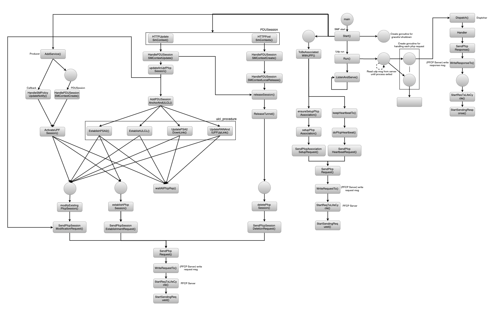

# SMF PFCP Software Architecture

>[!NOTE]
> Author: MingHsien Wu
> Date: 2024/02/09

## Introduction
Packet Forwarding Control Protocol(PFCP) is a communication protocol used in N4 interface of 5G core network. It is responsible for managing and controlling packet forwarding including functions such as traffic routing, Qos policy and session management. Typically, PFCP operates between control plane (SMF) and data plane (UPF), facilitating the exchange of control information and configuration commands.

The main focus of this blog is to share the software architecture diagram detailing how the PFCP server handles PFCP messages within the SMF. It will commence from the activation of the Network Function. Next, we will consider how free5GC operates in the software layer when receiving PFCP messages from the UPF and when the SMF needs to send PFCP requests.

### <u>Description</u>

### <u>Conclusion</u>

## Reference

- *3GPP TS 23.502*: Procedures for the 5G System (5GS)
- *3GPP TS 29.244*: Interface between the Control Plane and the User Plane nodes

## About
Hello, I'm Hsien, a newcomer to free5gc. This is my first time sharing my experiment. If you find any mistakes or have any questions, please feel free to let me know. I would greatly appreciate it.

### Connect with Me

- Linkedin: [https://www.linkedin.com/in/wuminghsien/](https://www.linkedin.com/in/wuminghsien/)
- Github: [https://github.com/ming-hsien](https://github.com/ming-hsien)
