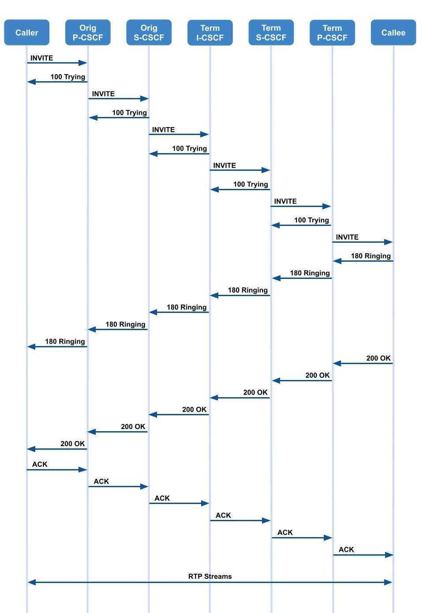

# Introduction of IP Multimedia Subsystem Part 3

>[!NOTE]
> Author: TzuChieh Huang
> Date: 2024/03/27
---

Continuing our exploration of the IP Multimedia Subsystem (IMS), Part 1 and Part 2 have provided a comprehensive understanding of the architecture, key components, and registration processes within the IMS framework. In Part 3, we delve into the intricate procedures of IMS call handling and look toward the future developments and innovations expected within this dynamic telecommunications landscape.

## Media Flow / Call Procedure
After successful registration, the following steps will be processed when a user initiates a communication session (e.g., make a call).

### SIP INVITE and 100 Trying
A SIP INVITE message aims to initiate a session between two endpoints. When a user wants to make a call, their SIP client sends an INVITE request to the SIP server, specifying the desired recipient and various parameters such as the media types (audio, video, etc.) and codecs for encoding the media.

The 100 Trying response in the context of the SIP is an informational response indicating that the request has been received and the server is working on a response. It serves as an interim response while the server processes the INVITE request or performs other tasks related to call setup.

- **Caller to Orig P-CSCF**
    - The caller sends the SIP INVITE request, including an initial SDP, to the P-CSCF, which is determined via the CSCF discovery mechanism. 
    - The initial SDP may encompass one or more media streams for a multi-media session.

- **Orig P-CSCF to Orig S-CSCF**
    - The originating P-CSCF knows the next hop CSCF since the UE has been registered.
    - The originating P-CSCF determines whether the INVITE message needs priority treatment based on the user profile saved during registration, the priority specified by the user, and/or the MPS code/identifier contained in the INVITE message.
    - If the session needs priority handling, the originating P-CSCF inserts or replaces the priority indication and forwards the INVITE to the originating S-CSCF. 

- **Orig S-CSCF to Term I-CSCF**
    - The originating S-CSCF validates the service profile and, if a Globally Routable User Agent URI (GRUU) is received as the contact, ensures that the Public User Identity associated with the served user in the request matches the Public User Identity linked to the GRUU, both belonging to the same service profile. 
    - Then the originating S-CSCF triggers any origination service logic necessary for this user
        - e.g., Authorization of the requested SDP based on the user's subscription for multi-media services. 

    - The originating S-CSCF analyzes the destination address, identifies the network operator the subscriber is affiliated with and forwards the SIP INVITE request. 
    - When the INVITE message contains a priority indication, the originating S-CSCF forwards the INVITE along with the Service User's priority level if available.
    - If the destination is local, the request is directed to a local I-CSCF for further processing.

- **Term I-CSCF to Term S-CSCF**
    - The terminated I-CSCF forwards the INVITE request to the terminated S-CSCF.
    - The S-CSCF validates the service profile and triggers any termination service logic required for this user. 
        - e.g., Authorization of the requested SDP based on the user's subscription for multi-media services.

- **Term S-CSCF to Term P-CSCF**
    - The terminated S-CSCF knows the next hop CSCF for this UE and forwards the INVITE to the terminated P-CSCF in the visited network.

- **Term P-CSCF to Callee**
    - If the terminated P-CSCF identifies that the termination is for a Multimedia Priority Service (MPS) session, it extracts the session information. It initiates dynamic policy enforcement by transmitting the derived session details to the Policy and Charging Rules Function (PCRF) or Policy Control Function (PCF). 
    - The terminated P-CSCF recalls (from the registration procedure) the UE address and forwards the INVITE to the UE.

### 180 ringing 
- If the UE needs user input before finalizing the session setup, it may alert the user and await their response. In such cases, it notifies the originating party with a provisional response, specifically indicating "Ringing." 
- This message is transmitted to the P-CSCF and forwarded along the signaling path to the originating endpoint.

### 200 OK    
- The 200 OK response indicates that the callee has accepted the call invitation and has successfully established the session. It contains essential information such as session parameters, codecs, and media descriptions for both parties to begin communication.
- This message is transmitted to the P-CSCF and forwarded along the signaling path to the originating endpoint.

### ACK
- After receiving the 200 OK response from the callee, the caller sends an ACK message to confirm the successful reception of the acceptance. The ACK message acknowledges the receipt of the 200 OK response and finalizes the call setup process. 
- It ensures that both ends of the call are synchronized and ready to proceed with the communication session.
- This message is transmitted to the P-CSCF and forwarded along the signaling path to the terminated endpoint.

### RTP Streams
- RTP streams are designed to deliver media in real-time with minimal delay, which is essential for IMS voice and video communication. They use UDP to transport media data, providing a continuous stream of packets representing the media content. The RTP protocol also supports mechanisms for synchronizing audio and video streams, handling packet loss, and ensuring media quality during the call.
- Once the SIP handshake is complete, RTP streams are established between the caller and the callee. 
- These streams carry the actual media (voice, video, etc.) over the network.

## IMS in Convergence and Next-Generation Networks

### Integration with 4G/5G Networks

#### 1. Role of IMS in LTE and 5G Architectures

In LTE and 5G networks, IMS is pivotal in enabling multimedia services over IP networks. It serves as the framework for delivering services like voice and video calls, multimedia messaging, and other IP-based communication services. 

In both LTE and 5G architectures, IMS is responsible for:

- **Session Control**: IMS handles the setup, modification, and termination of multimedia sessions, ensuring seamless communication.

- **Service Functionality**: It hosts Application Servers (AS) that provide various services like Voice over LTE (VoLTE), Video over LTE (ViLTE), Video over New Radio (VoNR), instant messaging, presence, and more.

- **Interoperability**: IMS ensures that different types of devices (smartphones, tablets, IoT devices, etc.) can communicate effectively, regardless of the access network (Wi-Fi, cellular, etc.).

#### 2. Enhancements for Low Latency and High Throughput

In the context of 5G integration, IMS undergoes several enhancements to leverage the capabilities of the new network:

- **Low Latency**: IMS is optimized to work with the ultra-low latency capabilities of 5G networks. This is particularly crucial for applications like real-time gaming, augmented reality (AR), virtual reality (VR), and other time-sensitive services.

- **High Throughput**: 5G networks provide significantly higher data rates than previous generations. IMS is enhanced to maximize this increased throughput, ensuring high-quality multimedia experiences.

### Cross-device and Cross-Network Communication

#### 1. Enabling Seamless Communication Across Various Devices and Networks

IMS enables users to communicate seamlessly across various devices, regardless of their form factor or operating system. This includes smartphones, tablets, laptops, IoT devices, and more. The key components facilitating this include:

- **P-CSCF and S-CSCF**: These elements ensure that SIP-based signaling messages can be appropriately routed to and from different devices.

- **Application Servers (AS)**: AS plays a critical role in providing services that can adapt to various device capabilities, ensuring a consistent user experience.

- **IMS Profile Management**: 
IMS profiles associated with a user are stored in the HSS and can be retrieved dynamically, allowing services to adapt to the device's capabilities.

#### 2. Support for VoLTE, ViLTE, VoNR, and Other Multimedia Services

IMS is instrumental in delivering various multimedia services over LTE and 5G networks:

- **VoLTE (Voice over LTE)**: 
IMS enables high-quality voice calls over LTE networks. It ensures that voice calls are treated as data sessions, allowing simultaneous voice and data usage.

- **ViLTE (Video over LTE)**: 
This service extends VoLTE's capabilities to include high-definition video calling.

- **VoNR (Voice over New Radio)**: 
With the introduction of 5G, IMS facilitates voice calls over the new radio interface, taking advantage of 5G's enhanced capabilities.

- **Multimedia Messaging**: 
IMS supports multimedia messaging services, allowing users to exchange images, videos, and other media in real time.

These services are made possible by interacting with various IMS components, including P-CSCF, I-CSCF, S-CSCF, and Application Servers, working together to establish and manage multimedia sessions.

## Conclusion
The IMS call flow is a sophisticated signaling and media transfer orchestration that enables seamless multimedia communication across various devices and networks. The entire process involves several network components, including P-CSCF, S-CSCF, and I-CSCF, which collaborate to support quality of service, security, and reliability. Meanwhile, the convergence of IMS with Next-Generation Networks marks a significant evolution in telecommunications, allowing for the integration of traditional telephony with modern IP-based services. This convergence promises enhanced efficiency, more decadent service offerings, and a robust platform for innovation, paving the way for a future where communication is more versatile, integrated, and ubiquitous. Together, they represent the ongoing commitment to advancing connectivity and creating a more cohesive and flexible communication ecosystem for users worldwide.

## Reference
3GPP TS 22.228: "Service requirements for the Internet Protocol (IP) multimedia core network subsystem (IMS) - Stage 1"

3GPP TS 23.218: "IP Multimedia (IM) session handling; IM call model; Stage 2"

3GPP TS 23.228: "IP Multimedia Subsystem (IMS) - Stage 2"

3GPP TS 29.228: "IP Multimedia (IM) Subsystem Cx and Dx Interfaces; Signalling flows and message contents"

## About
Hello, I am TzuChieh Huang. My ongoing research focuses on VoNR (Voice over New Radio). Feel free to reach out and share any inquiries or point out errors in the article. I welcome corrections and value your feedback. Please do not hesitate to contact me via email to contribute your insights.