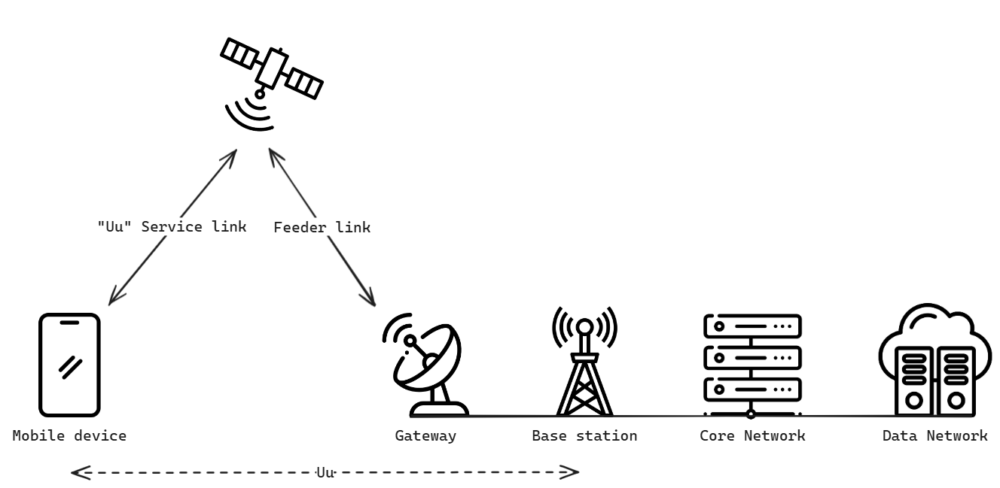
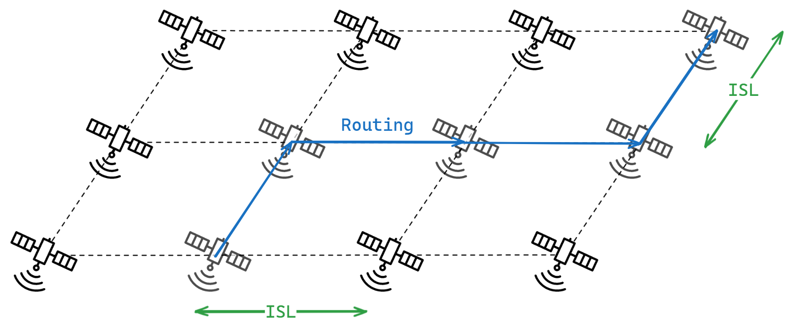

# NTN Overview

>[!NOTE]
> Author: Samuel Lin (pflin)
> Date: 2024/06/26

## Introduction

Non-Terrestrial Network (NTN) is an important component of future B5G and 6G networks. It can provide extensive coverage, enhanced connectivity for terrestrial networks, and establish the necessary satellite backhaul links to connect with the core network.

The global organization 3GPP extends existing terrestrial mobile communications to a satellite-based non-terrestrial network architecture. The aim is to integrate satellite and terrestrial networks. In the Release 16 *TR 22.822* document, 3GPP proposes three main NTN application types: **Service Continuity**, **Service Scalability**, and **Service Ubiquity**. These applications can provide stable and flexible network services in areas difficult for terrestrial networks to cover, such as oceans, remote areas, or conflict zones. In Release 17, 3GPP plans to incorporate NTN into the 5G cellular ecosystem, significantly accelerating the commercialization of NTN.

## NTN Architecture

### Transparent mode

Initially, in Release 17, NTN primarily relies on the reception and forwarding of signals from satellites to ground receiving stations in a **Transparent mode**. A ground receiving station can cover an area with a radius of approximately 800 kilometers.

>[!NOTE]
> **Feeder links:** Wireless link between `NTN Gateway` and `satellite`
> **"Uu" Service links:** Radio link between `satellite` and `mobile devices (UE)`

### Service Link Types

3GPP standards support three types of satellite service links, allowing support for any type of orbit.

- **Earth-fixed**: The beam continuously covers the same geographic area, remaining stationary relative to the Earth's surface. A typical example is the Global Positioning System (GPS), which uses multiple geosynchronous satellites to provide precise global positioning services.
- **Quasi-Earth-fixed**: In this coverage mode, the beam covers a geographic area for a specific period but shifts to cover other geographic areas over time. This method provides efficient geographic coverage for a specific time but lacks continuity.
- **Earth-moving**: The beam coverage moves along the Earth's surface, typically achieved by Low Earth Orbit (LEO) satellites. It is suitable for applications requiring dynamic global coverage, such as LEO satellite communication systems needing real-time updates and extensive geographic coverage.

## Current Research

### Constellation Routing

Constellation routing is a routing decision method for inter-satellite communication technology **(Inter-Satellite Link, ISL)** used in dynamically changing but periodically predictable satellite subnetworks. Its goal is to ensure high performance and reliability in message transmission while minimizing network delay and packet loss rates.

NTN develops ISL technology to replace submarine cables and achieve cross-regional communication. Compared to ground stations, LEO satellites have lower average latency, around 20 milliseconds, but ISL subnetworks may face challenges such as network congestion and link failures, increasing latency. Since NTN systems integrate with the 5G cellular network, which is sensitive to end-to-end delay, developing efficient, reliable, and low-complexity constellation routing solutions is a priority.

Research focuses on developing routing algorithms that achieve minimum hop count, high reliability, and efficiency in ISL subnetworks, enhancing the overall performance and reliability of satellite communication systems.

## Reference

- *3GPP TR 22.822*: Study on using satellite access in 5G
- *3GPP TS 38.821*: Solutions for NR to support Non-Terrestrial Networks (NTN)
- MediaTek Inc. (2023). MediaTek 6G Technology White Paper - Satellite and Terrestrial Network Convergence

## About

Hello, I’m Samuel Lin. I am currently conducting research related to NTN. If there are any inaccuracies, please feel free to let me know.

### Connect with Me

