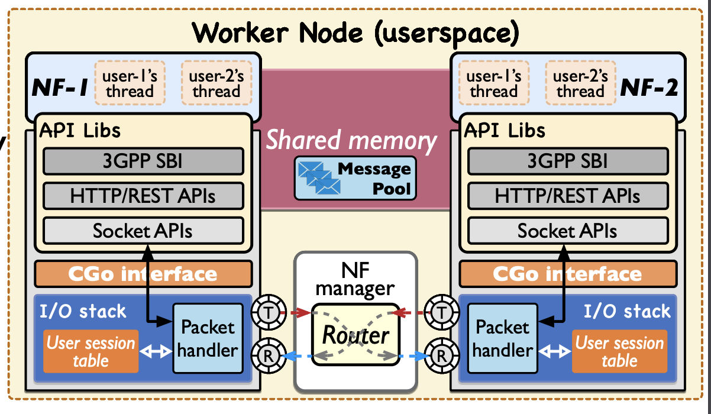

# L25GC+: Revolutionizing the Control Plane for 5G Core Networks
>[!NOTE]
> Author: Chun-Ting Lin
> Date: 2024/09/18
---

## Introduction
With the rapid development of 5G technology, the demand for network performance is also increasing. Conventional 5G core networks handle control plane operations with high latency due to the communication overhead of service-based interfaces (SBIs), which cannot meet the demands of low-latency applications such as the Internet of Things (IoT) and the automotive Internet of Things (IoT). To this end, the researchers propose L25GC+, a shared memory-based control plane design for 5G core networks, which aims to significantly reduce latency and improve system performance.

## Background of L25GC+
L25GC+ is a 5G control plane design that utilizes shared memory processing to reduce control plane delay.

## Technical Principle of L25GC+
- **Shared memory I/O stack** 
    - Shared memory processing with lock-free rings
    - Like L25GC, built with OpenNetVM
    - Asynchronous I/O only
    - Retaining a high-performance data plane
- **API Libs** 
    - Synchronous I/O support w/ shared memory
    - Combining our efforts on X-IO
    - Being 3GPP-compliant
- **Concurrent connection management** 
    - Using “User session table”
    - Scale up to a number of concurrent user sessions

This figure depicts the worker node architecture of a high-performance Network Functions Virtualization (NFV) platform.

## Benefits of L25GC+
- **Low Latency** -
With shared memory I/O and an optimized control plane design, the L25GC+ achieves extremely low control plane latency, which is critical for applications requiring low latency.
Highly Scalable: The L25GC+ is designed to be highly scalable to support a large number of users and services.
- **High Reliability** -
The L25GC+ utilizes a redundant design and fault-tolerant mechanisms to ensure high reliability.
- **Flexibility** -
The L25GC+ supports a wide range of Network Functional Virtualization (NFV) platforms, providing excellent flexibility.

## Evaluation
Verify the improvement of L25GC+ with commercial
testbed
- CN :The contributed latency by the 5GC
- UE registration : L25GC+ has 1.5× lower “CN” latency (Single UE) and 1.3× lower “CN” latency (5 UEs)
- PDU session establishment : L25GC+ has 2× lower “CN” latency (Single UE) and 1.6× lower “CN” latency (5 UEs)

## Reference
- *Yu-Sheng Liu, Shixiong Qi, Po-Yi Lin, Han-Sing Tsai, K. K. Ramakrishnan, Jyh-Cheng Chen, “L25GC+ is an improved, 3GPP-compliant 5GC designed for low-latency control plane operations” in 2023 IEEE 12th International Conference on Cloud Networking
- *Shixiong Qi, Han-Sing Tsai, Yu-Sheng Liu, K. K. Ramakrishnan, Jyh-Cheng Chen, “X-IO: A High-performance Unified I/O Interface using Lock-free Shared Memory Processing” in 2023 IEEE 9th International Conference on Network Softwarization
- *Vivek Jain, Hao-Tse Chu, Shixiong Qi, et al., “L25GC: a low latency 5G core network based on high-performance NFV platforms” in Proceedings of the ACM SIGCOMM 2023 Conference

## About
Hi, I am Chun-Ting Lin, a beginner to 5G and free5gc. Let me know without hesitation if there is any mistake in the article.

### Connect with Me

- Linkedin: [www.linkedin.com/in/tim-lin-a285bb282/](https://www.linkedin.com/in/tim-lin-a285bb282/)
- Github: [https://github.com/tim1207](https://github.com/tim1207)
