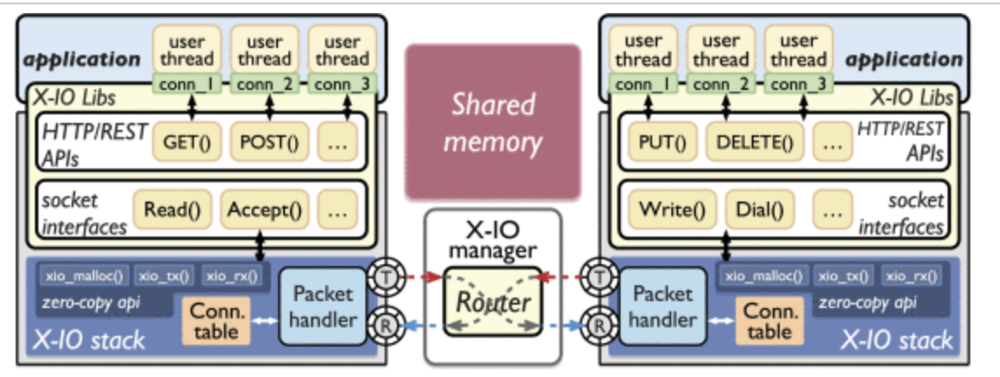
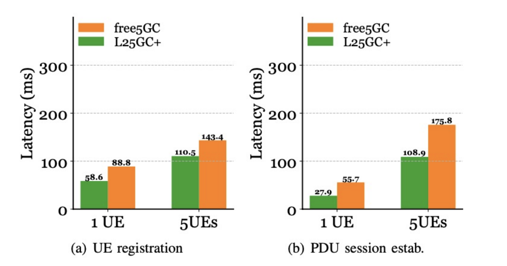

# How L25GC+ achieved the low-latency communication
>[!NOTE]
> Author: Chun-Ting Lin
> Date: 2024/09/18
---

## Introduction
Cloud-native applications are undergoing a rapid transformation from monolithic architectures to modular architectures, offering enhanced flexibility, modularity, and scalability.
However, the decoupling of modules introduces communication overhead, particularly when multiple modules need to collaborate to accomplish a task.
A prime example of this is the 5G core network, where multiple modules work together to complete the registration process of a user device. Within this collaboration, two main modes of communication exist: synchronous and asynchronous.
Traditional network communication methods can lead to significant overhead between modules, including data replication and protocol processing.

## X-IO 
X-IO is implemented using shared memory processing and unlocked producer/consumer rings between callers on the same nodes as the "X-IO stack". This approach is a much simpler alternative to kernel network stacking, enabling zero-copy packet transfers and providing a substantial improvement in data plane performance.
### Unlocked Shared Memory Communication
Two key elements are required to support shared memory communication:
- Shared memory buffer pool
- Packet descriptor delivery mechanism
The shared memory pool provides a shareable backend to store the payload for module access. Packet descriptor delivery delivers pointers to payloads in shared memory between different modules, rather than moving payloads.

### Shared Memory Pools
X-IO utilizes the X-IO Manager to manage the initialization of shared memory pools. These pools contain a specific number of shared memory buffers. The X-IO Manager runs as the DPDK master process, which grants it the privilege to create memory pools in the Linux file system.

### Unlocked Packet Descriptor Transfer
To efficiently transfer packet descriptors between caller' X-IO stacks, X-IO utilizes DPDK's RTE RING as a high-speed IPC channel. To minimize latency and overhead, X-IO implements a non-locked producer/consumer ring design. Each X-IO stack has a pair of RTE RINGs for receiving and transmitting, which are shared with the XIO manager. This eliminates the need for locks and allows the X-IO Manager to facilitate descriptor transfer between different X-IO stacks.

### Raw I/O primitives in X-IO: zero-copy interfaces
X-IO offers raw I/O primitives that enable zero-copy communication between caller. These primitives are implemented using DPDK's RTE RING and Mempool APIs.

The image demonstrates zero-copy and shared memory communication in X-IO using the original I/O primitive. It involves the source module writing the payload to a memory buffer and adding the descriptor to the caller's TX ring. The X-IO manager retrieves these descriptors from the caller's TX ring, parses the routing information, and places the descriptors into the target module's RX ring. This design eliminates message duplication, reduces overhead, and improves efficiency compared to core-based networks.

X-IO provides a high-performance interface for 5GC functions, utilizing lock-free shared memory processing. This improves the performance of the control plane, especially in achieving low latency.

L25GC+ is a 3GPP-compliant, modified 5GC designed for low-latency control plane operations, utilizing X-IO technology. Compared to the existing core-based SBI in free5GC, X-IO provides a superior, high-performance interface between 5GC functionalities and the underlying unlocked shared memory processing.

3GPP-compliant commercial testbed
- UEs: laptops with 5G dongles (from Apal)
- RU: from Alpha Networks Inc.
- CU/DU: from AEWIN Technologies
- UE Registration & PDU Session

Here are the improvements of L25GC+ with a commercial testbed:
- Contribution to latency by the 5GC: L25GC+ demonstrates 1.5× lower "CN" (Core Network) latency for a single UE and 1.3× lower "CN" latency for 5 UEs during UE registration.
- PDU session establishment: L25GC+ achieves 2× lower "CN" latency for a single UE and 1.6× lower "CN" latency for 5 UEs.

## Reference
- Yu-Sheng Liu, Shixiong Qi, Po-Yi Lin, Han-Sing Tsai, K. K. Ramakrishnan, Jyh-Cheng Chen, “L25GC+ is an improved, 3GPP-compliant 5GC designed for low-latency control plane operations” in 2023 IEEE 12th International Conference on Cloud Networking
- Shixiong Qi, Han-Sing Tsai, Yu-Sheng Liu, K. K. Ramakrishnan, Jyh-Cheng Chen, “X-IO: A High-performance Unified I/O Interface using Lock-free Shared Memory Processing” in 2023 IEEE 9th International Conference on Network Softwarization
- Vivek Jain, Hao-Tse Chu, Shixiong Qi, et al., “L25GC: a low latency 5G core network based on high-performance NFV platforms” in Proceedings of the ACM SIGCOMM 2023 Conference

## About
Hi, I am Chun-Ting Lin, a beginner to 5G and free5gc. Let me know without hesitation if there is any mistake in the article.

### Connect with Me

- Linkedin: [www.linkedin.com/in/tim-lin-a285bb282/](https://www.linkedin.com/in/tim-lin-a285bb282/)
- GitHub: [https://github.com/tim1207](https://github.com/tim1207)
