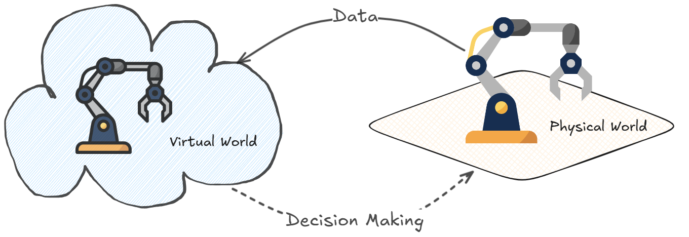

# Modeling Digital Twins in 5G Networks: A Glimpse into the Future of Intelligent Network Management
>[!NOTE]
> Author: Yu-Chun Wang
> Date: 2024/11/08
---

In the ever-evolving landscape of 5G, digital twins are emerging as one of the most promising innovations. By creating a virtual model of physical network components, digital twins in 5G enable real-time monitoring, predictive maintenance, and proactive management. For network providers, this shift promises a powerful way to optimize resource allocation and performance, handle dynamic data traffic demands, and unlock a new level of efficiency. Here’s a look at how digital twin modeling works, its applications in 5G network, and how it’s transforming network management.

## What is a Digital Twin?
A digital twin is a virtual model of a physical object, process, or system that uses real-time data to mirror its real-world counterpart. Originally developed in the manufacturing and industrial sectors, digital twins have since expanded into a wide range of fields, including healthcare, urban planning, and telecommunications. By continuously updating with data from sensors, devices, and network infrastructure, digital twins offer a detailed, dynamic representation of physical assets and systems. This environment allows for rapid analysis and supports real-time decision-making with precise, data-driven insights.

## An overview for Network Digital Twin Modeling
As 5G technology continues to transform network capabilities, digital twin technology has emerged as a cornerstone for managing these complex, high-performance networks. The research paper "_Digital Twins for 5G Networks: A Modeling and Deployment Methodology_" by Rodrigo et al. [1] offers a detailed framework that guides the development of digital twins in 5G environments, enabling real-time monitoring, predictive analytics, and adaptive management across network elements.

### The Building Blocks of a Network Digital Twin Model
Creating an effective digital twin for 5G involves integrating real-time data, predictive AI models, and secure communications to form a comprehensive, continuously updating network representation. Rodrigo et al. [1] outline a seven-phase methodology to establish a digital twin model that aligns with NFV (Network Function Virtualization) standards, ensuring interoperability and efficient performance in complex 5G ecosystems. Here is a breakdown of these phases:

1. **Data Acquisition:** This phase begins with collecting data from physical network components, including topologies, hardware configurations, and performance metrics. Automated agents gather this information to form the foundation of the digital twin.

2. **Modeling:** Using the acquired data, the network’s structure and behavior are modeled. This phase simplifies the network’s complexity to enable efficient and realistic simulations.

3. **Adaptation:** The digital model is then adapted to fit virtualization standards, transforming data to compatible templates. This ensures it can be integrated seamlessly with Network Function Virtualization (NFV) systems.

4. **NFV Deployment:** In this phase, the adapted digital model is deployed on an NFV platform, utilizing software such as OpenStack or Kubernetes to host and manage the virtual elements of the network.

5. **Provisioning:** This step customizes the virtual network by aligning it with specific operational characteristics of the physical network. Tools like Ansible automate deployment, ensuring the digital twin operates similarly to its physical counterpart.

6. **Interconnection:** Secure, real-time communication between the digital twin and its physical network is established, enabling the two to synchronize and share data. Messaging protocols like MQTT and Kafka are used to support continuous information flow.

7. **Feedback Loop:** In the final phase, a feedback loop is created, allowing the digital and physical networks to communicate constantly. This supports real-time monitoring, predictive maintenance, and dynamic adjustments for optimal performance​.

## Challenges of Digital Twin Modeling in 5G Network
Creating and deploying digital twins in 5G networks is no small feat. Some of the challenges include:

* **High Data Processing Requirements:** Digital twins require massive data streams to accurately reflect the state of network functions. This means that 5G networks need powerful processing capabilities and efficient data management strategies to support the continuous operation of digital twins.

* **Data Privacy and Security:** With vast amounts of data flowing between physical network functions and their digital counterparts, maintaining robust security protocols is crucial to prevent data breaches and unauthorized access.

* **Computational Load:** Running real-time digital twin models can require significant computational resources.

## The Future of Digital Twins in 5G and Beyond
As 5G advances and the next generation of networks—6G—emerges, digital twin technology will likely expand to support applications such as autonomous vehicles, augmented reality, and the industrial Internet of Things (IoT). With advances in AI and machine learning, digital twins will become more predictive and adaptive, enabling smarter decision-making in network management. Additionally, with the anticipated rollout of 6G, digital twins will play a pivotal role in managing an even more complex network ecosystem.

## Conclusion
Modeling digital twins in 5G represents a critical leap towards intelligent, proactive network management. As Rodrigo et al. [1] illustrate, these virtual models allow for unprecedented levels of control, visibility, and agility, transforming network operations. As 5G networks evolve and demand for efficient management grows, digital twin technology will be essential for network operators, ensuring they remain at the forefront of telecommunications innovation.

## Reference
[1] M. Sanz Rodrigo, D. Rivera, J. I. Moreno, M. Àlvarez-Campana and D. R. López, "Digital Twins for 5G Networks: A Modeling and Deployment Methodology," in _IEEE Access_, vol. 11, pp. 38112-38126, 2023, doi: 10.1109/ACCESS.2023.3267548.
[2] A. Fuller, Z. Fan, C. Day and C. Barlow, "Digital Twin: Enabling Technologies, Challenges and Open Research," in _IEEE Access_, vol. 8, pp. 108952-108971, 2020, doi: 10.1109/ACCESS.2020.2998358.

## About
Hi, I'm Yu-Chun! As a newcomer to 5G and the free5GC community, I'm diving into innovative 5G applications and tackling TNGF-related issues. My focus is on digital twin applications within the 5G space, where I’m passionate about pushing network capabilities to new levels.

### Connect with Me

- GitHub: [https://github.com/blackcat-118](https://github.com/blackcat-118)
