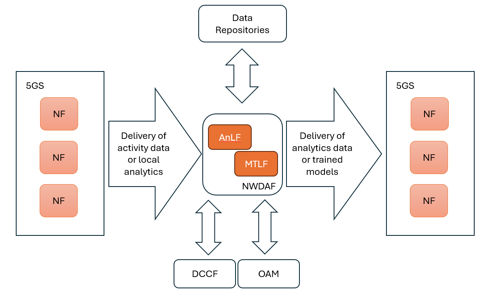
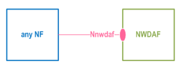
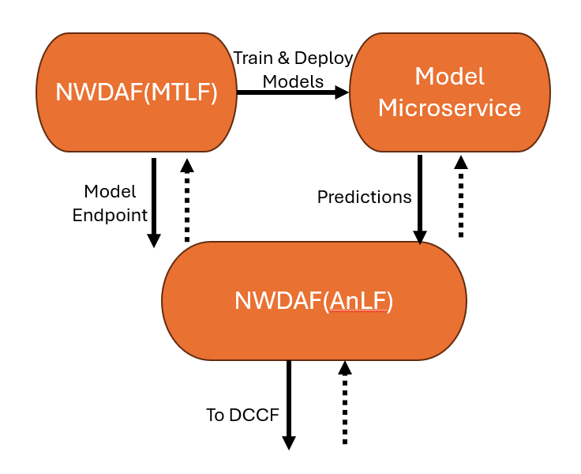

# NWDAF introduction
>[!NOTE]
> Author: Liu Hsiang Kuan
> Date: 2024/11/27
---
## Roles of NWDAF
- The Network Data Analytics Function (NWDAF) is a key component of the 5G core network responsible for collecting and analyzing network data to provide insights and predictions for network optimization and management. Think of it as the "brain" of the 5G network that helps make intelligent decisions based on data analysis. 

## Analytics Mechanisms
- NWDAF operates through three main functional aspects that work together to deliver network analytics:
- ### 1. Data Collection
    - #### Mechanisms
        The NWDAF begins its operation by gathering data from various sources within the 5G network. Imagine this as a network monitoring system that:
        - Collects real-time performance data from network functions
        - Gathers historical data for trend analysis
        - Coordinates data collection to avoid redundancy
    - #### Execute architecture
        - **Basic Collection Through Nnf Interface**
            The NWDAF's data collection process starts with its basic interface - Nnf, which allows NWDAF to collect data from various Network Functions (NFs) in the 5G core network. Through this interface, NWDAF can subscribe to the data it needs, such as network performance metrics, user behavior data, or service quality indicators.

            

        - **Enhanced Collection with DCCF**
            To improve the efficiency of data collection, DCCF acts as a central coordinator between data sources and NWDAF. Think of DCCF as a smart traffic controller - when multiple NWDAFs need the same data from an NF, instead of each NWDAF making separate requests, DCCF manages these requests centrally. It collects the data once and distributes it to all interested NWDAFs, significantly reducing the network's signaling load.
            

        - **Management Data Through OAM**
            For network management information, NWDAF also connects to the Operation, Administration and Maintenance (OAM) system. This connection provides NWDAF with essential network configuration and management data, helping it understand the broader context of network operations.

- ### 2. Analytics Processing
    - #### Mechanisms
        - At the heart of NWDAF lies its analytics capabilities:
        - Uses advanced algorithms to process network data
        - Employs AI/ML models for predictive analytics
        - Supports distributed learning across multiple NWDAF instances
        - Manages and updates analytics models

    - #### Execute Architecture
        - Analytics Processing with AnLF & MTLF
            - **AnLF**: processes the incoming data streams and generates real-time insights about network conditions in NWDAF
            - **MTLF**: providing trained machine learning models and help predict network behavior
            - **Analytics Model**
                The interaction between AnLF and MTLF creates a dynamic analytics environment. AnLF uses the models provided by MTLF to process current data, while MTLF uses the results to refine its models.
                

                - These two core components will discuss in next section

- ### 3. Analytics Exposure
    - #### Mechanisms
        NWDAF shares its insights through:
        - Subscription-based analytics services
        - Real-time analytics delivery
        - Historical data analysis
        - ML model provisioning

    - #### Architecture
        - **Analytics Distribution through Nnwdaf**
            The Nnwdaf interface serves as the primary channel for sharing analytics results. Network functions can subscribe to specific types of analytics and receive regular updates or request specific information when needed.
           

        - **Coordinated Analytics Delivery**
            Similar to data collection, DCCF can help optimize analytics distribution by managing multiple subscriptions and ensuring efficient delivery of analytics results to various consumers.
            

## Details for Analytics Processing
- ### Core Components
    - **Analytics Logical Function (AnLF)**
        AnLF is the primary analytics engine in NWDAF that processes data             and generates insights. 
        Its responsibilities include:

        - Performing inference on collected network data
        - Generating statistical information about past events
        - Providing predictive analytics for future network behavior
        - Exposing analytics through Nnwdaf_AnalyticsSubscription/Info services

        AnLF can work with both statistical models and ML models provided by MTLF, allowing it to handle different types of analytics requirements. While AnLF processes the analytics requests, it remains unaware of whether the ML models it uses were trained through federated learning or traditional methods.

    - **Model Training Logical Function (MTLF)**
        MTLF specializes in training and managing ML models. In Release 18, MTLF introduced significant enhancements, particularly in federated learning capabilities. Its main functions include:

        - Training ML models using collected network data
        - Supporting federated learning among multiple NWDAFs
        - Managing ML model updates and provisioning
        - Providing trained models to AnLF and other network functions

        MTLF can operate in two modes within federated learning:

            1. As an FL Server: Coordinating model training across multiple NWDAFs
            2. As an FL Client: Training models locally using its own data

    - The interaction between AnLF and MTLF creates a complete analytics pipeline where:

        - AnLF handles the analytics processing and service exposure
        - MTLF manages the underlying ML models and training

    - This separation of concerns allows for specialized optimization of both analytics processing and model training while maintaining flexibility in deployment options.This continuous feedback loop ensures that NWDAF's analytics capabilities keep improving over time.
        

# NWDAF Important Analytics Services
- Here are some key situations that need the assistance of NWDAF 
- ## 1. Network Performance Analytics
    - ### Slice Load Level Analytics (Section 6.3)
        - In modern 5G networks, different services run on separate network slices. NWDAF continuously monitors each slice's resource usage and provides essential information for slice selection. 
        - For example, when a gaming service slice approaches high load, NWDAF can trigger resource reallocation or guide new users to less congested slices, ensuring consistent service quality.
    - ### NF Load Analytics (Section 6.5)
        - Network Functions like AMF and SMF are critical components in 5G. NWDAF analyzes their load status to enable intelligent load balancing. 
        - When NWDAF detects an overloaded AMF, it can inform the system to redirect new connections to other AMFs, maintaining optimal network operation.
- ## 2. User Experience Analytics
    - ### Service Experience Analytics (Section 6.4)
        - NWDAF monitors real-time service quality by analyzing metrics like latency and throughput. 
        - For instance, if video streaming users in a specific area experience degraded quality, NWDAF can identify the issue and trigger necessary adjustments to maintain service standards.
    - ### UE Behavior Analytics (Section 6.7)
        - By analyzing user movement patterns, NWDAF can predict future locations and behaviors. This enables proactive resource allocation 
        - If NWDAF predicts a large crowd gathering for an event, the network can prepare additional resources in that area beforehand.
- ## 3. Resource Optimization
    - ### QoS Sustainability Analytics (Section 6.9)
        - NWDAF helps maintain consistent service quality by predicting potential QoS changes. If it detects that video call quality might degrade in a busy area, it can initiate preemptive measures to maintain service levels.
    - ### User Data Congestion Analytics (Section 6.8)
        - Through traffic pattern analysis, NWDAF can identify potential congestion before it impacts users. 
        - For example, it can detect emerging congestion patterns during peak hours and recommend traffic redistribution to prevent service degradation.
# A Complete Example of NWDAF Analytics
- Let's review the NWDAF by real-world scenario, imagine a high-priority gaming service slice experiencing increasing load during peak gaming hours:
- ### 1. Data Collection Process
    First, NWDAF collects data from various network functions:

    - Gets real-time resource utilization data from network slices
    - Receives user connection information from AMF
    - Obtains QoS flow statistics from SMF
    - Gathers historical load patterns from OAM

- ### 2. Analytics Processing
    NWDAF then processes this data using its two core components:

    - AnLF (Analytics Logical Function):
        - Analyses current slice load trends
        - Compares with historical patterns
        - Identifies potential overload risks

    - MTLF (Model Training Logical Function):
        - Uses collected data to train prediction models
        - Updates models based on new patterns
        - Provides refined models to AnLF for better predictions

- ### 3. Analytics Results and Actions
    NWDAF generates actionable insights:

    - Predicts slice load for the next few hours
    - Identifies potential capacity issues
    - Recommends preventive measures

- ### 4. Network Optimization
    The system responds to NWDAF's analytics:

    - NSSF adjusts slice selection strategy
    - AMF redirects new gaming users to less loaded slices
    - OAM allocates additional resources if available

## References
- 3GPP [TS 23.288](https://www.tech-invite.com/3m23/tinv-3gpp-23-288.html)
- https://blog.csdn.net/qq_31985307/article/details/139897023
- https://www.5gamericas.org/wp-content/uploads/2021/10/5G-Edge-and-Automation-PPT.pdf
- https://www.aarna.ml/post/nwdaf-rel-17-explained-architecture-features-and-use-cases
