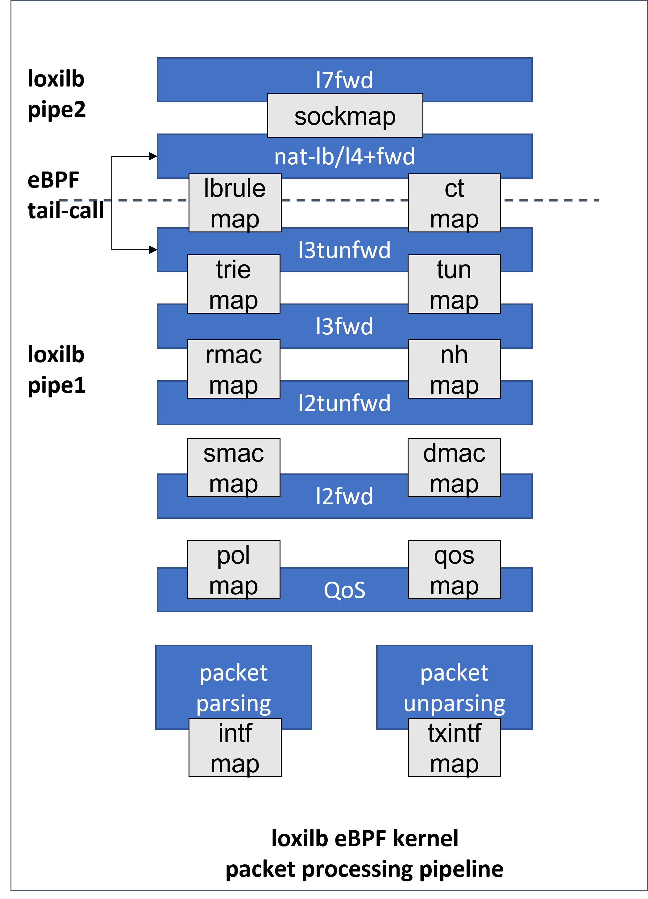

# Loxilb eBPF
In the evolving landscape of networking, the demand for high-performance, flexible, and efficient solutions has never been greater. Traditional approaches to packet processing often struggle to keep up with the scale and complexity of modern cloud-native environments and 5G networks. Enter Loxilb, an innovative networking solution leveraging the power of eBPF (Extended Berkeley Packet Filter). eBPF, a game-changing technology in the Linux kernel, allows developers to customize packet processing directly in the kernel with unparalleled speed and flexibility, all while maintaining safety and stability.

In this document, I will provide a comprehensive exploration of Loxilb's architecture, its efficient use of eBPF, and the dual-pipeline design that makes it a robust choice for scenarios requiring high-performance networking and advanced load balancing. Whether you're an enthusiast, developer, or systems architect, this guide will equip you with a deep understanding of how Loxilb utilizes eBPF to revolutionize packet processing and load balancing in modern networks.

## Introduction
Loxilb is a networking solution that utilizes eBPF, leverage eBPF to modify the packet processing rules as they traverse the network stack in the Linux kernel. This can be particularly useful for network behavior without altering existing applications or the operating system itself.
## Core Components
### Object Files
loxilb generates two primary object files during build:
```
/opt/loxilb/llb_ebpf_main.o  # TC layer processing (305KB)
/opt/loxilb/llb_xdp_main.o   # XDP layer processing (95KB)
```
### Hook Points
| Feature  | TC eBPF  | XDP      |
| -------- | -------- | -------- |
| Packet Format| Socket Buffer (skb) | XDP Frame Format |
|Processing Level| L2-L7 | Primarily L2

1. TC eBPF Layer
* Handles majority of L4+ processing
* Optimized for complex operations
* Supports TCP checksum offload
* Handles connection tracking
2. XDP Layer
* Performs quick L2 operations
* Handles packet mirroring
* Used for operations requiring multiple packet copies

### loxilb eBPF Maps

eBPF (extended Berkeley Packet Filter) maps are essential data structures within the Linux kernel that facilitate efficient storage and sharing of data between eBPF programs and user-space applications.

They function as key-value stores, enabling eBPF programs to maintain state across multiple invocations and allowing communication between the kernel and user space.
* State Preservation
* Kernel-User Space Communication
* Data Sharing Among eBPF Programs

LoxiLB utilizes eBPF maps to store and manage various data structures essential for packet processing. These maps are pinned to the filesystem, allowing for persistent storage and easy access. Commonly used maps include:
* Interface Maps: Store information about network interfaces.

* Connection Tracking Maps: Maintain state information for active connections.

* NAT Maps: Handle Network Address Translation entries.

* Policy Maps: Store security and routing policies.

## loxilb eBPF pipeline



Then I will detail analysis of loxilb's end-to-end packet processing pipeline and Load Balancer based on this architecture diagram.

### What is eBPF Tail Call?
An eBPF tail call is a mechanism that allows one eBPF program to call another eBPF program without returning to the original program. It's like a "jump" instruction that transfers control completely to another program and have benefit in:
* Modular code structure
* Efficient processing pipeline
* Compliance with eBPF verifier limits
* The Linux kernel limits the number of consecutive tail calls allowed to 32

### Pipeline Selection
Fast Path (pipe1)and Slow Path (pipe2), these two pipelines address the need for optimizing different types of packet processing tasks based on their complexity and requirements.
```
[Incoming Packet]
      ↓
[Parse Packet Headers]
      ↓
[Connection Lookup]─────Yes──┐
      ↓                      ↓
[Is Established?]     [Process & Forward (Fast Path)]
      ↓                      │
      No                     │
      ↓                      │
[Tail Call to Slow Path]     │
      │                      │
      └──────────────────────┘
```
#### TCP and UDP example
```
### TCP Example:
CLOSED → SYN_SENT → SYN_RECEIVED → ESTABLISHED
   │                                    │
   │                                    ▼
[Slow Path Processing]            [Move to Fast Path]


### UDP Example:
NEW → SEEN → ESTABLISHED
 │              │
 │              ▼
[Slow Path] [Move to Fast Path]
```
### 1. Initial Packet Reception and Parsing
`kernel/llb_kern_entry.c`
```
[Incoming Packet] → [packet parsing]
  ↓
[intf map] - Interface configuration lookup
  - Interface index
  - VLAN information
  - Zone information
  - Policy parameters
```
* When a packet arrives(parsing happens in `dp_parse_d0`), the packet parsing module extracts key metadata such as:
    * Source/destination MAC addresses
    * IP addresses
    * Layer 4 ports (if applicable)
* Metadata is stored in the `xfi` structure, which guides further processing.
* Interface-specific rules and properties are checked using `intf_map`.
### 2. QoS Processing
`kernel/llb_kern_policer.c`
```
[QoS Stage]
  ↓
[pol map] - Policy lookup
  - Traffic policing rules
  - Rate limiting
  - Traffic shaping
  ↓
[qos map] - QoS parameters
  - Priority queues
  - Bandwidth allocation
```
* Traffic policies (e.g., rate-limiting, prioritization) are applied based on:
    * Policy map `pol_map`: Defines access control and prioritization policies.
    * QoS map `qos_map`: Ensures compliance with Quality of Service requirements (e.g., rate shaping).
* Packets violating policies may be dropped or delayed.

### 3. Layer 2 Forwarding
`kernel/llb_kern_l2fwd.c`

#### Key Components
* `l2fwd` (Layer 2 forwarding)
* `l2tunfwd` (Layer 2 tunneling forwarding)
#### Maps Used:
* `smac_map`: Source MAC address
* `dmac_map`: Destination MAC address
* `rmac_map`: Router MAC address
#### `l2fwd` (MAC-based forwarding)
```
[l2fwd Stage]
  ↓
[smac map] - Source MAC processing
  - MAC learning
  - Source validation
  ↓
[dmac map] - Destination MAC processing
  - MAC lookup
  - L2 forwarding decision
```
#### `l2tunfwd` (tunneling at Layer 2)

```
[l2tunfwd Stage]
  - VXLAN processing
  - NVGRE processing
  - Other L2 tunnel protocols
```
### 4. Layer 3 Forwarding
`kernel/llb_kern_l3fwd.c`
#### Key Functions
* `dp_ing_l3()`: Entry point for L3 ingress processing.
* `dp_l3_fwd()`: Main function for Layer 3 forwarding.
* `dp_do_rtv4()` and `dp_do_rtv6()`: Handle IPv4 and IPv6 route lookups and apply forwarding actions.
* `dp_do_ctops()`: Handles connection tracking and NAT for packets.
#### Maps Used:
* `ct_map`: Connection tracking table for stateful flow handling.
* `rt_v4_map`: IPv4 routing table.
* `rt_v6_map`: IPv6 routing table.
* `LL_DP_RTV4_STATS_MAP` and `LL_DP_RTV6_STATS_MAP`: Statistics for routes.

### 5. Load Balancer / Layer 4 Forwarding

#### `kernel/llb_kern_ct.c` 
Provides connection tracking infrastructure

##### Key Components
* Connection State Tracking:
   - Maintains connection states for all protocols (TCP/UDP/SCTP/ICMP)
   - Required for stateful operation in both load balancing and L4 forwarding

* NAT Support Infrastructure:
   - Tracks NAT translations
   - Maintains original and translated addresses/ports
   - Essential for load balancer backend selection

#### `kernel/llb_kern_natlbfwd.c`: 
Network Address Translation (NAT) and Load Balancer forwarding implementation

#### Multiple load balancing algorithms:
* Round Robin
    ```c
    if (act->sel_type == NAT_LB_SEL_RR) {
        bpf_spin_lock(&act->lock);
        i = act->sel_hint; 

        // Iterate through endpoints
        while (n < LLB_MAX_NXFRMS) {
            if (nxfrm_act->inactive == 0) {
                // Select next backend in rotation
                act->sel_hint = (i + 1) % LLB_MAX_NXFRMS;
                sel = i;
                break;
            }
        }
    }
    ```
* Hash-based
    ```c
    if (act->sel_type == NAT_LB_SEL_HASH) {
        // Hash packet for backend selection
        sel = dp_get_pkt_hash(ctx) % act->nxfrm;

        // Fallback if selected backend is inactive
        if (act->nxfrms[sel].inactive) {
            for (i = 0; i < LLB_MAX_NXFRMS; i++) {
                if (act->nxfrms[i].inactive == 0) {
                    sel = i;
                    break;
                }
            }
        }
    }
    ```
* Least Connections
    ```c
    if (act->sel_type == NAT_LB_SEL_LC) {
        struct dp_nat_epacts *epa;
        __u32 lc = 0;

        // Find backend with least active connections
        for (i = 0; i < LLB_MAX_NXFRMS; i++) {
            if (nxfrm_act->inactive == 0) {
                __u32 as = epa->active_sess[i];
                if (lc > as || sel < 0) {
                    sel = i;
                    lc = as;
                }
            }
        }
    }
    ```
* Persistent RR
* N3 (GTP tunnel) based


## Conclusion about loxilb's effective use of eBPF
### Smart Pipeline Design
* Dual pipeline architecture (Fast/Slow) optimizes performance
* Fast path for established connections
* Slow path for new connections and complex processing
### Effective Use of eBPF Features
* Tail calls to overcome program size limits
* Maps for state management
* TC and XDP hooks for different processing needs
### loxilb particularly suitable for
* Modern cloud-native environments
* High-performance networking
* Complex load balancing scenarios
* Situations requiring efficient packet processing
## references

* [What is eBPF ??](https://docs.loxilb.io/main/ebpf/)
* [loxilb eBPF implementation details](https://docs.loxilb.io/latest/loxilbebpf/#loading-of-loxilb-ebpf-program)
* [State synchronization of eBPF Maps using Go - A tale of two frameworks !](https://www.loxilb.io/post/state-synchronization-of-ebpf-maps-using-go-a-tale-of-two-frameworks)
* [学习 loxilb（1）：本地构建与测试](https://fuchencong.com/2024/06/27/loxilb-01/)
* [5G SCTP LoadBalancer Using LoxiLB Applying on free5GC](https://medium.com/@ben0978327139/5g-sctp-loadbalancer-using-loxilb-applying-on-free5gc-b5c05bb723f0)
  
## About
Hello, I'm William Lin. I'd like to share my excitement about being a member of the free5gc project, which is a part of the Linux Foundation. I'm always eager to discuss any aspects of core network development or related technologies.

### Connect with Me
- GitHub: [williamlin0518](https://github.com/williamlin0518)
- Linkedin: [Cheng Wei Lin](https://www.linkedin.com/in/cheng-wei-lin-b36b7b235/)