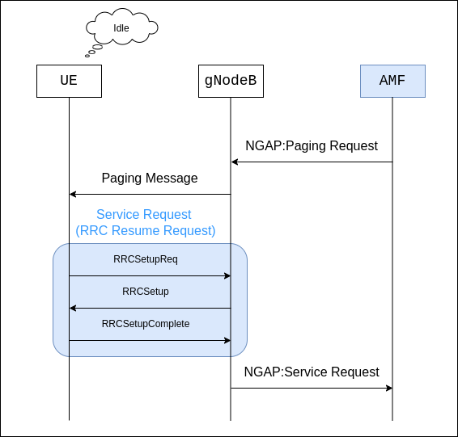

# Paging in 5G Network
>[!NOTE]
> Author: Yung-Hsuan, Tsao
> Date: 2024/12/04
---

In the 5G network, when a UE(User Equipment) is not actively involved in data transfer, it will turn into idle mode to conserve the battery. In this state, the network requires a mechanism to alert the UE when receiving an incoming call, a data packet waiting to be delivered, or a network request to re-establish connectivity with a UE. **Paging** is the procedure used to notify a UE in an idle or low-power state about such events.

## Overview of Paging in 5G

The paging process involves several key steps to ensure efficient and reliable communication between the network and the UE:

### 1. Triggering the Paging Request 
When there is incoming data or a call request for the idle UE, the network needs to notify the UE. The trigger typically comes from the AMF(Access and Mobility Management Function), which manages mobility and session information for devices in the 5G Core Network.
The AMF typically triggers paging for reasons such as:

- **Downlink Data Notification:** SMF(Session Management Function), primarily responsible for interacting with the decoupled data plane, informs the AMF of incoming data for the UE. 
- **Mobile-Terminated Call:** The network receives a signaling request to connect a voice or video call to UE.
- **Network Events:** For example, updates or emergency notifications.

### 2. Generating the Paging Message 
After receiving a paging trigger, AMF needs to determine the UE's location and reachability. It uses the UE's Registration Area(RA) or Tracking Area(TA) information stored in the AMF context to narrow down the list of gNBs or cells where the UE is likely present. The AMF uses the NG Application Protocol(NGAP) to send the paging request to these gNBs, which broadcast it over their radio interfaces.

### 3. UE Response
The UE in idle mode periodically wakes up to monitor for paging messages and goes back to sleep mode if it is not intended for it, this is also known as the Discontinuous Reception(DRX) cycle. Upon recognizing its identifier in the paging message, the UE responds by initiating a Service Request procedure. This allows the UE to transition from idle mode to connected mode.

### 4. Re-establishing Connectivity
After receiving the Service Request, the AMF:
1. **Validates the Paging Context:** Confirms that the UE responded to the Service Request matches the UE that the paging is triggered.
2. **Retrieves UE Context:** Loads the UE's mobility context and session information and also validates the request against the subscription and policy rules.
3. **Manages Session Continuity:** If the Service Request is for data, AMF needs to ensure the relevant PDU session is active.

The gNB establishes a Radio Resource Control (RRC) connection with the UE, enabling the necessary radio bearers for data transfer or signaling. If the request involves downlink data, packets buffered in the User Plane Function (UPF) are delivered to the UE.

## Paging Message

The following is a further introduction to the paging message transmitted by the AMF via the **NG-RAN**(gNB) to the UE, which contains essential information to identify the UE and specify the paging cause.

Here are some critical fields in the paging message:

- **UE Paging Identity:** A temporary identifier uniquely identifying the UE.
- **TAI List for Paging:** Specifies the areas where the paging should be broadcast.
- **Paging Priority:** Specifies the priority of the paging request, ensuring time-critical services(e.g. emergency calls) are handled promptly.
- **Paging Origin:** The source or entity in the network that initiates the paging procedure.

## Error Handling and Paging Retries

Error handling and retries are also critical in the paging process to ensure reliable communication with the UE(s), especially in scenarios like network congestion, UE mobility, or poor radio conditions. Following is a simple introduction to the mechanisms and strategies for handling errors and performing retries during paging in 5G networks.

Errors in the paging process can occur under various conditions, for example:

- **UE Non-Response:** The UE does not respond to a paging message due to poor coverage, signal interference, or power-saving mode misalignment.
- **Incorrect Paging Area:** The UE is no longer present in the area where it was last registered.
- **Network Congestion:** The gNB experiences a high traffic load, leading to delayed or dropped paging messages.

To address these errors, AMF employs retry mechanisms to successfully reach the UE by applying further paging according to any applicable paging strategy. These strategies include, 

- a paging retransmission scheme (e.g., how frequently the paging is repeated or with what time interval)
- determining whether to send the paging message to the (R)AN nodes during certain AMF high load conditions
- apply sub-area based paging (e.g., the first page in the last known cell-id and retransmission in all registered TAs).

If retries fail after multiple attempts, AMF may initiate additional procedures to recover the UE's context, such as requesting its current location through network-level signaling.

Paging errors can also result from UE mobility across the registration area. In this case, the AMF coordinates with neighboring AMFs to forward the paging result if the UE is likely to have moved to a different registration area. The previous AMF forwards the paging message to the new AMF to retry paging in the updated area.

In cases where paging errors persist after retries, the network uses fallback mechanisms to ensure continuity.

## Conclusion
Paging is a fundamental procedure in the 5G network, enabling seamless communication with UEs in idle or low-power states. By combining efficient paging strategies with robust error handling, the AMF ensures reliable delivery of services while minimizing resource use. This process reflects the advanced capabilities of 5G in balancing network efficiency, battery conservation, and quality of service. Paging's intelligent design ensures that the 5G network remains responsive and adaptive to the dynamic needs of modern connectivity.

## Reference
- [TS 23.501](https://www.etsi.org/deliver/etsi_ts/123500_123599/123501/17.05.00_60/ts_123501v170500p.pdf)
- [TS 23.502](https://www.etsi.org/deliver/etsi_ts/123500_123599/123502/17.04.00_60/ts_123502v170400p.pdf): Describes the overall paging and service request procedures
- [TS 38.413](https://www.etsi.org/deliver/etsi_ts/138400_138499/138413/16.02.00_60/ts_138413v160200p.pdf): About NGAP messages used between AMF and gNB
- [Idle Mode DRX in 5G NR](https://wirelessbrew.com/5g-nr/5g-mac-layer/idle-mode-drx/)

## About
Hi, I'm Yung-Hsuan!  A newcomer to 5G and the free5GC community. Let me know without hesitation if there is any mistake in the article.

### Connect with Me

- GitHub: [https://github.com/reki9185](https://github.com/reki9185)