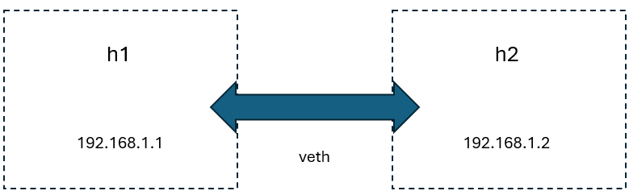

# Network Devices in Linux
>[!NOTE]
> Author: Fang-Kai Ting
> Date: 2025/01/23
---
Linux offers a diverse array of network devices, enabling the construction of intricate virtual and physical network topologies. Key examples include veth (virtual Ethernet), VLAN (Virtual LAN), VXLAN (Virtual eXtensible LAN), and IPVLAN. These devices are crucial for establishing scalable and adaptable network environments. In containerized environments such as Docker, network devices play a pivotal role in connecting containers, hosts, and routers, facilitating seamless communication across various network layers. Tools like `ip` and `bridge-utils` provide the necessary means for configuring these devices. This article will demonstrate the practical application of veth, VLAN, VXLAN, and IPVLAN by creating a sample network topology involving Docker containers and routers.

## 1. Veth

A `veth` (virtual Ethernet) pair is a Layer 2 (Data Link Layer) virtual network device that simulates a direct Ethernet cable connection between two interfaces. Creating a veth pair results in the creation of two virtual interfaces, where traffic transmitted through one interface is seamlessly transferred to the other.

For instance, consider two Docker containers, h1 and h2, connected by a veth pair. One end of the veth pair is placed within the h1 namespace, while the other end resides within the h2 namespace. As illustrated below, this configuration enables direct Layer 2 communication between the two hosts.



### Common Use Cases for veth

- **Container Networking (e.g., Docker or Kubernetes):**
    - **Scenario:** In Docker, each container operates within its own isolated network namespace. To enable communication between the container and the host or other containers, a veth pair is established.

In the following example, the host image is readily accessible from Docker Hub.

How to use docker-compose.yaml can refer to [docker compose | Docker Docs](https://docs.docker.com/reference/cli/docker/compose/)

```yaml
services:
  h1:
    image: ubuntu:22.04
    container_name: h1
    privileged: true
    build:
      context: ./config
      dockerfile: host.Dockerfile
    cap_add:
      - NET_ADMIN
      - NET_BROADCAST
    network_mode: "none"
    entrypoint: [ "/bin/sh", "-c" ]
    command:
      - |
        sleep 365d
```

### Namespace

In Docker, a **namespace** is a fundamental concept that provides isolation for containers, ensuring they operate independently from the host system and other containers. By moving the veth into the container’s namespace, the interface becomes **invisible** to the host and other containers. The container believes it has its own private network interface, adhering to the principle of namespace isolation.

```bash

# List of container names (replace with actual container names)
CONTAINERS=("h1" "h2")
# Create the /var/run/netns directory if it doesn't exist
sudo mkdir -p /var/run/netns
# Loop through each container and link its network namespace
for cname in "${CONTAINERS[@]}"; do
    # Get the PID of the container
    pid=$(docker inspect -f '{{.State.Pid}}' "$cname")
    # Link the container's network namespace to /var/run/netns
    sudo ln -sfT /proc/"$pid"/ns/net /var/run/netns/"$cname"
done
```

```bash
# create veth pair, veth always have two pair simulated physical cable
sudo ip link add h1h2 type veth peer name h2h1
# move veth end to docker namespace
sudo ip link set h1h2 netns h1
sudo ip link set h2h1 netns h2
# bring up device inside h1, h2
sudo ip netns exec h1 ip link set h1h2 up
sudo ip netns exec h2 ip link set h2h1 up
sudo ip netns exec h1 ip addr add 192.168.1.1/24 dev h1h2
sudo ip netns exec h2 ip addr add 192.168.1.2/24 dev h2h1
```

As shown below, h1 can ping h2 and arp have been resolved.


## 2. VLAN(Virtual Local Area Network)

### What is VLAN?

A **VLAN (Virtual Local Area Network)** is a technology used to create separate, isolated networks within the same physical network. It allows devices to be grouped logically, even if they are not physically connected to the same network switch. VLANs are implemented at Layer 2 (Data Link Layer) and use VLAN IDs to segregate network traffic.

In the following example, we create two virtual machines (VMs) using VirtualBox. These VMs utilize a host-only adapter as the **underlay network**. On top of this underlay network, we configure VLANs (Virtual LANs) to function as the **overlay network**.


### What is underlay network?

An underlay network is the physical or virtual infrastructure that forms the foundation for network communication. It consists of the actual hardware devices, such as routers, switches, and physical links, or virtual adapters in a virtualized environment. The underlay network is responsible for routing and delivering data packets across the network using traditional networking protocols.

### What is overlay network?

An overlay network is a virtualized network built on top of an underlay network. It creates a logical network that operates independently of the physical topology. Techniques like encapsulation, tunneling (e.g., VXLAN, GRE), or VLAN tagging enable the overlay network to logically segment traffic and isolate communication between devices, even if they share the same underlay.

### Step

1. install vlan
```bash
sudo apt-get install vlan
```
2. Load the 8021q kernel module using the “modprobe” command:
```bash
sudo modprobe 8021q
```
3. Verify that the module is loaded by running:
```bash
lsmod | grep 8021q
```
4. Create a VLAN subinterface for “enp0s8” with VLAN ID 10
```bash
sudo ip link add link enp0s8 name enp0s8.10 type vlan id 10
sudo ip addr add 192.168.10.1/24 dev enp0s8.10
sudo ip link set dev enp0s8.10 up
```
5. Repeat above in vm2

### Result

We create a subinterface as overlay network


vm1 routing info


vm1 can reach vm2


Moreover, by tcpdump, we can see the icmp packet flow


## 3. VXLan(Virtual Extensible LAN)

### What is VXLAN?

VXLAN (Virtual Extensible LAN) is a network virtualization technology designed to address the limitations of VLANs in large-scale cloud and data center networks. It encapsulates Layer 2 Ethernet frames in a Layer 3 UDP packet, enabling Layer 2 segments to extend across Layer 3 networks.

Key features of VXLAN:

- **Encapsulation**: Uses UDP for encapsulation, which allows Ethernet frames to traverse IP networks.
- **VXLAN Network Identifier (VNI)**: A 24-bit identifier used to distinguish virtual networks, supporting up to **16 million logical networks**, compared to the 12-bit VLAN ID that supports only 4096.
- **Distributed Gateway**: VXLAN works well with distributed routing architectures, enabling better scalability and performance in modern networks.

In following example, we create a Docker container named 'h1' within a VirtualBox virtual machine (VM) named 'vm1'. Similarly, another Docker container named 'h2' is created within a separate VirtualBox VM named 'vm2'. Both VMs utilize a host-only adapter as their underlying network. On top of this **underlay network**, we configure VXLAN (Virtual Extensible LAN) to establish an **overlay network** that enables communication between the two containers across the different VMs.


### Step

1. create h1 container with subnet 171.19.0.0/16, then assign h1 to 172.19.0.10
```yaml
services:
  h1:
    image: host
    container_name: h1
    privileged: true
    build:
      context: ./config
      dockerfile: host.Dockerfile
    cap_add:
      - NET_ADMIN
      - NET_BROADCAST
    networks:
      vxlan-net:
        ipv4_address: 172.19.0.10
    entrypoint: [ "/bin/sh", "-c" ]
    command:
      - |
        sleep 365d
networks:
  vxlan-net:
    driver: bridge
    driver_opts:
      com.docker.network.bridge.name: br19
    ipam:
      config:
        - subnet: 172.19.0.0/16
```
2. create vxlan device, 'vxlan-demo' is the name of the interface, type should be vxlan.
    1. VNI(Vxlan Network identifier) ID is 100 (It is only necessary to ensure that the VNI ID inside the tunnel is the same.)
    2. dstport should be 4789 which a udp standard port for vxlan communication
    3. vxlan have multicast and unicast usage, here demonstrate unicast
    4. `remote 192.168.56.108`  is the ip of another underlay interface.
```bash
sudo ip link add vxlan-demo type vxlan id 100 remote 192.168.56.108 dstport 4789 dev enp0s8
```
3. Set vxlan-demo device interface on br19
```bash
sudo ip link set vxlan-demo up
sudo ip link set vxlan-demo master br19
```
### Result

1. h1 can ping h2

2. Through tcpdump can see VXLAN encapsulates Layer 2 Ethernet frames in a Layer 3 UDP packet
```bash
tcpdump -i any udp port 4789
```

3. Routing info


## 4. IPVLAN

### What is IPvlan?

**IPvlan** is a Linux kernel networking feature that enables the creation of virtual network interfaces on top of a physical network interface. It allows for multiple virtual interfaces to share a single physical network interface (`eth0`, for example), with each virtual interface appearing as a separate device with its own IP address at the network layer.

IPvlan interfaces share the same MAC address as the parent interface. This makes IPvlan particularly useful in environments where network policies or switch configurations limit the number of MAC addresses that can be assigned to a single port (e.g., in certain cloud or data center environments).


In below example, we create h1 container in virtualbox vm1. h2 container in vm2. both with host-only adapter as **underlay network** and configure IPVLAN on top of the host-only adapter network, **IPVLAN** is **not an overlay network.**

### Step

1. Use docker supported ipvlan network driver.

```yaml
services:
  h1:
    image: host
    container_name: h1
    privileged: true
    build:
      context: ./config
      dockerfile: host.Dockerfile
    cap_add:
      - NET_ADMIN
      - NET_BROADCAST
    networks:
      ipvlan-net:
        ipv4_address: 172.19.0.10
    entrypoint: [ "/bin/sh", "-c" ]
    command:
      - |
        sleep 365d
networks:
  vxlan-net:
    driver: bridge
    driver_opts:
      com.docker.network.bridge.name: br19
    ipam:
      config:
        - subnet: 172.19.0.0/16
  ipvlan-net:
    driver: ipvlan
    driver_opts:
      parent: enp0s8
      vlan_tag: 10
    ipam:
      config:
        - subnet: 172.19.0.0/24

```

### Result

1. h1 can ping h2

2. Using `sudo ip netns exec h1 tcpdump -i any icmp` and `sudo tcpdump -i any icmp` can verify the following packet flow
    1. (h1)eth0 → enp0s8 → (h2)enp0s8 → eth0


3. h1 routing info

## Comparing VLAN, VXLAN, IPVLAN

Below show VLAN, VXLAN, IPVLAN compared table with overview, MAC address, Scalability, Network Isolation, Performance, and Use Cases.

### **1. Overview**

| Feature | **IPVLAN** | **VLAN** | **VXLAN** |
| --- | --- | --- | --- |
| **Purpose** | Lightweight network virtualization at Layer 2/3. | Segregates a physical network into logical networks. | Extends Layer 2 networks across Layer 3 boundaries. |
| **Focus** | Simplifying container or VM networking. | Network segmentation within a local Layer 2 domain. | Large-scale network virtualization for multi-tenant clouds. |

### **2. Addressing**

| Feature | **IPVLAN** | **VLAN** | **VXLAN** |
| --- | --- | --- | --- |
| **MAC Address** | Shares the same MAC address as the parent interface in L2 mode. | Unique MAC address per device per VLAN. | Unique MAC address per device, as in traditional L2. |
| **IP Address** | Each virtual interface has a unique IP address. | Devices can share the same IP scheme per VLAN. | Each network can share the same IP scheme (tenant isolation). |

### **3. Scalability**

| Feature | **IPVLAN** | **VLAN** | **VXLAN** |
| --- | --- | --- | --- |
| **Limitations** | Limited to one subnet per IPVLAN interface. | VLAN IDs limited to 4096 (12-bit tag). | Scales up to 16 million segments (24-bit tag). |
| **Use Case Scale** | Suitable for small-to-medium setups. | Suitable for moderate-sized enterprise networks. | Ideal for large-scale multi-tenant environments. |

### **4. Network Isolation**

| Feature | **IPVLAN** | **VLAN** | **VXLAN** |
| --- | --- | --- | --- |
| **Isolation** | Provides IP-based isolation (Layer 3 mode) or MAC address-based isolation (Layer 2 mode). | Segregates traffic using VLAN IDs. | Provides tenant isolation using VXLAN IDs. |
| **Cross-Subnet Communication** | Requires routing or bridging. | Requires routing between VLANs. | Built-in capability to bridge between subnets. |

### **5. Performance**

| Feature | **IPVLAN** | **VLAN** | **VXLAN** |
| --- | --- | --- | --- |
| **Overhead** | Very lightweight, as it avoids encapsulation. | Minimal overhead for VLAN tagging (4 bytes). | Higher overhead due to UDP encapsulation (50 bytes). |
| **Latency** | Low latency. | Low latency. | Higher latency due to encapsulation and decapsulation. |

### **6. Use Cases**

| Feature | **IPVLAN** | **VLAN** | **VXLAN** |
| --- | --- | --- | --- |
| **Best Use Case** | Container/VM networking with minimal overhead. | Network segmentation within a single data center. | Multi-tenant data centers, hybrid cloud environments. |
| **Example** | Assigning multiple containers unique IPs on a host's subnet. | Separating voice and data traffic on the same switch. | Connecting virtual machines across multiple data centers. |

### Conclusion
This article offers a introduction to veth, VLAN, VXLAN, and IPVLAN, exploring their functionalities and applications. It further illustrates the concepts through hands-on experiments, providing a practical understanding of these network technologies.

### Reference

[IPvlan network driver | Docker Docs](https://docs.docker.com/engine/network/drivers/ipvlan/)

[VXLAN & Linux](https://vincent.bernat.ch/en/blog/2017-vxlan-linux)

[Supercharge Your Container Networking: Seamless Host Communication with VxLAN and Docker - DEV Community](https://dev.to/tanvirrahman/supercharge-your-container-networking-seamless-host-communication-with-vxlan-and-docker-39o)

[Virtual eXtensible Local Area Networking documentation — The Linux Kernel documentation](https://docs.kernel.org/networking/vxlan.html)

[How to create VLAN in Linux using the ip command - SysLinuxOS](https://syslinuxos.com/how-to-create-vlan-in-linux-using-the-ip-command/)

### About me

Hi, I’m Fang-Kai Ting, a newcomer to 5G and free5GC, and currently conducting research on Network Slicing. Let me know without hesitation if there is any mistake in the article.

## Connect with Me

Github: [qawl987](https://github.com/qawl987)