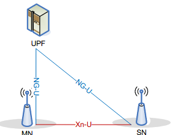

# Introducing NR-DC: Dual Connectivity for Next-Gen 5G Capabilities

> [!Note]
> Author: [Alonza Tu](https://www.linkedin.com/in/feng-tu-b91405345/)
> Date: 2025/02/19

---

## What is NR-DC?

NR-DC stands for New Radio Dual Connectivity. It is a 5G technology that allows a UE to be connected to two different NR cells simultaneously.
In TS 37.340, NR-DC is defined as using one or two gNBs (NR cells) to serve a UE, and the gNBs are connected to the same core network. Like the following figure shows:

(If it is under NR-DC mode and only one gNB is used, it is acceptable that your "Master gNB(MgNB)" and "Secondary gNB(SgNB)" are the same one.)

## Radio Architecture

The radio architecture in NR-DC consists of two main aspects: network interface and radio protocol stack.

### Control Plane Architecture

- Network Interface
 

    From the network interface perspective, the Master gNB (MgNB) serves as the primary connection point to the 5G Core Network through the N2 interface with AMF. All control plane messages from the core network are exclusively directed to the MgNB. The Secondary gNB (SgNB) communicates with the MgNB via the Xn interface, which facilitates the exchange of control information between the two nodes.

- Radio Protocol Stack

    The radio protocol architecture in NR-DC implements a split control plane design:

    - The MgNB maintains the overall RRC state of the UE, ensuring centralized control of the connection
    - Both MgNB and SgNB maintain their own RRC protocol entities and generate independent RRC PDUs
    - This architecture enables coordinated control while allowing for node-specific radio resource management

### User Plane

- Network Interface

    From the network interface perspective, both MgNB and SgNB will establish direct connections to the UPF through the N3 interface. This architecture allows for flexible user plane traffic routing to meet different QoS requirements.
    The Xn interface between MgNB and SgNB supports user plane data forwarding when needed, especially during SgNB addition/modification/release/change procedures.

- Radio Protocol Stack

    The user plane protocol architecture in NR-DC implements three different designs:

    - **Option 1**: MCG Bearer
        Both the control plane message and user plane data are served by the master cell(MgNB).
    - **Option 2**: SCG Bearer
        The control plane message is served by the master cell(MgNB) but the user plane data is only served by the secondary cell(SgNB).
    - **Option 3**: Split Bearer
        The control plane message is served by the master cell(MgNB) and the user plane data is served by both the master cell(MgNB) and the secondary cell(SgNB).

## NR-DC's Core Concept: PDU Session Split at UPF

### What is PDU Session Split?

PDU Session Split allows a single PDU session to be distributed across multiple data paths, optimizing data flow for different services and improving performance. This technique is particularly useful for QoS management, where certain QoS flows can be offloaded from the MgNB to the SgNB.

When establishing a new PDU session, the core network may provide two UL TEID addresses to the two gNBs to enable split tunneling. The MgNB takes responsibility for managing this split by coordinating with the SgNB. The MgNB can decide how to split QoS flows across multiple tunnels based on traffic requirements and network conditions. This ensures more efficient use of network resources and reduces latency for critical services.

### Why is PDU Session Split Important?

- Traffic Optimization: Offloading specific QoS flows to the SgNB reduces congestion at the MgNB.
- Quality of Service: Ensures that critical services receive dedicated resources.
- Network Utilization: Balances load between cells, improving overall network efficiency.
- Redundancy and Reliability: Multiple data paths improve resilience in case of a node failure.

### How It Works in NR-DC?

The PDU Session Split in NR-DC operates through a well-defined sequence of procedures:

1. **PDU Session Establishment**
      - UE initiates a PDU Session establishment request
      - AMF and SMF coordinate to set up the session
      - UPF allocates two sets of TEID for potential dual connectivity:
        - One for the MgNB path
        - Another for the SgNB path
2. **Bearer Configuration**
      - MgNB receives both TEIDs from the core network
      - Based on the QoS requirements and network conditions, MgNB decides the initial bearer type:
        - MCG Bearer: Using only MgNB path
        - SCG Bearer: Using only SgNB path
        - Split Bearer: Using both paths
3. **Dynamic Flow Management**
      - MgNB continuously monitors QoS requirements and radio conditions(these can be customized by operators)
      - When conditions change, MgNB can initiate:
        - Bearer type changes (e.g., from MCG to Split Bearer)
        - QoS flow redistribution between MgNB and SgNB
        - Traffic ratio adjustments in Split Bearer mode
4. **Inter-gNB Coordination**
      - MgNB uses Xn interface to coordinate with SgNB
      - Key coordination aspects include:
        - QoS flow management
        - Resource allocation
        - Bearer type changes
        - Load balancing

This dynamic and flexible architecture allows NR-DC to optimize network performance while maintaining service quality, truly embodying the advanced capabilities of 5G technology.

## Conclusion

NR-DC represents a significant advancement in 5G technology, introducing an enhanced network architecture that enables flexible control and user plane separation at the RAN level. Through its PDU Session Split mechanism and dynamic bearer configurations, NR-DC provides intelligent traffic distribution and QoS-aware flow management, significantly improving network resource utilization while maintaining high service quality. As 5G networks continue to evolve, NR-DC's flexible and efficient architecture stands as a crucial enabler for next-generation mobile services, from high-bandwidth consumer applications to ultra-reliable low-latency industrial use cases.

## Reference

- [TS 37.340](https://portal.3gpp.org/desktopmodules/Specifications/SpecificationDetails.aspx?specificationId=3198)
- [5G NR-NR Dual Connectivity(NR-DC) and IMS Voice service(VoNR)](https://www.telecomhall.net/t/5g-nr-nr-dual-connectivity-nr-dc-and-ims-voice-service-vonr/23697)
- [NR-NR Dual Connectivity(NR-DC)](https://wirelessbrew.com/5g-nr/nr-dc/)

## About me

Hi, I'm Alonza, a core network developer currently contributing to the free5GC project. I'm passionate about exploring cutting-edge 5G technologies, with a recent focus on NR-DC and its role in shaping next-generation connectivity. If you're also interested and have ideas to share, don't hesitate—reach out to me!

### Connect with me

- GitHub: [https://github.com/Alonza0314](https://github.com/Alonza0314)
- Website: [Alonza0314](https://alonza0314.github.io/)
- LinkedIn: [Alonza Tu](https://www.linkedin.com/in/feng-tu-b91405345/)