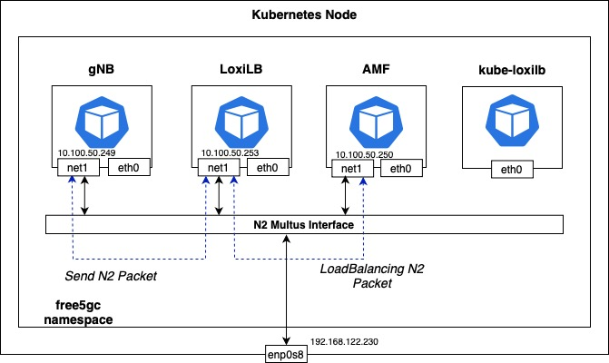

# Install Free5GC with LoxiLB NGAP load-balancing

This blog discusses how [**LoxiLB**](https://github.com/loxilb-io/loxilb), an open-source, eBPF-based load balancer, addresses challenges in NGAP (NG Application Protocol) Layer 7 load balancing within 5G networks with [**Free5GC**](https://github.com/free5gc/free5gc), an open-source implementation of a 5G core network (5GC). Traditional Layer 4 load balancing can lead to issues such as AMF (Access and Mobility Management Function) overload and problematic handovers, especially when gNBs (next-generation Node Bs) serve a large number of UEs (User Equipments). LoxiLB overcomes these challenges by comprehending both NGAP and NAS (Non-Access Stratum) protocols, enabling effective distribution of UEs across stateless AMFs and facilitating seamless handovers. More information about this topic can be found [here](https://www.loxilb.io/post/ngap-load-balancing-with-loxilb).

This post provides a step-by-step deployment guide using open-source solutions like **Free5GC, LoxiLB, and UERANSIM**, all orchestrated in a cloud-native fashion with Kubernetes, to demonstrate this functionality.

# **Overview**

LoxiLB is deployed as a load balancer in front of multiple AMFs in a Free5GC deployment to ensure high availability and seamless failover for NGAP connections originating from a gNB (UERANSIM). By proxying NGAP traffic, LoxiLB ensures that if an AMF instance goes down, the gNB's NGAP connection remains intact and continues to function without interruption. Additionally, when a failed AMF instance recovers, LoxiLB replays cached NG Setup requests, etc to restore connectivity automatically.

### **Flow Diagram**

**1. Normal Operation:**

- UERANSIM (gNB) establishes an NGAP connection through LoxiLB.
- LoxiLB load balances NGAP traffic across multiple Free5GC AMFs.
- The NG Setup procedure is completed with the selected AMF.

**2. AMF Failure Handling:**

- If an AMF fails, LoxiLB detects the failure and reroutes the gNB's NGAP session, along with its associated UEs, to a healthy AMF.
- The gNB does not experience connection loss because LoxiLB maintains the session.

**3. AMF Recovery & NGAP Replay:**

- When the failed AMF is restored, LoxiLB replays cached NG Setup requests and other related messages.
- The AMF resumes handling NGAP traffic without requiring the gNB to reinitiate the setup.

```markdown
                          +-------------------+
                          |   UERANSIM gNB    |
                          | (Simulated gNB)   |
                          +-------------------+
                                   |
                     NG Setup Req  |  NGAP Signaling
                                   v
                          +-------------------+
                          |      LoxiLB       |
                          | (NGAP Proxy/LB)   |
                          +-------------------+
                               /     |     \
       +----------------+    +----------------+    +----------------+
       |   AMF 1 (UP)   |    |   AMF 2 (DOWN)  |   |   AMF 3 (UP)   |
       |  (Processing)  |    | (Failure State) |   |  (Processing)  |
       +----------------+    +----------------+    +----------------+
                                        |
                         AMF 2 Recovers |
                                        v
                              +----------------+
                              |   AMF 2 (UP)   |
                              | (Cache Replay) |
                              +----------------+
```

This architecture significantly enhances 5G network reliability by ensuring the NGAP signaling plane remains operational even when individual AMF instances experience failures, making it ideal for production 5G deployments requiring high availability

# Prerequisites

## Install K8s (MicroK8s)

Install MicroK8s by referring to the guide  https://free5gc.org/guide/7-free5gc-helm/ 

After installing MicroK8s, enable Multus as well, and then additionally run the following command. (It is required to to create a PV to run Free5GC properly)

```jsx
microk8s enable hostpath-storage
```

## Install gtp5g kernel module

To run free5gc, you need the gtp5g module. The following commands install the basic packages for compiling kernel modules.

```jsx
sudo apt -y install git gcc gcc-12 g++ cmake autoconf libtool pkg-config libmnl-dev libyaml-dev
```

Then, install the module by referring to the [gtp5g](https://github.com/free5gc/gtp5g) page.

# Topology



The core networks (N2, N3, N4, N6, N9) of free5gc are configured using Multus. Therefore, each core pod of free5gc has an additional Multus network interface in addition to the default interface (eth0) provided by K8s CNI (default: calico).

gNB uses the N2 network to access AMF. Therefore, it is reasonable for LoxiLB to also have an N2 network interface to load balance the traffic.

In this document, free5gc is deployed as a K8s pod using Helm. At the same time, LoxiLB is also deployed to K8s in in-cluster mode. At this time, LoxiLB does not operate in host mode, but uses the pod network and is assigned the N2 Multus network interface.

gNB sees the external IP of the load balancer service as the AMF IP and forwards the traffic. LoxiLB can load balance the traffic to AMF.

In this document, K8s is installed as a single node in a VM environment. The Host VM has an enp0s8 interface and an IP of 192.168.122.230.

# Install free5gc (using Helm)

Download the free5gc Helm package with the following command.

```jsx
git clone https://github.com/free5gc/free5gc-helm.git
cd free5gc-helm/charts
```

## Modify free5gc/values.yaml

Modify the free5gc/values.yaml file to suit your environment.

```jsx
vi free5gc/values.yaml
```

The part that needs to be modified in the values.yaml file is the masterIf of each network. The VM used as a host in the current document has an enp0s8 interface, and that interface becomes the masterIf of the Multus interface. Therefore, modify it as follows:

```jsx
n2network:
    enabled: true
    name: n2network
    type: ipvlan
    **masterIf: enp1s0**
    subnetIP: 10.100.50.248
    cidr: 29
    gatewayIP: 10.100.50.254
    excludeIP: 10.100.50.254
```

Modify other networks (n3, n4, n6, n9) in the same way.

<aside>
💡

NOTE: This document is based on a VM with one interface. The official document, [free5GC Helm Installation](https://free5gc.org/guide/7-free5gc-helm/) - free5GC, recommends using two interfaces.

</aside>

Next, find AMF in the global section and change service.ngap.enabled to true and service.ngap.type to LoadBalancer.

```jsx
amf:
    n2if:  # NGAP
      ipAddress: 10.100.50.249
    service:
      ngap:
        **enabled: true**
        name: amf-n2
        port: 38412
        nodeport: 31412
        protocol: SCTP
        **type: LoadBalancer**
```

## Modify amf-service.yaml

Next, modify the amf-service.yaml file.

```jsx
vi free5gc/charts/free5gc-amf/templates/amf-service.yaml file
```

Add the following annotation to metadata: And specify “[loxilb.io/loxilb”](http://loxilb.io/loxilb%E2%80%9D) in spec.loadBalancerClass.

```jsx
metadata:
  name: {{ include "free5gc-amf.fullname" $ }}-{{ $.Values.global.amf.service.ngap.name }}
  labels:
    project: {{ $.Values.global.projectName }}
    nf: {{ .name }}
  annotations:
    **loxilb.io/probetype: "none"
    loxilb.io/lbmode: "fullproxy"
    loxilb.io/epselect: "n2"
    loxilb.io/multus-nets: "n2network-free5gc-helm-free5gc-amf"**
spec:
  type: {{ $.Values.global.amf.service.ngap.type }}
  **loadBalancerClass: "loxilb.io/loxilb"**
```

A description of the annotation can be found on kube-loxilb’s github [site](https://github.com/loxilb-io/kube-loxilb?tab=readme-ov-file#how-to-deploy-kube-loxilb-).

## Run helm install command

Deploy free5gc with the following command:

```jsx
helm install -n free5gc free5gc-helm ./ \
--set global.n6network.masterIf=enp0s8 \
--set global.n6network.subnetIP="192.168.122.0" \
--set global.n6network.gatewayIP="192.168.122.1" \
--set free5gc-upf.upf1.n6if.ipAddress="192.168.122.251" \
--set free5gc-upf.upf2.n6if.ipAddress="192.168.122.252" \
--set free5gc-upf.upfb.n6if.ipAddress="192.168.122.253" \
--set global.n2network.masterIf=enp0s8 \
--set global.n3network.masterIf=enp0s8 \
--set global.n4network.masterIf=enp0s8 \
--set global.n9network.masterIf=enp0s8
```

enp0s8 specified in global.n6network.masterIf is the interface name of the Host VM.

The IP address specified in global.n6network.subnetIP & global.n6network.gatewayIP is the network subnet and gateway information used by enp0s8. upf1, upf2, and upfb use the same subnet as the corresponding subnet to enable external communication. Therefore, the IPs of upf1, upf2, and upfb must be IPs that are not used by other machines.

Since this document uses only one interface, the option is set to use enp0s8 as the master for other networks as well. (Same as specified in the values.yaml file)

If the deployment is successful, the following pods are created.

```jsx
kubectl get pods -n free5gc
NAME                                                     READY   STATUS    RESTARTS        AGE
free5gc-helm-free5gc-amf-amf-8667945876-qcwlk            1/1     Running   0               5d2h
free5gc-helm-free5gc-ausf-ausf-64c684f546-crgjt          1/1     Running   0               5d2h
free5gc-helm-free5gc-chf-chf-7c7bb88fb7-xkpnj            1/1     Running   0               5d2h
free5gc-helm-free5gc-dbpython-dbpython-59684d749-6rppv   1/1     Running   0               5d2h
free5gc-helm-free5gc-nef-nef-759b6dfbdb-xrn5r            1/1     Running   0               5d2h
free5gc-helm-free5gc-nrf-nrf-6c8cc8b69-wwzf8             1/1     Running   0               5d2h
free5gc-helm-free5gc-nssf-nssf-5c9d76fc69-f4vfj          1/1     Running   0               5d2h
free5gc-helm-free5gc-pcf-pcf-78f7dbc67d-29xk8            1/1     Running   0               5d2h
free5gc-helm-free5gc-smf-smf-5dbcc8565c-2sj7w            1/1     Running   0               5d2h
free5gc-helm-free5gc-udm-udm-68ff9fbd47-hh2z7            1/1     Running   0               5d2h
free5gc-helm-free5gc-udr-udr-5bd79d98f8-8gfzh            1/1     Running   0               5d2h
free5gc-helm-free5gc-upf-upf1-79d75db8cd-l26ch           1/1     Running   0               5d2h
free5gc-helm-free5gc-upf-upf2-67dcd99f89-l2jf5           1/1     Running   0               5d2h
free5gc-helm-free5gc-upf-upfb-794d46bbb8-nh8fh           1/1     Running   0               5d2h
free5gc-helm-free5gc-webui-webui-75c45c779c-9vvc7        1/1     Running   0               5d2h
mongodb-0                                                1/1     Running   0               5d2h
```

PVC is produced as follows:

```jsx
kubectl get pvc -n free5gc
NAME                STATUS   VOLUME                                     CAPACITY   ACCESS MODES   STORAGECLASS        AGE
cert-pvc            Bound    pvc-dbc3f5ff-bdcc-4b06-bde3-462c3c96ec95   1Mi        ROX            microk8s-hostpath   5d2h
datadir-mongodb-0   Bound    pvc-ba897e0c-9860-4d42-8bc7-9f0ceb1ff17b   6Gi        RWO            microk8s-hostpath   6d3h
```

For service, the amf service will be stuck in pending state. This is because loxilb has not been deployed yet.

```jsx
kubectl get svc -n free5gc
NAME                                TYPE           CLUSTER-IP       EXTERNAL-IP         PORT(S)            AGE
free5gc-helm-free5gc-amf-amf-n2     LoadBalancer   10.152.183.91    <pending>           38412:31412/SCTP   5d2h
free5gc-helm-free5gc-amf-service    ClusterIP      10.152.183.146   <none>              80/TCP             5d2h
free5gc-helm-free5gc-ausf-service   ClusterIP      10.152.183.42    <none>              80/TCP             5d2h
free5gc-helm-free5gc-chf-service    ClusterIP      10.152.183.254   <none>              80/TCP             5d2h
free5gc-helm-free5gc-nef-service    ClusterIP      10.152.183.162   <none>              80/TCP             5d2h
free5gc-helm-free5gc-nssf-service   ClusterIP      10.152.183.181   <none>              80/TCP             5d2h
free5gc-helm-free5gc-pcf-service    ClusterIP      10.152.183.50    <none>              80/TCP             5d2h
free5gc-helm-free5gc-smf-service    ClusterIP      10.152.183.206   <none>              80/TCP             5d2h
free5gc-helm-free5gc-udm-service    ClusterIP      10.152.183.36    <none>              80/TCP             5d2h
free5gc-helm-free5gc-udr-service    ClusterIP      10.152.183.95    <none>              80/TCP             5d2h
gnb-service                         ClusterIP      10.152.183.43    <none>              4997/UDP           5d2h
loxilb-egress-service               LoadBalancer   10.152.183.211   llbanyextip         9999:31237/TCP     5d2h
loxilb-lb-service                   ClusterIP      None             <none>              11111/TCP          5d2h
mongodb                             ClusterIP      10.152.183.83    <none>              27017/TCP          5d2h
nrf-nnrf                            ClusterIP      10.152.183.176   <none>              8000/TCP           5d2h
webui-nbiling                       ClusterIP      10.152.183.56    <none>              2122/TCP           5d2h
webui-ncgf                          ClusterIP      10.152.183.180   <none>              2121/TCP           5d2h
webui-service                       NodePort       10.152.183.226   <none>              5000:30500/TCP     5d2h
```

# Deploy LoxiLB

Save the following to a file named loxilb.yaml:

```jsx
apiVersion: apps/v1
kind: DaemonSet
metadata:
  name: loxilb-lb
  namespace: free5gc
spec:
  selector:
    matchLabels:
      app: loxilb-app
  template:
    metadata:
      name: loxilb-lb
      labels:
        app: loxilb-app
      annotations:
        k8s.v1.cni.cncf.io/networks: '[ { "name": "n2network-free5gc-helm-free5gc-amf",
          "interface": "n2", "ips": [ "10.100.50.253/29" ], "gateway": [ "10.100.50.254"
          ] }]'
    spec:
      #hostNetwork: true
      dnsPolicy: ClusterFirstWithHostNet
      tolerations:
      - key: "node-role.kubernetes.io/master"
        operator: Exists
      - key: "node-role.kubernetes.io/control-plane"
        operator: Exists
      containers:
      - name: loxilb-app
        image: "ghcr.io/loxilb-io/loxilb:scp2"
        imagePullPolicy: Always
        command: [ "/root/loxilb-io/loxilb/loxilb", "--proxyonlymode" ]
        ports:
        - containerPort: 11111
        securityContext:
          privileged: true
          capabilities:
            add:
              - SYS_ADMIN
---
apiVersion: v1
kind: Service
metadata:
  name: loxilb-egress-service
  namespace: free5gc
  annotations:
    loxilb.io/egress: "yes"
    loxilb.io/probetype: "none"
    loxilb.io/staticIP: "0.0.0.0"
spec:
  type: LoadBalancer
  loadBalancerClass: loxilb.io/loxilb
  selector:
    app: loxilb-app
  ports:
  - name: loxilb-egress
    port: 9999
    targetPort: 9999
    protocol: TCP
---
apiVersion: v1
kind: Service
metadata:
  name: loxilb-lb-service
  namespace: free5gc
spec:
  clusterIP: None
  selector:
    app: loxilb-app
  ports:
  - name: loxilb-app
    port: 11111
    targetPort: 11111
    protocol: TCP
```

If you look at the annotations, you can see the [k8s.v1.cni.cncf.io/networks](http://k8s.v1.cni.cncf.io/networks) entry. This is an option to assign the loxilb pod an N2 Multus network interface. The IP addresses are set to 10.100.50.253/29. If you changed the N2 network subnet, you should also change the IP addresses.

Deploy loxilb with the following command.

```jsx
kubectl apply -f loxilb.yaml
```

You will also need to deploy kube-loxilb. Save the following to a file called kube-loxilb.yaml:

```jsx
---
apiVersion: v1
kind: ServiceAccount
metadata:
  name: kube-loxilb
  namespace: kube-system
---
kind: ClusterRole
apiVersion: rbac.authorization.k8s.io/v1
metadata:
  name: kube-loxilb
rules:
  - apiGroups:
      - ""
    resources:
      - nodes
    verbs:
      - get
      - watch
      - list
      - patch
  - apiGroups:
      - ""
    resources:
      - pods
    verbs:
      - get
      - watch
      - list
      - patch
  - apiGroups:
      - ""
    resources:
      - endpoints
      - services
      - namespaces
      - services/status
    verbs:
      - get
      - watch
      - list
      - patch
      - update
  - apiGroups:
      - gateway.networking.k8s.io
    resources:
      - gatewayclasses
      - gatewayclasses/status
      - gateways
      - gateways/status
      - tcproutes
      - udproutes
    verbs: ["get", "watch", "list", "patch", "update"]
  - apiGroups:
      - discovery.k8s.io
    resources:
      - endpointslices
    verbs:
      - get
      - watch
      - list
  - apiGroups:
      - apiextensions.k8s.io
    resources:
      - customresourcedefinitions
    verbs:
      - get
      - watch
      - list
  - apiGroups:
      - authentication.k8s.io
    resources:
      - tokenreviews
    verbs:
      - create
  - apiGroups:
      - authorization.k8s.io
    resources:
      - subjectaccessreviews
    verbs:
      - create
  - apiGroups:
      - bgppeer.loxilb.io
    resources:
      - bgppeerservices
    verbs:
      - get
      - watch
      - list
      - create
      - update
      - delete
  - apiGroups:
      - bgppolicydefinedsets.loxilb.io
    resources:
      - bgppolicydefinedsetsservices
    verbs:
      - get
      - watch
      - list
      - create
      - update
      - delete
  - apiGroups:
      - bgppolicydefinition.loxilb.io
    resources:
      - bgppolicydefinitionservices
    verbs:
      - get
      - watch
      - list
      - create
      - update
      - delete
  - apiGroups:
      - bgppolicyapply.loxilb.io
    resources:
      - bgppolicyapplyservices
    verbs:
      - get
      - watch
      - list
      - create
      - update
      - delete
  - apiGroups:
      - loxiurl.loxilb.io
    resources:
      - loxiurls
    verbs:
      - get
      - watch
      - list
      - create
      - update
      - delete
  - apiGroups:
      - egress.loxilb.io
    resources:
      - egresses
    verbs: ["get", "watch", "list", "patch", "update"]
---
kind: ClusterRoleBinding
apiVersion: rbac.authorization.k8s.io/v1
metadata:
  name: kube-loxilb
roleRef:
  apiGroup: rbac.authorization.k8s.io
  kind: ClusterRole
  name: kube-loxilb
subjects:
  - kind: ServiceAccount
    name: kube-loxilb
    namespace: kube-system
---
apiVersion: apps/v1             
kind: Deployment           
metadata:                           
  name: kube-loxilb                        
  namespace: kube-system                           
  labels:                          
    app: kube-loxilb-app                           
spec:                             
  replicas: 1                             
  selector:                          
    matchLabels:                      
      app: kube-loxilb-app                            
  template:                         
    metadata:                          
      labels:                       
        app: kube-loxilb-app                    
    spec:                       
      dnsPolicy: ClusterFirstWithHostNet                         
      tolerations:                      
        # Mark the pod as a critical add-on for rescheduling.           
        - key: CriticalAddonsOnly            
          operator: Exists                          
      priorityClassName: system-node-critical                      
      serviceAccountName: kube-loxilb                       
      terminationGracePeriodSeconds: 0                    
      containers:                     
      - name: kube-loxilb                     
        image: ghcr.io/loxilb-io/kube-loxilb:latest              
        imagePullPolicy: Always                      
        command:                   
        - /bin/kube-loxilb                
        args:               
        - --cidrPools=defaultPool=10.100.50.253/32                   
        - --setRoles=0.0.0.0
        - --setLBMode=1
        resources:             
          requests:           
            cpu: "100m"
            memory: "50Mi"             
          limits:              
            cpu: "100m"                
            memory: "50Mi"              
        securityContext:           
          privileged: true             
          capabilities:            
            add: ["NET_ADMIN", "NET_RAW"]
```

In cidrPools of args, we specified the 10.100.50.253/32 IP address used in loxilb above.

Deploy kube-loxilb with the following command.

```jsx
kubectl apply -f kube-loxilb.yaml
```

After some time has passed since the deployment was completed, you can see that the external IP Address *10.100.50.253* has been assigned to the AMF service.

```jsx
NAME                                TYPE           CLUSTER-IP       EXTERNAL-IP         PORT(S)            AGE
free5gc-helm-free5gc-amf-amf-n2     LoadBalancer   10.152.183.91    llb-10.100.50.253   38412:31412/SCTP   5d2h
```

# Test

We will deploy ueransim for testing. The free5gc helm package includes ueransim by default. Modify ueransim's values.yaml file for deployment.

```jsx
vi ueransim/values.yaml
```

As with free5gc, modify the masterIf for each network to suit your host environment. In this document, we use the enp0s8 interface of the host VM.

```jsx
global:
  #Global network parametes
  n2network:
    enabled: true
    name: n2network
    type: ipvlan
    masterIf: enp0s8
    subnetIP: 10.100.50.248
    cidr: 29
    gatewayIP: 10.100.50.254
    excludeIP: 10.100.50.254
  n3network:
    enabled: true
    name: n3network
    type: ipvlan
    masterIf: enp0s8
    subnetIP: 10.100.50.232
    cidr: 29
    gatewayIP: 10.100.50.238
    excludeIP: 10.100.50.238
```

Then, modify the amf.n2if.ipAddress entry to the external IP of the AMF service.

```jsx
amf:
    n2if:  # NGAP
      ipAddress: 10.100.50.253
```

Deploy ueransim with the following command:

```jsx
helm install -n free5gc ueransim ./ueransim/
```

After that, you need to access the web UI and create a subscriber for UE. To access it, set up port forwarding with the following command.

```jsx
kubectl port-forward svc/webui-service 5000:5000  --address 0.0.0.0
```

After that, access the web UI with the URL <host_ip>:5000. In this document, it is 192.168.122.230:5000.

When you access the web UI, a login page will appear. The default account is admin:free5gc.

After logging in, click the Create button in the SUBSCRIBERS menu and create a UE. (The basic information is already registered.)

After that, you can check that the UE is connected in the AMF log, and you can check that it is communicating externally with the following command.

```jsx
kubectl exec -it -n free5gc deployment/ueransim-ue \
-- ping -I uesimtun0 8.8.8.8
```

# **Troubleshooting Points**

## PersistentVolume Issue

Sometimes, the pods of free5gc are in a pending state, so when you check the pvc, it mught also be in a pending state. In this case, you need to add the provisionor with the following command.

```jsx
microk8s enable hostpath-storage
```

If you still have the same problem, refer to Create Persistent Volumn in the free5GC Helm Installation - free5GC document and manually add two PersistentVolumes.

## Issue in using K3s

Free5GC uses PersistentVolume, and uses ReadOnlyMany for accessModes.

Since K3s does not support this mode due to lightweight issues, please test using microk8s recommended in the official documentation.

***Author(s) - BackGuyn Jung (LoxiLB), William Linn (Free5GC)***