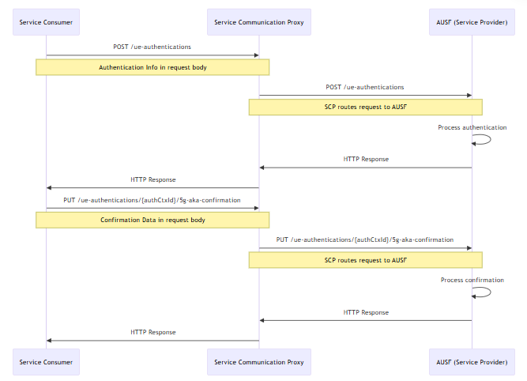

# SCP introduction

> [!Note]
> Author: [Liu-Hsiang Kuan](https://www.linkedin.com/in/%E5%8A%89%E7%BF%94-%E5%AE%98-648591316/)
> Date: 2025/03/12

---

## Introduction to Service Communication Proxy (SCP)

The Service Communication Proxy (SCP) is a crucial component in the 5G Service-Based Architecture (SBA). It acts as an **intermediary** for network functions (NFs) to communicate with each other. Unlike direct NF-to-NF communication, the SCP facilitates **indirect communication**, offering several advantages.

## Important mechanism of SCP in 5G

*   **Inter-PLMN communication**. The SCP can assist in inter-PLMN(Public Land Mobile Network)settings.

*   **Discovery and Routing**: An SCP aids in discovering and selecting appropriate NF service producers for NF service consumers. This often involves interacting with the **Network Repository Function (NRF)**. The NRF maintains profiles of available NF instances and their supported services. The SCP uses the NRF to discover other network entities.

*   **Routing Mechanisms**: The SCP uses routing mechanisms, such as the `3gpp-Sbi-Routing-Binding` header, to direct service requests to the appropriate HTTP server with the target NF service resource context.

*   **Security**: The SCP ensures that indirect communication maintains the same level of security as direct communication.

## How SCP Works

**Direct NF Communication (Without SCP)**

- Message Path:
    - Step 1: NF Consumer (e.g., SMF) sends discovery request directly to NRF.
    - Step 2: NRF returns NF Producer (e.g., NSSF) address.
    - Step 3: SMF communicates directly with NSSF for slice selection.
    - Step 4: NSSF interacts with AMF and PCF through additional NRF lookups.
- Challenges:
    - Repeated NRF queries cause latency and congestion.
    - No traffic prioritization between slice-critical and background messages.
    - Load imbalances if multiple NSSF instances exist.

**SCP-Mediated Communication (With SCP):**

- Message Path:
    - Step 1: SMF sends request to SCP instead of NRF.
    - Step 2: SCP handles discovery via NRF once, caching results for future requests.
    - Step 3: SCP routes request to optimal NSSF instance based on load, priority, and location.
    - Step 4: SCP mediates AMF/PCF interactions without additional NRF lookups.

**AUSF Example (with SCP):**

- The code defines two REST API endpoints in the AUSF service:
    - POST /ue-authentications - Initiates the authentication process for a UE (User Equipment)
    - PUT /ue-authentications/:authCtxId/5g-aka-confirmation - Confirms the authentication using 5G-AKA protocol
- When using the SCP architecture, all these requests would flow through the Service Communication Proxy rather than going directly to the AUSF.

## What is the benefit for SCP communication
1. Simplified Network Topology - Reduces point-to-point connections between services, creating a more maintainable architecture where services only need to know about the SCP rather than all other services.
2. Enhanced Service Management - Provides centralized capabilities for load balancing, service discovery, and traffic management in one place, simplifying operations.
3. Improved Resilience - Creates a more robust system by enabling automatic failover, circuit breaking, and intelligent routing around failures without complex client-side logic.

Actual Example:

- A hospital’s ultra-reliable low-latency (URLLC) network slice request competes with a background IoT firmware update. The SCP:
    - Prioritizes URLLC traffic over IoT.
    - Routes URLLC requests to low-latency edge NSSF instances while directing IoT traffic to centralized NSSFs.
    - Balances load across NSSF clusters during surge requests.

## SCP Design Details

### Essential HTTP Headers

Cruical HTTP headers for SCP operations:

- **3gpp-Sbi-Routing-Binding**: This header contains binding information that ensures message continuity. It helps the SCP route subsequent related requests to the same NF instance that processed the initial request, maintaining session context across multiple transactions.
- **3gpp-Sbi-Target-apiRoot**: Specifies the exact destination endpoint URL for the target network function. When an SCP has resolved the appropriate service provider, it includes this header to indicate the selected instance's base URL, enabling precise routing.
- **3gpp-Sbi-Discovery-**: A family of headers used for service discovery parameters. They carry criteria like required features, service names, or instance IDs that the SCP uses to find appropriate service providers when the consumer doesn't know the exact target.

### Load and Overload Control

*   **Load Control**: SCPs utilize the `3gpp-Sbi-Lci` header to convey load metrics across the network. This information allows consuming NFs to make intelligent routing decisions, potentially directing traffic to less loaded instances for better overall system performance.
*   **Overload Control**: When overload occurs, SCPs use the `3gpp-Sbi-Oci` header to communicate overload control information, allowing NFs to reduce traffic to the overloaded peer.

### Routing Information
The routing mechanism is cruical to SCP. There are some keypoint have to know:

- **SCP Domains**: When an SCP needs to route a message but the destination is in another domain, it consults its domain routing information to determine how to forward the message to the appropriate domain first, rather than trying to reach the final destination directly.

- **Domain Routing**: SCPs leverage the NRF's `Nnrf_NFDiscovery` service to build and maintain routing tables. This information maps service types and instances to appropriate routes, enabling the SCP to intelligently forward requests.
- **Dynamic Updates**: Through subscription mechanisms, SCPs receive real-time notifications about routing changes, service instance health, and network topology updates. This keeps routing information current without requiring constant polling.

### NRF Integration

The NRF provides essential services for SCP functionality:

- `Nnrf_NFManagement`: Handles the registration and lifecycle management of network functions. SCPs use this service to register themselves and to track the availability and capabilities of other network functions.
- `Nnrf_NFDiscovery`: Enables the SCP to find appropriate service instances based on various selection criteria.

For more details about authentication about NRF, you can refer [Authentication Mechanism in NRF: What Is OAuth?](https://free5gc.org/blog/20230802/20230802/)

In free5gc's implementation, indirect communication mode (routing through the SCP) becomes active only after the SCP successfully registers with the NRF, ensuring the SCP is properly integrated into the network's service discovery framework before handling any service routing.

## Conclusion

The SCP facilitated communication between network functions by providing service discovery, routing, and security. For the scalability and flexibility of the core network, the Proper configuration and management of SCPs are essential for ensuring network efficiency and flexible. 

## Reference

- [TS 29.500](https://portal.3gpp.org/desktopmodules/Specifications/SpecificationDetails.aspx?specificationId=3338)
- [TS 29.510](https://portal.3gpp.org/desktopmodules/Specifications/SpecificationDetails.aspx?specificationId=3345)
- [TS 23.502](https://portal.3gpp.org/desktopmodules/Specifications/SpecificationDetails.aspx?specificationId=3338)
- [Everything You Need To Know About NRF and SCP in The 5G Core](https://moniem-tech.com/wp-content/uploads/sites/3/2024/09/Model-C-and-Model-D.png)

## About me

Hi, I'm Liu-hsiang, a telecommunications developer and contributor to the free5GC open-source project. My work focuses on enhancing three critical components of the 5G core: Network Data Analytics Function (NWDAF) for intelligent network optimization, Network Repository Function (NRF) for service discovery and registration, and Charging Function (CHF) for flexible monetization models. I'm particularly interested in how these components can work together to create more adaptive, efficient 5G networks. If you're working in similar areas or have thoughts on advancing these technologies, I'd love to connect and exchange ideas!

### Connect with me

- [GitHub](https://github.com/senselessDog)
- [LinkedIn](https://www.linkedin.com/in/%E5%8A%89%E7%BF%94-%E5%AE%98-648591316/)