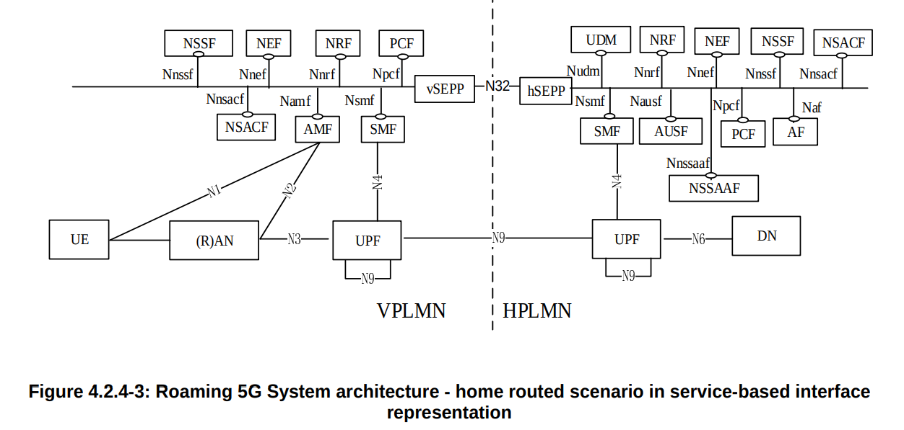
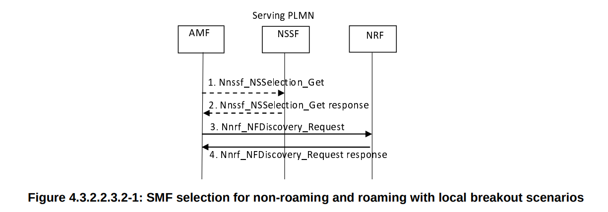
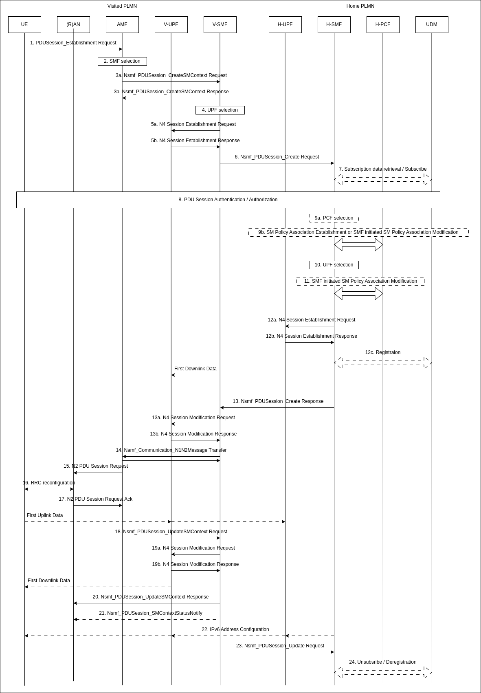
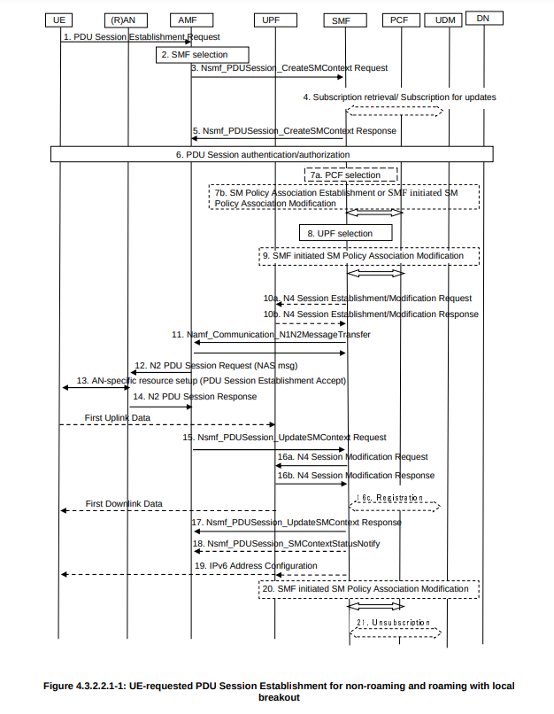

# Introduction of 5G Roaming
>[!NOTE]
> Author: Yung-Hsuan, Tsao
> Date: 2025/03/19
---

## Introduction

As 5G networks expand globally, the way users stay connected while traveling is evolving. **Roaming** ensures subscribers can seamlessly access calls, messaging, and mobile data across different networks or countries.

It allows a User Equipment (UE) to access services while outside its Home Public Land Mobile Network (HPLMN) by connecting to a Visited PLMN (VPLMN).

## Roaming Procedure

### 1. UE Registration in the Visited PLMN (VPLMN)

When the UE powers on in a roaming area, it scans for available PLMNs and selects the VPLMN based on roaming agreements. Then, the UE sends a registration request to the V-AMF (Access and Mobility Function in VPLMN), which checks the PLMN ID and detects that the UE is roaming.

### 2. Authentication and Security Procedures

Since the UE is unfamiliar with the VPLMN, authentication must happen through the HPLMN. V-AMF contacts the AUSF (Authentication Server Function) in the HPLMN through **SEPP** (Security Edge Protection Proxy), which ensures secure inter-PLMN signaling. The AUSF verifies the UE's credentials, and if successful, V-AMF will proceed with security procedures.

### 3. SMF Selection

Once authentication is complete, the UE needs a PDU session to access the data. The UE sends a PDU session establishment request to V-AMF, and it selects available SMFs based on the requested DNN and routing approach.

In 5G roaming, there are two ways of routing user data: Home-Routed (HR) and Local Breakout (LBO). They determine how a UE's traffic is forwarded when it connects to a visited network (VPLMN).

**Home-Routed Roaming (HR)**

Home-Routed Roaming returns all user data traffic to HPLMN before reaching the internet or other services. This means that:

- An H-SMF is selected in step 3, and a PDU session is established with H-UPF. Both SMF and UPF (User Plane Function) remain in the HPLMN.
- The VPLMN only provides radio access and mobility management (AMF).

In this case, data follows a longer path, which increases latency and allows the HPLMN to retain full control over security, billing, and policies.  Enterprise users who need secure connections and sensitive data applications that require strict compliance are preferred to use this kind of routing method.

There are two options for SMF selection in an HR scenario:

(1) SMF Discovery via NSSF

In an HR roaming scenario, the SMF selection involves interactions between VPLMN and HPLMN. If V-AMF does not have prior knowledge of the appropriate NRF (Network Repository Function) to use in the HPLMN, a series of steps are followed to facilitate the network function selection.

- [1] AMF requests slicing information from VPLMN NSSF (vNSSF).
- [2]-[3] If the vNSSF does not have pre-existing slicing configuration information for the requested HPLMN S-NSSAI, it forwards the request to the HPLMN NSSF (hNSSF).
- [4] The vNSSF includes all received details from the hNSSF in its response to the AMF.
- [5] AMF initiates NF discovery via vNRF. Network Function (NF) Discovery is a fundamental procedure in the 5G core that enables a network function to find and communicate with other required NFs dynamically. 
- [6] The vNRF contacts hNRF for SMF discovery.
- [7]-[8] The hNRF provides SMF information and responds to AMF.

(2) Direct SMF Discovery

When the NSSF is not deployed in the HPLMN, V-AMF must still determine the correct NRF in HPLMN for NF discovery.

- [1]-[2] AMF queries vNRF and forwards the request to hNRF. If the AMF does not provide hNRF, the vNRF determines the hNRF using its own configuration. The vNRF then sends an NF Discovery request to the hNRF in HPLMN.

Depending on the available information and based on configuration, the hNRF may either execute steps in [3A] or in [3B]. 

- [3A] Directly response from hNRF.
- [3B] The hNRF queries another local NRF in HPLMN, and then the hNRF relays this information back to the AMF via the vNRF.

**Local Breakout (LBO)**

In Local Breakout (LBO), the user’s data traffic is directly routed through the VPLMN instead of being sent back to the HPLMN. Then:

- Step 3 selects a V-SMF, and the PDU session is established with V-UPF. Both SMF and UPF are located in the VPLMN.
- The VPLMN handles both control and user plane traffic.

Under this condition, data follows a shorter path, reducing latency and improving performance, which is suitable for latency-sensitive applications (e.g., gaming, video calls, streaming) or mobile operators since it can reduce operational costs.

In an LBO scenario, VPLMN is responsible for selecting the SMF, which means user data does not traverse back to the home network. Instead, it is locally routed via the VPLMN’s User Plane Function (UPF) to external networks.

- [1]-[2] V-AMF queries NSSF for slice selection, and NSSF responds with slice selection details.
- [3] The AMF sends a discovery request to the NRF to find an appropriate SMF within the visited network.
- [4] The NRF responds with available SMFs, and the AMF selects the most suitable one for the PDU session. 

**Home-Routed vs. Local Breakout**

Following is a simple comparison of two routing approaches:

| Feature          | Home-Routed | Local Breakout |
| ---------------- | ----------- | -------------- |
| Data Routing     | HPLMN UPF   | VPLMN UPF      |
| SMF/UPF Location | HPLMN       | VPLMN          |
| Latency          | High        | Low            |
| Security         | More Secure | Less Secure    |

### 4. PDU Session Establishment

After selecting SMF, the PDU session establishment process starts.

**Home-Routed Roaming**

- [3]-[5] V-SMF selects a UPF in VPLMN to handle initial traffic management before forwarding the request to H-SMF.
- [6]-[7] H-SMF receives the request from V-SMF.
- [8]-[9] H-PCF applies policy rules, then H-SMF authorizes the session and proceeds with session establishment.
- [10] H-SMF selects a UPF in HPLMN for traffic routing. The H-UPF will act as the anchor point for this PDU session.
- [13] H-SMF sends the response to V-SMF.
- [14]-[17] AMF sends a message to UE, confirming the established session.

In the user plane, the UE starts sending uplink data. The data is sent to V-UPF and tunneled to H-UPF, which routes the traffic to the data network. Downlink data follows the same path in reverse.

**Local Breakout**

- [3]-[5] The selected V-SMF creates a session context and selects a local UPF. This UPF will serve as the PDU session anchor, handling the UE's data traffic locally rather than tunneling back to HPLMN.
- [6] The SMF communicates with V-PCF policy enforcement and UDM in HPLMN to verify user subscription data.
- [12]-[14] Once authentication is complete, the SMF sends a Session Establishment Accept message to the AMF. The AMF forwards the NAS message (PDU Session Establishment Accept) to the UE via RAN.

V-UPF establishes an N3 tunnel with the RAN to enable user-plane data transfer. The UE can now send and receive data via the UPF in VPLMN. Data is routed locally within the visited network without involving the home network.

## Conclusion

As 5G networks continue to expand, roaming plays a crucial role in enabling seamless connectivity for users traveling outside their home networks. In this article, two primary roaming approaches Home-Routed (HR) and Local Breakout (LBO) are introduced, offering different trade-offs in terms of latency, security, and operational costs. With the continued evolution of network slicing, edge computing, and AI-driven network optimization, 5G roaming will become even more flexible, efficient, and user-centric in the future.

## Reference
- [5G Roaming: Everything You Need to Know](https://titaniumplatform.com/news-insights/5g-roaming-everything-you-need-to-know)
- [ts 23.501](https://www.etsi.org/deliver/etsi_ts/123500_123599/123501/17.05.00_60/ts_123501v170500p.pdf): 4.2.4 Roaming reference architectures
- [ts 23.502](https://www.etsi.org/deliver/etsi_ts/123500_123599/123502/17.04.00_60/ts_123502v170400p.pdf)

## About
Hi, I'm Yung-Hsuan!  A newcomer to 5G and the free5GC community. Let me know without hesitation if there is any mistake in the article.

### Connect with Me

- GitHub: [https://github.com/reki9185](https://github.com/reki9185)