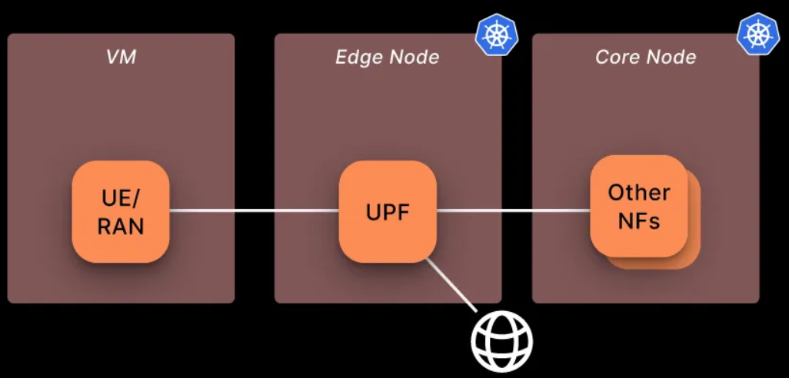

# Optimizing free5GC Through Local UE Traffic and Dedicated UPF: A Multi-Node Helm Deployment Approach
>[!NOTE]
> Author: Fang-Kai Ting
> Date: 2025/04/16
---
This guide walks through the steps for deploying and end-to-end testing the [free5GC-Helm](https://github.com/free5gc/free5gc-helm) project. It demonstrates the deployment of two nodes (Core and UPF) within a single Kubernetes cluster, along with a locally deployed UE used for ping-based connectivity testing.

# Architecture

Using a local UE, as opposed to deploying the UE and RAN together with the UPF on the same node via Helm, offers greater stability and consistency when establishing PDU sessions.

The architecture is as follows:

1. The control plane of the 5G core and the MongoDB database are deployed on the **vm1** node.
2. The user plane (UPF) is deployed on the **vm2** node within the same Kubernetes cluster.
3. The UE (User Equipment) and gNodeB simulator, **UERANSIM**, are deployed locally on a separate **vm3** node.
    
    
    

The specifications for each virtualbox VM shown below:

|  | vm name | CPU | RAM | Network Adapter 1 (enp0s3) | Network Adapter 2 (enp0s8) | OS |
| --- | --- | --- | --- | --- | --- | --- |
| vm1(free5GC control plane) | ns | 8 | 16G | NAT(10.0.2.15) | Host-only(192.168.56.119) | Ubuntu 20.04 LTS |
| vm2(free5GC UPF pod) | ns2 | 8 | 16G | NAT(10.0.2.15) | Host-only(192.168.56.120) | Ubuntu 20.04 LTS |
| vm3(UE + gNB) | ns3 | 8 | 16G | NAT(10.0.2.15) | Host-only(192.168.56.118) | Ubuntu 20.04 LTS |

## Cluster nodes setup(VM1, VM2)

### gtp5g install

```bash
git clone https://github.com/free5gc/gtp5g.git
cd gtp5g
bash <<EOF
sudo apt -y update
sudo apt -y install gcc g++ cmake autoconf libtool pkg-config libmnl-dev libyaml-dev
make clean && make
sudo make install
EOF
```

### Microk8s install & setup

MicroK8s is used with containerd as the container runtime. MicroK8s automatically installs containerd during its setup. For installation instructions, refer to [MicroK8s - Get started](https://microk8s.io/docs/getting-started)

All VMs are configured within the CIDR range **192.168.56.0/24**, using the **enp0s3** network adapter for internet access.

```bash
sudo snap install microk8s --classic --channel=1.32
sudo vim ~/.bash_aliases
alias kubectl='microk8s kubectl'
sudo usermod -a -G microk8s $USER
mkdir -p ~/.kube
chmod 0700 ~/.kube
su - $USER

bash <<EOF
microk8s config > .kube/config
microk8s status --wait-ready
microk8s kubectl get nodes
microk8s enable dns
microk8s enable hostpath-storage
EOF
```

### k8s configuration

- VM ipv4 forwarding
    
    ```bash
    cat <<EOF | sudo tee /etc/sysctl.d/k8s.conf
    net.bridge.bridge-nf-call-iptables  = 1
    net.bridge.bridge-nf-call-ip6tables = 1
    net.ipv4.ip_forward                 = 1
    EOF
    ```
    

Add below in `/var/snap/microk8s/current/args/kubelet`

1. The default internal IP for each node is **10.0.2.15**, which can hinder inter-node communication. To ensure proper connectivity, update the internal IPs accordingly—for example: **vm1 = 192.168.56.119**, **vm2 = 192.168.56.120**.
    
    ```bash
    --node-ip=<host-only ip>
    ```
    
2. Ipv4 forwarding
    
    ```bash
    --allowed-unsafe-sysctls "net.ipv4.ip_forward"
    ```
    

### CNI Plugin Configuration

MicroK8s clusters use the **Calico CNI** by default

- To enable IP forwarding on UPF, Calico CNI needs some necessary configurations.
- Some CNI plugin, like Flannel, kube-ovn, allow this funtionality by default
- Setup Calico CNI for IP Forwarding
    1. `/var/snap/microk8s/current/args/cni-network/cni.yaml`
        
        ```yaml
        kind: ConfigMap
        data:
            cni_network_config: |-
                {
                    # ...
                    "plugins": [
                        {
                            # Append IP forwarding settings
                            "container_settings": {
                                "allow_ip_forwarding": true
                            },
                        }
                    ]
                }
        ```
        
        - Refer to the [Calico CNI Docs](https://docs.tigera.io/calico/latest/reference/configure-cni-plugins#container-settings)
    2. Apply settings
        
        `kubectl apply -f /var/snap/microk8s/current/args/cni-network/cni.yaml`
        
    3. Restart MicroK8s
        
        `sudo microk8s stop && sudo microk8s start`
        

### **Multus**

Multus is a **CNI (Container Network Interface) plugin** for Kubernetes that enables **pods to have multiple network interfaces**. A clear example of this is the UPF, which has the N3, N4, N6 interfaces and optionally the N9. Multus has the capability to “call” other CNI plugins for this purpose.

```bash
kubectl apply -f [https://raw.githubusercontent.com/k8snetworkplumbingwg/multus-cni/master/deployments/multus-daemonset.yml](https://raw.githubusercontent.com/k8snetworkplumbingwg/multus-cni/master/deployments/multus-daemonset.yml)
```

### Multi-node microk8s setup

After completing the above MicroK8s configuration, the two nodes can be joined into a single cluster using the following command: [MicroK8s - Create a MicroK8s cluster](https://microk8s.io/docs/clustering)

- vm1: 
`microk8s add-node`
    - output example:
    `microk8s join 192.168.56.119:25000/92b2db236428470dc4fcfc4ebbd9dc81/2c0cb5284b05`
- vm2:
    - paste output(—worker is optional)

Result:


## Helm

**Helm** is a package manager for Kubernetes that simplifies the deployment and management of applications. It uses **Helm charts**, which are pre-configured templates that define Kubernetes resources like pods, services, and deployments. Helm enables developers and operators to install, upgrade, or roll back applications with a single command, making Kubernetes workflows more efficient and reproducible. It supports versioning and configuration overrides, allowing teams to maintain consistency across environments. Helm is often compared to tools like apt or yum, but for Kubernetes, making it an essential tool for managing complex, cloud-native applications at scale.

### Install

```bash
bash <<EOF
curl -fsSL -o get_helm.sh https://raw.githubusercontent.com/helm/helm/main/scripts/get-helm-3
chmod 700 get_helm.sh
./get_helm.sh
EOF
```

### Configuration

For a multi-cluster deployment with the UE/gNB hosted on a separate VM, the following modifications should be applied to the `values.yaml` files of each chart:

- Ref: [towards5gs-helm/charts/free5gc at main · Orange-OpenSource/towards5gs-helm](https://github.com/Orange-OpenSource/towards5gs-helm/tree/main/charts/free5gc#networks-configuration)
- To check where modifications were made in my Git commit
    - https://github.com/qawl987/free5gc-helm/commit/d40101d58e51a26e1c0acef3883d598528e718f1

Each NF has its own `values.yaml` file along with a shared global values.yaml; ensure that changes are applied to both configuration files.

- Ex: `free5gc-helm/charts/free5gc/values.yaml` and `free5gc-helm/charts/free5gc/charts/free5gc-amf/values.yaml` …

**Notice:**

1. The UPF N3 interface is the most challenging aspect. Since the UE sends packets only to port 2152, the NodePort method is not suitable, and LoadBalancer is designed for HTTP, not UDP traffic. The simplest solution is to configure the UPF's N3 interface to use the host-only subnet, allowing the UE to send packets directly to the N3 interface via that subnet. Alternatively, you can modify only the SMF to advertise the gNB N3 interface as the VM2 host-only IP and use a kube-proxy service to forward packets to the pod IP. This can also be addressed using MACVLAN or IPVLAN CNI plugins to bridge the UPF pod directly onto the host network.For detailed configuration and result, refer to the appendix.
2. We demonstrate the UPF ULCL configuration here; for a single UPF setup, refer to the section above.

| NF | parameter | current value | new value |
| --- | --- | --- | --- |
| AMF | global.n2network.masterIf | eth0 | enp0s8 |
| AMF | global.amf.service.ngap.enabled | false | true |
| SMF | global.n4network.masterIf | eth0 | enp0s8 |
| SMF | interfaceType: N3 endpoints | 10.100.50.233 | 192.168.56.19 |
| UPF | global.n4network.masterIf | eth0 | enp0s8 |
| UPF | global.n3network.masterIf | eth0 | enp0s8 |
| UPF | global.n3network.subnetIP | 10.100.50.232 | 192.168.56.0 |
| UPF | global.n3network.cidr | 29 | 24 |
| UPF | global.n3network.gatewayIP | 10.100.50.238 | empty |
| UPF | global.n3network.excludeIP | 10.100.50.238 | 192.168.56.254 |
| UPF | global.n6network.masterIf | eth1 | enp0s3 |
| UPF | global.n6network.subnetIP | 10.100.100.0 | 10.0.2.0 |
| UPF | global.n6network.gatewayIP | 10.100.100.1 | 10.0.2.2 |
| UPF | global.n6network.excludeIP | 10.100.100.254 | 10.0.2.254 |
| UPF | global.n9network.masterIf | eth0 | enp0s8 |
| UPF | upf1.n6if.ipAddress | 10.100.100.13 | 10.0.2.13 |
| UPF | upf2.n6if.ipAddress | 10.100.100.14 | 10.0.2.14 |
| UPF | upfb.n3if.ipAddress | 10.100.50.233 | 192.168.56.19 |
| UPF | upfb.n6if.ipAddress | 10.100.100.12 | 10.0.2.15 |
| ulcl-enabled-values.yaml | N3 endpoints | 10.100.50.233 | 192.168.56.19 |

### Persistent Volume for mongoDB

A Persistent Volume (PV) in Kubernetes is a storage resource provisioned independently of pods, enabling data persistence across pod restarts. It decouples storage from containers for stable, reusable storage.

```yaml
apiVersion: v1
kind: PersistentVolume
metadata:
  name: free5gc-pv-mongo
  labels:
    project: free5gc
spec:
  capacity:
    storage: 8Gi
  accessModes:
  - ReadWriteOnce
  persistentVolumeReclaimPolicy: Retain
  local:
    path: /home/vagrant/kubedata
  nodeAffinity:
    required:
      nodeSelectorTerms:
      - matchExpressions:
        - key: kubernetes.io/hostname
          operator: In
          values:
          # modify value to your hostname
          - ns
```

### Persistent Volume Claim for mongoDB

A Persistent Volume Claim (PVC) in Kubernetes is a user’s request for storage, specifying size and access mode. It binds to a Persistent Volume, enabling pods to use persistent storage seamlessly.

```yaml
apiVersion: v1
kind: PersistentVolume
metadata:
  name: free5gc-pv-cert
  labels:
    project: free5gc  # Must match the selector in PVC
spec:
  capacity:
    storage: 1Mi  # Must match the PVC request exactly
  accessModes:
    - ReadOnlyMany  # Must match the PVC access mode
  persistentVolumeReclaimPolicy: Retain
  local:
    path: /home/vagrant/certdata  # Ensure this directory exists on the correct node
  volumeMode: Filesystem
  nodeAffinity:
    required:
      nodeSelectorTerms:
        - matchExpressions:
            - key: kubernetes.io/hostname
              operator: In
              values:
                - ns  # Ensure this is the correct node name

```

### Multi-node configuration

Change the nodeSelector field in each NF's values.yaml file. For example, update the UPF nodeSelector to correspond to ns2, and set the nodeSelector for other NFs to ns

```yaml
Before
nodeSelecotr: {}
After
nodeSelector:
  # your desired node's host name
  kubernetes.io/hostname: ns
```

# Run

After above configuration, we can build core and upf now.

1. Run Core & UPF
    
    ```bash
    kubectl create ns free5gc
    kubectl apply -f persistent-vol-for-mongodb.yaml
    kubectl apply -f persistent-vol-for-cert.yaml
    helm -n free5gc install free5gc-v1 ./free5gc/
    ```
    
    
    
2. Check NF deployment node
    1. UPF in ns2
        
        
        
    2. Other NF in ns
        
        
        
3. Test the UPF forwarding by checking the output, which should be "1". If the output is different, ensure that the CNI and OS `ipv4_forwarding` configurations are correctly set.You can also refer to the appendix, under the Security Pod section, for more details.
    
    ```bash
    kubectl exec -it -n free5gc <upf-pod-name-above> \
    -- cat /proc/sys/net/ipv4/ip_forward
    ```
    
4. Check UPF N4 connection
    
    ```bash
    kubectl logs <upf-pod-name> -n free5gc
    ```
    
    
    

# Local UE VM3 deployment

### Install UERANSIM

https://github.com/aligungr/UERANSIM

```bash
cd UERANSIM
bash <<EOF
sudo apt install make -y
sudo apt install gcc -y
sudo apt install g++ -y 
sudo apt install libsctp-dev lksctp-tools -y
sudo apt install iproute2 -y
sudo snap install cmake --classic
EOF
# Be sure to use snap install cmake --classic for suitable cmake version
make
```

### AMF service expose

free5GC has the AMF N2 service configured as a `ClusterIP` by default, which prevents direct access to the pod on port 38412. To allow the local UE to connect, you need to change the service type to `NodePort`.

```bash
kubectl patch svc free5gc-v1-free5gc-amf-amf-n2 -n free5gc -p '{"spec": {"type": "NodePort"}}'
```

You can see 31412 is the port exposed.


### Configuration

`UERANSIM/config/free5gc-gnb.yaml`

|  | current value | new value | notes |
| --- | --- | --- | --- |
| ngapIp | 127.0.0.1 | 192.168.56.118 | VM3 host-only ip |
| gtpIP | 127.0.0.1 | 192.168.56.118 | VM3 host-only ip |
| amfConfig.address | 127.0.0.1 | 192.168.56.119 | VM1 host-only ip |
| amfConfig.port | 38412 | 31412 | above exposed port |

### End-to-end test

1. Subscribe UE in webconsole
    1. In VM1, expose the service for subscription
        
        ```bash
        kubectl port-forward --address 192.168.56.119 --namespace free5gc svc/webui-service 5000:5000
        ```
        
    2. Login to **192.168.56.119:5000** using the credentials (**admin**, **free5gc**), and create a subscriber using the default settings.
        
        
        
2. You need three terminal
    1. terminal 1: create gNB
        
        ```bash
        ./build/nr-gnb -c config/free5gc-gnb.yaml
        ```
        
        
        
    2. terminal 2: create UE
        
        ```bash
        sudo ./build/nr-ue -c config/free5gc-ue.yaml
        ```
        
        
        
    3. terminal 3: ping test
        
        
        
3. Check
    1. In the UPF pod, install `tcpdump` (ensure a nameserver is configured, as the current UPF pod lacks DNS resolution).
        
        ```bash
        echo "nameserver 8.8.8.8" >> /etc/resolv.conf & apt install tcpdump -y
        ```
        
        1. N3 if
            
            
            
        2. N9 if
            
            
            
    2. In upf1, install tcpdump too
        1. N6 if
            
            
            
        2. upfgtp
            
            
            

# Appendix

### ClusterIP service & kube-proxy

I attempted to use a `ClusterIP` service with kube-proxy to forward UE packets from the VM2 host-only IP to the UPF pod IP, but the packets are being lost after being forwarded to the pod IP. This issue remains unresolved.

1. kube-proxy service
    
    ```yaml
    apiVersion: v1
    kind: Service
    metadata:
      name: free5gc-upf-n3-externalip-service
      namespace: free5gc
    spec:
      type: ClusterIP
      selector:
        app.kubernetes.io/instance: free5gc-v1
        app.kubernetes.io/name: free5gc-upf
        nf: upfb
        project: free5gc
      ports:
        - name: n3-gtpu
          protocol: UDP
          port: 2152          # Service 在叢集內部以及外部監聽的埠
          targetPort: 2152    # UPF Pod 容器實際監聽的 GTP-U 埠
      externalIPs:
        - 192.168.56.120     # 指定 Service 監聽 vm2 的 IP 地址
    ```
    
2. add --masquerade-all=true in `/var/snap/microk8s/current/args/kube-proxy`

Can see src=10.1.4.159, mean flow-in DNAT success, but something went wrong after packet go inside upfb pod.


### Local registry

Docker Hub may throttle the UPF pod due to excessive image pull requests (affecting only the UPF pod, for reasons unclear). To avoid this, set up a local registry and use a locally built UPF image.

```bash
sudo microk8s enable registry
docker pull free5gc/upf:v4.0.0
docker tag free5gc/upf:v4.0.0 localhost:32000/free5gc/upf:v4.0.0
docker push localhost:32000/free5gc/upf:v4.0.0
```

Update all UPF image names from `name: localhost:32000/free5gc/upf` to `name: free5gc/upf`.
You can also refer to my Git commit for further details. 
- https://github.com/qawl987/free5gc-helm/commit/7d82f68060596954cc0139f5a5a160f235e53f3a

### Security pod

Some VMs require the following additional setting for UPF. If you've already configured all `ipv4_forwarding` options, add the configuration below to all UPF pods as well.

```yaml
free5gc-upf:
  upf1:
    podSecurityContext:
      sysctls:
        - name: net.ipv4.ip_forward
          value: "1"
```

# Conclusion

This guide walks through the steps for deploying and end-to-end testing the [free5GC-Helm](https://github.com/free5gc/free5gc-helm) project. It demonstrates the deployment of two nodes (Core and UPF) within a single Kubernetes cluster, along with a locally deployed UE used for ping-based connectivity testing.

### Reference

[From Theory to Practice: Implementing a 5G Core Network Using Open Source Tools | by Danilo Granados | Medium](https://medium.com/@danilo.j.granados/from-theory-to-practice-implementing-a-5g-core-network-using-open-source-tools-4a6afe1f708b)

[free5GC Helm Installation - free5GC](https://free5gc.org/guide/7-free5gc-helm/#installation)

[https://github.com/Orange-OpenSource/towards5gs-helm/tree/main/charts/free5gc#networks-configuration](https://github.com/Orange-OpenSource/towards5gs-helm/tree/main/charts/free5gc#networks-configuration)

### **About me**

Hi, I’m Fang-Kai Ting, a newcomer to 5G and free5GC, and currently conducting research on Network Slicing. Let me know without hesitation if there is any mistake in the article.

## Connect with Me

Github: [qawl987](https://github.com/qawl987)