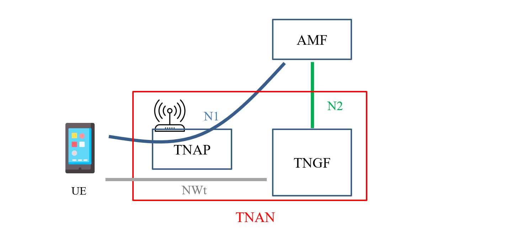
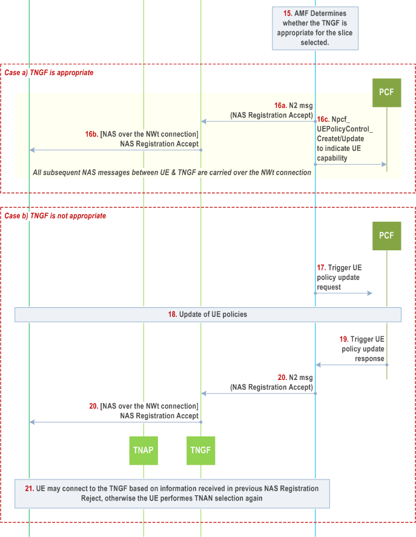

# Introduction to TNGF
>[!NOTE]
> Author: Pei-Chi, Cheng
> Date: 2025/04/23
---

## Introduction

TNGF (Trusted Non-3GPP Gateway Function) is a network function defined in the 5G System Architecture. It acts as a gateway between trusted non-3GPP access networks (like Wi-Fi, etc.) and the 5G Core (5GC).

TNGF enables UEs using trusted non-3GPP access to connect to the 5G Core, enabling them to access services such as mobility, session continuity, and policy enforcement just like on 3GPP access.

## Registration via Trusted non-3GPP Access

### Summary
When a UE connects to the 5G Core via trusted Wi-Fi (such as an operator-provided home Wi-Fi), the registration procedure is very similar with the 5GC registration procedure over untrusted non-3GPP access. 

The UE uses a special method called EAP-5G to encapsulate its NAS messages. These encapsulated messages are sent to the TNGF, which simply forwards them to the AMF. Even though the messages pass through TNGF, the actual communication always happens between the UE and the AMF. 

### 1. Access Selection and Initial Connection
In the Trusted non-3GPP access registration procedure, the UE first selects a compatible Trusted non-3GPP Access Network (TNAN), such as a WLAN, based on its subscription information (e.g., PLMN or SNPN). This selection process allows the UE to discover access networks that offer "5G connectivity." After selecting a TNAN, the UE establishes a Layer-2 connection with the Trusted Non-3GPP Access Point (TNAP), such as through 802.11 Association in Wi-Fi networks.

### 2. Authentication and Slice-Aware Registration
After establishing a Layer-2 connection with the TNAP, the UE initiates authentication to prove its identity and connect to the 5G Core Network (5GC). The UE sends a Network Access Identifier (NAI) via the TNAP, indicating its desired 5G connectivity (e.g., a specific PLMN or SNPN) and subscription context. The TNAP encapsulates the NAI in AAA messages (typically RADIUS) and forwards it to the TNGF. Acting as an AAA proxy, TNGF processes the TNAP’s EAP-5G messages and forwards the encapsulated NAS messages to the AMF via the N2 interface, initiating the authentication process.

Authentication is performed using the EAP-5G protocol directly between the UE and AMF, with TNGF relaying EAP-5G messages. Upon successful authentication, the UE and AMF each generate a TNGF Key, used for subsequent secure channel setup. The AMF sends the TNGF Key to TNGF via the N2 interface, and TNGF derives a TNAP Key from it. The TNAP Key secures the Layer-2 connection between the UE and TNAP (e.g., Wi-Fi WPA2/WPA3 security). This process ensures the UE’s secure access to the 5GC and prepares for slice-based services (e.g., dedicated channels for different applications).

### 3. Secure Channel Setup and IP Configuration
With authentication complete and security keys generated, the UE and TNAP perform a 4-way handshake (e.g., WPA2/WPA3) to establish a secure Layer-2 connection, protecting Wi-Fi wireless data. The UE then obtains an IP address from the TNAN, typically via DHCP or IPv6 Stateless Address Autoconfiguration.

Using the TNGF IP address obtained from EAP-5G authentication, the UE establishes a secure channel (NWt) with TNGF via the IKEv2 protocol. This involves IKE_INIT and IKE_AUTH exchanges, with authentication based on the TNGF Key generated during authentication, using shared key authentication. TNGF verifies the UE’s identity without involving a backend RADIUS server. Upon success, a signaling IPsec Security Association (SA) is established in tunnel mode, using null encryption to provide only integrity and authentication for NAS messages. NAS message confidentiality is ensured by the NAS protocol layer’s encryption, transmitted over the NWt channel via TCP/IP/ESP.

TNGF provides the UE with:
- **Inner IP address:** For communication within the secure channel.
- **NAS_IP_ADDRESS and TCP port:** For transmitting NAS messages.
- **DSCP value:** To mark packet priority, which the UE and TNAP may map to Wi-Fi QoS prioritie.

After establishing the signaling IPsec SA, the UE sets up a TCP connection using the NAS_IP_ADDRESS and TCP port. NAS messages are securely transmitted via TCP/IP/ESP in the NWt channel. With the NWt channel complete, the UE can securely access 5GC services, such as establishing PDU Sessions for data transfer.

### 4. Slice Compatibility Check and Policy Update
After the secure NWt connection is established, the TNGF notifies the AMF. The AMF then evaluates whether the UE’s Requested NSSAI (network slice selections) is compatible with the TNGF's supported slice configuration. If compatible, the AMF sends a NAS Registration Accept message, allowing the UE to proceed with PDU session establishment and enabling further policy interactions via the PCF.

If the TNGF is not compatible with the requested slices, the AMF may update the UE’s access policies via the PCF. The AMF then sends a Registration Reject message, possibly including new TNAP/TNGF target information. The UE can then re-select a new TNAN and repeat the registration procedure with updated preferences.

## PDU Session Establishment
After registering to 5GC via trusted non-3GPP access, UE can establish a PDU Session using a procedure similar to N3IWF, with N3IWF replaced by TNGF and untrusted access point by TNAP. 

TNGF sends TNGF Identities (N3 termination identifiers, such as FQDNs or IP addresses) and User Location Information (ULI) (e.g., cell ID) via N2. This enables the SMF to select a suitable UPF and allows the PCF to apply location-based policy control. The IKEv2 Create Child SA Request includes Additional QoS Information containing QoS Characteristics (linked to 5QI) and, for GBR flows, also GBR QoS Flow Information (MFBR, GFBR), guiding the UE's QoS resource reservation.

For L4S QoS flows, the TNGF may establish dedicated IPsec Child SAs with DSCP marking. If the UE fails to reserve the requested QoS resources over the trusted non-3GPP access, it may reject the Child SA. Based on operator policy, the network may retry without including Additional QoS Information.

## Difference between N3IWF and TNGF
### What Is N3IWF?

The N3IWF (Non-3GPP Interworking Function) is a critical network function in the 5G system architecture, serving as a gateway between untrusted non-3GPP access networks (e.g., public Wi-Fi) and the 5G Core Network. When a UE connects to the 5GC via an untrusted network, the N3IWF establishes a secure IPsec tunnel using IKEv2 and EAP-5G protocols for authentication, protecting both control and user plane data. 
The UE first selects an N3IWF (based on PLMN or SNPN) and sends NAS messages encapsulated in EAP-5G, which the N3IWF forwards to the AMF via the N2 interface. After authentication, the N3IWF and UE establish a signaling IPsec SA for NAS message transmission (TCP/IP/ESP) and support network slice selection. Acting like a VPN gateway, the N3IWF ensures security and service continuity, including mobility, QoS, and policy enforcement, in untrusted environments.

 
### Comparison
| **Item** | **TNGF** | **N3IWF** |
| --- | --- | --- |
| **Access Type** | Trusted non-3GPP Access (e.g., operator-managed Wi-Fi) | Untrusted non-3GPP Access (e.g., public Wi-Fi) |
| **Trust Level** | The 5GC trusts the access network | The 5GC does not trust the access network, requiring additional security mechanisms |
| **UE-Access Node Connectivity** | EAP-5G used for authentication, encapsulating NAS messages between UE and AMF via TNAP | IKEv2 used to establish an IPsec tunnel; EAP-5G used inside the tunnel for NAS signaling |
| **IPsec Tunnel usage** | For control plane via NWt interface (null encryption, protects NAS message integrity and authentication) | For control and user planes via NWu interface (full encryption, protects confidentiality, integrity, and authentication) |
| **NAS Communication** | NAS messages encapsulated in EAP-5G (during authentication) or TCP/IP/ESP (post-NWt setup), sent via N2/NGAP, similar to gNB | NAS messages encapsulated in EAP-5G during authentication, then in TCP/IP/ESP over a fully encrypted IPsec tunnel post-NWu setup |
| **Typical Use Case** | Trusted Wi-Fi deployed by operators or partners, e.g., home or enterprise Wi-Fi | Public or open Wi-Fi, e.g., in cafes, airports, or other unsecured networks |
| **Functional Role** | Acts like a gNB, supporting N2/NGAP for signaling and trusted access integration | Acts like a VPN gateway, handling IPsec, EAP, and translation between non-3GPP access and 5GC |

## How to Determine If a Non-3GPP Network Is Trusted?
- Wi-Fi deployed by a telecom operator or with a trust agreement with the 5GC is considered trusted.
- Trusted networks register as a TNAP in the 5GC, connect via a TNGF, and support 3GPP authentication (e.g., EAP-5G).
- Trusted networks may offer special SSIDs or onboarding flows for mobile subscribers.

## Conclusion
Trusted non-3GPP access extends the 5G Core over operator-managed Wi-Fi, enabling secure, seamless connectivity and consistent mobile services beyond traditional RAN coverage.

## Reference
- [TS 23.502](https://www.tech-invite.com/3m23/toc/tinv-3gpp-23-502_zp.html#e-4-12a-5)
- [TS 23.501](https://www.tech-invite.com/3m23/toc/tinv-3gpp-23-501_zb.html#e-5-7-3)
- [TS 133 501 - V16.17.0 - 5G](https://www.etsi.org/deliver/etsi_ts/133500_133599/133501/16.17.00_60/ts_133501v161700p.pdf)
- [5G: focus on N3IWF, TNGF, TWIF and W-5GAN](https://romars.tech/en/pubblications/n3iwf/)

## About me 
Hi, I'm Peggy Cheng, a newcomer to 5G and the free5GC community. Feel free to tell me if there's any mistake in the article.

### Connect with Me
GitHub: [HiImPeggy](https://github.com/HiImPeggy)