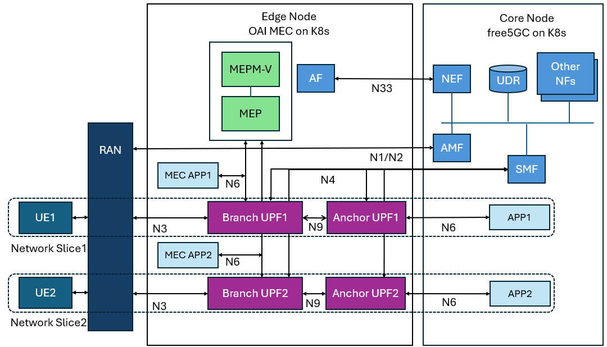

# A Practical Guide to Network Slicing and Traffic Steering with free5GC and OAI-MEC

This guide provides a step-by-step walkthrough for implementing advanced 5G features on a free5GC deployment. It demonstrates how to configure **OAI-MEC**, create multiple **network slices**, and manage data paths using **traffic steering** with an Application Function (AF), culminating in a multi-slice, multi-MEC application architecture.

**Acknowledgements**

Special thanks to [**wilson30139**](https://github.com/wilson30139) for providing many of the configuration files used in this lab. This article would not have been possible without his contributions.

# Intro

In a previous article, we described an architecture where the UPF is deployed on an edge node, with the rest of the core network functions residing on a central core node. We then ran a ping test using a local UE to validate the setup.

This time, we will build upon that foundation by using the network slicing and traffic steering capabilities of the free5GC core. We will deploy a cluster containing two network slices. Each slice will have its own dedicated UPF and a simple Multi-access Edge Computing (MEC) application on the edge node. The main core network will host the other NFs and an identical application. This setup simulates a scenario where users in each network slice have a dedicated data plane and a specialized MEC application.

For the detailed VM configuration, please refer to the previous article. All VM and cluster settings for this tutorial will remain the same.

[Optimizing free5GC Through Local UE Traffic and Dedicated UPF: A Multi-Node Helm Deployment Approach - free5GC](https://free5gc.org/blog/20250416/20250416/)

**It's important to note that we are using free5GC `v3.4.5`, because `v4.0.0` does not support traffic steering for the NEF (Network Exposure Function).**

The diagram below illustrates the final architecture. This article will guide you through three experiments to build this setup step-by-step.



## Lab outline

**Part 1: OAI-MEC Installation**
Base on previous article structure, add the MEC Platform (MEP) and a MEC application, and then complete a basic ping test to verify the setup.

**Part 2: OAI-MEC App with Traffic Steering**
Integrate the OpenNESS Application Function (AF). Then, use the AF and the Network Exposure Function (NEF) to send new packet routing rules to the network.

**Part 3: Two Slices with Two MEC Apps and Traffic Steering**
Create and deploy two network slices. Next, use the MEP's gateway and registry mechanisms to enable service discovery for the MEC applications. Finally, apply traffic steering to achieve independent traffic control for each of the two slices.

Each of the three experiments will cover the following sections:

1. **Architecture**
2. **Tools Introduction**
3. **Implementation and Configuration**
4. **Execution Commands and Results**

# Lab 1: Installing the OAI-MEC Platform

## **Architecture**

Lab 1 will begin by deploying a MEC application on the edge node. We will then modify the UPF configuration to allow the UE (User Equipment) to route traffic to the external network via the `uesimtun0` interface, and also to direct traffic to the MEC application.
We will use the OAI-MEC platform, available at [OAI MEP repo](https://gitlab.eurecom.fr/oai/orchestration/oai-mec/oai-mep). In the diagram, the green component represents the MEP (Multi-access Edge Computing Platform), which manages the entire lifecycle of the MEC application.


## **Tools Introduction**

### OAI-MEC

OAI-MEC is a project under the OpenAirInterface (OAI) banner that focuses on developing an open-source Multi-access Edge Computing (MEC) platform. It is designed to be compliant with the European Telecommunications Standards Institute (ETSI) MEC standards.

The project provides key components like the MEC Platform (MEP) and a Radio Network Information Service (RNIS), enabling the deployment and management of edge applications. By integrating with OAI's 5G core and Radio Access Network (RAN), OAI-MEC allows developers and researchers to explore, test, and innovate on low-latency applications and services at the network edge, which is crucial for 5G use cases.

- **OAI MEP registry**
This component tells the **OAI MEP gateway** where to find registered MEC applications and services.
- **OAI MEP registry DB**
This database stores the service information that the **OAI MEP registry** relies on to function.
- **OAI MEP gateway**
It receives API requests, asks the **OAI MEP registry** for the correct service location, and then forwards the request accordingly. It reads its own rules from the **OAI MEP gateway DB**.
- **OAI MEP gateway DB**
This database holds the configuration rules that the **OAI MEP gateway** uses to manage and route traffic.
- **OAI kong migration**
This is a process used to update the configuration data within the **OAI MEP gateway DB**, which in turn changes the behavior of the **OAI MEP gateway**.

## **Implementation and Configuration**

Place `oai-mec` and `oai-mep` under the `free5GC-helm/charts` directory as shown in the diagram.

The `oai-mep` and `oai-mec-app` are configuration files provided by [wilson30139](https://github.com/wilson30139), which are modified from the original files at [OAI GitLab](https://www.google.com/search?q=https://gitlab.com/oai/orchestration/oai-mec/oai-mep/-/tree/master&authuser=1).

The original files can be found at this commit: [MEP and MEC app file](https://github.com/qawl987/free5gc-helm/commit/9d0946493f338c2ab45248c37c232585445dc6ee). You can copy and modify them as needed.

For detailed reference on IP address modifications and other changes, see this commit: [MEP and MEC app modification](https://github.com/qawl987/free5gc-helm/commit/9474c99fbecbf4a6990fcef50bede20022d33011).

```
├── charts
│   ├── app
│   ├── free5gc-amf
...
│   ├── free5gc-webui
│   ├── oai-mec-app
				├── charts
				├── Chart.yaml
				├── templates
				│   ├── _helpers.tpl
				│   ├── mec-app-1
				│   │   ├── mec-app-1-configmap.yaml
				│   │   ├── mec-app-1-deployment.yaml
				│   │   ├── mec-app-1-nad.yaml
				│   │   └── mec-app-1-service.yaml
				│   └── NOTES.txt
				└── values.yaml
│   ├── oai-mep
				├── charts
				├── Chart.yaml
				├── templates
				│   ├── _helpers.tpl
				│   ├── kong-migration
				│   │   ├── kong-migration-job.yaml
				│   │   └── kong-migration-nad.yaml
				│   ├── mep-gateway
				│   │   ├── mep-gateway-deployment.yaml
				│   │   ├── mep-gateway-nad.yaml
				│   │   └── mep-gateway-service.yaml
				│   ├── mep-gateway-db
				│   │   ├── mep-gateway-db-deployment.yaml
				│   │   ├── mep-gateway-db-nad.yaml
				│   │   └── mep-gateway-db-service.yaml
				│   ├── mep-registry
				│   │   ├── mep-registry-deployment.yaml
				│   │   ├── mep-registry-nad.yaml
				│   │   └── mep-registry-service.yaml
				│   ├── mep-registry-db
				│   │   ├── mep-registry-db-deployment.yaml
				│   │   ├── mep-registry-db-nad.yaml
				│   │   └── mep-registry-db-service.yaml
				│   └── NOTES.txt
				└── values.yaml
│   └── openness-af
```

1. Modify all YAML configuration files for the MEP and MEC app.
    
    This includes, but is not limited to, updating the settings for the following components within the MEP:
    
    - MEP gateway DB IP address
    - MEP registry DB IP address
    - kong-migration service
    - MEP gateway IP address
    - MEP registry IP address
    - MEC app IP address
    - Edge node name
    - NAT network interface card name
    - NAT network interface card
    
    An example of the required IP address modifications is shown in the figure below.
    
    | Name |  IP Address |
    | --- | --- |
    | OAI MEP Gateway DB |  10.0.2.3 |
    | OAI MEP Registry DB | 10.0.2.4 |
    | OAI Kong Migration | 10.0.2.5 |
    | OAI MEP Gateway | 10.0.2.6 |
    | OAI MEP Registry | 10.0.2.7 |
    | OAI MEC App 1 | 10.0.2.105 |
2. Modify the UPFb and UPF1 configurations.
    
    ```bash
    # file path: charts/free5gc/charts/free5gc-upf/templates/upf1/upf1-configmap.yaml
    iptables -A FORWARD -j ACCEPT
    iptables -t nat -A POSTROUTING -s {{ $.Values.global.uesubnet }} -o n6 -j MASQUERADE 
    echo "1200 n6if" >> /etc/iproute2/rt_tables
    ip rule add from {{ $.Values.global.uesubnet }} to 10.0.2.0/24 lookup main prio 20000
    ip rule add from {{ $.Values.global.uesubnet }} table n6if prio 25000
    ip route add default via {{ $.Values.global.n6network.gatewayIP }} dev n6 table n6if
    ```
    
    ```bash
    # file path: charts/free5gc/charts/free5gc-upf/templates/upfb/upfb-configmap.yaml
    iptables -A FORWARD -j ACCEPT
    iptables -t nat -A POSTROUTING -s {{ $.Values.global.uesubnet }} -o n6 -j MASQUERADE  # Allow routing traffic comming from the UE SUBNET to the interface N6
    iptables -t nat -A POSTROUTING -o n9 -j MASQUERADE
    iptables -t nat -A POSTROUTING -o n3 -j MASQUERADE
    ip rule add from {{ $.Values.global.uesubnet }} to 10.0.2.0/24 lookup main prio 20000
    ```
    
    When a UE pings the `MEC app`, the default UPF rule inspects the routing table of the N6 interface. However, the `n6if` routing table only contains a default route: `default via 10.0.2.2 dev n6`.
    
    Therefore, a new rule must be added. This rule will ensure that when an IP packet originates from the `uesubnet` and is destined for the `10.0.2.0/24` network, the system will use the main routing tables of `upfb` and `upf1` to find the correct forwarding path to the `mec-app`.
    
    ```bash
    ip rule add from {{ $.Values.global.uesubnet }} to 10.0.2.0/24 lookup main prio 20000
    ip rule add from {{ $.Values.global.uesubnet }} table n6if prio 25000
    ```
    

## **Execution Commands and Results**

After the deployment is complete, you can ping the `MEC app` from the `uesimtun0` interface. The traffic will be routed through `upfb` and `upf1`.


# Lab 2: Traffic Steering

## **Architecture**

In lab1, add a new `app` to the core network that is identical to the `MEC app`. Then, configure traffic steering to redirect traffic, which would normally be routed to this new core application, to the `MEC app` instead.

Since both the ping command and traffic steering rules operate based on the destination IP address, the core application and the `MEC app` must be assigned the same IP address. As a result, they can share the same Network Attachment Definition (NAD).

1. After traffic steering: Branch UPF → Anchor UPF→`app1`
    
    
    
2. After traffic steering: Branch UPF → `mec-app1`
    
    
    

## **Tools Introduction**

### AF

The Application Function (AF) is a crucial element in the 5G architecture that allows external applications to interact with the 5G core network. Its primary role is to influence network behavior based on application-specific requirements.

The AF provides information to the Policy Control Function (PCF) via the Network Exposure Function (NEF), enabling it to make informed decisions about Quality of Service (QoS) and traffic routing.

This allows the network to dynamically create and manage PDU sessions.

## **Implementation and Configuration**

### **AF**

This is not part of the official free5GC project, so you need to add the AF (Application Function) Image to the Edge Node separately.

1. `git clone [https://github.com/danielh1204/opennessAF.git](https://github.com/danielh1204/opennessAF.git)`
2. `cd opennessAF/af`
3. `docker build -t af .`
4. `docker save af:latest -o af.tar`
5. `docker tag af:latest localhost:32000/af:latest`
6. `docker push localhost:32000/af:latest`
    1. This step uses the local registry feature of MicroK8s.
    2. `microk8s enable registry`

The charts for `openness-af` are available in this commit: [OpenNESS af file](https://github.com/qawl987/free5gc-helm/commit/42ddf6b3b2232ae5694b424ea8891be8a059e189), and are also provided by [wilson30139](https://github.com/wilson30139). You can download and modify them.

For detailed configuration changes, please refer to this commit: [OpenNESS af modification](https://github.com/qawl987/free5gc-helm/commit/1010fa2b778e10a9c3ade510b92104471bff9466).

### **App**

Copy the `MEC app` folder and rename it to `app`. This will be the application deployed on the core network, serving as the initial target for traffic steering.

### **ti_data.json**

This is the configuration file for traffic steering, which can be modified according to your specific requirements.

1. dnn
2. dnai
3. flowdescription
    
    ```bash
    {
        "afServiceId": "Service1",
        "dnn": "internet",
        "snssai": {
            "sst": 1,
            "sd": "010203"
        },
        "anyUeInd": true,
        "notificationDestination": "http://af:8000/test123",
        "trafficFilters": [
    		{
    			"flowId": 1,
    			"flowDescriptions": [
    				"permit out ip from 10.0.2.105 to [uesubnetip](ex:10.1.0.0/24)"
    			]
    		}
    	],
        "trafficRoutes": [
            {
                "dnai": "mec"
            }
        ]
    }
    ```
    

## **Execution Commands and Results**

### **AF request (Below command all run inside AF pod)**

1. `kubectl exec -it [AF Pod Name] -n free5gc -- sh`
2. `vim ti_data.json`
    1. Paste the `ti_data.json` configuration from above. If needed, modify the `uesubnet` section to `10.1.0.0/24`.
    2. If you cannot use `curl` or `vim` within the AF pod, simply add them to the installation command in the AF `Dockerfile`.
3. `curl -X POST -H "Content-Type: application/json" --data @./[File
Name] http://[NEF Service IP Address]/3gpp-traffic-
influence/v1/af001/subscriptions`
    1. ex: `curl -X POST -H "Content-Type: application/json" --data @./ti_data.json [http://10.152.183.217:80/3gpp-traffic-influence/v1/af001/subscriptions](http://10.152.183.217/3gpp-traffic-influence/v1/af001/subscriptions)`

### Ping test

- Before traffic steering:
    - Left side: `upfb.n9` | Right side: `upf1.upfgtp`
    - `upfb.n9` → `upf1.upfgtp`
        
        
        
- After traffic steering:
    - `upfb.upfgtp`
        
        
        

# Lab 3: Two slice with two MEC-app with traffic steering

1. **Architecture**
2. **Tools Introduction**
3. **Implementation and Configuration**
4. **Execution Commands and Results**

## **Architecture**

In Lab 3, you will need to use the web console to create two network slices. In the SMF and UPF configurations, you will then set up the traffic to route through its dedicated network slice. Finally, you will use traffic steering to control the traffic flow to the `MEC app`.

**First network slice (dedicated resources):**

- Branch UPF1
- OAI MEC app 1
- Anchor UPF1
- app 1

**Second network slice (dedicated resources):**

- Branch UPF2
- OAI MEC app 2
- Anchor UPF2
- app 2

**Shared Resources:**

- Core Network NFs
- OAI-MEP
- AF


## **Tools Introduction**

### Network Slicing

In free5GC, different network slices are distinguished using identifiers such as the S-NSSAI (Single Network Slice Selection Assistance Information) and DNN (Data Network Name).

This allows each slice to be configured with its own dedicated UPF, making it possible to provide specialized services and guarantee specific QoS levels for each slice.

## **Implementation and Configuration**

### AMF, SMF, UPF config

Referring to the architecture diagram above, here are the UPF names and their corresponding interface IP addresses.

branch upf1: upfb

branch upf2: upfb2

anchor upf1: upf1

anchor upf2: upf2

|  | upfb | upfb2 | upf1 | upf2 |
| --- | --- | --- | --- | --- |
| N3 | 192.168.56.19 | 192.168.56.38 | X | X |
| N4 | 10.100.50.241 | 10.100.50.242 | 10.100.50.243 | 10.100.50.245 |
| N6 | 10.0.2.15 | 10.0.2.16 | 10.0.2.13 | 10.0.2.14 |
| N9 | 10.100.50.225 | 10.100.50.226 | 10.100.50.227 | 10.100.50.228 |

The detailed configuration file for the following can be found in [AMF, SMF, UPF modification](https://github.com/qawl987/free5gc-helm/commit/8c4d4a0250d87cad473b559bd9221e0843810003)

### AMF

Add `internet2` to the `supportDnnList`.

### SMF

Addition to `snssaiInfos`

```yaml
- sNssai:Add commentMore actions
	  sst: 1
	  sd: 112233
	dnnInfos: # DNN information list
	  - dnn: internet2 # Data Network Name
	    dnaiList:
	      - mec2
	    dns: # the IP address of DNS
	      ipv4: 8.8.8.8
	      ipv6: 2001:4860:4860::8888
```

You need to configure `userplaneInformation` and `ueRoutingInfo` with the corresponding IP addresses and specify the specific paths for the two UEs.

### UPF

First, add a new UPF instance named `upfb2`.

Then, modify the Helm template file at `free5gc-upf/templates/_helpers.tpl` to update the configurations for all relevant UPF instances: `upf1`, `upf2`, `upfb`, and the new `upfb2`.

### Create a new network slice

1. Based on the screenshots from the free5GC v3.4.5 web console below, we will create a network slice named `internet2`.
    
    
    
    
    
    
    
    
    
    
    
    
    
    
    

### When a UE uses the OAI MEC App Service

In the UE VM, edit the `/etc/hosts` file (e.g., `vim /etc/hosts`) and add the following line:

`[OAI MEP Gateway IP Address] oai-mep.org`

### Use the local `MEC app` image

The `MEC app` image often exceeds Docker's pull rate limits, causing the deployment to fail. Therefore, you need to build the image locally and push it to the MicroK8s local registry. You can find a reference for the Dockerfile at this commit: [MEC app dockerfile](https://github.com/qawl987/free5gc-helm/commit/64b65d6ea226d033360cd2692e53249347757fcf).

Modify the `mec-app-1-deployment.yaml` to use the image: `localhost:32000/mec-app1:v1`.

### ti_data2.json

The JSON file for UE2 traffic steering.

```tsx
{
    "afServiceId": "Service2",
    "dnn": "internet2",
    "snssai": {
        "sst": 1,
        "sd": "112233"
    },
    "anyUeInd": true,
    "notificationDestination": "http://af:8000/test123",
    "trafficFilters": [
		{
			"flowId": 2,
			"flowDescriptions": [
				"permit out ip from 10.0.2.107 to [uesubnetip]"
			]
		}
	],
    "trafficRoutes": [
        {
            "dnai": "mec2"
        }
    ]
}
```

## **Execution Commands and Results**

### Deployment example

The `MEC app` should have a 'Running' status. If it restarts repeatedly or gets stuck in a loop, it indicates a problem with the application.


### Ping test


`curl --interface uesimtun0 [http://oai-mep.org:8002/first_mec_app/v1/second_web_page](http://oai-mep.org:8002/first_mec_app/v1/second_web_page)`

`curl --interface uesimtun1 [http://oai-mep.org:8002/second_mec_app/v1/second_web_page](http://oai-mep.org:8002/second_mec_app/v1/second_web_page)`

## Mec-app E2E test

1. Before traffic steering
    1. Using the MEP's gateway registry system to retrieve the `MEC app` content.
    2. `curl --interface uesimtun0 [http://oai-mep.org:8002/first_mec_app/v1/second_web_page](http://oai-mep.org:8002/first_mec_app/v1/second_web_page)`
        
        
        
    3. `curl --interface uesimtun1 [http://oai-mep.org:8002/second_mec_app/v1/second_web_page](http://oai-mep.org:8002/second_mec_app/v1/second_web_page)`
        
        
        
    4. The following are the `tcpdump` results from each UPF. The N9 interface is on the left, and the `upfgtp` interface is on the right. As you can see, the traffic is still being routed from the branch UPF to the anchor UPF.
        1. upf1
            
            
            
        2. upf2
            
            
            
        3. upfb
            
            
            
        4. upfb2
            
            
            
2. Traffic steering command
    1. `curl -X POST -H "Content-Type: application/json" --data @./ti_data.json [http://10.152.183.217:80/3gpp-traffic-influence/v1/af001/subscriptions](http://10.152.183.217/3gpp-traffic-influence/v1/af001/subscriptions)`
    2. `curl -X POST -H "Content-Type: application/json" --data @./ti_data2.json [http://10.152.183.217:80/3gpp-traffic-influence/v1/af001/subscriptions](http://10.152.183.217/3gpp-traffic-influence/v1/af001/subscriptions)`
3. After traffic steering
    1. `curl --interface uesimtun0 [http://10.0.2.105/v1/second_web_page](http://10.0.2.105/v1/second_web_page)`
    2. The left side corresponds to the N9 interface, and the right side corresponds to the `upfgtp` interface.
        
        After traffic steering is applied, the traffic is sent directly out from the `upfgtp` interface of the branch UPF.
        
        1. upf1
            
            
            
        2. upfb
            
            
            
    3. `curl --interface uesimtun1 [http://10.0.2.107/v1/second_web_page](http://10.0.2.107/v1/second_web_page)`
        1. upf2
            
            
            
        2. upfb2
            
            
            

# Appendix

Here are some additional commands you can use to verify if the traffic steering was successful.

**UDR**

1. `curl -X GET -H "Content-Type: application/json" [http://10.152.183.38/nudr-dr/v1/application-data/influenceData?dnns=internet](http://10.152.183.38/nudr-dr/v1/application-data/influenceData?dnns=internet)`
    
    
    
    
    

**NEF**

1. query command
    1. `curl -X GET -H "Content-Type: application/json" [http://10.152.183.217/3gpp-traffic-influence/v1/af001/subscriptions?dnns=internet](http://10.152.183.217/3gpp-traffic-influence/v1/af001/subscriptions?dnns=internet)`
        
        self: The final number is the ID you will use for the delete operation.
        
        
        
2. delete command
    1. `curl -X DELETE -H "Content-Type: application/json" [http://10.152.183.217/3gpp-traffic-influence/v1/af001/subscriptions/2](http://10.152.183.217/3gpp-traffic-influence/v1/af001/subscriptions/2)`

# Conclusion

This guide provides a step-by-step walkthrough for implementing advanced 5G features on a free5GC deployment. It demonstrates how to configure **OAI-MEC**, create multiple **network slices**, and manage data paths using **traffic steering** with an Application Function (AF), culminating in a multi-slice, multi-MEC application architecture.

### Reference

[Files · master · oai / orchestration / oai-mec / oai-mep · GitLab](https://gitlab.eurecom.fr/oai/orchestration/oai-mec/oai-mep)

https://github.com/qawl987/free5gc-helm

### **About me**

Hi, I’m Fang-Kai Ting, a newcomer to 5G and free5GC, and currently conducting research on Network Slicing. Let me know without hesitation if there is any mistake in the article.

## Connect with Me

Github: [qawl987](https://github.com/qawl987)

Linkedin: [www.linkedin.com/in/方凱-丁-a26a7925a](http://www.linkedin.com/in/%E6%96%B9%E5%87%B1-%E4%B8%81-a26a7925a)