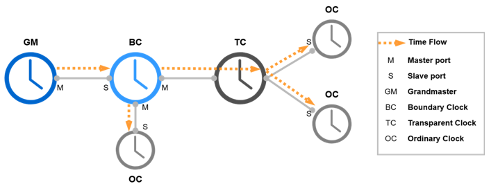
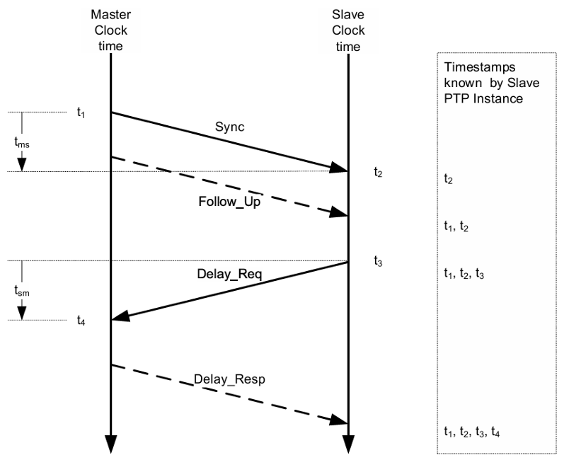
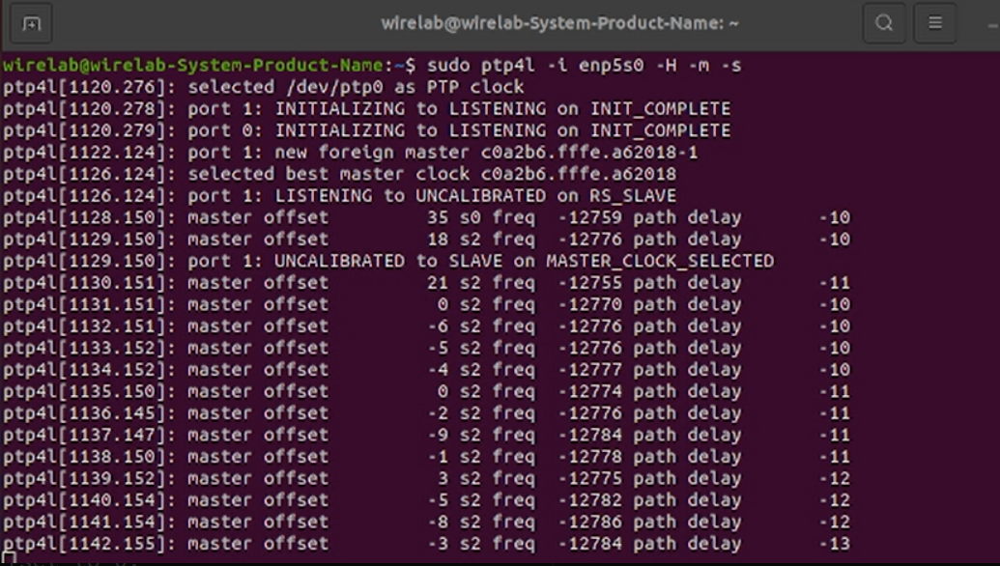

# Time Synchronization with Linux Precision Time Protocol
>[!NOTE]
> Author: Pei-Chi, Cheng
> Date: 2025/07/09
---

## Introduction 

Linux PTP (Precision Time Protocol) is a software suite designed to implement the IEEE 1588 precision time synchronization protocol on the Linux operating system, providing **high-accuracy time synchronization capabilities**. IEEE 1588 is primarily designed for applications that require microsecond or even nanosecond-level synchronization accuracy, such as industrial automation, communication networks (e.g., 5G time synchronization) and financial trading systems.

And it provides two main tools:
- `ptp4l`: A daemon that implements the PTP protocol and is responsible for coordinating and synchronizing time with other devices.
- `phc2sys`: A daemon that synchronizes the hardware clock (PHC) with the system clock to ensure consistent time at the system level.

The following show the relation between NIC, Linux PTP and system clock.


The package supports hardware timestamping and can achieve high synchronization accuracy when paired with PTP-capable NICs (such as the Intel® I210) and suitable drivers. Linux PTP enables reliable and efficient time synchronization on standard Linux systems.

## Difference between PTP, gPTP and NTP

**1. PTP (Precision Time Protocol)** is a high-precision time synchronization protocol capable of achieving microsecond to nanosecond-level accuracy, which defined by IEEE 1588. It is designed for environments that require strict time coordination, such as industrial automation and communication systems.

**2. gPTP (Generalized Precision Time Protocol)** is a profile of PTP and is optimized for Time-Sensitive Networking (TSN), it is defined by IEEE 802.1AS. It simplifies certain aspects of PTP to enable faster and more stable synchronization in local networks. gPTP also introduces the Grand Master election mechanism (BMCA), making it suitable for automotive and industrial TSN applications. For more details on TSN, refer to [Time-Sensitive Networking over 5G system - Introduction (Rel-16)](https://free5gc.org/blog/20230712/TSN/?h=time).

**3. NTP (Network Time Protocol)** is a general-purpose time synchronization protocol commonly used on the internet. It typically provides millisecond-level accuracy and is widely adopted in *servers* and *workstations*. However, its precision is lower than that of PTP, making it unsuitable for applications requiring very high accuracy.

In summary, PTP and gPTP offer much higher synchronization accuracy than NTP. gPTP is an optimized version of PTP for specific use cases, especially in local networks where high reliability and low-latency synchronization are essential.


## PTP Clock Roles 
Linux PTP operates in a hierarchical structure with different clock roles:
- **Grand Master Clock (GM):** The primary reference clock, selected via the Best Master Clock Algorithm (BMCA), provides the time source for the PTP domain.
- **Ordinary Clock (OC):** A single-port device that acts as either a master or slave, synchronizing to the GM or a higher-level clock.
- **Boundary Clock (BC):** A multi-port device that synchronizes to a master on one port and acts as a master to slaves on other ports.
- **Transparent Clock (TC):** A device that forwards PTP messages while compensating for residence time (the time a message spends in the device).



## PTP Mode and Message Exchange Steps
Linux PTP supports two synchronization modes:
- **One-Step Mode:** Timestamps are embedded directly in Sync messages.
- **Two-Step Mode:** Timestamps are sent in a separate Follow_Up message for higher accuracy.

The synchronization process involves five key message types:
**1. Announce Message**
- Purpose: Advertise clock properties and participate in the BMCA process.
- Sent by: Ordinary and Boundary Clocks.
- Content Includes:
    - Clock accuracy
    - Priority values (Priority1 and Priority2)
    - Clock class and identity
- Function: Enables BMCA to select the Grandmaster.

**2. Sync Message**
- Purpose: Transmit the current time (T1) from the Grandmaster to the Slave.
- Sent by: Grandmaster.
- Timestamp: T1 is recorded when the Sync message leaves the Grandmaster.

If the device is a 1-step clock, T1 is embedded directly in the Sync message.
If it is a 2-step clock, the timestamp T1 is sent later in a Follow_Up message.

**3. Follow_Up Message (for 2-step clocks)**
- Purpose: Provides the precise T1 timestamp for the Sync message
- Sent by: 2-step Grandmaster.
- Usage: Ensures slaves receive accurate transmission times.

**4. Delay_Req Message**
- Purpose: Measure path delay between Slave and Grandmaster.
- Sent by: Slave.
- Timestamp: T2 is recorded when Delay_Req leaves the Slave.

**5. Delay_Resp Message**
- Purpose: Reply to the Delay_Req with the exact time (T3) it was received.
- Sent by: Grandmaster.
- Content: Contains timestamp T3

Using these timestamps, the slave calculates:
- Mean Path Delay: `[(t2 - t1) + (t4 - t3)] / 2`
- Time offset: `[(t2 - t1) - (t4 - t3)] / 2`




## Setting Up Linux PTP
### 1. Checking System Requirements

#### Checking Network Interface Card (NIC)

To confirm if your system has a PTP-capable NIC (e.g., Intel® I210), use the following command in Ubuntu:
```
lspci | grep -i ethernet
```

If the NIC is exist, you should see output similar to:
```
02:00.0 Ethernet controller: Intel Corporation I210 Gigabit Network Connection (rev 03)
```

If no relevant output appears, verify your NIC and consider rebooting the system.

#### Checking Linux Kernel
In order to run Linux PTP, you need Linux kernel version 3.0 or newer. Check your kernel version with:
```
uname -r
```

And you will see something like:
```
5.15.0-106-generic
```

#### Checking Timestamping Support
Next, verify if your NIC supports PTP using:
```
ethtool -T <interface name>
```

This command displays the NIC’s timestamping capabilities. For example, hardware timestamping support might look like:
```
Time stamping parameters for eth6:
Capabilities:
        hardware-transmit     (SOF_TIMESTAMPING_TX_HARDWARE)
        software-transmit     (SOF_TIMESTAMPING_TX_SOFTWARE)
        hardware-receive      (SOF_TIMESTAMPING_RX_HARDWARE)
        software-receive      (SOF_TIMESTAMPING_RX_SOFTWARE)
        software-system-clock (SOF_TIMESTAMPING_SOFTWARE)
        hardware-raw-clock    (SOF_TIMESTAMPING_RAW_HARDWARE)
PTP Hardware Clock: 1
Hardware Transmit Timestamp Modes:
        off                   (HWTSTAMP_TX_OFF)
        on                    (HWTSTAMP_TX_ON)
Hardware Receive Filter Modes:
        none                  (HWTSTAMP_FILTER_NONE)
        all                   (HWTSTAMP_FILTER_ALL)
```

If only software timestamping is supported, the output may look like:
```
Time stamping parameters for enp6s0:
Capabilities:
        software-transmit     (SOF_TIMESTAMPING_TX_SOFTWARE)
        software-receive      (SOF_TIMESTAMPING_RX_SOFTWARE)
        software-system-clock (SOF_TIMESTAMPING_SOFTWARE)
PTP Hardware Clock: none
Hardware Transmit Timestamp Modes: none
Hardware Receive Filter Modes: none
```


### 2. Installing Linux PTP
To get Linux PTP, use the following command.
```
git clone http://git.code.sf.net/p/linuxptp/code linuxptp
cd linuxptp/
make
sudo make install
```


### 3. Synchronizing to PTP Hardware Clock (PHC)

For hardware timestamping, use the following commands:

**Master Side:**
```
sudo ptp4l -i <interface name> -H -m 
```

**Slave Side:**
```
sudo ptp4l -i <interface name> -H -m -s
```

- `-i` : Specifies the network interface.
- `-H` : Enables hardware timestamping.
- `-m` : Outputs synchronization messages to the terminal.
- `-s` : Designates the slave role.

Below is the result of master side and slave side:
**Master side(enp4s0):**


**Slave side (enp5s0):**


When `ptp4l` runs, the master side selects a local clock as the best master, while the slave side synchronizes to a foreign master. Clock status is indicated by `s0` (unlocked), `s1` (synchronizing), or `s2` (locked). Hardware timestamping typically achieves `s2` quickly, while software timestamping (using `-S` instead of `-H`) may show all states. 
If `ptp4l` consistently reports offsets below 100 ns, the PHC is synchronized.

### 4. Synchronizing to System Clock
To synchronize the PHC to the system clock, use `phc2sys` on master and slave sides:
```
sudo phc2sys -s <interface name> -c CLOCK_REALTIME -O 0 -m
```

- `-s` : Specifies the source network interface.
- `-c` : Sets the target clock (CLOCK_REALTIME is the Linux system clock).
- `-O 0` : Sets the offset to 0.
- `-m` : Outputs synchronization information to the terminal.

**Example output:**


If `phc2sys` consistently reports offsets below 100 ns, the system clock is synchronized.


## Conclusion
Linux PTP provides a robust solution for high-precision time synchronization, supporting microsecond to nanosecond accuracy for demanding applications. By leveraging PTP-capable hardware and the ptp4l and phc2sys tools, users can achieve reliable synchronization in environments like 5G networks and TSN systems. 

## Reference
- [Support of Time Sensitive Communication and Time Synchronization in 5G system - Introduction (Rel-17)](https://free5gc.org/blog/20230927/Support_of_Time_Sensitive_Communication_and_Time_Synchronization_in_5G_system_-_Introduction_%28Rel-17%29/?h=time)
- [Time-Sensitive Networking over 5G system - Introduction (Rel-16)](https://free5gc.org/blog/20230712/TSN/?h=time)
- [Chapter 15. Using Precision Time Protocol hardware | Red Hat Product Documentation](https://docs.redhat.com/en/documentation/openshift_container_platform/4.17/html/networking/using-precision-time-protocol-hardware)
- [linuxptp](https://github.com/richardcochran/linuxptp)
- [Synchronizing Time with Linux* PTP](https://tsn.readthedocs.io/timesync.html)
- [12 - 利用LinuxPTP进行时间同步(软/硬件时间戳) - 研一原创](https://blog.csdn.net/BUPTOctopus/article/details/86246335)

## About me 
Hi, I'm Peggy Cheng, a newcomer to 5G and the free5GC community. Feel free to tell me if there's any mistake in the article.

### Connect with Me
GitHub: [HiImPeggy](https://github.com/HiImPeggy)