# Flexible GTP-U Handling: A Userspace Implementation

> [!Note]
> Author: [Alonza Tu](https://www.linkedin.com/in/feng-tu-b91405345/)
> Date: 2025/07/23

---

## **Introduction**

In current open source RAN and UE simulators, the GTP-U function is usually implemented in kernel space. For example, [PacketRusher](https://github.com/HewlettPackard/PacketRusher) uses the [gtp5g](https://github.com/free5gc/gtp5g) kernel module to handle GTP packet forwarding.

However, if we want more flexible control over GTP-U, moving it to user space is a better choice. The goal of this project is to test the dynamic NR-DC feature in [free5GC](https://github.com/free5gc/free5gc). Although moving GTP-U to user space may incur some performance overhead, it offers greater flexibility for development and testing.

## **Overview**

Here is an example of the ICMP process, i.e., `ping`.

### Uplink

```mermaid
graph LR
    UE_Kernel(["<b>UE Kernel</b><br/>ping 8.8.8.8"])
    TUN(["<b>TUN<br/>ueTun0</b>"])
    UE_Sim(["<b>UE Simulator</b>"])
    RAN_Sim(["<b>RAN Simulator</b>"])
    UPF(["<b>UPF</b><br/>UDP 2152"])

    UE_Kernel -.->|"ICMP Packet"| TUN
    TUN -- "User Data" --> UE_Sim
    UE_Sim -- "TCP" --> RAN_Sim
    RAN_Sim -- "Encapsulate GTP-U <br/> with TEID" --> UPF

    %% 樣式美化
    classDef kernel fill:#e3f2fd,stroke:#1976d2,stroke-width:2px;
    classDef tun fill:#fffde7,stroke:#fbc02d,stroke-width:2px;
    classDef sim fill:#e8f5e9,stroke:#388e3c,stroke-width:2px;
    classDef ran fill:#f3e5f5,stroke:#8e24aa,stroke-width:2px;
    classDef gtpu fill:#fbe9e7,stroke:#d84315,stroke-width:2px;
    classDef upf fill:#ede7f6,stroke:#5e35b1,stroke-width:2px;

    class UE_Kernel kernel;
    class TUN tun;
    class UE_Sim sim;
    class RAN_Sim ran;
    class GTPU gtpu;
    class UPF upf;
```



1. Create a TUN device in the UE to serve as a virtual network interface for user traffic.
2. The UE reads packets from the TUN device in user space and sends them to the RAN simulator via TCP.
3. The RAN simulator receives the data from the UE and encapsulates the packets as GTP-U packets with the assigned TEID.
4. The RAN simulator sends the encapsulated GTP-U packets to the UPF over UDP (port 2152).

### Downlink

```mermaid
graph LR
  UPF(["<b>UPF</b><br/>UDP 2152"])
  RAN_Sim(["<b>RAN Simulator</b>"])
  UE_Sim(["<b>UE Simulator</b>"])
  TUN(["<b>TUN<br/>ueTun0</b>"])
  UE_Kernel(["<b>UE Kernel</b><br/>ping reply"])

  UPF -- "GTP-U Packet" --> RAN_Sim
  RAN_Sim -- "Decapsulate GTP-U<br/>with TEID" --> UE_Sim
  UE_Sim -- "User Data" --> TUN
  TUN -.->|"ICMP Reply"| UE_Kernel

  %% 樣式美化
  classDef upf fill:#ede7f6,stroke:#5e35b1,stroke-width:2px;
  classDef ran fill:#e3f2fd,stroke:#1976d2,stroke-width:2px;
  classDef sim fill:#e8f5e9,stroke:#388e3c,stroke-width:2px;
  classDef tun fill:#fffde7,stroke:#fbc02d,stroke-width:2px;
  classDef kernel fill:#f3e5f5,stroke:#8e24aa,stroke-width:2px;

  class UPF upf;
  class RAN_Sim ran;
  class UE_Sim sim;
  class TUN tun;
  class UE_Kernel kernel;
```



1. When the UPF has data to send to the UE, it encapsulates the data into a GTP-U packet and sends it via UDP (port 2152) to the RAN simulator.
2. The RAN simulator receives the GTP-U packet, decapsulates it based on the TEID, and forwards the original IP packet to the corresponding UE.
3. The UE simulator receives the packet in user space and writes the raw packet into the TUN device.
4. The UE kernel processes the packet and generates a response (e.g., ping reply).

## **Implementation**

To describe the implementation, we will separate the infrastructure into UE and RAN components.

> [!Important]
> The connections mentioned here only consider the **data plane**.

### At UE

After the PDU session establishment procedure, the UE will receive configuration messages, including the UE IP address.

#### Bring up a network device in kernel space

This network device will act as an entry point for user traffic from kernel space to user space. We use the [water](https://github.com/songgao/water) library to create and manage TUN devices.

1. Using the [water](https://github.com/songgao/water) library to bring up a network device:

    ```go
    tunCfg := water.Config{ DeviceType: water.TUN }
    tunCfg.Name = ueTunnelDeviceName
    ```

2. Set up the device with UE IP:

    ```go
    cmds := [][]string{
      {"ip", "addr", "add", fmt.Sprintf("%s/32", ip), "dev", ueTunnelDeviceName},
      {"ip", "link", "set", "dev", ueTunnelDeviceName, "up"},
    }

    for _, cmd := range cmds {
      if err := exec.Command(cmd[0], cmd[1:]...).Run(); err != nil {
        return nil, fmt.Errorf("error bringing up tunnel device: %v", err)
      }
    }
    ```

#### Set up packet forwarding channels

Here we will set up two channels to transmit packets between the **READER** and **TRANSMITTER**.

1. Uplink (read from tunnel device and send to RAN):

    ```go
    u.readFromTun = make(chan []byte)
    go func() {
      buffer := make([]byte, 4096)
      for {
        n, err := ueTunnelDevice.Read(buffer)
        if err != nil {
          return
        }
        u.readFromTun <- buffer[:n]
      }
    }()
    ```

2. Downlink (receive from RAN and write to tunnel device):

    ```go
    u.readFromRan = make(chan []byte)
    go func() {
      buffer := make([]byte, 4096)
      for {
        n, err := u.ranDataPlaneConn.Read(buffer)
        if err != nil {
          if errors.Is(err, net.ErrClosed) {
            return
          }
          return
        }
        u.readFromRan <- buffer[:n]
      }
    }()
    ```

#### Data plane packet handler (transmit packets between TUN and RAN)

Using `select` statement with for loops to handle bidirectional traffic.

```go
for {
    select {
    case buffer := <-u.readFromTun:
        n, err := u.ranDataPlaneConn.Write(buffer)
        if err != nil {
            if errors.Is(err, net.ErrClosed) {
                return
            }
        }
    case buffer := <-u.readFromRan:
        n, err := u.ueTunnelDevice.Write(buffer)
        if err != nil {
          return
        }
    }
}
```

### At RAN

The RAN will maintain a **MAP** for mapping each TEID to its corresponding UE connection.

#### Uplink (RAN receives packets from UE and formats them as GTP packets for sending to UPF)

1. RAN continuously reads from the UE connection and formats the packet as a GTP packet:

    ```go
    buffer, gtpChannel := make([]byte, 4096), make(chan []byte)
    for {
        n, err := ueDataPlaneConn.Read(buffer)
        if err != nil {
            if errors.Is(err, net.ErrClosed) || errors.Is(err, io.EOF) {
                return
            }
        }

        tmp := make([]byte, n)
        copy(tmp, buffer[:n])
        go formatGtpPacketAndWriteToGtpChannel(ulTeidBytes, tmp, g.gtpChannel, g.GnbLogger)
    }
    ```

2. RAN formats a GTP header with the corresponding TEID and encapsulates it in front of the original packet. Then this GTP packet will be written to the gtpChannel for later transmission:

    ```go
    gtpHeader := make([]byte, 12)

    gtpHeader[0] = 0x32
    gtpHeader[1] = 0xff
    binary.BigEndian.PutUint16(gtpHeader[2:], uint16(len(packet)+4))
    copy(gtpHeader[4:], teid)
    gtpHeader[8], gtpHeader[9], gtpHeader[10], gtpHeader[11] = 0x00, 0x00, 0x00, 0x00

    gtpPacket := append(gtpHeader, packet...)
    gtpChannel <- gtpPacket
    ```

3. RAN reads GTP packets from gtpChannel and sends them to UPF (N3 Connection):

    ```go
    for {
        select {
        case <-ctx.Done():
            return
        case packet := <-gtpChannel:
            n, err := n3Conn.Write(packet)
            if err != nil {
              return
            }
        }
    }
    ```

#### Downlink (RAN receives packets from UPF and removes their GTP header for sending to UE)

1. Receive the GTP packet from N3 connection and pass the packet to the forward function:

    ```go
    for {
        n, err := n3Conn.Read(buffer)
        if err != nil {
            if errors.Is(err, net.ErrClosed) {
                return
            }
        }
        go forwardPacketToUe(buffer[:n], teidToConn, gnbLogger)
    }
    ```

2. Parse the GTP packet and forward to the UE connection by TEID (from **MAP**):

    ```go
    teid, payload, err := parseGtpPacket(gtpPacket)
    if err != nil {
        return
    }

    conn, found := teidToConn.Load(teid)
    if !found {
        return
    }

    n, err := conn.(net.Conn).Write(payload)
    if err != nil {
      return
    }
    ```

3. GTP packet parsing function:

    ```go
    func parseGtpPacket(gtpPacket []byte) (string, []byte, error) {
        basicHeader, headerLength := gtpPacket[:8], 8
        pduSessionType, pduSessionLength := byte(0x85), 2

        if basicHeader[0]&0x02 != 0 {
            headerLength += 3
        }

        for {
            if gtpPacket[headerLength] == 0x00 {
                headerLength += 1
                break
            } else {
                switch gtpPacket[headerLength] {
                case pduSessionType:
                    extensionHeaderLength := gtpPacket[headerLength+1]
                    headerLength += 2
                    headerLength += int(extensionHeaderLength) * pduSessionLength
                default:
                    return "", nil, fmt.Errorf("unknown GTP extension header type: %d", gtpPacket[headerLength])
                }
            }
        }

        return hex.EncodeToString(basicHeader[4:]), gtpPacket[headerLength:], nil
    }
    ```

## **Conclusion**

This document presents a comprehensive design for implementing GTP-U functionality in user space, providing greater flexibility for testing and development purposes, particularly for dynamic NR-DC features in free5GC. The implementation separates concerns between UE and RAN components, with clear packet forwarding mechanisms for both uplink and downlink traffic.

The key benefits of this approach include:

- Enhanced control over GTP-U packet processing
- Better debugging and monitoring capabilities
- Easier integration with test frameworks
- Flexibility in implementing custom GTP-U behaviors

While there may be some performance overhead compared to kernel-space implementations, the gained flexibility makes this approach valuable for research and development scenarios.

## Reference

If you want more detailed information, please refer to the links below for the complete RAN/UE simulator implementation.

- [free-ran-ue offcial wesite](https://alonza0314.github.io/free-ran-ue/)
- [free-ran-ue github](https://github.com/alonza0314/free-ran-ue)

## About me

Hi, I'm Alonza, a core network developer currently contributing to the free5GC project. I am also working on the development of [free-ran-ue](https://alonza0314.github.io/free-ran-ue/), a userspace RAN/UE simulator. If you have any ideas or would like to collaborate, feel free to reach out!

## Connect with me

- GitHub: [https://github.com/Alonza0314](https://github.com/Alonza0314)
- Website: [Alonza0314](https://alonza0314.github.io/)
- LinkedIn: [Alonza Tu](https://www.linkedin.com/in/feng-tu-b91405345/)
