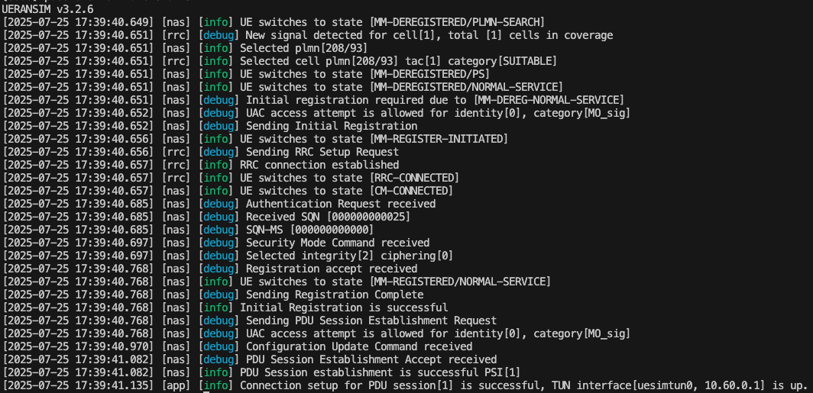

# Improving Network Performance with Custom eBPF-based Schedulers

>[!NOTE]
> Author: [Ian Chen](https://www.linkedin.com/in/ian-chen-88b70b1aa/)
> Date: 2025/07/26
---

Linux Kernel has supported sched_ext since v6.12, which allows users to define custom CPU schedulers through eBPF programs. This feature enables developers to create more flexible and efficient scheduling strategies to meet specific performance requirements.
Inspired by the scx project and drawing on concepts from [scx_rustland](https://github.com/sched-ext/scx/tree/main/scheds/rust/scx_rustland), I have implemented a framework called [scx_goland_core](https://github.com/Gthulhu/scx_goland_core) that allows developers to write custom schedulers using the golang language.

## Potential Integration of scx with 5G Domain

There have been some discussions about the integration of 5G and scx [[1]](https://free5gc.org/blog/20250305/20250305/) [[2]](https://free5gc.org/blog/20250509/20250509/) [[3]](https://lwn.net/Articles/1027096/). However, considering the characteristics of modern Cloud-Native Apps (5G Core Network), there are currently no case studies exploring how scx operates in cloud-native architectures.

*Figure 1: API Architecture*

To address this, I propose an initial concept - a custom scheduler called [Gthulhu](https://gthulhu.github.io/docs/) developed based on the scx_goland_core framework, which can run in cloud-native environments. It can be deployed in Kubernetes clusters to manage scheduling strategies for a large number of nodes through deployment methods.

We can set scheduling strategies through Restful API to the Gthulhu API server, which helps us identify workloads that need adjustment. Meanwhile, Gthulhu sends heartbeat messages to the API server periodically and updates scheduling strategies when necessary.

> For detailed information about Gthulhu, please refer to [Gthulhu Docs](https://gthulhu.github.io/docs/how-it-works.en/).

## A Quick Test: Observing Performance Differences in the Data Layer After Loading Gthulhu

In this experiment, my machine was running Ubuntu 24.04 LTS with Linux Kernel 6.12. The purpose was to observe the impact of Gthulhu on data layer performance after loading.

The test environment was as follows:

- VM1 (Ubuntu 24.04 LTS, Linux Kernel 6.12)
    - Deployed free5GC v4.0.1
- VM2 (Ubuntu 20.04 LTS, Linux Kernel 5.4.0)
    - Deployed UERANSIM

After establishing the PDU Session, I used the `ping` tool to test the UPF N6 interface and observed the latency changes before and after loading Gthulhu.

Before loading, Linux's default scheduler was EEVDF, with RTT parameters as follows:

- rtt min = 1.263 ms
- rtt avg = 1.907 ms
- rtt max = 6.405 ms
- rtt mdev = 0.657 ms

After loading Gthulhu, the RTT parameters changed to:

- rtt min = 1.222 ms
- rtt avg = 1.864 ms
- rtt max = 3.771 ms
- rtt mdev = 0.433 ms

As can be seen, after loading Gthulhu, both the average and maximum RTT values decreased, demonstrating that Gthulhu indeed helps reduce latency in data layer scheduling.

## Conclusion

5G introduced the concept of network slicing, which aims to provide different quality of service by dividing physical networks into multiple virtual networks. With custom schedulers like Gthulhu, we can more flexibly manage and optimize the performance of these virtual networks, deploy UPFs with different business requirements on different nodes, and adjust scheduling strategies according to actual needs.

## About the Author

Ian Chen is a developer passionate about open-source technologies, focusing on research in 5G and cloud-native architectures. He initiated the [Gthulhu](https://gthulhu.github.io/docs/) project and is also a major contributor to free5GC, dedicated to promoting and implementing open-source solutions for 5G networks.
