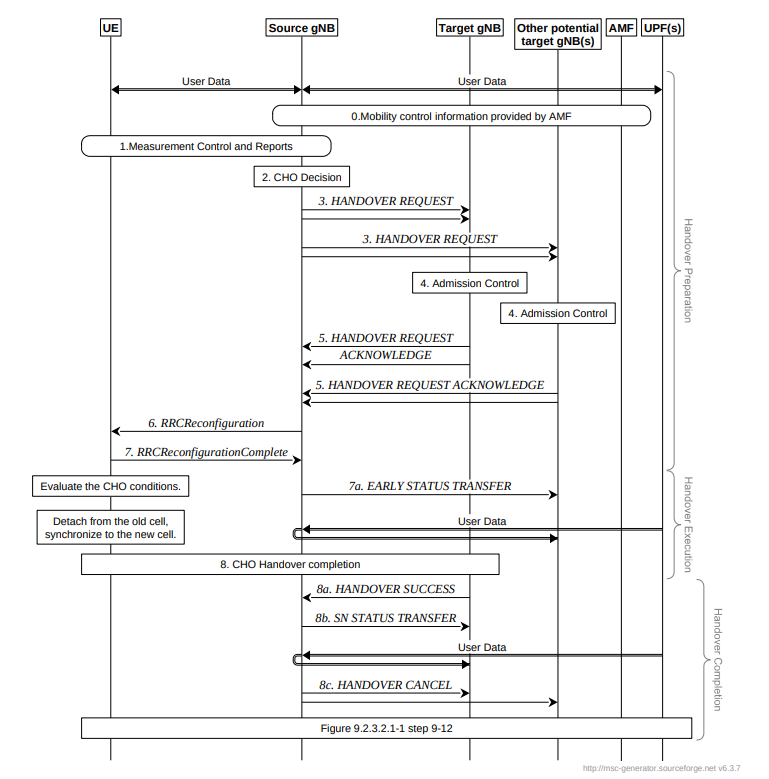

# Handover in Non-Terrestrial Networks
>[!NOTE]
> Author: Yung-Hsuan, Tsao
> Date: 2025/09/03
---

As 5G evolves toward global connectivity, Non-Terrestrial Networks (NTN) have become a key enabler for extending mobile services beyond the reach of traditional terrestrial infrastructure. By leveraging satellites—particularly Low Earth Orbit (LEO) constellations—and high-altitude platforms, NTN promises to deliver coverage in remote, rural, and maritime regions where deploying ground-based base stations is impractical or economically unfeasible.

One of the most critical challenges in NTN integration is handover (HO), which allows a user device (UE) to maintain an ongoing session while moving across different cells, satellites, or between terrestrial and non-terrestrial domains. Unlike conventional terrestrial handover, NTN handover is complicated by rapid satellite movement, longer propagation delays, Doppler effects, and frequent service beam changes. These characteristics demand new approaches to mobility management within the 5G Core (5GC) and Radio Access Network (RAN).

This blog explores how NTN handover works, why it fundamentally differs from terrestrial scenarios, and what technical solutions are emerging to ensure seamless mobility across the sky and ground.

## Why Handover is Different in NTN

Handover in terrestrial 5G networks is already a complex process, but in NTN it becomes significantly more challenging due to the unique characteristics of satellite communication.

- **Satellite Mobility:** LEO satellites orbit the Earth in about 90–120 minutes, so a UE may need to switch satellites every few minutes, resulting in widespread handover events compared to terrestrial networks.
- **Doppler Effect:** High relative velocities cause large Doppler shifts, complicating synchronization and stability during HO.
- **Backhaul Constraints:** Satellite feeder links may be capacity-limited or weather-dependent, influencing HO reliability.

In short, NTN handover requires adaptations in mobility management, timing, and signaling beyond terrestrial assumptions.

## Types of NTN Handover

Handover can occur at different levels depending on the network topology and user movement to ensure seamless mobility in Non-Terrestrial Networks. The main categories are:

**1. Intra-Satellite Handover**
Occurs when UE switches between beams of the same satellite. Common in spot-beam architectures, where a single satellite projects multiple coverage areas to increase capacity. Like handovers in terrestrial networks, beam transitions are often more frequent due to satellite footprint movement.

**2. Inter-Satellite Handover**
Happens when the UE transitions from one satellite to another. Particularly frequent in LEO constellations, where satellites have fast-moving orbits and limited visibility duration. Coordinating between the NTN gateway, 5GC, and the Radio Access Network (RAN) is required to maintain session continuity.

**3. NTN to TN Handover**
A UE may move between terrestrial 5G and NTN coverage in hybrid deployments. This handover ensures service continuity when users travel from urban areas (dense terrestrial cells) to remote regions (served by satellites)—often considered one of the most challenging scenarios because of significant differences in latency, Doppler, and scheduling strategies.

## Conditional Handover

Unlike traditional handovers where the source gNB immediately triggers a switch, Conditional Handover (CHO) allows the UE to pre-receive handover configurations and execute the switch autonomously when certain conditions are met (e.g., signal quality, timing, or position). This is particularly useful in NTN scenarios, where fast-moving LEO satellites cause frequent changes in serving cells.

- [2] The source gNB requests CHO for one or more candidate cells belonging to one or more candidate gNBs.
- [3-4] A CHO request message is sent for each candidate cell. Candidate gNBs provide CHO responses with configurations of possible target cells.
- [5] The source gNB delivers these candidate cell configurations and execution conditions to the UE.
- [6] The UE acknowledges and stores them while staying connected to the source gNB.
- [7a-8] When one of the candidate cells meets the CHO condition, the UE independently detaches from the source gNB and completes handover to the selected target gNB.

Any unused candidate configurations are discarded once the handover is successful.

### Key Benefits for NTN

- **Reduced Interruption:** UE doesn’t wait for back-and-forth signaling at handover.
- **Resilience to Delay:** Useful in satellite links where RTT is higher than in terrestrial links.
- **Frequent HO Handling:** Helps mitigate the overhead caused by rapid satellite movement (handover every few minutes in LEO).

## NTN Handover in the 5G Core Architecture

### Control Plane Perspective

From the control plane perspective, NTN handover is primarily orchestrated by the 5G Core:

- AMF (Access and Mobility Management Function)
    - Manages UE registration, context transfer, and mobility events.
    - Handles signaling for HO requests and target cell selection.
- SMF (Session Management Function)
    - Ensures session continuity by managing PDU session contexts during path switches.
    - Coordinates with the UPF to redirect data flows post-handover.
- NG-RAN Integration
    - gNBs (or TNGF for satellite access) report measurement events and initiate HO procedures.
    - Control-plane signaling is adapted to cope with higher delays and Doppler effects.

The key challenge is ensuring UE context transfer happens fast enough to prevent session drops despite long propagation delays.

### Data Plane Perspective

On the data plane, the **UPF** plays a crucial role in maintaining uninterrupted user traffic flow:

- Path Switch Procedure: When the serving gNB changes (e.g., due to inter-satellite HO), the UPF must update its forwarding path.
- Session Anchoring: New UPFs may be selected to optimize latency or resource use.
- Latency Considerations: With satellite backhaul, rerouting packets through different gateways introduces additional delay. Efficient path switching is essential to minimize service interruption.

## Conclusion

NTN handover is more than a simple extension of terrestrial mobility procedures—it represents one of the core challenges of integrating satellites into the 5G system. With satellites rushing, introducing high delays, and demanding frequent beam or satellite switches, mobility management must evolve to ensure seamless global coverage.

Looking ahead, a combination of predictive algorithms, smarter session anchoring, and advanced multi-connectivity strategies will be essential for achieving reliable NTN handovers. As 5G moves toward 6G, seamless mobility across space and ground will be a defining feature of next-generation connectivity.

## Reference

- [TS 38.300](https://www.etsi.org/deliver/etsi_ts/138300_138399/138300/18.01.00_60/ts_138300v180100p.pdf)
- [3GPP Release 18](https://www.3gpp.org/specifications-technologies/releases/release-18)

## About
Hi, I'm Yung-Hsuan! A newcomer to 5G and the free5GC community. Let me know without hesitation if there is any mistake in the article.

### Connect with Me

- GitHub: [https://github.com/reki9185](https://github.com/reki9185)