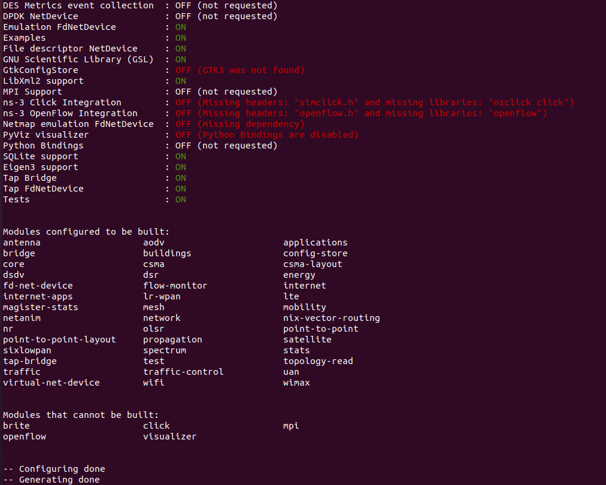
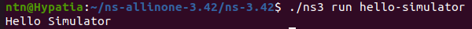
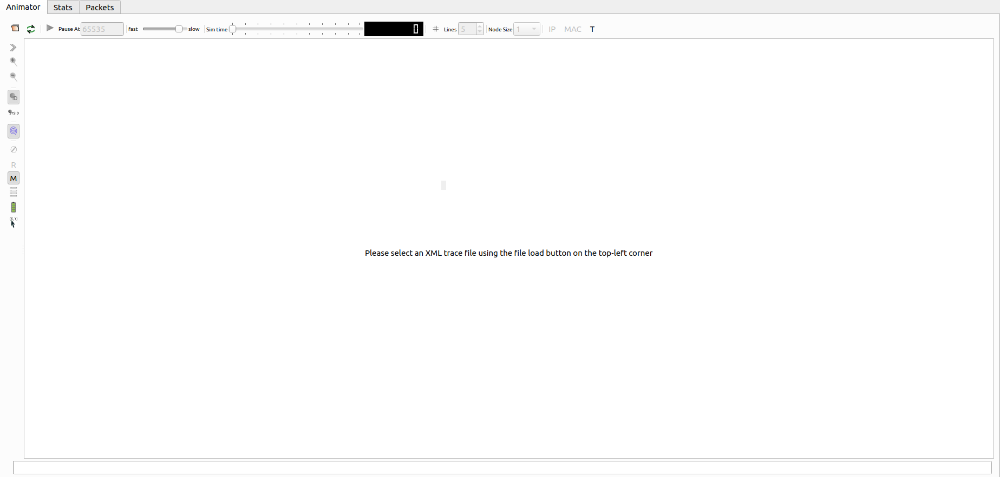
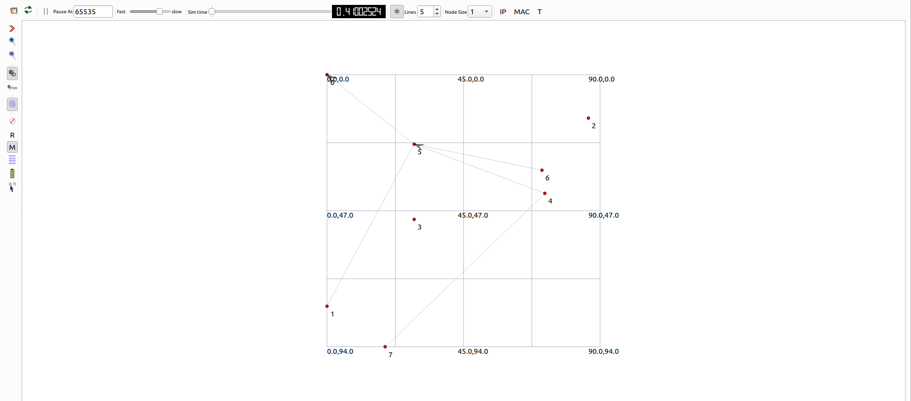
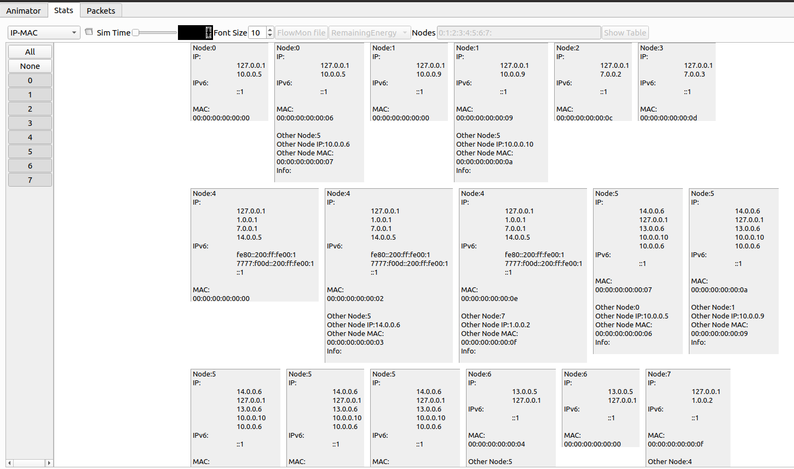
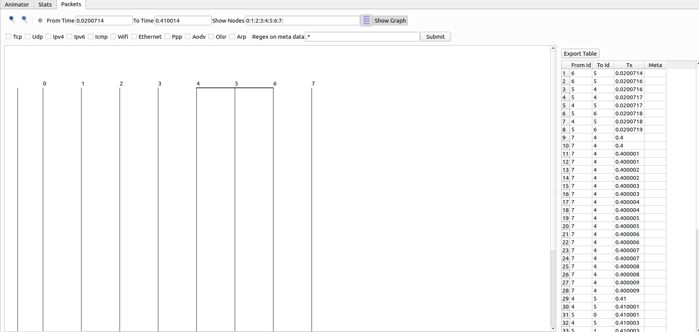

# Getting Started with ns-3: A Guide to Network Simulation and 5G Modeling
>[!NOTE]
> Author: Pei-Chi, Cheng
> Date: 2025/10/08
---

## 1. Introduction 
ns-3 is a discrete-event network simulator designed primarily for academic research and education. Unlike network emulation tools that mimic real-world networks, ns-3 focuses on simulating network behavior in a controlled, virtual environment. It is widely used to study network protocols, evaluate performance, and test network designs.

### What is Discrete-Event Simulation?
Discrete-event simulation processes events (e.g., packet transmission, node movement) at specific time points, making it efficient for modeling complex network scenarios without continuous computation.

### Key Features 
- Modular Design: ns-3 is highly modular, allowing users to customize and extend its functionality.
- Protocol Support: Supports a wide range of protocols including IPv4/IPv6, TCP/UDP, LTE/5G, Wi-Fi, and more.
- Event-Driven: Operates as a discrete-event simulator, processing events in a time-based sequence.
- Programming APIs: Provides APIs for both C++ and Python, catering to different user preferences.

### Use Cases
- Researching and developing network protocols.
- Designing and testing network topologies.
- Simulating wireless, satellite, or mobile networks.
- Educational demonstrations for networking concepts.

## 2. Installation and Environment Setup
### System Requirements
ns-3 is primarily developed for Linux environments, with Ubuntu being the most commonly used platform. Required tools include:

- g++: C++ compiler.
- Python: For scripting and PyBind support.
- CMake: For build configuration.
- Additional dependencies like libxml2, sqlite, and others may be needed depending on modules.

### Installation Steps
#### Step 1: Install Dependencies:
```
sudo apt update
sudo apt install -y git g++ python3 python3-dev \
  cmake ninja-build pkg-config sqlite3 \
  libsqlite3-dev libboost-all-dev \
  libgsl-dev libgtk-3-dev
```

#### Step 2: Download ns-3 Source Code (using version 3.42 as an example)
```
wget https://www.nsnam.org/releases/ns-allinone-3.42.tar.bz2
tar xfj ns-allinone-3.42.tar.bz2
cd ns-allinone-3.42/ns-3.42
```

#### Step 3: Configure and Build:
```
./ns3 configure --enable-examples --enable-tests
./ns3 build
```

Upon successful compilation, the terminal will display the configured modules, indicating which packages are included in your ns-3 simulator.



#### Step 4: Verify Installation:
Run a sample program to confirm the setup:
```
./ns3 run hello-simulator
```
A successful run will produce output confirming the simulator is operational.


#### macOS Installation Notes
For macOS, install dependencies using Homebrew:
```
brew install git python3 cmake ninja pkg-config sqlite boost gsl gtk+3
```
For Windows, use WSL2 with Ubuntu or a Docker container.

## 3. Understanding ns-3 Directory Structure
To navigate ns-3 effectively, understanding its directory structure is crucial. Below are key folders and their purposes:

| Directory   | Description                                               |
| ----------- | --------------------------------------------------------- |
| `scratch/`  | User-written test scripts for quick experiments           |
| `examples/` | Official example programs demonstrating built-in features |
| `src/`      | Core protocol modules (e.g., Wi-Fi, LTE, TCP/IP stack)    |
| `utils/`    | Utility tools for trace analysis and data collection      |
| `contrib/`  | Community-contributed extensions (e.g., 5G LENA)          |
| `build/`    | Compiled binaries and output files                        |


## 4. Compiling and Running Simulations
### Running a Scratch Program
To execute a user-written script (e.g., mytest) in the `scratch/` directory:
```
./ns3 run scratch/mytest
```
Note: In older ns-3 versions, use `./waf` instead of `./ns3`:
```
./waf run scratch/mytest
```

### Running an Example
To execute an official example:
```
./ns3 run examples/tutorial/first.cc
```

### Adding Parameters
Pass custom parameters to simulations:
```
./ns3 run "scratch/mytest --param=5 --duration=10s"
```

## 5. Example: The 3GPP Channel Model Simulation
### Overview
The `cttc-3gpp-channel-example.cc` from the 5G LENA module simulates a 5G NR network with:

- RemoteHost: Sends UDP traffic to user equipment (UEs).
- PGW: Connects UEs to the external network.
- gNB1, gNB2: 5G base stations.
- UE1, UE2: User equipment nodes.

The simulation configures:

- 3GPP TR 38.901 channel model.
- Antennas, beamforming, and TDMA-RR scheduler.
- UDP downlink traffic (10 packets per UE).

The TR 38.901 model provides realistic channel characteristics for 5G, supporting scenarios like:

- UMa (Urban Macro): High base stations in urban areas.
- RMa (Rural Macro): Wide coverage in rural settings.
- UMi-StreetCanyon: Urban street-level environments.

### Code Example
Below is the core code for `cttc-3gpp-channel-example.cc`. It leverages ns-3 Helper classes to simplify the setup of complex network components.

```c++
// Copyright (c) 2019 Centre Tecnologic de Telecomunicacions de Catalunya (CTTC)
//
// SPDX-License-Identifier: GPL-2.0-only

/**
 * \file cttc-3gpp-channel-example.cc
 * \ingroup examples
 * \brief Channel Example
 *
 * This example describes how to setup a simulation using the 3GPP channel model
 * from TR 38.901. Topology consists by default of 2 UEs and 2 gNbs, and can be
 * configured to be either mobile or static scenario.
 *
 * The output of this example are default NR trace files that can be found in
 * the root ns-3 project folder.
 */

#include "ns3/applications-module.h"
#include "ns3/config-store.h"
#include "ns3/core-module.h"
#include "ns3/internet-module.h"
#include "ns3/ipv4-global-routing-helper.h"
#include "ns3/log.h"
#include "ns3/mobility-module.h"
#include "ns3/nr-helper.h"
#include "ns3/nr-mac-scheduler-tdma-rr.h"
#include "ns3/nr-module.h"
#include "ns3/nr-point-to-point-epc-helper.h"
#include "ns3/point-to-point-helper.h"
#include <ns3/antenna-module.h>
#include <ns3/buildings-helper.h>
#include "ns3/netanim-module.h"

using namespace ns3;

int
main(int argc, char* argv[])
{
    std::string scenario = "UMa"; // scenario
    double frequency = 28e9;      // central frequency
    double bandwidth = 100e6;     // bandwidth
    double mobility = false;      // whether to enable mobility
    double simTime = 1;           // in second
    double speed = 1;             // in m/s for walking UT.
    bool logging = true; // whether to enable logging from the simulation, another option is by
                         // exporting the NS_LOG environment variable
    double hBS;          // base station antenna height in meters
    double hUT;          // user antenna height in meters
    double txPower = 40; // txPower
    enum BandwidthPartInfo::Scenario scenarioEnum = BandwidthPartInfo::UMa;

    CommandLine cmd(__FILE__);
    cmd.AddValue("scenario",
                 "The scenario for the simulation. Choose among 'RMa', 'UMa', 'UMi-StreetCanyon', "
                 "'InH-OfficeMixed', 'InH-OfficeOpen'.",
                 scenario);
    cmd.AddValue("frequency", "The central carrier frequency in Hz.", frequency);
    cmd.AddValue("mobility",
                 "If set to 1 UEs will be mobile, when set to 0 UE will be static. By default, "
                 "they are mobile.",
                 mobility);
    cmd.AddValue("logging", "If set to 0, log components will be disabled.", logging);
    cmd.Parse(argc, argv);

    // enable logging
    if (logging)
    {
        // LogComponentEnable ("ThreeGppSpectrumPropagationLossModel", LOG_LEVEL_ALL);
        LogComponentEnable("ThreeGppPropagationLossModel", LOG_LEVEL_ALL);
        // LogComponentEnable ("ThreeGppChannelModel", LOG_LEVEL_ALL);
        // LogComponentEnable ("ChannelConditionModel", LOG_LEVEL_ALL);
        // LogComponentEnable ("UdpClient", LOG_LEVEL_INFO);
        // LogComponentEnable ("UdpServer", LOG_LEVEL_INFO);
        // LogComponentEnable ("NrRlcUm", LOG_LEVEL_LOGIC);
        // LogComponentEnable ("NrPdcp", LOG_LEVEL_INFO);
    }

    /*
     * Default values for the simulation. We are progressively removing all
     * the instances of SetDefault, but we need it for legacy code (LTE)
     */
    Config::SetDefault("ns3::NrRlcUm::MaxTxBufferSize", UintegerValue(999999999));

    // set mobile device and base station antenna heights in meters, according to the chosen
    // scenario
    if (scenario == "RMa")
    {
        hBS = 35;
        hUT = 1.5;
        scenarioEnum = BandwidthPartInfo::RMa;
    }
    else if (scenario == "UMa")
    {
        hBS = 25;
        hUT = 1.5;
        scenarioEnum = BandwidthPartInfo::UMa;
    }
    else if (scenario == "UMi-StreetCanyon")
    {
        hBS = 10;
        hUT = 1.5;
        scenarioEnum = BandwidthPartInfo::UMi_StreetCanyon;
    }
    else if (scenario == "InH-OfficeMixed")
    {
        hBS = 3;
        hUT = 1;
        scenarioEnum = BandwidthPartInfo::InH_OfficeMixed;
    }
    else if (scenario == "InH-OfficeOpen")
    {
        hBS = 3;
        hUT = 1;
        scenarioEnum = BandwidthPartInfo::InH_OfficeOpen;
    }
    else
    {
        NS_ABORT_MSG("Scenario not supported. Choose among 'RMa', 'UMa', 'UMi-StreetCanyon', "
                     "'InH-OfficeMixed', and 'InH-OfficeOpen'.");
    }

    // create base stations and mobile terminals
    NodeContainer gnbNodes;
    NodeContainer ueNodes;
    gnbNodes.Create(2);
    ueNodes.Create(2);
    
    // position the base stations
    Ptr<ListPositionAllocator> gnbPositionAlloc = CreateObject<ListPositionAllocator>();
    gnbPositionAlloc->Add(Vector(0.0, 0.0, hBS));
    gnbPositionAlloc->Add(Vector(0.0, 80.0, hBS));
    MobilityHelper gnbMobility;
    gnbMobility.SetMobilityModel("ns3::ConstantPositionMobilityModel");
    gnbMobility.SetPositionAllocator(gnbPositionAlloc);
    gnbMobility.Install(gnbNodes);

    // position the mobile terminals and enable the mobility
    MobilityHelper uemobility;
    uemobility.SetMobilityModel("ns3::ConstantVelocityMobilityModel");
    uemobility.Install(ueNodes);

    if (mobility)
    {
        ueNodes.Get(0)->GetObject<MobilityModel>()->SetPosition(
            Vector(90, 15, hUT)); // (x, y, z) in m
        ueNodes.Get(0)->GetObject<ConstantVelocityMobilityModel>()->SetVelocity(
            Vector(0, speed, 0)); // move UE1 along the y axis

        ueNodes.Get(1)->GetObject<MobilityModel>()->SetPosition(
            Vector(30, 50.0, hUT)); // (x, y, z) in m
        ueNodes.Get(1)->GetObject<ConstantVelocityMobilityModel>()->SetVelocity(
            Vector(-speed, 0, 0)); // move UE2 along the x axis
    }
    else
    {
        ueNodes.Get(0)->GetObject<MobilityModel>()->SetPosition(Vector(90, 15, hUT));
        ueNodes.Get(0)->GetObject<ConstantVelocityMobilityModel>()->SetVelocity(Vector(0, 0, 0));

        ueNodes.Get(1)->GetObject<MobilityModel>()->SetPosition(Vector(30, 50.0, hUT));
        ueNodes.Get(1)->GetObject<ConstantVelocityMobilityModel>()->SetVelocity(Vector(0, 0, 0));
    }

    /*
     * Create NR simulation helpers
     */
    Ptr<NrPointToPointEpcHelper> nrEpcHelper = CreateObject<NrPointToPointEpcHelper>();
    Ptr<IdealBeamformingHelper> idealBeamformingHelper = CreateObject<IdealBeamformingHelper>();
    Ptr<NrHelper> nrHelper = CreateObject<NrHelper>();
    nrHelper->SetBeamformingHelper(idealBeamformingHelper);
    nrHelper->SetEpcHelper(nrEpcHelper);

    /*
     * Spectrum configuration. We create a single operational band and configure the scenario.
     */
    BandwidthPartInfoPtrVector allBwps;
    CcBwpCreator ccBwpCreator;
    const uint8_t numCcPerBand = 1; // in this example we have a single band, and that band is
                                    // composed of a single component carrier

    /* Create the configuration for the CcBwpHelper. SimpleOperationBandConf creates
     * a single BWP per CC and a single BWP in CC.
     *
     * Hence, the configured spectrum is:
     *
     * |---------------Band---------------|
     * |---------------CC-----------------|
     * |---------------BWP----------------|
     */
    CcBwpCreator::SimpleOperationBandConf bandConf(frequency,
                                                   bandwidth,
                                                   numCcPerBand,
                                                   scenarioEnum);
    OperationBandInfo band = ccBwpCreator.CreateOperationBandContiguousCc(bandConf);
    // Initialize channel and pathloss, plus other things inside band.
    nrHelper->InitializeOperationBand(&band);
    allBwps = CcBwpCreator::GetAllBwps({band});

    // Configure ideal beamforming method
    idealBeamformingHelper->SetAttribute("BeamformingMethod",
                                         TypeIdValue(DirectPathBeamforming::GetTypeId()));

    // Configure scheduler
    nrHelper->SetSchedulerTypeId(NrMacSchedulerTdmaRR::GetTypeId());

    // Antennas for the UEs
    nrHelper->SetUeAntennaAttribute("NumRows", UintegerValue(2));
    nrHelper->SetUeAntennaAttribute("NumColumns", UintegerValue(4));
    nrHelper->SetUeAntennaAttribute("AntennaElement",
                                    PointerValue(CreateObject<IsotropicAntennaModel>()));

    // Antennas for the gNbs
    nrHelper->SetGnbAntennaAttribute("NumRows", UintegerValue(8));
    nrHelper->SetGnbAntennaAttribute("NumColumns", UintegerValue(8));
    nrHelper->SetGnbAntennaAttribute("AntennaElement",
                                     PointerValue(CreateObject<IsotropicAntennaModel>()));

    // install nr net devices
    NetDeviceContainer gnbNetDev = nrHelper->InstallGnbDevice(gnbNodes, allBwps);
    NetDeviceContainer ueNetDev = nrHelper->InstallUeDevice(ueNodes, allBwps);

    int64_t randomStream = 1;
    randomStream += nrHelper->AssignStreams(gnbNetDev, randomStream);
    randomStream += nrHelper->AssignStreams(ueNetDev, randomStream);

    nrHelper->GetGnbPhy(gnbNetDev.Get(0), 0)->SetTxPower(txPower);
    nrHelper->GetGnbPhy(gnbNetDev.Get(1), 0)->SetTxPower(txPower);

    // When all the configuration is done, explicitly call UpdateConfig ()
    for (auto it = gnbNetDev.Begin(); it != gnbNetDev.End(); ++it)
    {
        DynamicCast<NrGnbNetDevice>(*it)->UpdateConfig();
    }

    for (auto it = ueNetDev.Begin(); it != ueNetDev.End(); ++it)
    {
        DynamicCast<NrUeNetDevice>(*it)->UpdateConfig();
    }

    // create the internet and install the IP stack on the UEs
    // get SGW/PGW and create a single RemoteHost
    Ptr<Node> pgw = nrEpcHelper->GetPgwNode();
    NodeContainer remoteHostContainer;
    remoteHostContainer.Create(1);
    Ptr<Node> remoteHost = remoteHostContainer.Get(0);
    InternetStackHelper internet;
    internet.Install(remoteHostContainer);

    // connect a remoteHost to pgw. Setup routing too
    PointToPointHelper p2ph;
    p2ph.SetDeviceAttribute("DataRate", DataRateValue(DataRate("100Gb/s")));
    p2ph.SetDeviceAttribute("Mtu", UintegerValue(2500));
    p2ph.SetChannelAttribute("Delay", TimeValue(Seconds(0.010)));
    NetDeviceContainer internetDevices = p2ph.Install(pgw, remoteHost);

    Ipv4AddressHelper ipv4h;
    ipv4h.SetBase("1.0.0.0", "255.0.0.0");
    Ipv4InterfaceContainer internetIpIfaces = ipv4h.Assign(internetDevices);
    Ipv4StaticRoutingHelper ipv4RoutingHelper;

    Ptr<Ipv4StaticRouting> remoteHostStaticRouting =
        ipv4RoutingHelper.GetStaticRouting(remoteHost->GetObject<Ipv4>());
    remoteHostStaticRouting->AddNetworkRouteTo(Ipv4Address("7.0.0.0"), Ipv4Mask("255.0.0.0"), 1);
    internet.Install(ueNodes);

    Ipv4InterfaceContainer ueIpIface;
    ueIpIface = nrEpcHelper->AssignUeIpv4Address(NetDeviceContainer(ueNetDev));

    // assign IP address to UEs, and install UDP downlink applications
    uint16_t dlPort = 1234;
    ApplicationContainer clientApps;
    ApplicationContainer serverApps;
    for (uint32_t u = 0; u < ueNodes.GetN(); ++u)
    {
        Ptr<Node> ueNode = ueNodes.Get(u);
        // Set the default gateway for the UE
        Ptr<Ipv4StaticRouting> ueStaticRouting =
            ipv4RoutingHelper.GetStaticRouting(ueNode->GetObject<Ipv4>());
        ueStaticRouting->SetDefaultRoute(nrEpcHelper->GetUeDefaultGatewayAddress(), 1);

        UdpServerHelper dlPacketSinkHelper(dlPort);
        serverApps.Add(dlPacketSinkHelper.Install(ueNodes.Get(u)));

        UdpClientHelper dlClient(ueIpIface.GetAddress(u), dlPort);
        dlClient.SetAttribute("Interval", TimeValue(MicroSeconds(1)));
        // dlClient.SetAttribute ("MaxPackets", UintegerValue(0xFFFFFFFF));
        dlClient.SetAttribute("MaxPackets", UintegerValue(10));
        dlClient.SetAttribute("PacketSize", UintegerValue(1500));
        clientApps.Add(dlClient.Install(remoteHost));
    }

    // attach UEs to the closest gNB
    nrHelper->AttachToClosestGnb(ueNetDev, gnbNetDev);

    // start server and client apps
    serverApps.Start(Seconds(0.4));
    clientApps.Start(Seconds(0.4));
    serverApps.Stop(Seconds(simTime));
    clientApps.Stop(Seconds(simTime - 0.2));

    // enable the traces provided by the nr module
    nrHelper->EnableTraces();

    AnimationInterface anim("3gpp-channel.xml");

    Simulator::Stop(Seconds(simTime));
    Simulator::Run();

    Ptr<UdpServer> serverApp = serverApps.Get(0)->GetObject<UdpServer>();
    uint64_t receivedPackets = serverApp->GetReceived();

    Simulator::Destroy();

    if (receivedPackets == 10)
    {
        return EXIT_SUCCESS;
    }
    else
    {
        return EXIT_FAILURE;
    }
}
```
### Key Components Explained
#### Node and Mobility Setup
```c++
NodeContainer gnbNodes;
NodeContainer ueNodes;
gnbNodes.Create(2);
ueNodes.Create(2);
```

Nodes are placed using `ListPositionAllocator` and controlled by `MobilityHelper`, which determines if the UEs are static or moving.

#### Helper Classes
Helpers simplify the creation of complex ns-3 objects.
In this example:

| Helper                    | Purpose                                                      |
| ------------------------- | ------------------------------------------------------------ |
| `NodeContainer`           | Creates and manages multiple nodes.                          |
| `MobilityHelper`          | Assigns mobility or static positions to nodes.               |
| `NrHelper`                | Installs 5G gNB/UE devices and configures PHY/MAC layers.    |
| `NrPointToPointEpcHelper` | Sets up the EPC (core) network and connects to the Internet. |
| `IdealBeamformingHelper`  | Simulates 5G directional beamforming.                        |
| `CcBwpCreator`            | Defines carrier bandwidth parts (BWPs) and frequency bands.  |
| `ThreeGppChannelHelper`   | Models 3GPP channel propagation characteristics.             |


These helpers abstract away internal complexity, allowing you to focus on system-level design instead of wiring individual components.

#### EPC and Internet Configuration
```c++
Ptr<NrPointToPointEpcHelper> nrEpcHelper = CreateObject<NrPointToPointEpcHelper>();
Ptr<Node> pgw = nrEpcHelper->GetPgwNode();
```

A Point-to-Point link connects the PGW to a remote host, simulating the Internet backbone. The IPv4 stack and static routing are configured for connectivity.

#### Applications
Each UE runs a UDP server, and the remote host sends 10 packets:
```c++
UdpClientHelper dlClient(ueIpIface.GetAddress(u), dlPort);
dlClient.SetAttribute("MaxPackets", UintegerValue(10));
dlClient.SetAttribute("PacketSize", UintegerValue(1500));
```
This allows performance evaluation (throughput, delay, etc.) across the simulated 5G channel.

#### Visualization
```c++
AnimationInterface anim("3gpp-channel.xml");
```
The AnimationInterface exports simulation data for NetAnim, allowing visual inspection of node mobility and packet exchanges. 
NetAnim provides a graphical way to analyze your ns-3 simulation. Once your script generates `3gpp-channel.xml`, follow these steps:

##### Install Qt (required for NetAnim GUI):
```
brew install qt
```

##### Compile NetAnim 
```
cd netanim-3.42
qmake NetAnim.pro
make
```

##### Run NetAnim:
```
./NetAnim
```

Launch NetAnim, and you’ll see the initial interface. 


NetAnim provides three different views of the simulation:

- Animator: Displays node positions, movements, and packet animations. The network topology, including nodes and their links, becomes visible.
Click the file icon (top-left) and select 3gpp-channel.xml, you can see as following.


- Stats: Shows statistics for nodes.


- Packets: Visualizes packet flows between nodes.


NetAnim allows you to confirm topology correctness and visually inspect the packet flow throughout the simulation.

## Conclusion
ns-3 is a powerful and flexible simulation framework capable of modeling a wide range of network technologies. Its modular architecture allows researchers and developers to easily combine different layers of the protocol stack, experiment with realistic mobility and propagation models, and evaluate system performance under diverse scenarios.

In this guide, we introduced the fundamentals of ns-3 and also explored a practical example using the 5G LENA module to simulate a 3GPP-compliant 5G network, complete with EPC integration, beamforming, and traffic modeling.

To deepen your understanding, explore the official `examples/` directory, which contains well-documented sample scripts covering various protocols and use cases. You can also explore the `contrib/` directory to clone and integrate additional modules such as 5G LENA or mmWave.

By experimenting with these examples and modules, you’ll discover how ns-3 can serve as a robust research and prototyping platform for next-generation communication systems.

## Reference
- [[ns-3] mac安裝指南及基本介紹](https://hackmd.io/@2liyUFHsSVW_BKU-MqZ2Ow/S1Hg9Lg4Jg)
- [ns-3 Tutorial](https://www.nsnam.org/docs/release/3.42/tutorial/singlehtml/index.html)
- [cttc-3gpp-channel-example.cc File Reference](https://cttc-lena.gitlab.io/nr/html/cttc-3gpp-channel-example_8cc.html)

## About me 
Hi, I'm Peggy Cheng, a newcomer to 5G and the free5GC community. Feel free to tell me if there's any mistake in the article.

### Connect with Me
GitHub: [HiImPeggy](https://github.com/HiImPeggy)