# NGAP Introduction
>[!NOTE]
> Author: Wei, Chang
> Date: 2025/10/15

NGAP (Next-Generation Application Protocol) is the control-plane protocol on the **N2** interface between **NG-RAN (gNB)** and the **5GC (AMF)**. It defines modular **Elementary Procedures (EPs)** that carry Information Elements (IEs) to establish identities and capabilities, transport **NAS** end-to-end, manage **UE context** and **PDU session resources**, and support **mobility** (handover, path switch). Messages are ASN.1 APER-encoded and run over **SCTP/IP**, relying on shared identifiers (RAN-UE-NGAP-ID, AMF-UE-NGAP-ID, PDU Session ID) and transport anchors (TEIDs/IPs) to maintain state across procedures.

## Main functions
- **Paging:** Notify the RAN to locate the UE.
- **UE Context Management:** Create, modify, and release the UE context in both the AMF and the gNB.
- **PDU Session Management:** Manage the UE’s PDU sessions, e.g., establishing and releasing the resources required for connectivity to the UPF.
- **Mobility Management:** Handle handover procedures as the UE moves between different gNBs.
- **NAS Message Transport:** Transparently transfer NAS messages between the UE and the AMF.
- **NG Interface Management:** Manage the NGAP connection between the RAN and the AMF.

## Message model
Every NGAP PDU (Protocol Data Unit) is exactly one of:
- **initiatingMessage** (request/trigger)
- **successfulOutcome** (positive response)
- **unsuccessfulOutcome** (negative response)

Messages are made of **IEs (Information Elements)**. Each IE has **id / criticality / presence**.

### Presence
- **Mandatory:** This IE must be present in the message. If it’s missing, it’s a protocol error and the whole message/procedure is typically discarded or fails.
- **Optional:** This IE may be present or absent; omission is not an error.

### Assigned Criticality
This tells the receiver how to handle the IE if there’s an issue.
- **reject:** If this IE is problematic, reject the entire message/procedure; treat it as a failure.
- **ignore:** If this IE is problematic, ignore this IE and continue processing the rest of the message.

## Elementary Procedures (EPs)
There are two types of elementary procedure classified into **Class 1** and **Class 2**.
- **Class 1:** Elementary Procedures with response (success and/or failure)

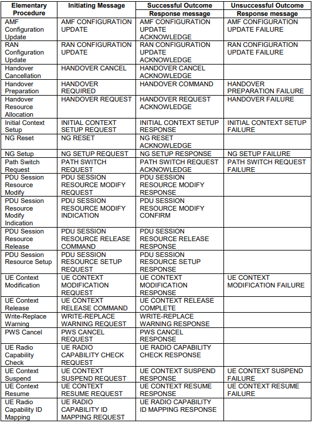
- **Class 2:** Elementary Procedures without response.

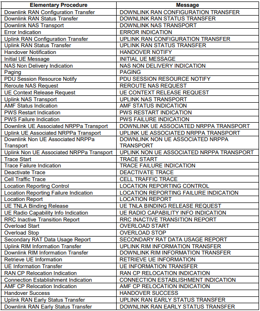

## Interdependencies
- **Sequential:** Initiating message → response (success/failure); failures abort or trigger error handling.
- **Contextual:** Later procedures depend on earlier context (e.g., UE context before resource setup).
- **Shared IEs:** UE IDs, security info, session details reused within/across procedures.

---

## Key Procedure Summaries & IEs (Presence / Criticality)

### (1) NG Setup Request (gNB→AMF)
**Purpose:** Introduce gNB; establish NG parameters.

**Key IEs**

| IE | Presence | Criticality |
|---|---|---|
| Global RAN Node ID | M | reject |
| RAN node name | O | ignore |
| Supported TA List | M | reject |
| default paging DRX | M | ignore |

**Effect:** Registers gNB identity; constrains UE placement (TA/PLMN match).

### (2) NG Setup Response (AMF→gNB)
**Purpose:** Confirm setup; provide AMF identity/capacity.

**Key IEs**

| IE | Presence | Criticality |
|---|---|---|
| AMF Name | M | reject |
| Served GUAMI List | M | reject |
| PLMN Support List | M | reject |
| Relative AMF Capacity | M | ignore |

**Effect:** gNB caches AMF identifiers; slice/PLMN alignment influences routing.

### (3) Initial UE Message (gNB→AMF)
**Purpose:** First UE-associated NGAP; carry initial NAS.

**Key IEs**

| IE | Presence | Criticality |
|---|---|---|
| RAN-UE-NGAP-ID | M | reject |
| NAS-PDU | M | reject |
| User Location Information | M | reject |
| RRC Establishment Cause | M | ignore |
| 5G-S-TMSI | O | reject |
| UE Context Request | O | ignore |

**Processing notes (38.413-8.6.1.2):**
- gNB allocates unique RAN-UE-NGAP-ID and includes it.
- NAS-PDU is forwarded without interpretation.
- Selected PLMN is indicated by PLMN Identity in the TAI (network sharing).
- If UE Context Request present, AMF triggers Initial Context Setup.
- Additional optional IEs (AMF Set ID, CE-mode-B, LTE-M indication, EDT Session, NPN info) are handled per TS 23.501/23.502.

### (4) Downlink NAS Transport (AMF→gNB)
**Purpose:** Deliver NAS to UE (e.g., Authentication Request, SMC, Registration Accept, PDU Session Accept).

**Key IEs**

| IE | Presence | Criticality |
|---|---|---|
| AMF-UE-NGAP-ID | M | reject |
| RAN-UE-NGAP-ID | M | reject |
| NAS-PDU | M | reject |

### (5) Uplink NAS Transport (gNB→AMF)
**Purpose:** Forward UE NAS to AMF when a UE-associated logical NG-connection exists.

**Key IEs**

| IE | Presence | Criticality |
|---|---|---|
| AMF-UE-NGAP-ID | M | reject |
| RAN-UE-NGAP-ID | M | reject |
| NAS-PDU | M | reject |
| User Location Information | M | ignore |

**Note:** NAS is transferred without interpretation in NG-RAN.

### (6) Initial Context Setup Request (AMF → gNB)
**Purpose:** Establish the UE’s initial control-plane and user-plane context at the gNB after authentication/authorization.

**Key IEs**

| IE | Presence | Criticality |
|---|---|---|
| AMF-UE-NGAP-ID | M | reject |
| RAN-UE-NGAP-ID | M | reject |
| GUAMI | M | reject |
| Allowed NSSAI | M | reject |
| UE Security Capabilities | M | reject |
| Security Key | M | reject |
| NAS-PDU | O | ignore |
| Redirection Voice Fallback | O | ignore |

**Effect**
- gNB creates the UE context and configures required resources based on the above security/slice parameters; prepares for subsequent session setup.  
- Common side effect: triggers the gNB’s **RRC Security Mode Command**.

### (7) Initial Context Setup Response (gNB → AMF)
**Purpose:** Indicates successful completion of the initial context setup initiated by the request; confirms radio/security configuration is in place at the gNB.

**Key IEs**

| IE | Presence | Criticality |
|---|---|---|
| AMF-UE-NGAP-ID | M | ignore |
| RAN-UE-NGAP-ID | M | ignore |

**Effect:** AMF acknowledges the UE context is active at the gNB; the UE can proceed with further signaling and data transfer (including subsequent NAS and PDU Session resource procedures).

### (8) PDU Session Resource Setup Request (AMF→gNB)
**Purpose:** Assign resources on Uu and NG-U for one/more PDU sessions; set up DRBs/QoS flows.

**Key IEs**

| IE | Presence | Criticality |
|---|---|---|
| AMF-UE-NGAP-ID | M | reject |
| RAN-UE-NGAP-ID | M | reject |
| RAN Paging Priority | O | ignore |
| NAS-PDU | O | reject |
| PDU Session Resource Setup List SUReq | M | reject |

### (9) PDU Session Resource Setup Response (gNB→AMF)
**Key IEs**

| IE | Presence | Criticality |
|---|---|---|
| AMF-UE-NGAP-ID | M | ignore |
| RAN-UE-NGAP-ID | M | ignore |
| PDU Session Resource Setup List SURes | O | ignore |

---

## Test

### NG Setup Request/Response

**gNB:**

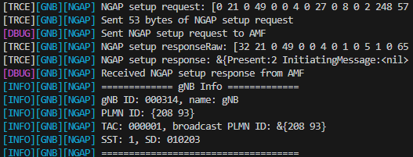

**AMF:**  

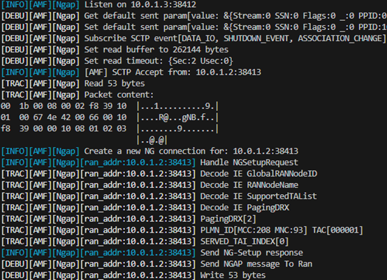

> The first two steps are non-UE-associated, not yet tied to a specific UE.

### Initial UE Message
**gNB:**  

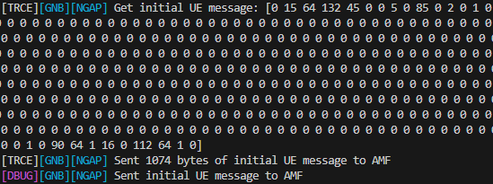

**AMF:**  

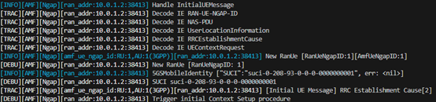

### Downlink / Uplink NAS Transport
**gNB:**  

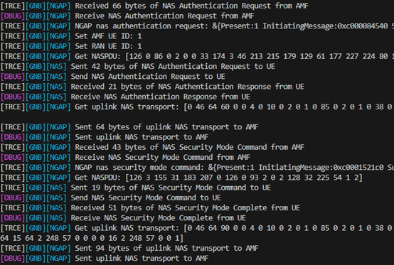

**AMF:**  

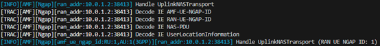

### Initial Context Setup Request
**gNB:**  

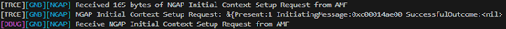

**AMF:**  

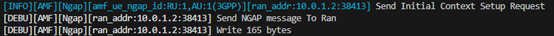

### Initial Context Setup Response
**gNB:**  

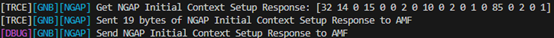

**AMF:**  

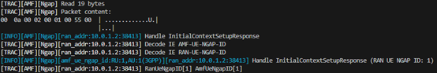

### PDU Session Resource Setup Request
**gNB:**  

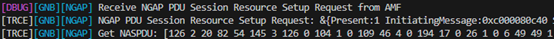

**AMF:**  

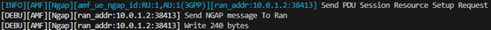

### PDU Session Resource Setup Response
**gNB:**  

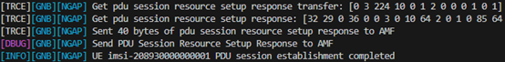

**AMF:**

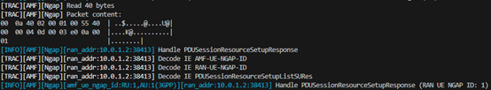

## Reference

- [TS 38.413](https://www.etsi.org/deliver/etsi_ts/138400_138499/138413/16.07.00_60/ts_138413v160700p.pdf)
- [5G/NR Network  - NGAP/N2 Interface](https://www.sharetechnote.com/html/5G/5G_NGAP.html)
- [Week 3: Protocol Stack](https://hackmd.io/@cndi2025/S1BM-mULgg)

## About
Hi, I'm Wei, Chang! A newcomer to 5G and the free5GC community. Let me know without hesitation if there is any mistake in the article.

### Connect with Me

- GitHub: [https://github.com/wiwi878](https://github.com/wiwi878)