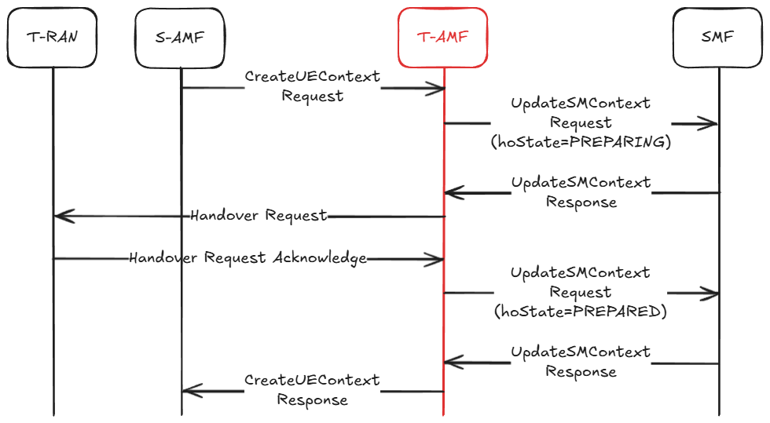
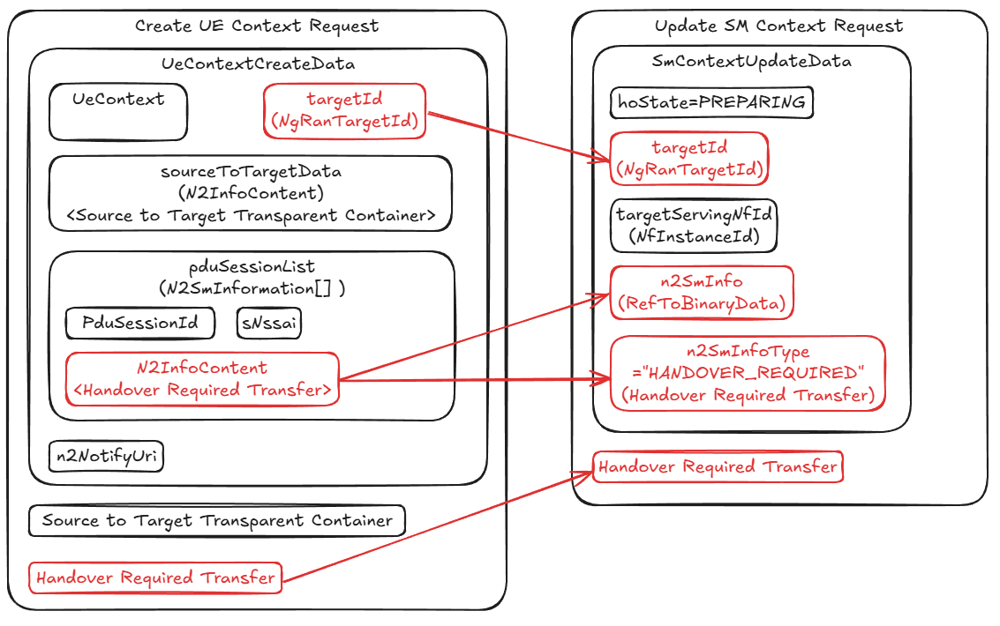
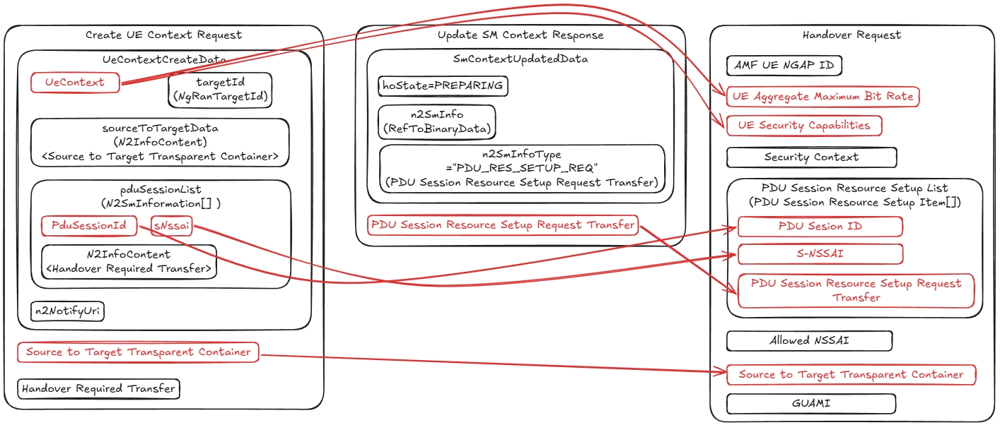
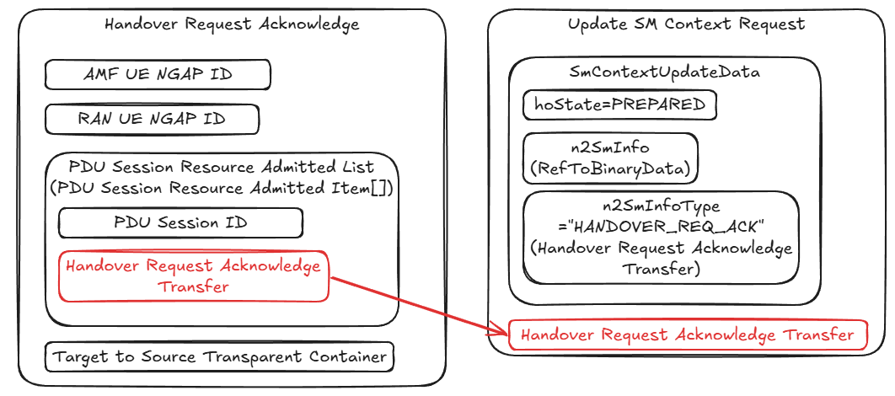
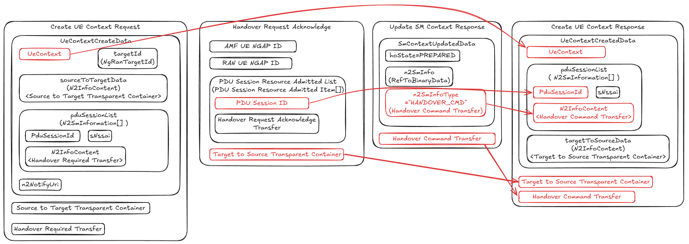
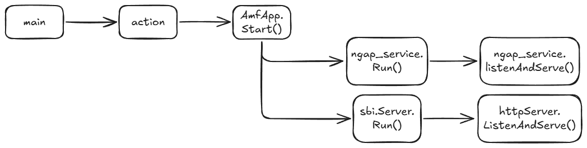
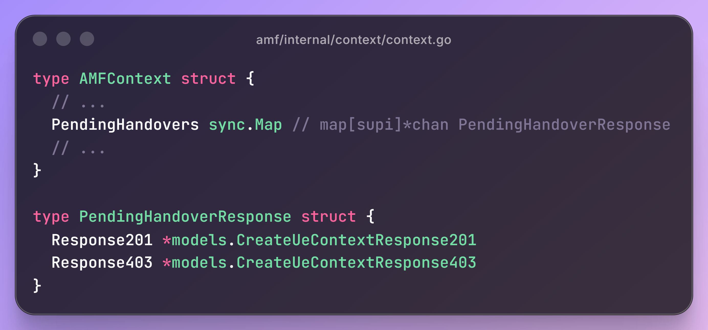
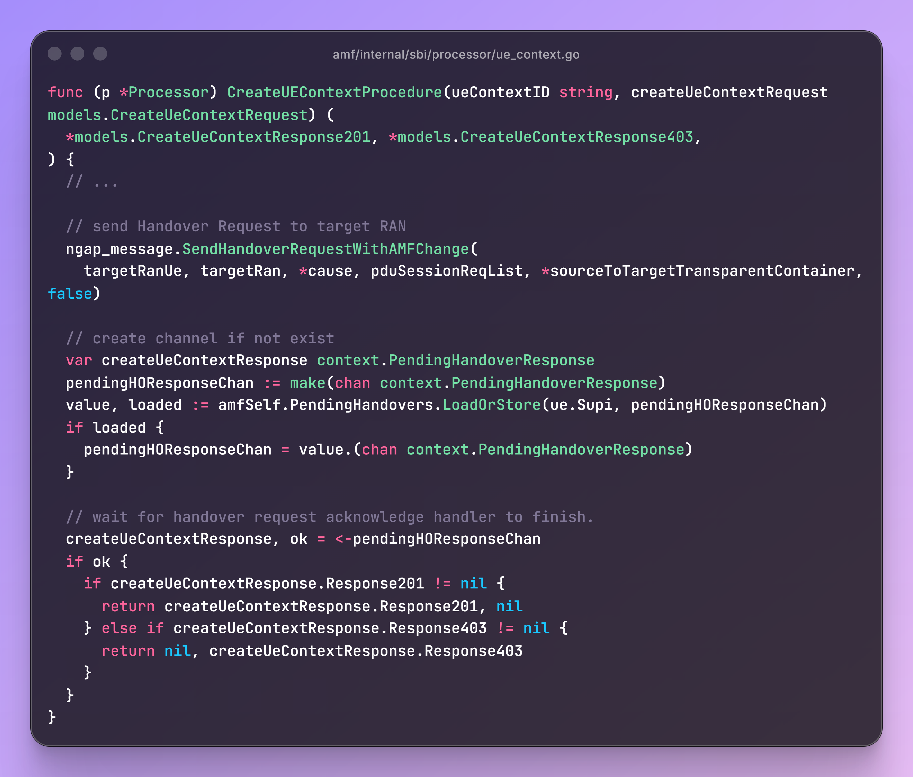
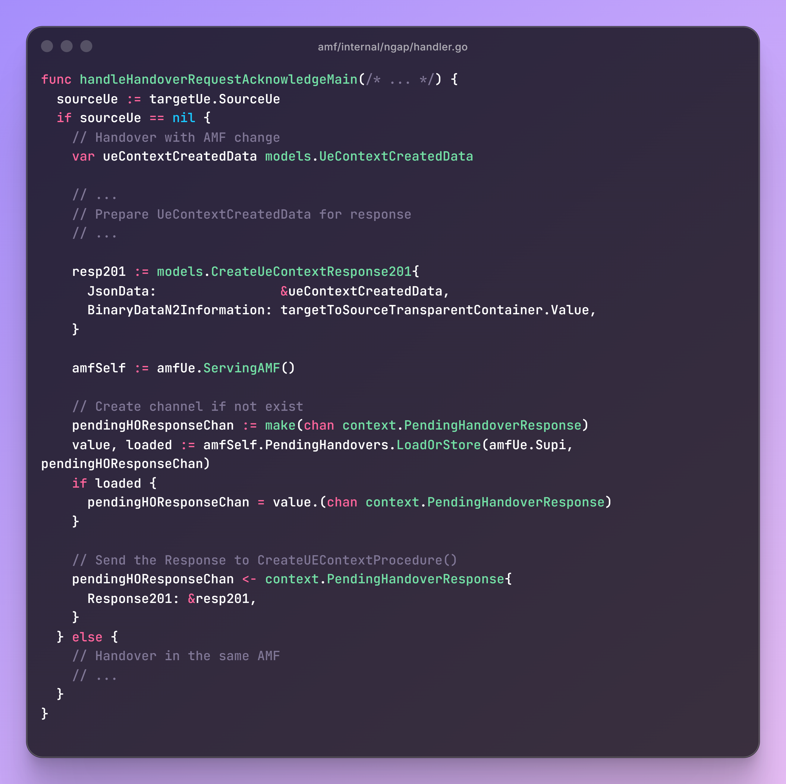

# Bridging SBI and NGAP: Implementing AMF CreateUEContext Service
In this article, we will introduce the Create UE Context service in Access and Mobility Management Function (AMF), and explain the implementation in free5GC.

## Create UE Context service
### When is this service used?
This service operation is used by a source AMF (S-AMF) to create the UE context in a target AMF (T-AMF) during handover procedures.

### What does the target AMF do in the procedure?

The image above shows the messages handled or sent by the T-AMF throughout the N2 handover preparation procedure.

After T-AMF receives the `CreateUEContext` request, it sends an `UpdateSMContext` request for each PDU session in the `pduSessionList`. 
The request update the SM context of the PDU session with: 

- `hoState` (handover state) `=PREPARING`
- `targetId` (target RAN ID)
- `targetServingNfId` (target AMF ID)
- `n2SmInfo` refers to the `Handover Required Transfer` IE.

If the handover is admitted, the SMF returns the `UpdateSMContext` response with the same `hoState`, and a `PDU Session Resource Setup Request Transfer` targetting to the T-RAN.

After receiving the `UpdateSMContext` response, the T-AMF builds and sends the `Handover Request` to the T-RAN. The `Handover Request` includes:

- `PDU Session` and its `S-NSSAI` which requires the handover.
- `Source to Target Transparent Container` sent from the S-RAN to T-RAN.
- `PDU Session Resource Setup Request Transfer` from the SMF, in order to reserve the resource in T-RAN.

If the resources are allocated successfully, the T-RAN returns the `Handover Request Acknowledge`.

When the `Handover Request Acknowledge` is received by the T-AMF, another `UpdateSMContext` request is sent to the SMF for the PDU Sessions whose resource is successfully reserved, in order to:

- update the `hoState` to `PREPARED`
- acknowledge the resources being setup with `Handover Request Acknowledge Transfer`

After the `hoState` being updated to `PREPARED`, the SMF response with the same `hoState`, and a `Handover Command Transfer`.

After the T-AMF receives the `UpdateSMContext` response, it builds the `CreateUEContext` response with the following attributes:

- `UeContext` created in the T-AMF, which is built based on the `UeContext` in the `CreateUEContext` request
- `PDU Session ID` of the PDU sessions being handed over
- `Target to Source Transparent Container` built by the T-RAN and being sent to the S-RAN
- `Handover Command Transfer` sent from the SMF to the S-RAN, in order to indicate the QoS flow being handed over

## How does free5GC’s AMF handle messages?

In free5GC, the NGAP service and the SBI server listen on different ports. In other words, the Create UE Context Request is processed in a Goroutine spawned by the SBI server, while the NGAP service handles the Handover Request Acknowledge in a separate Goroutine.

## Implementation of Create UE Context processor

Channels of Response model type are added to pass the response message from the NGAP handler to the SBI processor.

The `CreateUEContextProcedure` processor sends a `HandoverRequest` message to the T-RAN, then waits for the Handover Request Acknowledge handler to prepare the `createUeContextResponse` and deliver it through the channel back to the SBI processor.

The `handleHandoverRequestAcknowledgeMain()` verifies whether resource allocation for any PDU session succeeded; If so, it builds the `CreateUeContextResponse` and passes it to the SBI processor.

## Reference
- [TS 23.502 - V17.12.0; Procedures for the 5G System (5GS)](https://www.etsi.org/deliver/etsi_ts/123500_123599/123502/17.12.00_60/ts_123502v171200p.pdf) 
- [TS 29.502 - V17.10.0; Session Management Services](https://www.etsi.org/deliver/etsi_ts/129500_129599/129502/17.10.00_60/ts_129502v171000p.pdf) 
- [TS 29.518 - V17.14.0; Access and Mobility Management Services](https://www.etsi.org/deliver/etsi_ts/129500_129599/129518/17.14.00_60/ts_129518v171400p.pdf)
- [TS 38.413 - V17.10.0; NG Application Protocol (NGAP)](https://www.etsi.org/deliver/etsi_ts/138400_138499/138413/17.10.00_60/ts_138413v171000p.pdf) 

## About
Hi, I’m Jeff Chen, a newcomer to the 5G core network. My current focus is on developing AMF. If you notice any errors in this article, please reach out via my [Github](https://github.com/InertGas01)!
