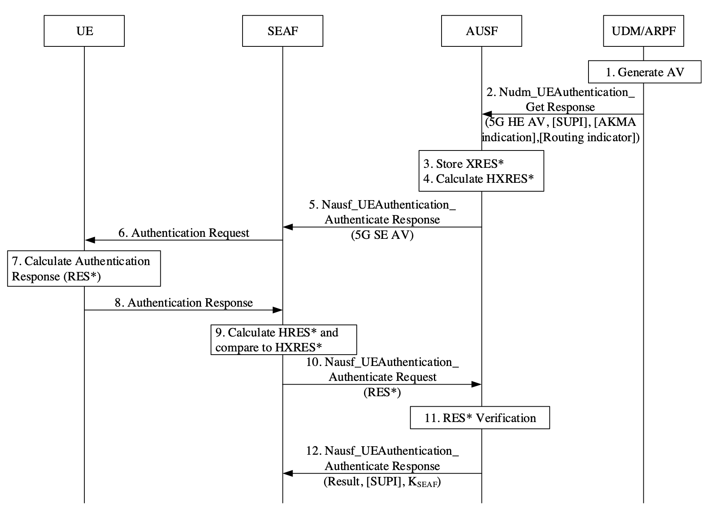

# Introduction to 5G AKA
>[!NOTE]
> Author: Che-Wei Lin
> Date: 2025/10/29

## Introduction

The **5G Authentication and Key Agreement** (5G AKA) protocol is the primary authentication mechanism defined by 3GPP to secure communication between a user device (UE) and the network. It ensures mutual authentication between the User Equipment (UE), the Serving Network (SN), and the Home Network (HN), while also generating cryptographic keys used to protect subsequent data exchanges.

In this article, we’ll walk through the 5G AKA procedure and highlight selected segments of its implementation in **free5GC**, combining protocol concepts with practical implementation.

## Quick terms

- `USIM`: Secure element holding the long-term key K and performing AKA functions
- `SEAF`: Security Anchor Function (typically co-located with AMF; holds anchor keys)
- `ARPF`: Authentication credential Repository and Processing Function (in UDM; generates auth vectors)
- `SUPI`: Subscriber permanent identifier 
- `SUCI`: Concealed SUPI
- `SNname (SNN)`: Serving Network Name
- `RES*`: UE’s computed response
- `XRES*`: Expected response computed on the home side
- `HRES*/HXRES*`: Hashed versions used for verification at AUSF/SEAF boundary
- `CK`, `IK`: AKA cipher/integrity base keys used as inputs to 5G KDFs
- `K`: Long-term secret in USIM and ARPF
- `K_AUSF`: Key derived from CK/IK and SNN on both UE and AUSF sides
- `K_SEAF`: Anchor key delivered to the serving network after successful auth
- `K_AMF`: Key derived at UE and AMF from K_SEAF; source for NAS/AS keys

## 5G AKA procedure and steps (with free5GC code spotlights)

5G AKA follows a **challenge-and-response** protocol. At a high level, the UE proves knowledge of a secret (K) shared with its home network. The home network creates an authentication challenge; the UE validates it and computes a response. If the response matches what the home network expects, both sides derive fresh keys and the serving network gets an anchor key to secure the session.

Here is an overview of how the 5G AKA procedure works:

**Figure 1.** The 5G AKA procedure (source: [3GPP TS 33.501](https://www.etsi.org/deliver/etsi_ts/133500_133599/133501/17.05.00_60/ts_133501v170500p.pdf)). 
> Note: The step numbers in the following explanation do not strictly correspond to those shown in the figure above.


### **1. Registration request and identity protection**

- UE → gNB → AMF/SEAF: Sends a Registration Request carrying `SUCI`.

### **2. Vector acquisition from the home network**

- SEAF/AMF → AUSF: Ask for an auth vector.
- AUSF → UDM/ARPF: Request 5G-HE-AKA vector for the subscriber (UDM de‑conceals `SUCI` to `SUPI`).
- UDM/ARPF generates `RAND`, `AUTN`, `RES`, `CK`, `IK`; then derives `XRES*` and `K_AUSF`.

Code spotlight (`XRES*` derivation and 5G-HE auth vector)
[udm/internal/sbi/processor/generate_auth_data.go:](https://github.com/free5gc/udm/blob/main/internal/sbi/processor/generate_auth_data.go)
```go
// Key = CK || IK, per TS 33.501
key := append(CK, IK...)
FC := ueauth.FC_FOR_RES_STAR_XRES_STAR_DERIVATION
P0 := []byte(authInfoRequest.ServingNetworkName) // SNN
P1 := RAND
P2 := RES

kdfValForXresStar, err := ueauth.GetKDFValue(
    key, FC,
    P0, ueauth.KDFLen(P0),
    P1, ueauth.KDFLen(P1),
    P2, ueauth.KDFLen(P2),
)
xresStar := kdfValForXresStar[len(kdfValForXresStar)/2:]

// Fill in rand, xres, autn, ckPrime, ikPrime
av.Rand = hex.EncodeToString(RAND)
av.Xres = hex.EncodeToString(RES)
av.Autn = hex.EncodeToString(AUTN)
av.CkPrime = hex.EncodeToString(ckPrime)
av.IkPrime = hex.EncodeToString(ikPrime)
av.AvType = models.AvType_EAP_AKA_PRIME
```

### **3. Network challenges the UE**

- AUSF → AMF: Provides `RAND`, `AUTN`, and `HXRES*` plus `SNN` context.
- AMF → UE: Sends NAS Authentication Request (`RAND`, `AUTN`).

Code spotlight (AUSF computing `HXRES*` to include in 5G-SE AV):
[ausf/internal/sbi/processor/ue_authentication.go:](https://github.com/free5gc/ausf/blob/main/internal/sbi/processor/ue_authentication.go)
```go
// Derive HXRES* from XRES*
concat := authInfoResult.AuthenticationVector.Rand + authInfoResult.AuthenticationVector.XresStar
var hxresStarBytes []byte
if bytes, err := hex.DecodeString(concat); err != nil {
    // ...
} else {
    hxresStarBytes = bytes
}
hxresStarAll := sha256.Sum256(hxresStarBytes)
hxresStar := hex.EncodeToString(hxresStarAll[16:]) // last 128 bits
```

Code spotlight (AMF building Authentication Request)
[amf/internal/gmm/message/build.go:](https://github.com/free5gc/amf/blob/main/internal/gmm/message/build.go)
```go
// Set RAND (16 bytes) into NAS IE
rand, err := hex.DecodeString(av5gAka.Rand)
if err != nil { return nil, err }
authenticationRequest.AuthenticationParameterRAND =
    nasType.NewAuthenticationParameterRAND(nasMessage.AuthenticationRequestAuthenticationParameterRANDType)
var tmp [16]byte
copy(tmp[:], rand[0:16])
authenticationRequest.AuthenticationParameterRAND.SetRANDValue(tmp)

// Set AUTN (16 bytes) into NAS IE
autn, err := hex.DecodeString(av5gAka.Autn)
if err != nil { return nil, err }
authenticationRequest.AuthenticationParameterAUTN =
    nasType.NewAuthenticationParameterAUTN(nasMessage.AuthenticationRequestAuthenticationParameterAUTNType)
copy(tmp[:], autn[0:16])
authenticationRequest.AuthenticationParameterAUTN.SetAUTNValue(tmp)
```

### **4. UE validates `AUTN` and computes `RES*`, derives keys**

- UE checks `AUTN` MAC and `SQN` freshness; if ok, computes `RES`, `CK`, `IK`.
- UE derives `RES*`, `K_AUSF` (from `CK||IK`, `SNN`, `SQN⊕AK`) and then `K_SEAF` from `K_AUSF`; derives `K_AMF` later with `SUPI` binding and `ABBA`.

Code spotlight (UE test harness deriving `K_AUSF` → `K_SEAF` → `K_AMF`)
[free5gc/test/ranUe.go:](https://github.com/free5gc/free5gc/blob/main/test/ranUe.go)
```go
P1 := SQNxorAK
Kausf, err := ueauth.GetKDFValue(key, FC, P0, ueauth.KDFLen(P0), P1, ueauth.KDFLen(P1))
if err != nil { fatal.Fatalf("GetKDFValue error: %+v", err) }

P0 = []byte(snName)
Kseaf, err := ueauth.GetKDFValue(Kausf, ueauth.FC_FOR_KSEAF_DERIVATION, P0, ueauth.KDFLen(P0))
if err != nil { fatal.Fatalf("GetKDFValue error: %+v", err) }

P0 = []byte(groups[1]) // SUPI digits
L0 := ueauth.KDFLen(P0)
P1 = []byte{0x00, 0x00} // ABBA
L1 := ueauth.KDFLen(P1)

ue.Kamf, err = ueauth.GetKDFValue(Kseaf, ueauth.FC_FOR_KAMF_DERIVATION, P0, L0, P1, L1)
if err != nil { fatal.Fatalf("GetKDFValue error: %+v", err) }
```

### **5. Serving-network verification and AUSF confirmation**

- UE → SEAF: Sends `RES*` in NAS Authentication Response.
- SEAF computes `HRES* = SHA-256(RAND || RES*)` and compares with `HXRES*`. If they match, authentication is successful from the serving network viewpoint; SEAF forwards `RES*` to AUSF for home-network confirmation.
- AUSF compares `RES*` with stored `XRES*`. If equal, AUSF confirms success and provides `K_SEAF` (and `SUPI` if `SUCI` was used).

Code spotlight (AUSF: `RES*` confirmation and return of `K_SEAF`)
[ausf/internal/sbi/processor/ue_authentication.go:](https://github.com/free5gc/ausf/blob/main/internal/sbi/processor/ue_authentication.go)
```go
// Compare RES* with stored XRES*
if strings.EqualFold(updateConfirmationData.ResStar, ausfCurrentContext.XresStar) {
    confirmDataRsp.AuthResult = models.AusfUeAuthenticationAuthResult_SUCCESS
    confirmDataRsp.Supi  = currentSupi
    confirmDataRsp.Kseaf = ausfCurrentContext.Kseaf
} else {
    ausfCurrentContext.AuthStatus = models.AusfUeAuthenticationAuthResult_FAILURE
    confirmDataRsp.AuthResult = models.AusfUeAuthenticationAuthResult_FAILURE
}
```

### **6. Security context establishment in the serving network**

- UE and AMF derive `K_AMF` from `K_SEAF`, then NAS keys; gNB later derives `K_gNB` and AS keys for RRC/UP.

Code spotlight (UE test harness deriving NAS algorithm keys from `K_AMF`)
[free5gc/test/ranUe.go:](https://github.com/free5gc/free5gc/blob/main/test/ranUe.go)
```go
// Security Key
P0 := []byte{security.NNASEncAlg}
L0 := ueauth.KDFLen(P0)
P1 := []byte{ue.CipheringAlg}
L1 := ueauth.KDFLen(P1)

kenc, err := ueauth.GetKDFValue(ue.Kamf, ueauth.FC_FOR_ALGORITHM_KEY_DERIVATION, P0, L0, P1, L1)
if err != nil { fatal.Fatalf("GetKDFValue error: %+v", err)}
copy(ue.KnasEnc[:], kenc[16:32])

// Integrity Key
P0 = []byte{security.NNASIntAlg}
L0 = ueauth.KDFLen(P0)
P1 = []byte{ue.IntegrityAlg}
L1 = ueauth.KDFLen(P1)

kint, err := ueauth.GetKDFValue(ue.Kamf, ueauth.FC_FOR_ALGORITHM_KEY_DERIVATION, P0, L0, P1, L1)
if err != nil { fatal.Fatalf("GetKDFValue error: %+v", err)}
copy(ue.KnasInt[:], kint[16:32])
```

### **7. Resynchronization (only if needed)**

- If UE detects `AUTN` failure due to sequence number drift, UE → SEAF/AMF: Sends `AUTS` for resync.
- AUSF relays resync to UDM; UDM re-generates vectors with new `SQN` and flow restarts.

Code spotlight (UDM Milenage helpers used for MAC-A/MAC-S and AK/AUTN calculations)
[udm/internal/util/milenage.go:](https://github.com/free5gc/udm/blob/main/internal/util/milenage.go)
```go
// Generate AKA params and extract AUTN tail (MAC-A)
ik, ck, xres, autn, err := milenage.GenerateAKAParameters(opc, k, rand, sqn, amf)

// For MAC-S, use resync AMF (0000)
resyncAMFBytes, err := hex.DecodeString("0000")
if err != nil {return err}
ikS, ckS, xresS, autnS, err := milenage.GenerateAKAParameters(opc, k, rand, sqn, resyncAMFBytes)
```

### **8. Re‑authentication and handovers**

- 5G supports efficient re‑auth flows and a key hierarchy so that subsequent procedures (e.g., mobility, handovers, access changes) don’t require repeating full home authentication unless needed.

### **KDF reference used across free5GC**

free5GC’s shared KDF utility implements TS 33.220/33.501 HMAC‑SHA256 KDF and function codes
[util/ueauth/ueauth.go:](https://github.com/free5gc/util/blob/main/ueauth/ueauth.go)
```go
const (
	FC_FOR_CK_PRIME_IK_PRIME_DERIVATION  = "20"
	FC_FOR_KSEAF_DERIVATION              = "6C"
	FC_FOR_RES_STAR_XRES_STAR_DERIVATION = "6B"
	FC_FOR_KAUSF_DERIVATION              = "6A"
	FC_FOR_KAMF_DERIVATION               = "6D"
	FC_FOR_KGNB_KN3IWF_DERIVATION        = "6E"
	FC_FOR_NH_DERIVATION                 = "6F"
	FC_FOR_ALGORITHM_KEY_DERIVATION      = "69"
	FC_FOR_KTIPSEC_KTNAP_DERIVATION      = "84"
)

func GetKDFValue(key []byte, FC string, param ...[]byte) ([]byte, error) {
    kdf := hmac.New(sha256.New, key)

    var S []byte
    if STmp, err := hex.DecodeString(FC); err != nil {return nil, fmt.Errorf("GetKDFValue FC decode failed: %+v", err)} 
    else {
        S = STmp    
    }

    for _, p := range param {
        S = append(S, p...)
    }

    if _, err := kdf.Write(S); err != nil {return nil, fmt.Errorf("GetKDFValue KDF write failed: %+v", err)}
    sum := kdf.Sum(nil)
    return sum, nil
}
```

## Conclusion

Through its structured challenge–response process and layered key system, 5G AKA enables mutual authentication between the UE, serving network, and home network while securely generating session-specific keys. By exploring the protocol together with its implementation in free5GC, we can see how 3GPP’s specifications are brought to life in software—from authentication vector generation and verification to the derivation of keys across different network functions.

## Reference

- [TS 33.501](https://www.etsi.org/deliver/etsi_ts/133500_133599/133501/17.05.00_60/ts_133501v170500p.pdf)
- [5G Security](https://ithelp.ithome.com.tw/m/articles/10293421)
- [5G AKA协议详解](https://www.cnblogs.com/machi12/p/15557919.html)
- References to implementation:
    - AUSF, HXRES*, K_SEAF, confirmation: [ausf/internal/sbi/processor/ue_authentication.go](https://github.com/free5gc/ausf/blob/main/internal/sbi/processor/ue_authentication.go)
    - UDM, vector and XRES*, K_AUSF: [udm/internal/sbi/processor/generate_auth_data.go](https://github.com/free5gc/udm/blob/main/internal/sbi/processor/generate_auth_data.go)
    - AMF, NAS Authentication Request build: [amf/internal/gmm/message/build.go](https://github.com/free5gc/amf/blob/main/internal/gmm/message/build.go)
    - Util KDF: [util/ueauth/ueauth.go](https://github.com/free5gc/util/blob/main/ueauth/ueauth.go)
    - UE test harness (KAMF/NAS keys): [free5gc/test/ranUe.go](https://github.com/free5gc/free5gc/blob/main/test/ranUe.go)

## About

Hello! I'm Che Wei, Lin, and I’ve recently begun my journey into 5G technology and the free5GC community. I hope you found this blog post helpful, and please feel free to reach out if you notice any errors or have suggestions for improvement.

## Connect with Me

- GitHub: [Zach1113](https://github.com/Zach1113)