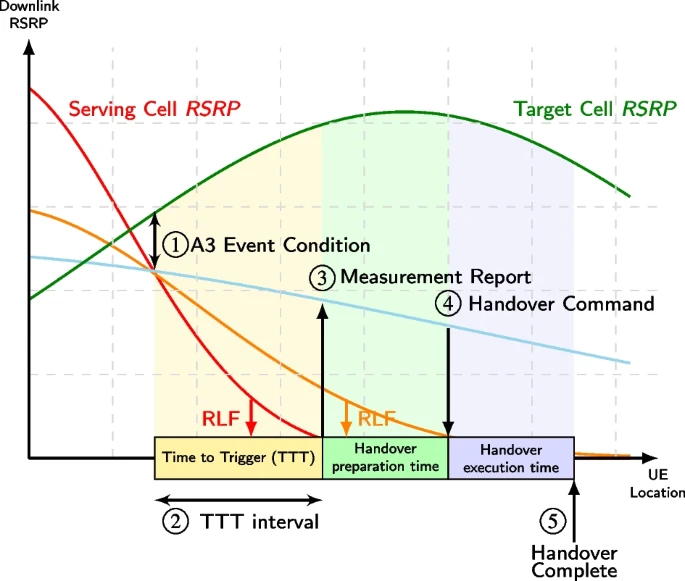

# Introduction of Xn and NG(N2) based handover
>[!NOTE]
> Author: Kai-Hung, Hu
> Date: 2025/11/05

## Key Terms and Abbreviations

### **1. Key Terms**

- **NG**: The interface connecting NG-RAN nodes to the 5G Core (5GC).
- **RACS**: Radio Access Capability Signaling - mechanism to efficiently handle UE radio capabilities using capability IDs instead of full capability sets.
- **RRC_CONNECTED state**:  It means the UE has an active connection with the network and can send/receive data. In this state, the network knows the UE's exact location and can coordinate its mobility through handover procedures.
- **Xn**: The interface connecting two NG-RAN nodes.

### **2. Abbreviations**

- **AN**: Access Network
- **CN PDB**: Core Network Packet Delay Budget
- **DL**: Downlink (network to UE)
- **HO**: Handover
- **NG-RAN**: Next Generation Radio Access Network
- **RLF**: Radio Link Failure
- **RRM**: Radio Resource Management
- **PSA**: PDU Session Anchor
- **S-AMF**: Source AMF
- **S-NG-RAN**: Source NG-RAN
- **S-UPF**: Source UPF
- **T-AMF**: Target AMF
- **T-NG-RAN**: Target NG-RAN
- **T-UPF**: Target UPF
- **UL**: Uplink (UE to network)

## What is Handover

Handover (HO) is a fundamental mobility management procedure in 5G networks that enables seamless service continuity when a User Equipment (UE) moves between different cells while maintaining an active connection. When a UE in **RRC_CONNECTED** state transitions from one cell (source cell) to another (target cell), handover ensures that ongoing data sessions, voice calls, and other services continue without interruption.

### **Handover Triggering Conditions**

Handover can be triggered by various conditions:

- **Radio Conditions**: When signal quality or strength from the serving cell degrades below a threshold, and a neighboring cell offers better radio conditions.
- **Load Balancing**: When a cell becomes heavily loaded, UEs may be handed over to less congested cells to optimize network resources.
- **Service Requirements**: When a specific service (e.g., voice call) is unavailable in the current system, triggering inter-system handover.

### **Handover Procedure**

**Figure 1.** handover procedure (source: [A survey on the handover management in 5G-NR cellular networks: aspects, approaches and challenges](https://jwcn-eurasipjournals.springeropen.com/articles/10.1186/s13638-023-02261-4))

A typical handover will go through the following stages:

#### 1. A3 Event Condition (Neighbor becomes offset better than SpCell)

- Event A3: The "Quality" Handover.
- What it means: "My neighbor cell is now significantly better (by a configured offset) than my current serving cell."
- Common Use Case: This is the most common event for mobility optimization and load balancing. The network uses this to proactively move a UE to a better cell, even if the current cell is still perfectly fine. This ensures the UE always has the best quality of service and prevents cells from becoming overloaded.

#### 2. Time-to-Trigger (TTT)

Before initiating handover, the UE waits for a **Time-to-Trigger (TTT)** period to confirm that the A3 condition is stable and not just a momentary spike. This waiting period prevents unnecessary handovers, especially "ping-pong handovers" where the UE would bounce back and forth between cells.

- **Short TTT**: Quick handover response, but risk of unnecessary handovers
- **Long TTT**: More stable decisions, but risk of delayed handover when needed

#### 3. Measurement Report

If the A3 condition remains true for the entire TTT duration, the UE sends a **Measurement Report (MR)** to the serving base station (gNB). This report contains:

- Signal quality measurements of the current cell
- Signal quality measurements of neighboring cells

#### 4. Handover Command

After receiving the measurement report, the serving gNB:

1. Makes a handover decision based on the measurements
2. Coordinates with the target gNB to prepare resources for the UE
3. If the target gNB accepts, sends a **Handover Command** to the UE

The handover command includes all the configuration information the UE needs to connect to the target cell (e.g., target cell ID, new radio resources, security parameters).

#### 5. Handover Completion

The UE:

1. Detaches from the source cell
2. Connects to the target cell using the provided configuration
3. Sends a **Handover Complete** message to the target gNB

At this point, the handover is successful, and the UE continues its services through the new cell. The network updates routing paths to ensure data flows to the correct location.

### **Types of Handover in 5G**

5G supports multiple handover types based on the network architecture and interfaces available:

- **Xn-based Handover**: Direct handover between two gNBs connected via the Xn interface, coordinated entirely within the RAN without core network involvement.
- **NG(N2)-based Handover**: Handover coordinated through the 5G Core via the N2 interface (connecting gNB to AMF) when the Xn interface is unavailable between source and target gNBs.
- **Intra-gNB Handover**: UE moves between cells/DUs within the same CU.
- **Inter-System Handover**: Transition between different systems (e.g., 5G to 4G) using the N26 interface.
- **Inter-RAT Handover**: Movement between different Radio Access Technologies.

I will focus on Xn-based Handover and NG(N2)-based Handover in this article.

## Xn-based Handover Procedure

**Xn-based handover** is a direct handover procedure between two gNBs (base stations) connected via the **Xn interface**. This type of handover is optimized for efficiency by handling mobility within the Radio Access Network (RAN) itself, and most of handover preparation/execution phases are involved in source NG-RAN and Target NG-RAN.

### **Key Characteristics of Xn-based Handover**

#### 1. Direct RAN-to-RAN Coordination
- The source and target gNBs communicate **directly through the Xn interface** to coordinate the handover
- Few core network (AMF/SMF) involvement during preparation and execution phases
- Faster handover decision-making and reduced signaling overhead

#### 2. Three-Phase Process

The picture shows the overall procedure of Intra-AMF/UPF handover:

**Figure 2.** Intra-AMF Intra-UPF handover (source: [TS 38.300](https://www.tech-invite.com/3m38/toc/tinv-3gpp-38-300_p.html#top))

The Xn-based handover follows a structured three-phase approach:

**Phase 1: Handover Preparation**

1. Source gNB decides to initiate handover based on measurement reports
2. Source gNB sends a **Handover Request** to the target gNB via Xn interface
3. Target gNB performs admission control (checks if it has resources available)
4. If accepted, target gNB prepares resources and sends **Handover Request Acknowledge** with RRC configuration for the UE

**Phase 2: Handover Execution**

1. Source gNB sends **RRC Reconfiguration** (handover command) to the UE
2. UE detaches from source gNB and synchronizes with target gNB
3. Source gNB forwards buffered data to target gNB to prevent data loss
4. Source gNB sends **SN Status Transfer** message to maintain packet sequence continuity

**Phase 3: Handover Completion**

1. UE successfully connects to target gNB and sends **RRC Reconfiguration Complete**
2. Target gNB sends **Path Switch Request** to AMF to update the user plane path
3. AMF triggers the UPF to switch the data path from source gNB to target gNB
4. After path switch confirmation, target gNB sends **UE Context Release** to source gNB
5. Source gNB releases all resources associated with the UE

#### 3. Data Forwarding
- **Direct data forwarding**: Source gNB can forward downlink packets directly to target gNB via the Xn interface
- Minimizes data loss during the handover transition
- Improves service continuity for ongoing sessions

#### 4. UPF Handling
Xn-based handover can occur with different UPF scenarios:

- **Without UPF re-allocation**: The existing UPF continues to serve the UE
- **With intermediate UPF insertion**: SMF decides that insertion of a new additional intermediate UPF is needed
- **With intermediate UPF re-allocation**: SMF decides that the intermediate UPF needs to be changed

I will introduce the detailed procedure of type "Without UPF re-allocation" with Figure. 3. If you are interested in the other two cases, you can also check the detailed procedure on [TS 23.502](https://www.tech-invite.com/3m23/toc/tinv-3gpp-23-502_za.html#e-4-9). 

### **Detailed Procedure Steps**

Based on TS 23.502 Section 4.9.1.2.2 (Xn-based inter NG-RAN handover without UPF re-allocation), the handover procedure follows these steps:

**Figure 3.** Xn-based handover without UPF re-allocation (source: [TS 23.502](https://www.tech-invite.com/3m23/toc/tinv-3gpp-23-502_za.html#e-4-9))

**Step 0**: Source NG-RAN initiates the inter NG-RAN Xn handover procedure for UE in RRC_CONNECTED state

- Handover is triggered based on UE measurement reports and RRM information
- Source gNB prepares UE context information for target gNB

**Step 1a** (Optional): Source NG-RAN provides RAN usage data report to AMF during handover execution phase

**Step 1b**: Target NG-RAN sends **N2 Path Switch Request** to AMF

This message contains:

- List of PDU Sessions to be switched with N2 SM Information
- List of PDU Sessions that failed to be established
- UE Location Information
- Established QoS Flows status (active/not active)

Target NG-RAN informs AMF that the UE has moved to the new target cell

**Step 2**: AMF sends **Nsmf_PDUSession_UpdateSMContext Request** to SMF

- AMF invokes this service operation for each PDU Session
- Includes indication whether PDU Session is to be switched or rejected

**Steps 3-4**: SMF communicates with UPF via N4 Session Modification

- **Step 3**: CN Tunnel Info of UPF connecting to Target NG-RAN and connection to Source NG-RAN may be different, e.g. Source and Target NG-RAN are in different IP domains. Then, the SMF may ask the UPF to allocate new CN Tunnel Info.
- **Step 4**: For the PDU Sessions that are switched, UPF returns N4 Session Modification Response message to the SMF after requested PDU Sessions are switched.

**Step 5**: UPF sends **end marker packets** to assist reordering function

- One or more end marker packets sent for each N3 tunnel on the old path
- UPF starts sending downlink packets to Target NG-RAN

**Step 6**: SMF sends **Nsmf_PDUSession_UpdateSMContext Response** to AMF

- Contains N2 SM Information (CN Tunnel Info, updated CN PDB for accepted QoS Flows)
- Includes information for PDU Sessions which have been switched successfully

**Step 7**: AMF sends **N2 Path Switch Request Acknowledge** to Target NG-RAN

- Aggregates CN Tunnel Info received from all SMFs
- Sends aggregated information as N2 SM Information
- If none of the requested PDU Sessions switched successfully, AMF sends **N2 Path Switch Request Failure** instead

**Step 8**: Target NG-RAN sends **Release Resources** message to Source NG-RAN

- Confirms success of the handover
- Triggers release of resources at Source NG-RAN

**Step 9** (Conditional): UE may initiate Mobility Registration Update procedure if triggered

## NG(N2)-based Handover Procedure

**NG(N2)-based handover** is used when there is no Xn interface between the source and target gNBs. In this scenario, the handover coordination is performed through the core network (specifically via the AMF) using the N2 interface. This type of handover involves more core network signaling but ensures mobility support even when direct RAN-to-RAN connectivity is unavailable.

### **Key Characteristics of N2-based Handover**

#### 1. Core Network Coordination

- Handover is coordinated through the **AMF (Access and Mobility Management Function)** via N2 interface
- AMF acts as the intermediary between source gNB and target gNB
- Higher signaling overhead compared to Xn-based handover due to core network involvement

#### 2. Two-Phase Process

The overall N2-based handover follows a two-phase approach:

**Phase 1: Preparation Phase**

1. Source gNB sends **Handover Required** message to source AMF with target information
2. Source AMF may select a new target AMF if the current AMF cannot serve the target area
3. AMF coordinates with SMF to prepare UPF resources and tunnel information
4. Target AMF sends **Handover Request** to target gNB with UE context and PDU session information
5. Target gNB performs admission control and sends **Handover Request Acknowledge**

**Phase 2: Execution Phase**

1. Source AMF aggregates responses and sends **Handover Command** back to source gNB
2. Source gNB sends **Handover Command** (RRC Reconfiguration) to UE
3. UE detaches from source gNB and synchronizes with target gNB
4. Data forwarding occurs (direct or indirect via UPF)
5. UE sends **Handover Confirm** to target gNB after successful synchronization
6. Target gNB sends **Handover Notify** to target AMF
7. AMF triggers SMF to switch the user plane path to target gNB
8. Source gNB resources are released after path switch completion

#### 3. Data Forwarding Options

- **Direct Forwarding**: If IP connectivity and security associations exist between source and target gNB, data can be forwarded directly
- **Indirect Forwarding**: When direct forwarding is unavailable

#### 4. AMF Relocation Support

- **Intra-AMF Handover**: Source and target gNBs served by same AMF
- **Inter-AMF Handover**: Requires AMF relocation when UE moves to an area served by different AMF. Source AMF transfers UE context to target AMF and target AMF becomes the new serving AMF

### **Detailed Procedure Steps**

Based on TS 23.502 Section 4.9.1.3.2 and 4.9.1.3.3, the N2-based handover procedure follows these steps:

**Figure 4.** N2-based handover preparation phase (source: [TS 23.502](https://www.tech-invite.com/3m23/toc/tinv-3gpp-23-502_zb.html#e-4-9-1-3-2))

#### **Preparation Phase**

**Step 1**: Source gNB sends **Handover Required** to source AMF

- It contains:
      - Target ID (identifies target gNB and cell)
      - Source to Target transparent container (UE context, RAN information, QoS flows for data forwarding)
      - PDU Session IDs of all active PDU sessions
      - Direct Forwarding Path Availability indication (if source gNB can forward data directly to target gNB)

**Step 2**: Source AMF selects target AMF (if needed)

- If source AMF cannot serve the UE, it selects a new target AMF based on **AMF Selection Function**

**Step 3** (Conditional): Source AMF sends **Namf_Communication_CreateUEContext Request** to target AMF

- Transfers complete UE context information
- This step is skipped if source AMF can still serve the UE

**Step 4** (Conditional): Target AMF sends **Nsmf_PDUSession_UpdateSMContext Request** to SMF for each PDU Session

- Provides PDU Session ID, Target ID, T-AMF ID, N2 SM Information

**Steps 5-6**: SMF interacts with UPF via N4 Session Establishment/Modification

- **Step 5** (Conditional): SMF checks if target gNB location is within service area of current UPF. If UE moved out of UPF service area, SMF selects new intermediate UPF (Target UPF)
- **Step 6a-6b** (Conditional): If new UPF needed, SMF updates PDU Session Anchor (PSA UPF) with CN Tunnel Info on N9 interface
- **Step 6c-6d** (Conditional): SMF establishes N4 session with Target UPF (intermediate), receives CN Tunnel Info for N3 interface

**Step 7**: SMF sends **Nsmf_PDUSession_UpdateSMContext Response** to target AMF

- It Contains N2 SM Information with:
      - N3 UP address and UL CN Tunnel ID of UPF for target gNB
      - QoS parameters, security enforcement information
      - Data forwarding availability indication
- If UPF cannot serve target area and no alternative is available, SMF provides reason for non-acceptance

**Step 8**: Target AMF supervises SMF responses

- Waits for all SMF responses or until maximum wait time expires, AMF continues the N2 handover procedure.

**Step 9**: Target AMF sends **Handover Request** to target gNB

- It contains:
      - Source to Target transparent container
      - N2 SM Information list (tunnel info, QoS parameters for each accepted PDU session)
      - N2 MM Information (Security information, Mobility Restriction List)
      - UE Radio Capability ID (if RACS supported)

**Step 10**: Target gNB sends **Handover Request Acknowledge** to target AMF

- It contains:
      - Target to Source transparent container (RRC configuration for UE)
      - List of PDU Sessions successfully prepared with N2 SM information (N3 AN Tunnel Info)
      - List of PDU Sessions that failed to be established with failure reasons
      - Data forwarding tunnel addresses (if target gNB supports data forwarding)

**Steps 11a-11f**: AMF and SMF coordinate data forwarding setup

- **Step 11a**: AMF forwards target gNB's N2 SM response to SMF for each PDU session
- **Step 11b-11c** (Conditional): If indirect forwarding needed and UPF re-allocated, SMF configures Target UPF with forwarding tunnels
- **Step 11d-11e** (Conditional): SMF configures Source UPF with data forwarding information (either Target UPF tunnel or Target gNB tunnel)
- **Step 11f**: SMF sends DL forwarding tunnel information back to target AMF
      - DL forwarding tunnel information:
        - Direct forwarding: SMF includes the T-RAN N3 forwarding information the SMF received in step 11a
        - Indirect forwarding: setup in step 11b or 11d, then the SMF includes the T-UPF or S-UPF DL forwarding information

**Step 12** (Conditional): Target AMF sends **Namf_Communication_CreateUEContext Response** to source AMF

- It contains:
      - Target to Source transparent container (RRC configuration for UE)
      - N2 SM Information (DL forwarding tunnel info)
      - List of PDU Sessions that failed to be setup
      - Target AMF ID (if AMF was relocated)

**Figure 5.** N2-based handover execution phase (source: [TS 23.502](https://www.tech-invite.com/3m23/toc/tinv-3gpp-23-502_zb.html#e-4-9-1-3-3))

#### **Execution Phase**

**Step 1**: Source AMF sends **Handover Command** to source gNB

- It contains:
      - Target to Source transparent container
      - List of PDU Sessions to be handed over with N2 SM information (forwarding addresses)
      - List of PDU Sessions failed to be setup

**Step 2**: Source gNB sends **Handover Command** (RRC Reconfiguration) to UE

- UE container includes RRC configuration from target gNB
- UE uses this configuration to connect to target cell

**Steps 2a-2c**: Source gNB sends **Uplink RAN Status Transfer** to source AMF

- Source AMF forwards this to target AMF (if AMF relocated)
- Target AMF sends **Downlink RAN Status Transfer** to target gNB
- Ensures continuity and integrity of data during the handover from source RAN to target RAN

**Step 3**: Data forwarding begins

- Downlink packets from PSA UPF continue to source gNB via source UPF
- Source gNB forwards buffered DL data to target gNB (direct or indirect via UPF)
- Uplink packets from UE at target gNB are sent to Target UPF and PSA UPF

**Step 4**: UE sends **Handover Confirm** to target gNB

- After successful synchronization with target cell
- Confirms UE has completed the handover at UE side

**Step 5**: Target gNB sends **Handover Notify** to target AMF

- Confirms successful handover at RAN side
- Triggers user plane path switch procedures

**Steps 6a-6c**: AMF notifications and PDU session handling

- **Step 6a** (Conditional): Target AMF notifies source AMF via **Namf_Communication_N2InfoNotify** (if AMF relocated)
      - Start a timer in S-AMF to supervise when resources in S-RAN can be released
- **Step 6b** (Conditional): Source AMF acknowledges
- **Step 6c** (Conditional): Source AMF releases PDU sessions not accepted by target AMF (e.g., S-NSSAI not available)

**Step 7**: Target AMF sends **Nsmf_PDUSession_UpdateSMContext Request** to SMF

- Includes Handover Complete indication for each PDU session
- Handover Complete indication is used to indicate the success of the N2 Handover

**Steps 8-10**: SMF switches user plane path

- **Steps 8a-8b** (Conditional): It happens when new T-UPF is inserted or an existing intermediate S-UPF is re-allocated
- **Steps 9a-9b** (Conditional): If happens when UPF not re-allocated
- **Steps 10a-10b** (Conditional): SMF updates PSA UPF with new tunnel information
      - step 10a and 10b are skipped if T-UPF is not inserted or an existing intermediate S-UPF is not re-allocated

**Step 11**: SMF sends **Nsmf_PDUSession_UpdateSMContext Response** to target AMF

- Confirms handover completion for PDU session
- If indirect forwarding used, SMF starts timer to release forwarding resources

**Step 12**: UE initiates **Mobility Registration Update**

- Updates registration with target AMF
- Target AMF performs subset of registration procedure (skips context transfer steps since already done)

**Steps 13a-13b** (Conditional): SMF releases source UPF resources

- After forwarding timer expires, SMF sends **N4 Session Release Request** to source UPF
- Source UPF releases resources and confirms with **N4 Session Release Response**
- If indirect forwarding used, resource of indirect forwarding is also released

**Steps 14a-14b**: Source gNB resource release

- After timer in step 6a expires, AMF sends **UE Context Release Command** to source gNB
- Source gNB releases all resources and responds with **UE Context Release Complete**

**Steps 15a-15b** (Conditional): SMF releases indirect forwarding resources in Target UPF (if applicable)

- After indirect forwarding timer expires, SMF sends **N4 Session Modification Request** to Target UPF to release indirect forwarding resources
- T-UPF replies with **N4 Session Modification Response** to confirm the release

## Conclusion

**Xn-based handover** offers lower latency and reduced signaling through direct RAN-to-RAN coordination, ideal for seamless mobility with minimal core network involvement. However, it requires Xn interface connectivity between gNBs.

**N2-based handover** provides universal mobility support even without Xn interface, enabling inter-AMF scenarios and cross-operator handovers. The trade-off is increased core network signaling overhead and higher handover latency.

## Reference

- [TS 23.502](https://www.etsi.org/deliver/etsi_ts/123500_123599/123502/18.10.00_60/ts_123502v181000p.pdf)
- [TS 38.300](https://www.etsi.org/deliver/etsi_ts/138300_138399/138300/19.00.00_60/ts_138300v190000p.pdf)
- [TS 38.331](https://www.etsi.org/deliver/etsi_ts/138300_138399/138331/18.06.00_60/ts_138331v180600p.pdf)
- [5G Handover](https://devopedia.org/5g-handover)
- [A survey on the handover management in 5G-NR cellular networks: aspects, approaches and challenges](https://jwcn-eurasipjournals.springeropen.com/articles/10.1186/s13638-023-02261-4)

## About

Hello! I'm Kai-Hung Hu, and I'm just starting my exploration of 5G technology and the free5GC community. I hope this blog post has been informative. If you spot any mistakes or have ideas for improvement, please don't hesitate to get in touch.

## Connect with Me

- GitHub: [carlhus](https://github.com/carlhus)