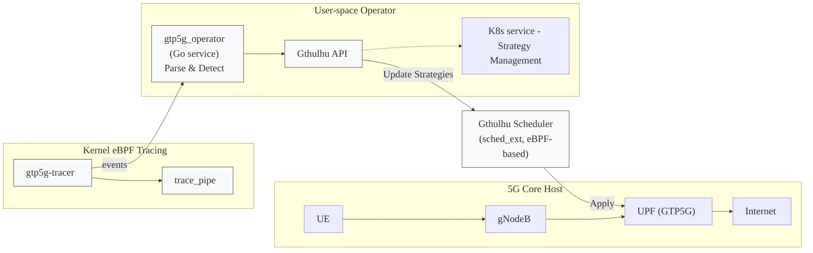
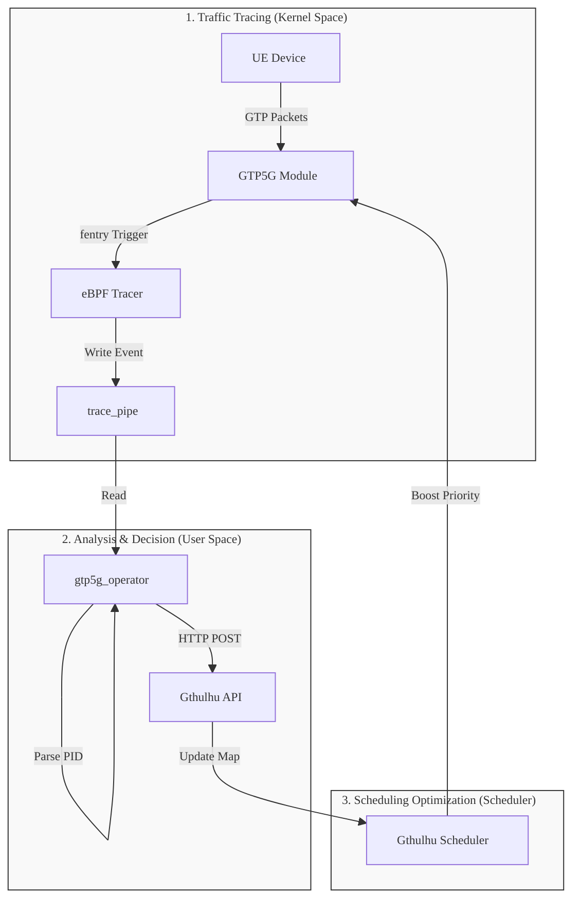
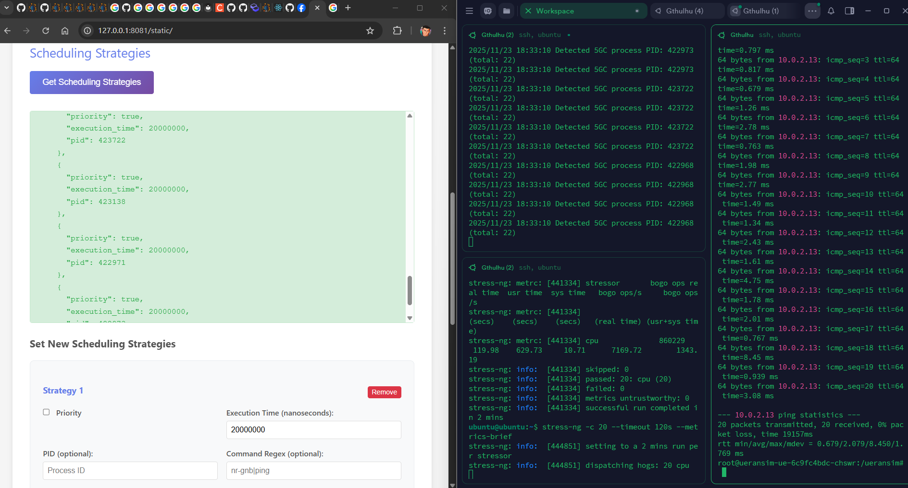

# Implementing GTP-driven Automatic Scheduling Optimization with eBPF-based Scheduler

>[!NOTE]
> Author: [Meng-Han, Hsieh](https://github.com/c9274326)
> Date: 2025/11/26

## Abstract

This article demonstrates how to use eBPF (Extended Berkeley Packet Filter) to trace GTP packet processing in the kernel (via [gtp5g-tracer](https://github.com/free5gc/gtp5g-tracer)), and combine it with [Gthulhu](https://gthulhu.org/) — a Linux eBPF-based Scheduler (sched_ext) — to automatically adjust scheduling strategies for end-to-end UE (User Equipment) latency optimization.

Key achievements delivered in this work:

  - Automatically identify gNodeB, UE related process ID
  - Dynamically adjust related process priority and CPU time slices
  - Reduce UE ping latency

## Background

### Performance Challenges in 5G UPF

In 5G networks, the UPF handles all user plane traffic, including tasks like GTP encapsulation/decapsulation and routing. UPF usually faces several performance challenges:

1. **Multi-process CPU Competition**:
    - gNodeB processes (e.g. nr-gnb)
    - UE simulators (e.g. nr-ue) generate test traffic
    - GTP5G kernel module processes packets
    - Other system services compete for CPU resources

2. **Limitations of Linux CFS Scheduler**:

    - CFS (Completely Fair Scheduler) pursues fairness
    - Lacks application-level awareness — can't automatically prioritize critical 5GC processes based on traffic

3. **Manual Optimization Difficulties**:

    - PIDs change dynamically (container/process restarts)
    - Requires continuous monitoring and adjustment


### Solution

Combining **eBPF observability** + **eBPF-based scheduler (sched_ext) programmability** to build an automated process scheduling optimization system. Instead of modifying network traffic directly, I trace the `gtp5g` module to identify `nr-ue` and `nr-gnb` related processes and provide them higher CPU priority during high system load:



---

## Architecture

### System Components

#### 1. gtp5g-tracer (eBPF Tracer)

**Function**: Trace critical functions in GTP5G kernel module

**Implementation**:
```c
// gtp5g_tracer_kern.c
SEC("fentry/gtp5g_encap_recv")
int BPF_PROG(gtp5g_encap_recv_entry, struct sk_buff *skb, 
             struct net_device *dev) {
    u32 pid = bpf_get_current_pid_tgid() >> 32;
    u32 tgid = bpf_get_current_pid_tgid();
    
    bpf_printk("fentry/gtp5g_encap_recv: PID=%d, TGID=%d", pid, tgid);
    return 0;
}

SEC("fexit/gtp5g_encap_recv")
int BPF_PROG(gtp5g_encap_recv_exit, struct sk_buff *skb, 
             struct net_device *dev, int ret) {
    bpf_printk("fexit/gtp5g_encap_recv: ret=%d", ret);
    return 0;
}
```

**Traced Functions**:

- `gtp5g_encap_recv()`: GTP encapsulation receive
- `gtp5g_handle_skb_ipv4()`: IPv4 packet handling
- `gtp5g_xmit_skb_ipv4()`: IPv4 packet transmission

**Output** (`/sys/kernel/debug/tracing/trace_pipe`):
```
nr-gnb-365189 [003] d..31 21039.948599: bpf_trace_printk: fentry/gtp5g_encap_recv: PID=365189, TGID=365162
nr-ue-365012  [004] d..31 22353.878390: bpf_trace_printk: stop: pid=365012 (nr-ue) cpu=4
```

#### 2. gtp5g_operator (Go Service)

**Function**: Parse trace_pipe, identify critical process IDs, and send scheduling strategies

**Core Modules**:

  2.1 **Trace Parser** (`pkg/parser/trace_parser.go`)

  ```go
  type TraceParser struct {
      nrGnbRegex *regexp.Regexp
      nrUeRegex  *regexp.Regexp
  }

  func (p *TraceParser) ParsePIDFromLine(line string) (int, bool) {
      // Priority matching:
      // 1. TGID= (thread group ID)
      // 2. nr-gnb-<PID> / nr-ue-<PID>
      // 3. pid=<num> (procname)
      // 4. PID= field
  }
  ```

  2.2 **JWT Auth Client** (`pkg/auth/client.go`)

  ```go
  type Client struct {
      token       string
      tokenExpiry time.Time
      mu          sync.RWMutex
  }

  // Automatic token management:
  // - Acquire on first request
  // - Auto-refresh 5 minutes before expiry
  // - Thread-safe
  ```

  2.3 **API Client** (`pkg/api/client.go`)

  ```go
  type SchedulingStrategy struct {
      PID           int    `json:"pid"`
      Priority      bool   `json:"priority"`
      ExecutionTime uint64 `json:"execution_time"`  // nanoseconds
  }

  func (c *Client) SendStrategies(ctx context.Context, 
                                  pids map[int]bool, 
                                  priority bool, 
                                  executionTime uint64)
  ```

**Workflow**:
```
1. tail -f /sys/kernel/debug/tracing/trace_pipe
2. Regex matching to extract PIDs (nr-gnb, nr-ue)
3. POST to Gthulhu API every second
4. Periodically get JWT token authentication
```

#### 3. Gthulhu Scheduler (eBPF-based Scheduler / sched_ext)

**Function**: Programmable scheduler based on Linux sched_ext

**Key Features**:

- Receive strategy updates via API
- Dynamically adjust process priority
- Custom CPU time slice allocation

**Strategy Parameters**:
```json
{
  "strategies": [
    {
      "pid": 365162,           // gNodeB main process
      "priority": true,        // Boost priority
      "execution_time": 20000000  // 20ms time slice
    }
  ]
}
```

### Data Flow

To clearly demonstrate the data flow, I divide the process into three phases: **Traffic Tracing**, **Analysis & Decision**, and **Scheduling Optimization**.

<center>



</center>

**Process Detail**:

  1.  **Traffic Generation**: UE sends packets, processed by the `GTP5G Module` in the Kernel.
  2.  **Event Capture**: `gtp5g-tracer` intercepts key functions via eBPF hooks and writes PID information to `trace_pipe`.
  3.  **Data Analysis**: `gtp5g_operator` reads the pipe in real-time, filtering for key processes (nr-gnb/nr-ue).
  4.  **Strategy Dispatch**: The Operator sends the identified PIDs to the `Gthulhu API`.
  5.  **Execution**: `Gthulhu Scheduler` receives the strategy and immediately adjusts the CPU priority and time slice for that PID.

---

## Implementation Details

### Environment Setup

#### System Requirements

- **OS**: Ubuntu 25.04 (kernel 6.12+)
- **Kubernetes**: microk8s or other K8s distributions
- **free5GC**: free5GC-helm v4.1.0
- **Go**: v1.24.2
- **gtp5g**: v0.9.15
- **gtp5g-tracer**: x

#### Step 1: gtp5g-tracer (build & run)

1\. Make gtp5g functions visible for fentry/fexit:

If functions are declared `static inline` the symbol may not be visible to the tracer. Convert to a visible symbol where needed (example):

```diff
// gtp5g/src/gtpu/gtpu.c
- static inline int gtp5g_encap_recv(struct sk_buff *skb, struct net_device *dev)
+ __visible noinline int gtp5g_encap_recv(struct sk_buff *skb, struct net_device *dev)
{
  // ... function body
}
```

2\. Build & run the tracer

```bash
cp /sys/kernel/btf/vmlinux /usr/lib/modules/$(uname -r)/build/
cd <GTP5G>
make clean && make
sudo make install
cd <GTP5G-TRACER>
make dep
make 
```

3\. Quick verification (development, should have ue traffic):

```bash
sudo cat /sys/kernel/debug/tracing/trace_pipe | grep gtp5g
# example output:
# nr-gnb-365189 ... bpf_trace_printk: fentry/gtp5g_encap_recv: PID=365189, TGID=365162
# nr-ue-365012  ... bpf_trace_printk: stop: pid=365012 (nr-ue) cpu=4
```

---

#### Step 2: Build Gthulhu

- Gthulhu (API + Scheduler): [Deploying Gthulhu with Kubernetes](https://gthulhu.org/k8s/)

- gtp5g_operator: build the operator binary and make sure it can authenticate against the Gthulhu API

```bash
cd ~/Gthulhu/gtp5g_operator
go build -o gtp5g_operator
```

The operator expects configuration for the API endpoint and the Kubernetes JWT public key; see `./start_operator.sh` for example environment variables.

---

### Deployment Guide

```
Host (Ubuntu 25.04)
├── gtp5g-tracer (running in background)
│   └── Output to /sys/kernel/debug/tracing/trace_pipe
│
├── Kubernetes Cluster (microk8s)
│   ├── gthulhu-api (Pod)
│   │   ├── :8080 (API Server)
│   │   └── /app/jwt_public_key.pem
│   │
│   └── gthulhu-scheduler (Pod)
│       └── eBPF-based Scheduler (sched_ext)
│
└── gtp5g_operator (running on host)
    ├── Read trace_pipe
    ├── Port-forward → :8081 → K8s :8080
    └── Send strategies to Gthulhu API
```

#### Startup Sequence

1. **Start free5GC-helm and UERANSIM**
```bash
# Install free5GC charts
cd free5gc-helm/charts
helm install -n free5gc free5gc-helm ./free5gc/ 

#Install UERANSIM chart
cd free5gc-helm/charts
helm install -n free5gc ueransim ./ueransim/ 
```

2. **Start gtp5g-tracer**
```bash
cd ~/gtp5g-tracer
sudo ./main
```

3. **Start Gthulhu (K8s)**
```bash
cd Gthulhu/chart
helm install gthulhu gthulhu
```

4. **Setup Port-Forward**
```bash
POD_NAME=gthulhu-api-xxxxx
sudo kubectl port-forward $POD_NAME 8081:8080
```

5. **Start gtp5g_operator**
```bash
cd ~/Gthulhu/gtp5g_operator/
sudo go run main.go
```


---

## Performance Testing

### Test Methodology

#### Baseline (Unoptimized)

1. Stop gtp5g_operator
2. Clear Gthulhu strategies
3. UE ping test (Run a short host CPU stress, e.g. `stress-ng -c 20 --timeout 120s --metrics-brief`):

```bash
# Inside UE POD
ping -I uesimtun0 N6_IP -c 20
```

#### Optimized

1. Start gtp5g_operator
2. Confirm strategies are applied
3. UE ping test (same command, same CPU stress)

### Test Results

<center>

| Metric | Baseline | Optimized | Improvement |
|--------|----------|-----------|-------------|
| Avg Latency | 88.98 ms | 2.079 ms | 97.66% |
| Min Latency | 35.47 ms | 0.679 ms | 98.08% |
| Max Latency | 130.95 ms | 8.45 ms | 93.55% |

</center>


Figure 1: Baseline - without gtp5g-operator


Figure 2: Optimized - automatic apply schduling strategies

## Conclusion

Combining kernel-level eBPF tracing of gtp5g with an eBPF-based scheduler (Gthulhu) provides an efficient, non-invasive way to detect and prioritize critical 5GC processes — Reducing substantial UE latency under CPU contention. While this approach is promising, it requires BTF/function visibility and safe, well-tested strategies to avoid negative trade-offs.

## References
- [GTP5G-Tracer: Detailed Project Explanation](https://free5gc.org/blog/20250913/20250913/)
- [30 篇文帶你用 eBPF 與 Golang 打造 Linux Scheduler 系列](https://ithelp.ithome.com.tw/users/20110850/ironman/8339?page=1) 

## About
Hello! I'm Meng-Han Hsieh, and I've recently started exploring 5G technology and engaging with the free5GC community. I hope you find this blog post useful, and don't hesitate to reach out if you have recommendations for improvement.


### Connect with Me
- GitHub: [Meng-Han, Hsieh](https://github.com/c9274326)
