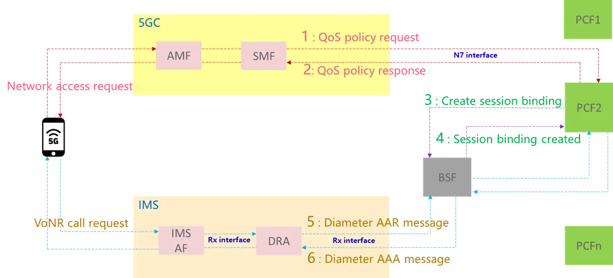

# Introduction to BSF
>[!NOTE]  
>Author: [Chieh-Cheng, Kuo](https://github.com/Jasonkuo23)  
>Date: 2025/12/03
---

## Introduction
### 1. What Is BSF?
**Binding Support Function** (BSF) is a service-based network function defined in the 5G System Architecture, responsible for storing and providing binding information between

- **PDU session** (Packet Data Unit) and **PCF** (Policy Control Function)
- **UE** (User Equipment) and **PCF**
- **MBS session** (Multicast/Broadcast Services), and **PCF**. 

BSF allows PCF to register, update and remove a binding information, and allows PCF to discover binding information.  
In practice, the BSF becomes a **real-time directory of active PCF assignments**.  
When an application functions (AF) or network function (NF) needs to apply policy changes, the BSF ensures that the request is routed to the correct PCF instance.

### 2. Why Is BSF Needed?
In the 5G Core, policy control is one of the most dynamic and distributed functions. With the shift to a Service-Based Architecture, network functions (NFs) are no longer monolithic and static as in legacy systems. Instead, they operate as cloud-native microservices that can scale in and out, get relocated, or fail independently.  
This flexibility creates a new challenge: How do different NFs, AFs know which Policy Control Function (PCF) is responsible for a specific UE or session?

The Binding Support Function (BSF) is the 5GC network function designed to solve this problem. It maintains authoritative mappings—called _bindings_—that associate UEs, sessions, or service groups with the correct PCF instance.

AF interact with BSF

## BSF Workflow
The BSF operates through a relatively simple but crucial workflow involving these major processes:

1. **PCF registers binding information with the BSF**
2. **AF / NF query BSF to obtain the correct PCF instance**
3. **AF / NF subscription**
    
These processes run continuously during network operation to ensure accurate and updated bindings.

### 1. PCF Registers Binding Information
**Required information for binding**  
When the PCF performs a POST (binding creation), it should provide some important information:

- SUPI or GPSI
- PCF instance ID
- DNN and S-NSSAI
- UE address
- Binding level information (NF instance or NF set)

The binding may be created for a specific PDU Session (SM Policy Control), UE as a whole (AM Policy Authorization), or a MBS Session, however, these bindings are stored independently.

**bindLevel and PCF Set**  
The BSF allows two types of binding targets:

- NF_INSTANCE → direct PCF instance mapping
- NF_SET → binding to a PCF Set, allowing failover and load distribution

**SamePcf Logic**  
If a binding already exists for a given (SUPI, GPSI, DNN, S-NSSAI, or MBS Session ID), the BSF may:

- Enforce that subsequent PCF must be the same instance
- Reject conflicting registrations

This prevents policy inconsistency.

**Accept binding information**  
Upon the reception of an HTTP POST request, the BSF shall:

- create new binding information
- assign a bindingId
- store the binding information

### 2. AF / NF Requests Binding Information
Since application functions or network functions do not inherently know which PCF is serving which UE, they need to send a request for binding information to the BSF before interacting with the PCF.

**Inputs Required When Querying BSF**

For **PDU-session**: UE IPv4/IPv6 address (mandatory).  
For **UE** binding retrieval: SUPI or GPSI (Optional: DNN, S-NSSAI)  
For **MBS-session**: MBS session identifier

Upon acceptance, BSF will then return binding information.

### 3. Subscription and Notification
AFs or NFs may subscribe to binding change events, such as:

- PCF binding created
- PCF binding deleted
- First / last session for a DNN/S-NSSAI
- MBS binding changes

This allows services to stay synchronized when PCF relocates or sessions end.
### 4. Example
In the scenario of voice call over new radio, after N7 interface (PDU session) is established, PCF registers this session (and the user's IP) with the BSF.  
The AF in this case, the IMS (IP Multimedia Subsystem) network, wants to set up a high-quality voice call. 
To do this, it must request dedicated network resources (QoS) for the voice media.  
However, the IMS system **only knows the subscriber's IP address, it does not know which of the many PCF instances in the 5G Core is actually controlling that subscriber's data connection**.  
By sending queries to BSF, look up the correct PCF instance using the IP address, and ensuring the QoS policy is sent to the right place.

    
Source: [5G: Do we need a BSF?
](https://gooram.medium.com/5g-do-we-need-a-bsf-32847673b292)

## BSF Use Cases
### 1. Application-Aware QoS (AF-driven policies)

Cloud gaming, VR streaming, or enterprise UC systems require dynamic QoS updates. The AF must retrieve the correct PCF instance before sending a policy authorization request.

BSF ensures:

- Requests always reach the correct PCF
- Policies apply to the intended UE
- Charging/QoS stays consistent
    
Without BSF, the AF might send the request to a random PCF, which would reject it because it doesn't know that user.  
This is the most common BSF use case.

### 2. Slice-Aware Policy Control

Each slice may use different PCFs.
BSF enables:

- Slice-specific PCF binding
- AF requests routed to correct slice PCF
- Multi-slice UEs to maintain multiple independent PCF bindings

This is critical for enterprise, URLLC, and industrial use cases.

### 3. Multi-Access and Session Diversity

A UE may simultaneously use:

- 3GPP access via gNB
- non-3GPP access via N3IWF

Ex:

    Session A (5G Radio) → IP 10.0.0.1 → PCF Instance X
    Session B (Wi-Fi) → IP 192.168.1.5 → PCF Instance Y

If an AF requests QoS for the Wi-Fi session, it provides the Wi-Fi IP. The BSF correctly points to PCF Instance Y, ensuring the policy is applied to the correct access path.
## Conclusion
The Binding Support Function (BSF) is a foundational component of the 5G Core policy architecture.  
It enables consistency in a distributed, cloud-native environment where PCFs scale dynamically and policy control must always be routed to the correct place.

**Key takeaways**:

- BSF maintains three independent binding types: **PCF-for-UE**, **PCF-for-PDU-session**, **PCF-for-MBS-session**.
- It ensures AFs always reach the **correct PCF instance**, even in large-scale microservice deployments.
- It supports both **NF instance and NF set bindings**, enabling redundancy and load balancing.
- BSF **prevents policy inconsistencies** through SamePcf logic and strict binding-level rules.
- It plays a crucial role in **slicing, QoS, SM/AM policy separation, and AF-driven service optimization**.

As 5G deployments become more complex and application-driven, the BSF’s importance will only grow.  
Thus, understanding BSF is essential—especially its interaction with PCF binding, which is at the heart of 5G Core policy control.
## Reference
- [TS 23.501](https://www.etsi.org/deliver/etsi_ts/123500_123599/123501/17.05.00_60/ts_123501v170500p.pdf)
- [TS 23.502](https://www.etsi.org/deliver/etsi_ts/123500_123599/123502/17.04.00_60/ts_123502v170400p.pdf)
- [TS 129 521 - V17.6.0 - 5G](https://www.etsi.org/deliver/etsi_ts/129500_129599/129521/17.06.00_60/ts_129521v170600p.pdf)
- [5G: Do we need a BSF?
](https://gooram.medium.com/5g-do-we-need-a-bsf-32847673b292)
## About Me
Hi! I'm Chieh-Cheng Kuo, I've started the journey on learning 5G technology and engaging with the free5GC community recently.  
I hope you find this blog useful, and feel free to contact me if you want to discuss anything!
### Connect with Me
Github: [Jasonkuo23](https://github.com/Jasonkuo23)