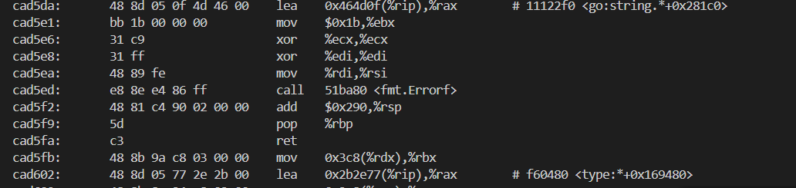
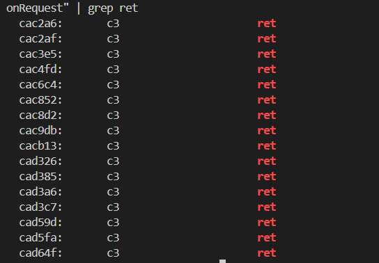
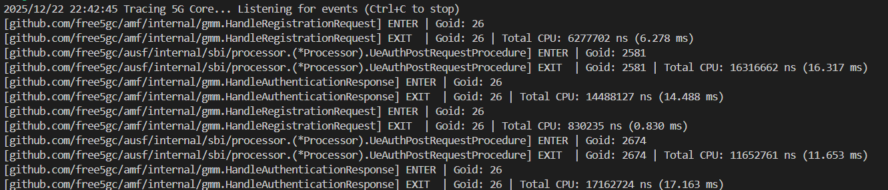

# Tracing the latency of the 5G Registration Procedure with eBPF
>[!NOTE]
> Author: Chia-Hui, Chen
> Date: 2025/12/24
---
## **Overview**
In modern cloud-native architectures, system complexity has reached unprecedented levels. When performance bottlenecks occur in high-performance, high-concurrency systems, developers need tools that can reach deep into the system's lower layers to pinpoint the exact sources of latency. This is where eBPF (extended Berkeley Packet Filter) comes into play.
### Why eBPF?
eBPF allows us to dynamically inject "probes" into both the kernel and user space without modifying the target program's source code or performing a recompilation. For many debugging and optimization scenarios, eBPF serves as an excellent diagnostic tool, offering the following core advantages:

* **Non-intrusive Observation**
    It transparently collects performance data without interfering with the business logic. This means we can perform deep-dive analysis directly in a production environment without worrying about modifying code.

* **A Bridge Between Kernel and User** 
    It doesn't just track user-space function calls via Uprobes; it simultaneously monitors Kprobes (kernel probes) and scheduling events. This cross-layer observability allows for "complete" monitoring of a function's lifecycle — capturing not only its active execution time but also any instances where it was descheduled or blocked by the kernel.

In this article, we will apply these eBPF capabilities to a real-world high-concurrency scenario: Tracing the latency of the 5G Registration Procedure. By monitoring key functions within the 5G Registration Procedure in free5GC, we will demonstrate how to pinpoint bottlenecks that traditional tools miss, providing a transparent view of a 5G NAS message's journey through the Go runtime.

## **Background**
Before diving into performance bottleneck analysis, we must understand two key technical areas: how eBPF enables tracing and how Go’s low-level design makes this task exceptionally challenging.

### eBPF and the Mechanics of Uprobes
eBPF is a Linux kernel technology that allows us to execute custom programs within a sandboxed environment inside the kernel without modifying the kernel source code.
Through Uprobes (User-level Probes), we can attach directly to specific memory addresses within a binary. When the program reaches that point, the eBPF program is triggered to collect register and memory information. This allows us to observe the internal state of a program without modifying its source code and with minimal overhead.

### Challenges in Tracing Go Applications

1. ABIInternal: The Hidden Register Trap

    Since Go 1.17, Go has utilized a Register-based Calling Convention (ABIInternal). Unlike the standard C ABI or older Go versions that passed arguments on the stack, parameters are now distributed across registers like RAX, RBX, and RCX.

    * **Impact:** Generic eBPF tools that do not account for Go’s register mapping will capture meaningless data. We must manually locate these registers to extract correct information.

2. Stack Growth and the Risks of uretprobe

    Goroutine stacks are dynamic. When a function detects insufficient stack space, it calls runtime.morestack to expand, "moving" the entire stack content to a larger memory segment.

    * **Impact:** eBPF's uretprobe relies on modifying the return address upon function entry. If a stack move occurs mid-execution, the recorded return address becomes invalid, potentially causing the tracer to fail or, worse, crashing the application.

    * **Solution:** To ensure safety, we can replace uretprobe with manual calculations of function exit offsets, utilizing standard Uprobes to capture exit events accurately.

3. Invisibility of the G-M-P Scheduler

    The Linux kernel recognizes Threads, but remains unaware of Goroutines.

    * **Impact:** Measuring time at the thread level makes it impossible to distinguish which Goroutine is consuming resources or to account for kernel scheduling interference.
    * **Solution:** Instead of blind kernel-level tracing, we target the internal state transition point of the Go Runtime: runtime.casgstatus. By monitoring when a Goroutine enters _Grunning or _Gwaiting, we obtain actual CPU execution time from a "Goroutine-centric perspective.
    
4. Goroutine Migration Between Threads

    In Go's G-M-P scheduling model, a Goroutine is not pinned to a specific OS thread. A Goroutine might start executing on Thread A, get descheduled, and later resume on Thread B.

    * **The Impact:** Traditional eBPF tools often use the Thread ID (TID) as a key to store timestamps. If a Goroutine migrates during function execution, the exit probe on Thread B will fail to find the start time recorded by the entry probe on Thread A, leading to broken traces or corrupted data.
    * **Solution:** Instead of relying on TID, we extract the Goid (Goroutine ID) directly from the Go runtime. On x86_64, the g pointer is stored in the R14 register. By reading the goid field from the g struct, we obtain a persistent identifier that follows the Goroutine across different threads. Using Goid as our primary key ensures that our timing remains accurate regardless of thread migration.

    
## **Methodology**

### Locating the Entry and Exit Points of the function
To capture the Entry and Exit Points of the function, we can use `objdump` command to analyze the disassembled binary.
> Note: Function addresses are not fixed and will change every time the program is recompiled. Always re-verify the offsets for your current binary.

Example Command:

``` bash
objdump -d ./amf --disassemble="github.com/free5gc/amf/internal/gmm.HandleRegistrationRequest"
```
The output will be like

We can use `grep` to quickly find all ret instruction addresses.
``` bash 
objdump -d ./amf --disassemble="github.com/free5gc/amf/internal/gmm.HandleRegistrationRequest" | grep ret
```

`0xcac2a6` is one of the ret instruction address.
> Note: Every ret instruction within the function must be traced to ensure the exit event is captured regardless of the execution path.

We can use `head -n 10` to find the entry.
``` bash
objdump -d ./amf --disassemble="github.com/free5gc/amf/internal/gmm.HandleRegistrationRequest" | head -n 10
```

`0xcabf80` is the entry address.

`nm` can also be used to find the entry.
``` bash
nm ./amf | grep -w "github.com/free5gc/amf/internal/gmm.HandleRegistrationRequest"
```


> Note: Go's compiler may "inline" small functions for performance. If a function is inlined, it loses its unique symbol and address, making it untraceable via eBPF. To prevent this, you must add the //go:noinline compiler directive directly above the function definition:
``` go
//go:noinline
func YourFunction() { ... }
```
### Get information from Register (ABIInternal)
#### Get goid
To trace Go applications effectively, we need a persistent way to identify a Goroutine as it moves across different OS threads. This is where the Goid comes in. Extracting it requires two pieces of information: the location of the "g" pointer and the memory offset of the goid field.

1. Finding the G-Pointer via R14 
    In the x86_64 architecture, Go’s ABIInternal convention stores the pointer to the current Goroutine structure (runtime.g) in the R14 register.
    * **The Logic:** Whenever an eBPF probe is triggered, we read the value of R14 to get the memory address of the current Goroutine's "home" in memory.
2. Using `pahole` to Locate the Offset
    ```bash
    pahole -C "runtime.g" ./amf
    ```
    the output will be like:
    ```bash
            struct runtime.g {
                runtime.stack              stack;                /*     0    16 */
                uintptr                    stackguard0;          /*    16     8 */
                uintptr                    stackguard1;          /*    24     8 */
                runtime._panic *           _panic;               /*    32     8 */
                runtime._defer *           _defer;               /*    40     8 */
                runtime.m *                m;                    /*    48     8 */
                runtime.gobuf              sched;                /*    56    48 */
                /* --- cacheline 1 boundary (64 bytes) was 40 bytes ago --- */
                uintptr                    syscallsp;            /*   104     8 */
                uintptr                    syscallpc;            /*   112     8 */
                uintptr                    syscallbp;            /*   120     8 */
                /* --- cacheline 2 boundary (128 bytes) --- */
                uintptr                    stktopsp;             /*   128     8 */
                void *                     param;                /*   136     8 */
                internal/runtime/atomic.Uint32 atomicstatus;     /*   144     4 */
                uint32                     stackLock;            /*   148     4 */
                uint64                     goid;                 /*   152     8 */
                runtime.guintptr           schedlink;            /*   160     8 */
                int64                      waitsince;            /*   168     8 */
                runtime.waitReason         waitreason;           /*   176     1 */
                bool                       preempt;              /*   177     1 */
                bool                       preemptStop;          /*   178     1 */
                                            .
                                            .
                                            .
                uint32                     sig;                  /*   220     4 */
                struct []uint8             writebuf;             /*   224    24 */
                uintptr                    sigcode0;             /*   248     8 */
                /* --- cacheline 4 boundary (256 bytes) --- */
                uintptr                    sigcode1;             /*   256     8 */
                uintptr                    sigpc;                /*   264     8 */
                uint64                     parentGoid;           /*   272     8 */
                uintptr                    gopc;                 /*   280     8 */
                                            .
                                            .
                                            .
                /* --- cacheline 6 boundary (384 bytes) --- */
                runtime.synctestBubble *   bubble;               /*   384     8 */
                runtime.gTraceState        trace;                /*   392    32 */
                int64                      gcAssistBytes;        /*   424     8 */
                uintptr                    valgrindStackID;      /*   432     8 */

                /* size: 440, cachelines: 7, members: 61 */
                /* sum members: 439, holes: 1, sum holes: 1 */
                /* last cacheline: 56 bytes */
        };
    ```
    We can find that the offset of goid is 152
    ```bash
    uint64                     goid;                 /*   152     8 */
    ```
    > Note: This offset is version-dependent and should be verified using pahole for your specific Go runtime.
    This tells us that goid is located 152 bytes from the start of the g struct. Therefore, the logic for our BPF program is:$$\text{Goid} = \text{Value at } (R14 + 152)$$
    ``` c
    static __always_inline u64 get_goid(struct pt_regs *ctx) {
        void *g_ptr = (void *)(ctx->r14);
        u64 goid;
        bpf_probe_read_user(&goid, sizeof(goid), (void *)(g_ptr + 152));
        return goid;
    }
    ```
> Note: Go Runtime and all its Goroutines operate entirely in User Space. So we should use `bpf_probe_read_user` to ensures that the data is copied safely from the User Space process into a kernel buffer before we attempt to analyze it.

#### Tracing State Transitions: Capturing casgstatus Arguments
To calculate the actual "CPU Time" spent on a task, we must know when a Goroutine is actively running (_Grunning) and when it switch to other state like _Gwaiting. This transition is handled by the internal function runtime.casgstatus.

1. Function Signature and Register Mapping
    The function is defined in the Go runtime as:
    ```Go
    func casgstatus(gp *g, oldval, newval uint32)
    ```
    Because Go uses a Register-based ABI, these arguments are not on the stack but are passed through CPU registers. On x86_64, the mapping is as follows:

    `gp` (The G being modified): Stored in **RAX**.
    `oldval` (The previous state): Stored in **RBX**.
    `newval` (The target state): Stored in **RCX**.
2. The Implementation Method
    When we attach a Uprobe to runtime.casgstatus, our BPF C code uses specific macros to pull these values directly from the registers:
    ``` c
    SEC("uprobe/runtime.casgstatus")
    int uprobe_casgstatus(struct pt_regs *ctx) {
        void *gp = (void *)ctx->ax;; 
        u32 oldval = (u32)ctx->bx;
        u32 newval = (u32)ctx->cx;

        u64 target_goid = bpf_probe_read_user(&goid, sizeof(goid), (void *)((u64)gp + 152));

        // handle logic
        return 0;
    }
    ```
    By monitoring these transitions, we can distinguish between Wall Time and CPU Time (the time actually spent processing), providing a much clearer picture of where the function is struggling.

## **Implementation**
The following is the source code to trace the latency of  5G Registration Procedure.
> Note: all the following contents are based on x86_64.
### Source Code
The header file of eBPF
```c
//trace.h
#ifndef __TRACER_H__
#define __TRACER_H__

#define user_pt_regs pt_regs

#include <bpf/bpf_helpers.h>
#include <bpf/bpf_tracing.h>
#include <bpf/bpf_core_read.h>

// Go runtime status
#define G_IDLE 0
#define G_RUNNABLE 1
#define G_RUNNING 2
#define G_SYSCALL 3
#define G_WAITING 4
#define G_MORIBUND_UNUSED 5
#define G_DEAD 6
#define G_ENQUEUE_UNUSED 7
#define G_COPYSTACK 8
#define G_PREEMPTED 9

// Offset
#define OFFSET_GOID    152
#define OFFSET_STARTPC 296
#define OFFSET_GOPC    280

// Register (x86-64 Go ABI)
#define GO_G_REG(ctx) (ctx->r14)
#define GO_ARG1(ctx)  (ctx->ax)
#define GO_ARG2(ctx)  (ctx->bx)
#define GO_ARG3(ctx)  (ctx->cx)
#define GO_ARG4(ctx)  (ctx->di)
#define GO_ARG5(ctx)  (ctx->si)

#endif 
```
The eBPF tracer source code
```c
// tracer.bpf.c
#include "vmlinux.h"
#include <bpf/bpf_helpers.h>
#include <bpf/bpf_tracing.h>
#include <bpf/bpf_core_read.h>

typedef __u64 u64;
typedef __u32 u32;
typedef __u8  u8;

// key for tracking function calls per goroutine
struct proc_key {
    u64 goid;
    u64 func_id;
};

// goroutine CPU time tracking structure
struct goid_clock {
    u64 total_cpu_ns;
    u64 last_start_ns;
    u8  is_on_cpu;
};

// event structure for ring buffer
struct event_t {
    u64 goid;
    u64 total_cpu_ns;
    u32 event_type; 
    u64 func_id; 
};

#define EVENT_ENTER 1
#define EVENT_EXIT  2

#include "tracer.h" 

// global map to track goid CPU time
struct {
    __uint(type, BPF_MAP_TYPE_HASH);
    __uint(max_entries, 1024);
    __type(key, u64); // goid
    __type(value, struct goid_clock);
} goid_clocks SEC(".maps");

// map to store entry snapshots
struct {
    __uint(type, BPF_MAP_TYPE_HASH);
    __uint(max_entries, 2048);
    __type(key, struct proc_key); // goid + func_id 
    __type(value, u64);           // snapshot vtime
} g_stats SEC(".maps");

struct {
    __uint(type, BPF_MAP_TYPE_RINGBUF);
    __uint(max_entries, 256 * 1024);
} events SEC(".maps");

// calculate accumulated vtime for a given goid
static __always_inline u64 get_accumulated_vtime(u64 goid) {
    struct goid_clock *c = bpf_map_lookup_elem(&goid_clocks, &goid);
    if (!c) return 0;
    u64 total = c->total_cpu_ns;
    if (c->is_on_cpu) {
        total += (bpf_ktime_get_ns() - c->last_start_ns);
    }
    return total;
}
// get goid from pt_regs
static __always_inline u64 get_goid(struct pt_regs *ctx) {
    void *g_ptr = (void *)GO_G_REG(ctx);
    u64 goid;
    bpf_probe_read_user(&goid, sizeof(goid), (void *)(g_ptr + OFFSET_GOID));
    return goid;
}
// get goid from gp pointer
static __always_inline u64 get_goid_from_gp(void *gp) {
    u64 goid;
    bpf_probe_read_user(&goid, sizeof(goid), (void *)((u64)gp + OFFSET_GOID));
    return goid;
}
// enter uprobe
SEC("uprobe/handle_entry")
int handle_entry(struct pt_regs *ctx) {
    u64 goid = get_goid(ctx);
    u64 now = bpf_ktime_get_ns();
    u64 cookie = bpf_get_attach_cookie(ctx); 

    // initialize goid tracking map if not exists
    struct goid_clock *c = bpf_map_lookup_elem(&goid_clocks, &goid);
    if (!c) {
        struct goid_clock init_c = { .last_start_ns = now, .is_on_cpu = 1, .total_cpu_ns = 0 };
        bpf_map_update_elem(&goid_clocks, &goid, &init_c, BPF_ANY);
    }

    // store entry snapshot
    struct proc_key key = { .goid = goid, .func_id = cookie };
    u64 vtime_snapshot = get_accumulated_vtime(goid);
    bpf_map_update_elem(&g_stats, &key, &vtime_snapshot, BPF_ANY);
    // submit event
    struct event_t *e = bpf_ringbuf_reserve(&events, sizeof(*e), 0);
    if (e) {
        e->goid = goid;
        e->event_type = EVENT_ENTER;
        e->total_cpu_ns = 0;
        e->func_id = cookie; 
        bpf_ringbuf_submit(e, 0);
    }
    return 0;
}
// enter uprobe for runtime.casgstatus
SEC("uprobe/runtime.casgstatus")
int uprobe_casgstatus(struct pt_regs *ctx) {
    void *gp = (void *)GO_ARG1(ctx);
    u32 oldval = (u32)GO_ARG2(ctx);
    u32 newval = (u32)GO_ARG3(ctx);
    u64 now = bpf_ktime_get_ns();
    u64 target_goid = get_goid_from_gp(gp);
    // lookup the goid tracking map
    struct goid_clock *c = bpf_map_lookup_elem(&goid_clocks, &target_goid);
    if (!c) return 0;

    // update CPU time tracking based on state transition
    if (oldval == G_RUNNING && newval != G_RUNNING) {
        if (c->is_on_cpu) {
            c->total_cpu_ns += (now - c->last_start_ns);
            c->is_on_cpu = 0;
        }
    } else if (oldval != G_RUNNING && newval == G_RUNNING) {
        c->last_start_ns = now;
        c->is_on_cpu = 1;
    }
    return 0;
}
// exit uprobe
SEC("uprobe/handle_exit")
int handle_exit(struct pt_regs *ctx) {
    u64 goid = get_goid(ctx);
    u64 cookie = bpf_get_attach_cookie(ctx); 
    struct proc_key key = { .goid = goid, .func_id = cookie };

    // retrieve the entry snapshot
    u64 *entry_vtime = bpf_map_lookup_elem(&g_stats, &key);
    if (!entry_vtime) return 0;

    // calculate CPU usage
    u64 current_vtime = get_accumulated_vtime(goid);
    u64 cpu_usage = current_vtime - *entry_vtime;
    // submit event
    struct event_t *e = bpf_ringbuf_reserve(&events, sizeof(*e), 0);
    if (e) {
        e->goid = goid;
        e->total_cpu_ns = cpu_usage;
        e->event_type = EVENT_EXIT;
        e->func_id = cookie; 
        bpf_ringbuf_submit(e, 0);
    }

    // delete the snapshot
    bpf_map_delete_elem(&g_stats, &key);
    return 0;
}

char LICENSE[] SEC("license") = "GPL";
```
The sample yaml file. Only some key functions are shown here for illustrative purposes.
```yaml
# config.yaml
binaries:
  - path: "../../free5gc/bin/amf"  # binary path
    symbols:
      - name: "github.com/free5gc/amf/internal/gmm.HandleRegistrationRequest"
        fun_id: 101 # use as cookie
        entry: 0xcabf80 # entry address   
        rets: # return addresses
          - 0xcac2a6
          - 0xcac2af
          - 0xcac3e5
          - 0xcac4fd
          - 0xcac6c4
          - 0xcac852
          - 0xcac8d2
          - 0xcac9db
          - 0xcacb13
          - 0xcad326
          - 0xcad385
          - 0xcad3a6
          - 0xcad3c7
          - 0xcad59d
          - 0xcad5fa
          - 0xcad64f
      - name: "github.com/free5gc/amf/internal/gmm.HandleAuthenticationResponse"
        fun_id: 102
        entry: 0xcb71a0
        rets:
          - 0xcb7422
          - 0xcb7443
          - 0xcb7464
          - 0xcb75e3
          - 0xcb7765
          - 0xcb7b1a
          - 0xcb7b74
          - 0xcb7b83
          - 0xcb7ba4
          - 0xcb7bb1
          - 0xcb7d91
          - 0xcb7f05
          - 0xcb8063
          - 0xcb81db
          - 0xcb84d0
          - 0xcb852a
          - 0xcb8539
      - name: "github.com/free5gc/amf/internal/gmm/message.SendRegistrationAccept"
        fun_id: 103
        entry: 0xca8440
        rets:
          - 0xca8938
          - 0xca89d8
          - 0xca8a4e
          - 0xca8ac4
          - 0xca8ad2
      - name: "github.com/free5gc/amf/internal/gmm/message.SendDeregistrationAccept"
        fun_id: 104
        entry: 0xca80a0
        rets:
          - 0xca8232
          - 0xca826b
          - 0xca82d2
          - 0xca8340
          - 0xca83b0
          - 0xca83be
      - name: "github.com/free5gc/amf/internal/gmm.handleRequestedNssai"
        fun_id: 105
        entry: 0xcb06e0
        rets:
          - 0xcb080d
          - 0xcb0c19
          - 0xcb0ec5
          - 0xcb1a7d
          - 0xcb1a8a
          - 0xcb1b37
      - name: "github.com/free5gc/amf/internal/gmm.HandleInitialRegistration"
        fun_id: 106
        entry: 0xcadae0
        rets:
          - 0xcadf77
          - 0xcadfc4
          - 0xcae019
          - 0xcae022
          - 0xcae512
      - name: "github.com/free5gc/amf/internal/gmm.AuthenticationProcedure"
        fun_id: 107
        entry: 0xcb4e60
        rets:
          - 0xcb4f98
          - 0xcb50bc
          - 0xcb5113
          - 0xcb5354
          - 0xcb541b
          - 0xcb554e
          - 0xcb561c
      - name: "github.com/free5gc/amf/internal/gmm.contextTransferFromOldAmf"
        fun_id: 108
        entry: 0xcad6c0
        rets:
          - 0xcad99a
          - 0xcad9db
          - 0xcada2d
          - 0xcada73
          - 0xcada7c
  - path: "../../free5gc/bin/ausf"
    symbols:
      - name: "github.com/free5gc/ausf/internal/sbi/processor.(*Processor).UeAuthPostRequestProcedure"
        fun_id: 203
        entry: 0xb8fda0
        rets:
          - 0xb902ce
          - 0xb90a57
          - 0xb90b6d
          - 0xb90c14
          - 0xb90e9e
          - 0xb911b7
```
> Note: In a real production environment, this list can be expanded to a large number of functions across all 5GC NFs (SMF, UPF, PCF, etc.).

Python script for configuration generation.
```python
# gen_config.py
import subprocess
import re
import sys
import shlex

def get_offsets(binary, search_pattern):
    try:
        nm_cmd = f"nm -n {binary} | grep {shlex.quote(search_pattern)}"
        nm_output = subprocess.check_output(nm_cmd, shell=True).decode().splitlines()
        
        if not nm_output:
            print(f"Error: Symbol matching '{search_pattern}' not found.")
            return None

        target_line = nm_output[0].split()
        entry_addr_hex = target_line[0]
        full_symbol_name = target_line[2]
        entry_addr = int(entry_addr_hex, 16)

        print(f"[*] Found Full Symbol: {full_symbol_name}")
        print(f"[*] Entry Address: 0x{entry_addr:x}")

        obj_cmd = f"objdump -d {binary} --disassemble={shlex.quote(full_symbol_name)}"
        dump_out = subprocess.check_output(obj_cmd, shell=True).decode()
        rets = re.findall(r'^\s*([0-9a-f]+):\s+(?:c3|c2|cb|ca)\s+ret', dump_out, re.MULTILINE)
        
        ret_addrs = [int(r, 16) for r in rets]
        
        return entry_addr, ret_addrs, full_symbol_name

    except subprocess.CalledProcessError as e:
        print(f"Exec error: {e}")
        return None


binary_path = "~/free5gc/bin/ausf" # binary path
target_function = "UeAuthPostRequestProcedure" # function name to search
fun_id = 103  # function ID for tracing

result = get_offsets(binary_path, target_function)

if result:
    entry, rets, full_name = result
    print(f"- name: \"{full_name}\"")
    print(f"  fun_id: {fun_id}")
    print(f"  entry: 0x{entry:x}")
    print(f"  rets:")
    for r in rets:
        print(f"    - 0x{r:x}")
```
A Go-based eBPF loader for probe orchestration and event processing.
```go
// main.go
package main
//go:generate bpf2go -target amd64 bpf ../tracer.bpf.c
import (
    "bytes"
    "encoding/binary"
    "errors"
    "fmt"
    "log"
    "os"
    "os/signal"
    "syscall"

    "github.com/cilium/ebpf/link"
    "github.com/cilium/ebpf/ringbuf"
    "github.com/cilium/ebpf/rlimit"
    "gopkg.in/yaml.v3" 
)

type Config struct {
    Binaries []BinaryConfig `yaml:"binaries"`
}
// BinaryConfig defines a binary to trace and its symbols.
type BinaryConfig struct {
    Path    string         `yaml:"path"`
    Symbols []SymbolConfig `yaml:"symbols"`
}
// SymbolConfig defines a function to trace within a binary.
type SymbolConfig struct {
    Name  string   `yaml:"name"`
    FunID uint64   `yaml:"fun_id"`
    Entry uint64   `yaml:"entry"`
    Rets  []uint64 `yaml:"rets"`
}
// Event types
type bpfEventT struct {
    Goid       uint64 // Goroutine ID
    TotalCpuNs uint64 // valid only for exit events
    EventType  uint32 // 1 for enter, 2 for exit
    _          [4]byte // Padding to align to 8 bytes
    FuncId     uint64  // Function ID
}
const (
	EventEnter = 1
	EventExit  = 2
)

func main() {
    if err := rlimit.RemoveMemlock(); err != nil {
        log.Fatal(err)
    }

    // load config.yaml
    configFile, err := os.ReadFile("config.yaml") // path to your config file
    if err != nil {
        log.Fatalf("failed to read config: %v", err)
    }
    var config Config
    if err := yaml.Unmarshal(configFile, &config); err != nil {
        log.Fatalf("failed to parse yaml: %v", err)
    }

    // load BPF Objects
    var objs bpfObjects
    if err := loadBpfObjects(&objs, nil); err != nil {
        log.Fatalf("loading objects: %v", err)
    }
    defer objs.Close()

    // create function ID to name map
    idToName := make(map[uint64]string)
    var links []link.Link
    defer func() {
        for _, l := range links {
            l.Close()
        }
    }()

    // loop through binaries and symbols to attach uprobes
    for _, bin := range config.Binaries {
        ex, err := link.OpenExecutable(bin.Path)
        if err != nil {
            log.Printf("Warning: opening executable %s failed: %v", bin.Path, err)
            continue
        }

        for _, sym := range bin.Symbols {
            // create function ID to name mapping
            idToName[sym.FunID] = sym.Name

            // attach Entry Uprobe with Cookie
            enL, err := ex.Uprobe(sym.Name, objs.HandleEntry, &link.UprobeOptions{
                Offset: 0x0,
                Cookie: sym.FunID,
            })
            if err != nil {
                log.Fatalf("failed to attach entry for %s: %v", sym.Name, err)
            }
            links = append(links, enL)

            // attach Exit Uprobes with Cookie
            for _, retAddr := range sym.Rets {
				retOffset := retAddr - sym.Entry
                exL, err := ex.Uprobe(sym.Name, objs.HandleExit, &link.UprobeOptions{
                    Offset: retOffset,
                    Cookie: sym.FunID,
                })
                if err != nil {
                    log.Fatalf("failed to attach exit at 0x%x for %s: %v", retOffset, sym.Name, err)
                }
                links = append(links, exL)
            }
        }

        // attach casgstatus uprobe
        casgL, err := ex.Uprobe("runtime.casgstatus", objs.UprobeCasgstatus, nil)
        if err != nil {
            log.Printf("Warning: casgstatus attach failed for %s: %v", bin.Path, err)
        } else {
            links = append(links, casgL)
        }
    }

    log.Printf("Tracing 5G Core... Listening for events (Ctrl+C to stop)")

    // read events from ring buffer
    rd, err := ringbuf.NewReader(objs.Events)
    if err != nil {
        log.Fatalf("creating ringbuf reader: %v", err)
    }
    defer rd.Close()

    sig := make(chan os.Signal, 1)
    signal.Notify(sig, os.Interrupt, syscall.SIGTERM)
    go func() {
        <-sig
        log.Println("Received interrupt, shutting down...")
        rd.Close()
    }()

    for {
        record, err := rd.Read()
        if err != nil {
            if errors.Is(err, ringbuf.ErrClosed) {
                return
            }
            log.Printf("reading from ringbuf: %v", err)
            continue
        }

        var event bpfEventT
        if err := binary.Read(bytes.NewBuffer(record.RawSample), binary.LittleEndian, &event); err != nil {
            log.Printf("parsing event: %v", err)
            continue
        }

        // print event info
        funcName := idToName[event.FuncId]
        if funcName == "" {
            funcName = "Unknown_Function"
        }

        switch event.EventType {
        case EventEnter:
            fmt.Printf("[%s] ENTER | Goid: %d\n", funcName, event.Goid)
        case EventExit:
            fmt.Printf("[%s] EXIT  | Goid: %d | Total CPU: %d ns (%.3f ms)\n",
                funcName, event.Goid, event.TotalCpuNs, float64(event.TotalCpuNs)/1e6)
        }
    }
}
```
### How to use
1. Generate vmlinux.h 
```bash
bpftool btf dump file /sys/kernel/btf/vmlinux format c > vmlinux.h
```
2. Generate `bpf_bpfel.o` and `bpf_bpfel.go`
    By running go generate, we produce `bpf_bpfel.o` (the compiled bytecode) and `bpf_bpfel.go` (the Go bindings). These files act as the bridge, allowing our Go application to load the eBPF program into the kernel.
```bash
go generate
```

3. Build eBPF loader
```bash
go build -o tracer
```
4. Execute eBPF loader
```bash
sudo ./tracer
```
## **Result**

## **Conclusion**
In this article, we have navigated the intricate intersection of eBPF technology and the Go runtime to address one of the challenges in 5G core network optimization: transparent, high-precision latency tracing.


**References**

- [free5GC](https://github.com/free5gc/free5gc)
- [xgotop](https://github.com/ozansz/xgotop)
- [30 篇文帶你用 eBPF 與 Golang 打造 Linux Scheduler系列 第 10 篇](https://ithelp.ithome.com.tw/articles/10384032)
- [golang uretprobe的崩溃与模拟实现](https://www.cnxct.com/golang-uretprobe-tracing/)
- [Golang Goroutine 與 GMP 原理全面分析](https://alanzhan.dev/post/2022-01-24-golang-goroutine/)
- [References: runtime.casgstatus](https://ref.gotd.dev/use/runtime..casgstatus%5Ef43d9.html)

**About Me**
Hi, I'm Chia-Hui Chen. I'm currently diving into 5G technology and the free5gc project. I hope you find this blog valuable! Feel free to reach out if you have any feedback or would like to discuss anything further.

- GitHub: [chchen7](https://github.com/chchen7)