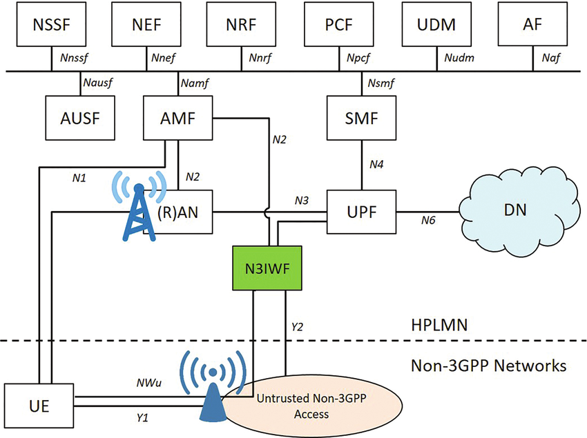
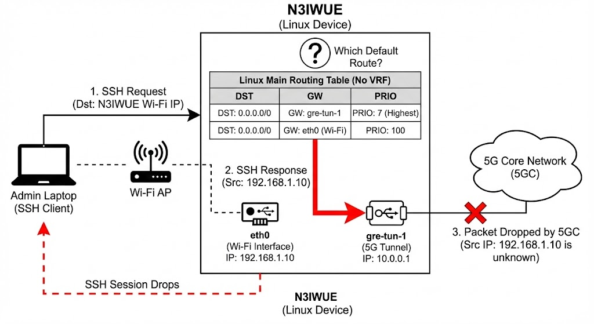
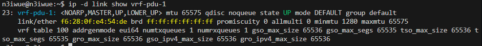
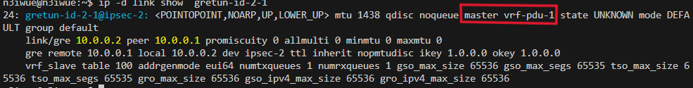
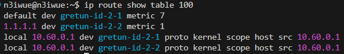
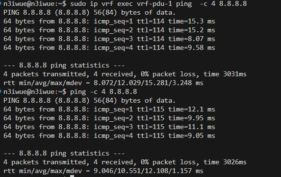

# Beyond Standard Networking: Implementing 5G VRF Isolation in Go
>[!NOTE]
> Author: HUANG, YUAN-CHUN
> Date: 2025/12/31
---

## 1. Introduction
According to 3GPP TS 23.501, the 5G System (5GS) is designed to be access-agnostic, allowing User Equipment (UE) to connect to the 5G Core Network (5GC) via Non-3GPP Access Networks (e.g., untrusted Wi-Fi or wired networks).

### 1.1. Definition and Functional Role

An **N3IWUE** (Non-3GPP Interworking UE) is a UE that utilizes the NWu reference point to communicate with the **N3IWF** (Non-3GPP Interworking Function). Its primary role is to establish a secure connection over an untrusted non-3GPP access to reach the 5GC.



### 1.2. Protocol Stack and Interface
Per 3GPP specifications, the N3IWUE must implement a specific dual-stack architecture to separate signaling from data:

+ Control Plane (CP): The UE establishes an IKEv2 security association with the N3IWF to create a Signaling IPsec SA. NAS (Non-Access Stratum) messages are then encapsulated and transmitted over this secure tunnel to the AMF (Access and Mobility Management Function).

+ User Plane (UP): For each established PDU Session, the UE creates a separate Data IPsec SA. User data is encapsulated using GRE (Generic Routing Encapsulation) (as per TS 24.502) before being encrypted by IPsec and sent to the N3IWF, which forwards it to the UPF (User Plane Function).


### 1.3. Significance and Practical Use Cases
1. Untrusted Non-3GPP Access (TS 23.501 §4.2.8)
N3IWUE allows for the extension of 5G services to any IP-based network. The significance lies in Security Termination: the N3IWF acts as a security gateway, terminating the IPsec tunnels from the UE and interfacing with the 5GC via standard N2 (CP) and N3 (UP) interfaces.

2. PDU Session Resource Isolation
3GPP defines that a UE may support multiple PDU Sessions over non-3GPP access. Each PDU Session is associated with a specific QFI (QoS Flow Identifier).

3. Regulatory and Emergency Services
3GPP specifies procedures for Emergency Services over non-3GPP access, ensuring that even without a SIM card or cellular coverage, an N3IWUE can reach the 5GC for emergency calls if an N3IWF is reachable via Wi-Fi.
## 2. The Routing Black Hole — Default Route Hijacks and the Case of Disappearing Management Traffic
In the process of implementing the User Plane for an free5GC N3IWUE, we eventually reach the milestone where data starts flowing. Following the 3GPP TS 24.502 specification, the UE establishes multiple GRE tunnels based on the QoS Flow Identifier (QFI) assigned by the 5G Core (5GC).

However, as soon as the first tunnel—the Default QFI (QFI=1)—is activated, a silent but devastating networking conflict begins to brew.

### 2.1. The "Aggressive" Default Route
To ensure that the UE's general data traffic is steered into the 5G network, a common implementation practice is to inject a default route pointing to the GRE interface. For example:
``` bash
# A typical routing entry for QFI=1
ip route add 0.0.0.0/0 dev gre-tun-1 priority 7
```
In the Linux routing world, a ```priority``` (or ```metric```) of 7 is exceptionally low, giving it massive precedence over other routes. The logic seems sound: **"Unless there is a more specific path, send everything through the 5G tunnel."**
### 2.2. The Practical Disaster: The SSH "Black Hole"
Imagine your development setup: Your N3IWUE software is running on a Linux machine connected to your lab’s Wi-Fi. You are remotely managing this device via SSH from your laptop.

The moment your N3IWUE successfully establishes the PDU Session and injects that ``` priority 7 ``` default route, the disaster strikes: **Your SSH session instantly freezes and disconnects.**
#### What happened to the packets?
Let’s trace the journey of a single SSH response packet:

1. **Request Inbound:** Your laptop sends an SSH request to the N3IWUE via the Wi-Fi interface.

2. **Response Generated:** The N3IWUE generates a response packet. The Source IP is the Wi-Fi IP, and the Destination IP is your laptop’s IP.

3. **The Fatal Routing Decision:** The Linux kernel looks at the routing table.

    + It sees ```0.0.0.0/0 dev gre-tun-1 priority 7```.

    + Because your laptop’s IP isn't on the same local subnet as the Wi-Fi, the kernel decides this "external" packet must follow the highest-priority default route.

    + The Result: The SSH response packet, carrying a Wi-Fi Source IP, is forcefully pushed into the GRE Tunnel.

4. **The Black Hole:** The 5G Core receives a packet originating from a "Local Wi-Fi IP." Since this IP is completely unknown to the 5G internal routing domain, the 5GC drops the packet immediately.

Your management traffic has been hijacked by your own 5G data plane.

### 2.3. The Multi-Access Paradox
This scenario highlights a fundamental conflict in N3IWUE design: **Multi-access does not mean simple aggregation**.

According to 3GPP's vision, an N3IWUE must be "Multi-homed," meaning it should handle:

+ 5G Service Traffic: Which must traverse the GRE/IPsec tunnels.

+ Non-3GPP Management Traffic: Which must remain on the local Wi-Fi or Ethernet (e.g., SSH, DNS lookups, or OS updates).

If we rely on a single, global routing table (the ```main``` table), these two types of traffic will always fight for the default route. No matter how you tweak the ```priority``` values, one connection will inevitably break.
### 2.4. Conclusion: We Need "Parallel Universes"
Relying on a single "brain" (routing table) makes the N3IWUE implementation extremely fragile and practically impossible to manage remotely. To satisfy 3GPP's isolation requirements while keeping the device reachable, we need a way to isolate the 5G PDU Session traffic into its own world.

In the next chapter, we will explore how **Linux VRF (Virtual Routing and Forwarding)** allows us to create these "parallel universes," ensuring that 5G tunnels and local management traffic never cross paths.

## 3. Building Parallel Universes — The Architecture of VRF Isolation
Before we dive into the Go implementation, we must understand the "magic" that allows Linux to handle conflicting routes without breaking a sweat. To solve the SSH disconnection and PDU Session routing traps we encountered in Chapter 2, we rely on a powerful Linux kernel feature: **VRF**.
### 3.1. What is VRF? (Virtual Routing and Forwarding)
At its core, VRF is a Layer 3 (L3) isolation technology. If you are familiar with VLANs, you can think of VRF as the L3 equivalent.

+ VLAN (L2): Partitions a single physical switch into multiple logical switches by isolating Broadcast Domains.

+ VRF (L3): Partitions a single physical router (your Linux host) into multiple logical routers by isolating Routing Tables.

When an interface is assigned to a VRF, it no longer looks at the system's "Main" routing table. Instead, it operates within its own private FIB (Forwarding Information Base).

### 3.2. Key Concepts: L3mdev and Policy Routing
To implement VRF, modern Linux (Kernel 4.8+) uses a mechanism called L3mdev (Layer 3 Master Device).

+ **The Master Device:** The VRF itself is a virtual network interface (e.g., `vrf-pdu-1`). It acts as a "Master" to other interfaces.

+ **Enslavement:** When you "enslave" a GRE tunnel or an Ethernet port to a VRF, you are telling the kernel: "Any packet entering or leaving this interface must use the routing table associated with this VRF Master."

+ **The "Rule" of Priority:** By default, Linux queries routing tables in a specific order (Policy Routing). VRF automates this by creating a high-priority rule that redirects traffic based on the incoming interface.


### 3.3. Why VRF is the Perfect Match for N3IWUE
Why can't we just use standard routing? Here is why VRF is indispensable for 5G N3IWUE implementations:

1. Solving the Default Route Conflict
As we saw, when the 5G User Plane needs a `0.0.0.0/0` route, it hijacks the whole system. By putting the 5G GRE tunnel into a VRF, that Default Route stays inside the VRF table. The "Main" table (used by your Wi-Fi and SSH) remains untouched and clean.

2. Support for Overlapping IP Addresses
In 5G, it is common for different PDU Sessions to be assigned the same or overlapping private IP ranges (e.g., two different customers both using `10.0.0.1`). Without VRF, the kernel would be confused. With VRF, each `10.0.0.1` lives in its own "Parallel Universe" (separate table), so they never collide.

3. Maintaining Management Reachability
With VRF, your SSH, NTP, and DNS traffic can continue to use the Main Routing Table via the physical Wi-Fi/Ethernet interface. The 5G data traffic is isolated in the VRF Table. This ensures the device remains manageable even when high-priority 5G tunnels are active.
### 3.4. The Hierarchy of Isolation: VRF, GRE, and XFRM
In the N3IWUE architecture, we implement the 5G User Plane using a Master-Slave hierarchy within the Linux kernel. This layered approach ensures that 5G data traffic remains strictly isolated from local management services.

**The Logical Roles**
+ **VRF (The Master Container):** Acts as the foundational "Parallel Universe." It provides a dedicated L3 Routing Context (FIB), ensuring that 5G default routes do not conflict with the system's main table.

+ **GRE (The Tunneling Slave):** Handles 5G-specific encapsulation (QFI mapping). It is "enslaved" to the VRF master, inheriting its routing isolation.

+ **XFRM (The Security Engine):** The IPsec transformation layer. It monitors traffic leaving the GRE interface and encrypts it into ESP (Encapsulated Security Payload) before physical transmission.

**The Packet Journey (Egress Flow)**
To understand how these components interact in real-time, follow the path of an outgoing 5G data packet:

1. Selection: A socket bound to the VRF initiates a request.

2. Routing: The kernel queries the VRF Table, directing the packet to the GRE interface.

3. Encapsulation: The GRE layer wraps the packet (Adding the GRE header).

4. Encryption: The XFRM engine intercepts the GRE packet and encrypts it (Adding the ESP header).

5. Transmission: The final encrypted packet is sent via the Physical Interface (e.g., Wi-Fi) to the N3IWF.

## 4. Orchestrating Parallel Universes — The Go Implementation

In the previous chapters, we analyzed the routing conflicts inherent in 5G N3IWUE and how **VRF** provides the logical isolation required to solve them. Now, let’s look at the actual Go implementation. We will break this down into two parts: the **VRF Factory** and the **NAS Event Handler**.

### 4.1. The VRF Factory: Dynamic Creation and Lifecycle
To manage VRF devices dynamically, we implement a robust utility function. This function ensures idempotency (checking if the VRF already exists) and registers the interface for automatic cleanup to prevent resource leaks.
``` go 
package vrf

import (
    "fmt"
    "github.com/vishvananda/netlink"
    "github.com/free5gc/n3iwue/pkg/context"
)

func CreateOrGetVRF(vrfName string, tableID int) (netlink.Link, error) {
    // Step 1: Check if the VRF device already exists
    link, err := netlink.LinkByName(vrfName)
    if err == nil {
        if vrf, ok := link.(*netlink.Vrf); ok {
            if vrf.Table == uint32(tableID) {
                return vrf, nil // VRF exists and matches the Table ID
            }
            return nil, fmt.Errorf("VRF %s mismatch: need Table %d, got %d", vrfName, tableID, vrf.Table)
        }
        return nil, fmt.Errorf("Device %s exists but is not a VRF", vrfName)
    }

    // Step 2: Define and Create the L3mdev (VRF) device
    vrfLink := &netlink.Vrf{
        LinkAttrs: netlink.LinkAttrs{Name: vrfName},
        Table:     uint32(tableID), // Link to a dedicated Routing Table
    }

    if err := netlink.LinkAdd(vrfLink); err != nil {
        return nil, fmt.Errorf("Failed to add VRF %s: %v", vrfName, err)
    }

    // Step 3: Bring the interface UP
    if err := netlink.LinkSetUp(vrfLink); err != nil {
        return nil, fmt.Errorf("Failed to set VRF %s UP: %v", vrfName, err)
    }

    // Step 4: Register for automatic cleanup
    n3ueSelf := context.N3UESelf()
    var createdLink netlink.Link = vrfLink
    n3ueSelf.CreatedIface = append(n3ueSelf.CreatedIface, &createdLink)

    return vrfLink, nil
}

```

### 4.2. The Trigger: Handling PDU Session Establishment
The most critical moment in the N3IWUE lifecycle is when the 5G Core sends a `PDUSessionEstablishmentAccept`. This NAS message contains the UE's assigned IP and QoS information.
``` go
func (s *Server) handleDLNASTransport(evt *context.HandleDLNASTransportEvt) {
    nwucpLog := logger.NWuCPLog
    n3ueSelf := s.Context()
    nasMsg := evt.NasMsg

    // ... [NAS Decoding Logic] ...

    switch nasMsg.GsmMessage.GetMessageType() {
    case nas.MsgTypePDUSessionEstablishmentAccept:
        // 1. Extract PDU Address assigned by 5GC
        pduAddress, _ := nasPacket.GetPDUAddress(nasMsg.GsmMessage.PDUSessionEstablishmentAccept)
        n3ueSelf.N3ueInfo.DnIPAddr = pduAddress.String()

        // 2. Dynamically define VRF parameters
        vrfName := fmt.Sprintf("vrf-pdu-%d", n3ueSelf.PduSessionCount)
        vrfTableID := 100 + int(n3ueSelf.PduSessionCount)

        // 3. Create the VRF (The Parallel Universe)
        vrfLink, err := vrf.CreateOrGetVRF(vrfName, vrfTableID)
        if err != nil {
            nwucpLog.Errorf("VRF setup failed: %v", err)
            return
        }

        // 4. Setup GRE Tunnels (The Transport Layer)
        newGREName := fmt.Sprintf("%s-id-%d", n3ueSelf.N3ueInfo.GreIfaceName, n3ueSelf.N3ueInfo.XfrmiId)
        linkGREs, _ := gre.SetupGreTunnels(...)

        // 5. Enslave and Route
        for qfi, link := range linkGREs {
            tunnel := *link
            
            // KEY STEP: Bind the GRE interface to the VRF Master
            // This ensures all ingress/egress on this tunnel use the VRF context
            if err := netlink.LinkSetMaster(tunnel, vrfLink); err != nil {
                nwucpLog.Errorf("Failed to bind %s to VRF %s", tunnel.Attrs().Name, vrfName)
                continue
            }

            // 6. Inject routes into the VRF's private Routing Table
            priority := 1
            if qfi == uint8(1) { priority = 7 } // Default QFI route

            upRoute := &netlink.Route{
                LinkIndex: tunnel.Attrs().Index,
                Dst:       &net.IPNet{IP: targetAddr, Mask: targetMask},
                Priority:  priority,
                Table:     vrfTableID, // Target the isolated table, not 'main'
            }
            netlink.RouteAdd(upRoute)
        }
        n3ueSelf.PduSessionCount++
    }
}
```
### 4.3. Implementation Highlights

1. Dynamic L3 Isolation via VRF
Instead of a static routing configuration, our Go implementation utilizes the vishvananda/netlink library to orchestrate VRF devices on-the-fly. By assigning each PDU Session a unique VRF Table ID (e.g., 100+), we create a dedicated Forwarding Information Base (FIB), effectively isolating 5G User Plane traffic from the host’s management plane.

2. The "Enslavement" Mechanism (LinkSetMaster)
The core of our implementation lies in the "enslavement" of GRE tunnels. By programmatically calling LinkSetMaster(greLink, vrfLink), we bind the 5G User Plane (UP) interfaces to the VRF Master. This critical step ensures that any packet originating from or arriving at the tunnel is processed within the context of the VRF's private routing table, not the system's main table.

3. Explicit Table-Targeted Routing
To resolve the Default Route Hijacking issue (which previously caused SSH disconnections), we explicitly define the target table in our netlink.Route structures.

    + Main Table: Remains untouched, preserving local management connectivity (SSH, DNS).

    + VRF Table: Contains the 0.0.0.0/0 route for the 5G PDU Session. This granular control ensures that the high-priority 5G default route exists only within its own "Parallel Universe."

4. Automated Interface Lifecycle Management
Following software engineering best practices, we implemented an automatic cleanup mechanism. By registering every dynamically created VRF and GRE interface into a centralized CreatedIface slice within the UE context, the system can gracefully tear down all virtual resources during de-registration or unexpected crashes, preventing "interface leaks" in the Linux kernel.

## 5. Mission Accomplished — Verifying the Parallel Universe
After running our Go-based N3IWUE, we need to ensure that the infrastructure was built correctly and that the routing isolation actually works. In this chapter, we use standard Linux networking tools to audit our "Parallel Universe."
### 5.1. Verifying the Master-Slave Relationship
First, we check if the VRF device was created and if the GRE tunnels were successfully "enslaved" to it.
```bash
# Check the status of the VRF device
ip -d link show vrf-pdu-1
```


**What to look for**: You should see `type vrf table 100`.
```bash
# Verify that the GRE interface is a slave to the VRF
ip link show gretun-id-2-1
```


**What to look for**: Look for `master vrf-pdu-0` in the output. This confirms that the "Enslavement" we performed in Go (`LinkSetMaster`) was successful.
### 5.2. Auditing the Isolated Routing Table
The most critical part of our implementation is the separation of routing tables. We want to ensure the `0.0.0.0/0` route exists **only** in the VRF table, not the main table.
```bash
# Inspect the VRF-specific routing table
ip route show table 100
```

```bash
# Inspect the Main routing table
ip route show table main
```

### 5.3. Testing End-to-End Connectivity
Now, let's perform the ultimate test: Sending data through the 5G PDU Session while maintaining local connectivity.
1. Test 5G Connectivity (Inside the VRF)
We use the ip vrf exec command to force a process to run within the VRF context.
```bash
# Ping a public DNS through the 5G PDU Session
sudo ip vrf exec vrf-pdu-0 ping -c 4 8.8.8.8
```
2. Test Local Connectivity (Main Table)
Simultaneously, open a new terminal and ping the same address:
```bash
# Ping a public DNS through the 5G PDU Session
ping -c 4 8.8.8.8
```


3. Test Specific gre tunnel
```bash
sudo ip vrf exec vrf-pdu-0 ping -I 10.60.0.1 -c 4 8.8.8.8
```


## Acknowledgments
Building this N3IWUE implementation has been an intense but rewarding journey. This blog series would not have been possible without the mentorship of **Ian Chen** and **Alonza Tu**, whose guidance was instrumental in navigating the complexities of 5G networking and Linux kernel internals.

The code modifications and the VRF-based isolation logic discussed in this blog have been submitted as a Pull Request to the official repository: 👉 [Check out the PR on GitHub](https://github.com/free5gc/n3iwue/pull/21)