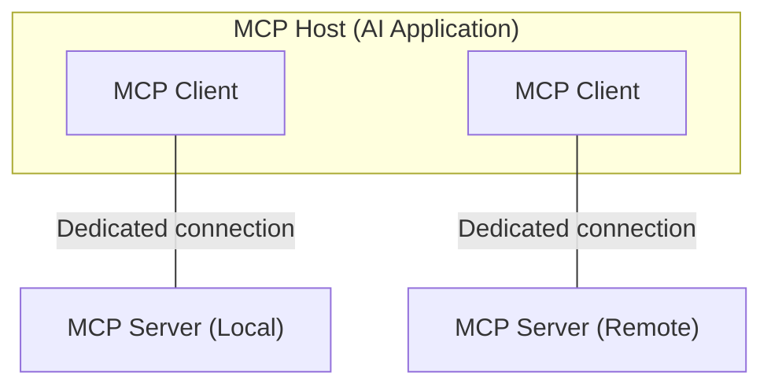
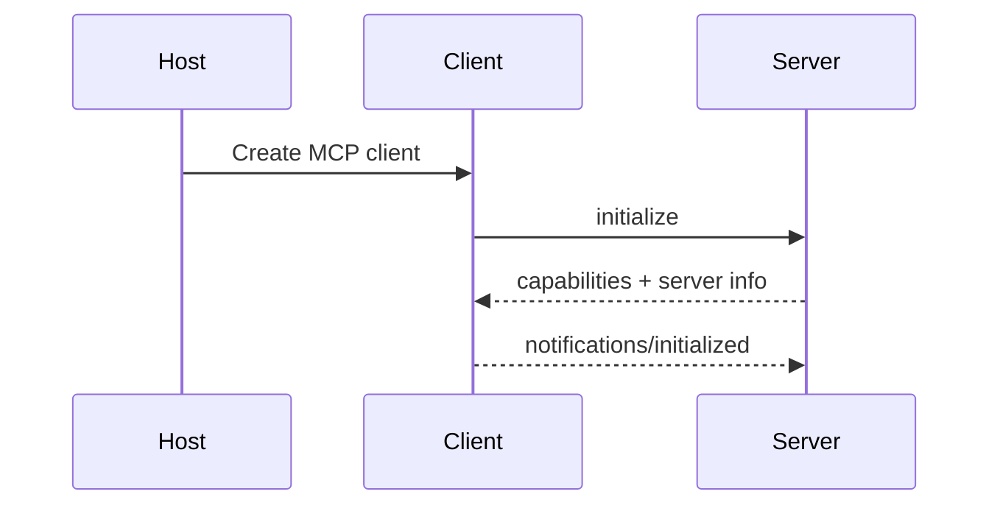
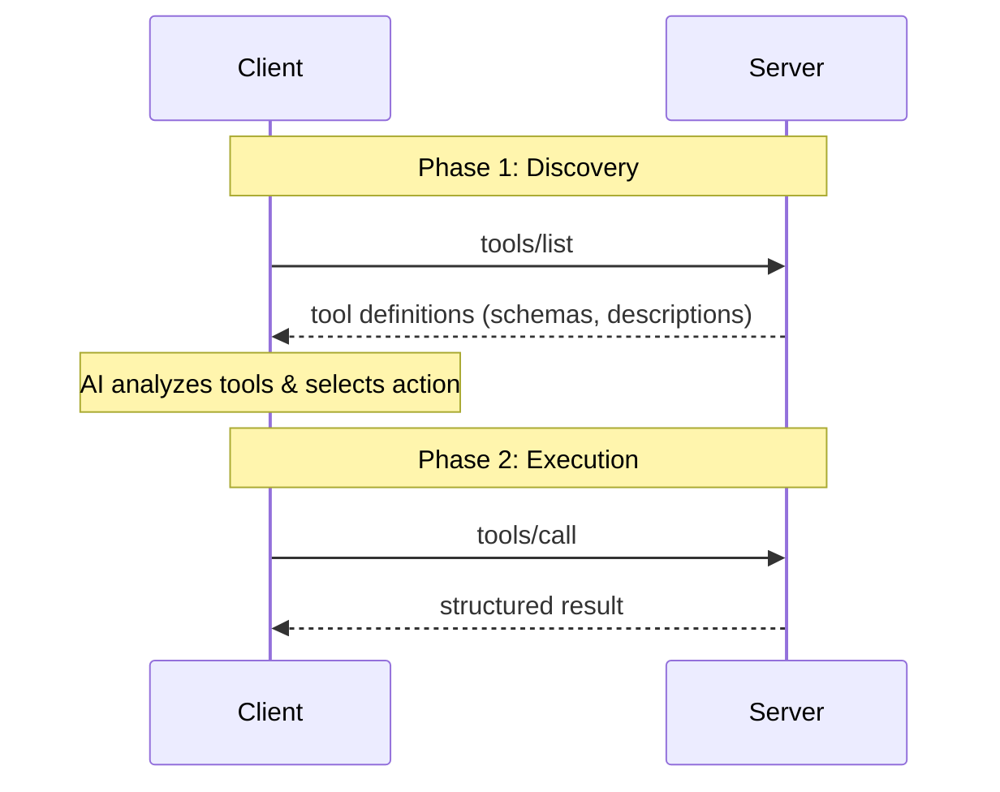
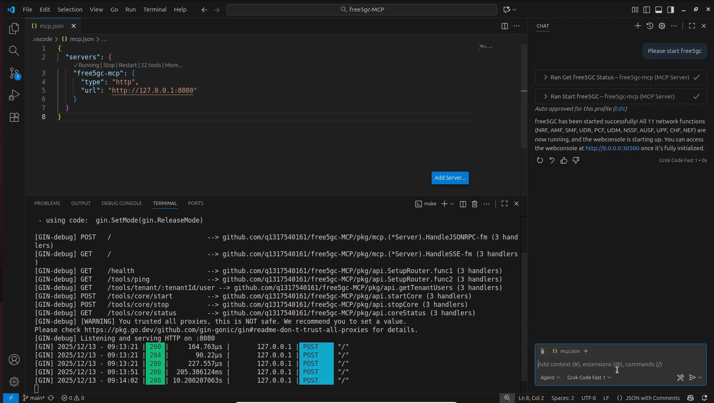
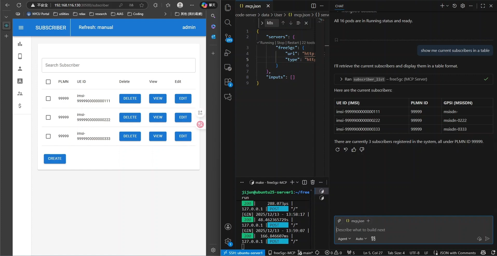

# MCP Server Integration with free5GC: Architecture and Use Cases

>[!NOTE]
> **Author:** [Ng Warren](https://github.com/warren0813)  
> **Date:** 2026/01/07

---

## **1. Introduction**

While free5GC is the gold standard for 3GPP-compliant research, its day-to-day operations remain burdensome. Managing Network Functions (NFs), dependencies, and subscriber provisioning relies on fragile, script-heavy workflows that scale poorly in complex lab environments.

AI assistants can bridge this gap by translating operator intent into action, but they require safe boundaries. The free5GC-MCP server provides this control layer. **Utilizing the Model Context Protocol (MCP), it replaces unrestricted shell access with a strict, typed interface**. This ensures that high-level requests—like "provision 10 UEs" or "restart the core"—are executed as deterministic, auditable free5GC operations.

---
### **1.1 Core Concepts of MCP**

At a high level, MCP defines who participates, what can be exchanged, and how communication happens. MCP follows a client–server architecture with a clear separation of responsibilities:

* **MCP Host:** The AI application users interact with (e.g. IDEs, desktop AI apps, chat interfaces).
  It owns the UI, the LLM, and user consent.

* **MCP Client:** A protocol component created by the Host.
  Each client maintains one dedicated connection to one MCP server.

* **MCP Server:** A standalone program that exposes tools, resources, and prompts to clients.



> This design allows a single AI application to safely coordinate **multiple independent systems** through a unified interface.

---

### **1.2 MCP Data Layer and Lifecycle**

MCP is a stateful protocol. Every connection begins with a lifecycle handshake that negotiates capabilities.

 **Initialization Flow:**



**During initialization:**

1. Protocol versions are negotiated
2. Supported primitives (tools, resources, prompts, notifications) are declared
3. Both sides know *exactly* what is allowed for the lifetime of the session

> This prevents undefined behavior and unsafe assumptions.

---

### **1.3 Tool Discovery and Execution**

Once initialized, clients dynamically discover server capabilities.

**Tool Discovery & Tool Execution**



The AI now knows:

* What tools exist
* What inputs they accept
* What actions are possible

> This structured flow enables **safe, typed, auditable actions** instead of free-form command execution.

---

### **1.4 Why use MCP?**
MCP solves the fragmentation problem between AI models and infrastructure. Instead of building custom integrations for every new AI tool, MCP provides a universal standard for connecting data and systems.

- **Write Once, Run Anywhere**: Developers build a single MCP server for their infrastructure (like free5GC). This server instantly works with any MCP-compliant client (Claude Desktop, IDEs, etc.), removing the need to maintain separate adapters for different AI platforms.

- **Real-Time Context, Not Training Data**: LLMs are limited by their training cutoff. MCP allows the AI to query the current state of the system (e.g., "Is the UPF running?"), ensuring answers are based on live reality rather than outdated information.

- **Safety & Control**: MCP provides a strict boundary between the AI and the system. The AI cannot execute arbitrary commands; it can only request to use specific, pre-defined tools. This ensures that even powerful models operate within a safe, typed, and human-supervised sandbox.

---


## **2. System Architecture: free5GC-MCP**

The free5GC-MCP server acts as a control-plane facade that sits *above* existing free5GC management interfaces.


- **Built with Go:** The server is written in Golang to be fast and reliable. It acts like a translator: it listens to the AI's requests and converts them into actual commands for the network.

- **Connects to free5GC:** Instead of using separate tools, this server talks to everything at once. It manages the WebConsole for users, runs Scripts to start/stop the core, and connects to Kubernetes for cloud setups.

- **Follows Strict Rules:** The AI isn't allowed to guess. It must pick from a specific list of approved tools (like "login" or "create subscriber"). This prevents the AI from making mistakes or running dangerous commands.

---

## **3. free5GC-MCP Protocol Flow: Step by step walkthrough**

The server is configured through `config/config.yaml`.

```yaml
server:
  addr: "127.0.0.1:8080"
  api_token: ""
  api_token_type: ""

free5gc:
  webui_base_url: "http://127.0.0.1:30500"
  username: "admin"
  password: "free5gc"
  free5gc_path: "/home/you/free5gc"

k8s:
  k8s_tool: "microk8s"
  namespace: "free5gc"
```

Practical security model:

* Bind to localhost by default
* Treat MCP API tokens as administrative credentials
* Restrict `sudo` access to specific scripts only

The threat model is explicit: MCP is a *privileged control interface* and should be exposed accordingly.


### **3.1 Capability Negotiation (Initialization)**

Upon connection, the MCP client and server agree on an MCP protocol version. This ensures forward compatibility as tool semantics evolve.

```bash
curl -s http://127.0.0.1:8080/ \
  -H 'Content-Type: application/json' \
  -d '{
    "jsonrpc": "2.0",
    "id": 1,
    "method": "initialize",
    "params": {
      "protocolVersion": "2025-03-26"
    }
  }'
```

The server responds with its supported capabilities, forming a contract for the session.

---

### **3.2 Tool Discovery: Defining the Operational Surface**

The `tools/list` method exposes the *entire* operational vocabulary available to the client.

```bash
curl -s http://127.0.0.1:8080/ \
  -H 'Content-Type: application/json' \
  -d '{
    "jsonrpc": "2.0",
    "id": 2,
    "method": "tools/list",
    "params": {}
  }'
```

Tools are grouped by responsibility:

| Category | Tools |
|---|---|
| Subscriber Management (CRUD) | `subscriber_list`, `subscriber_get`, `subscriber_create`, `subscriber_create_multiple`, `subscriber_update`, `subscriber_patch`, `subscriber_delete`, `subscriber_delete_multiple` |
| Local free5GC lifecycle | `local_free5gc_start`, `local_free5gc_stop`, `local_free5gc_status` |
| Kubernetes / Helm orchestration | `k8s_start_free5gc`, `k8s_stop_free5gc`, `k8s_free5gc_status`, `k8s_upgrade_free5gc`, `k8s_start_ueransim`, `k8s_stop_ueransim`, `k8s_ueransim_status`, `k8s_list_network_func`, `k8s_update_nfconfig`, `k8s_set_free5gc_helm_base_path` |

Each tool is accompanied by an `inputSchema`, enabling strict validation before execution.

---

### **3.3 Deterministic Execution via `tools/call`**

Tool invocation is explicit and unambiguous.

```bash
curl -s http://127.0.0.1:8080/ \
  -H 'Content-Type: application/json' \
  -d '{
    "jsonrpc": "2.0",
    "id": 3,
    "method": "tools/call",
    "params": {
      "name": "subscriber_list",
      "arguments": {}
    }
  }'
```

Responses are returned as MCP `content` blocks (typically `type: text`) along with a high-level status. From an AI perspective, this is crucial: the result is structured, interpretable, and safe to reason about.

---

## **4. How the MCP Server Enforces Safety**

The implementation is intentionally modular, with clear separation between protocol handling and operational logic.

### **4.1 Server Bootstrap and Dependency Injection**

At startup, the server:

1. Loads YAML configuration
2. Instantiates a `Free5GCClient` for WebConsole access
3. Optionally initializes Kubernetes/Helm managers
4. Binds MCP handlers to the Gin router

```go
cfg, err := config.Load(*configPath)
if err != nil {
    log.Fatalf("failed to load config: %v", err)
}

client := control.NewFree5GCClient(
    cfg.Free5GC.BaseURL,
    cfg.Free5GC.Username,
    cfg.Free5GC.Password,
    cfg.Free5GC.Free5GCPath,
)

r := api.SetupRouter(client, authCfg)
_ = r.Run(cfg.Server.Addr)
```

This wiring makes the server stateless with respect to MCP sessions, which simplifies reliability and restart semantics.

---

### **4.2 Resilient Authentication Against WebConsole**

The `Free5GCClient` encapsulates WebConsole authentication. Tokens are refreshed transparently when a request encounters `401` or `403`.

```go
if resp.StatusCode == http.StatusUnauthorized || resp.StatusCode == http.StatusForbidden {
    resp.Body.Close()
    if err := c.Login(); err != nil {
        return nil, fmt.Errorf("re-login failed: %w", err)
    }
    return c.doRequest(method, path, bytes.NewReader(bodyBytes), headers)
}
```

This design is critical for long-lived MCP sessions, where token expiry should not surface as an operational failure.

---

## **5. Examples of Workflows Enabled by MCP**

By bridging natural language processing with the 5G core's API and Kubernetes layer, MCP transforms complex operational sequences into simple, conversational interactions. Below are the key workflows currently enabled.

### **5.1 Workflow A — Unified Lifecycle Management**

Whether running locally on bare metal or orchestrating a cloud-native deployment, MCP abstracts the underlying complexity of starting and stopping the network.

**1. Local Development Control**
For local testing, the `start_free5gc` and `stop_free5gc` tools handle the orchestration of all 11 Network Functions (NFs). The agent verifies that the web console is accessible and that services are healthy before confirming success to the user.


>  A split-screen view showing the MCP Chat interface confirming "free5GC has been started successfully" alongside a terminal window displaying the Gin server logs (HTTP 200 responses) indicating the 11 NFs are active.

**2. Kubernetes and Helm Orchestration**
In Kubernetes environments, the complexity increases. MCP exposes specific tools to manage Helm charts directly, allowing users to spin up the core or simulation tools without memorizing `kubectl` or `helm` commands.
* `k8s_start_free5gc`: Deploys or upgrades the core network chart.
* `k8s_start_ueransim`: Spins up the UE and gNodeB simulators to generate traffic.


>  The VS Code interface showing the agent executing `k8s_start_ueransim`. The output panel displays the "Running" status of both the `ueransim-gnb` and `ueransim-ue` pods, confirming the simulation is live.

---

### **5.2 Workflow B — Subscriber Inventory and Provisioning**

Managing User Equipment (UE) data is often the most repetitive task in a 5G lab. MCP creates a seamless loop between the database and the operator.

**1. Instant Visibility (Read Operations)**
Instead of navigating through multiple WebUI tabs, an engineer can simply ask, "Show me current subscribers in a table." The agent triggers `subscriber_list`, retrieving the IMSI, PLMN ID, and status directly from the database and formatting it for immediate review.


>  A side-by-side comparison. On the left, the free5GC WebUI displays a list of subscribers. On the right, the MCP Chat interface renders that same data into a clean, text-based table format in response to the prompt "show me current subscribers in a table."

**2. Bulk Provisioning (Write Operations)**
Populating a test environment usually requires tedious manual entry. With MCP, users can describe their intent naturally.
* **Prompt:** *"Add 3 subscribers: imsi-208930000000111, ...222, ...333"*
* **Result:** The agent parses the request, applies default templates (authentication keys, slice selection), and executes `subscriber_create` for each entry.


>  The agent processing a request to "Add 3 subscribers" by running the `subscriber_create` tool three consecutive times. The left side shows the WebUI instantly reflecting the three new IMSIs registered under PLMN ID 20893.

---

### **5.3 Workflow C — Complex Configuration Chaining**

Perhaps the most powerful capability of MCP is **chaining tools** to perform atomic infrastructure updates. Changing a network parameter often requires a config update, a Helm upgrade, and a restart of dependent services.

**Example Scenario: Changing the SMF IP Pool**
A user wants to change the PDU Session IP range to `10.2.0.0/17`. This involves a multi-step dependency chain that the agent handles autonomously:

1.  **Configuration Update:** The agent calls `k8s_update_nfconfig` to patch the Session Management Function (SMF) configuration.
2.  **Deployment Upgrade:** It triggers `k8s_upgrade_free5gc` to apply the new ConfigMap to the cluster.
3.  **Simulation Restart:** To ensure the UEs pick up the new IP addresses, the agent executes `k8s_stop_ueransim` followed immediately by `k8s_start_ueransim`.


>  A complex workflow demonstration. The chat history shows a "Todo" list where the agent automatically planned and executed four distinct tasks: updating the config, upgrading the helm chart, stopping the simulator, and restarting it. The terminal below verifies the success with an `ip a` command showing the UE interface now holds an IP from the new `10.1.0.0/16` subnet.

The result is a fully reconfigured network and a restarted simulation environment from a single natural language prompt, significantly reducing the risk of human error during configuration rollouts.

---

## **6. Closing Thoughts**

free5GC-MCP represents a fundamental shift from manual, error-prone lab management to a structured, intent-driven architecture. By wrapping the free5GC WebConsole, local scripts, and Kubernetes operations in a robust Go-based MCP server, we have successfully bridged the gap between strict 3GPP compliance and the flexibility of AI agents.

This project proves that we don't need to sacrifice safety for convenience. By enforcing strict tool contracts and JSON schemas, we ensure that every AI action—from bulk subscriber provisioning to complex Helm upgrades—is authenticated, validated, and auditable. Ultimately, free5GC-MCP transforms the 5G Core from a system you laboriously operate into a platform you can intelligently orchestrate.

## **Credits**
A huge thank you to my colleagues for their collaboration, insights, and support on this journey:

- 🙌 [Jason Kuo](https://github.com/Jasonkuo23)

- 🔥 [Ji-Jun Lin](https://github.com/q1317540161)

- ⚡ [Hung-Pei Chen](https://github.com/Pei-H-Chen)

## **References**
- [Github: free5gc-MCP](https://github.com/q1317540161/free5gc-MCP)
- [MCP: Specs (2025-11-25)](https://modelcontextprotocol.io/specification/2025-11-25)
- [MCP: Architecture overview](https://modelcontextprotocol.io/docs/learn/architecture)


## **About**
Hey it's Warren! currently exploring 5G Core and working with free5GC. I’m just learning how things work in practice and building as I go. Still early in the journey, but enjoying the process and learning a lot along the way. I would love to connect with you!

## **Connect with Me**
- GitHub: [Ng Warren](https://github.com/warren0813)

