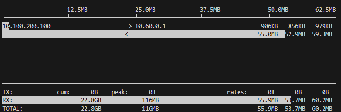
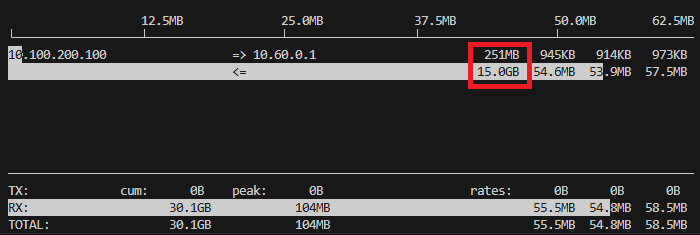

# Introduction of iperf3 and iftop 
>[!NOTE]
> Author: Wei, Chang
> Date: 2026/01/14


## Introduction

free5GC requires measuring dataplane (GTP‑U) maximum available bandwidth and behavior to ensure it can carry UE traffic under high load or production-like conditions. We use `iperf3` as a controllable traffic generator and throughput measurement tool, paired with `iftop` to observe per-connection bandwidth usage and direction in real time on UPF interfaces (for example, monitor outer GTP‑U traffic on `upfgtp`).

### What is iperf3?

A tool for network performance measurement and traffic generation, commonly used to evaluate throughput between two endpoints, and in UDP mode it can measure jitter and loss. It uses a client/server architecture: one side runs the server to listen, the other runs the client to initiate tests.

#### TCP mode (default)

- Measures achievable throughput (in Mbits/s or Gbits/s).
- Displays retransmissions (`Retr` in output), useful to identify reliability/stability issues.
- Reflects actual transfer capability under congestion control interactions (e.g., TCP window, RTT, and retransmissions).

Use cases: validate link capacity, end-to-end available throughput, or test core network dataplane under different loads.

#### UDP mode (`-u`)

- Sends packets at a target rate (client can specify bitrate with `-b`).
- Measures jitter and packet loss—important QoS indicators.

Use cases: evaluate latency-sensitive or real-time applications (VoIP, video streaming), or pressure-test forwarding capacity and loss behavior with a fixed send rate.

**Common options (summary)**:
- `-c <host>` / `--client <host>`: run in client mode connecting to specified host.
- `-s` / `--server`: start server mode (accept connections).
- `-t <seconds>`: test duration in seconds (default 10).
- `-P <num>`: number of parallel streams.
- `-R`: reverse mode—server sends to client (tests DN→UE).
- `-d`: bidirectional test.
- `-J`: output JSON format.
- `--bind-dev <iface>`: bind source interface or source IP.

### iftop

- What is iftop: an interactive interface bandwidth monitoring tool that shows per-connection (IP:port) real-time bandwidth usage on a specified interface, including short/medium/long averages.

- Why use iftop:
	- Quickly identify which interface or connection is consuming bandwidth—suitable for real-time troubleshooting and initial diagnosis.
	- Shows direction and rate per connection, helpful during high-traffic tests to confirm traffic source/direction (e.g., DN→UE vs UE→DN).
	- Low startup and observation overhead; suitable as a runtime monitoring tool during tests.

**Common options (summary)**:
- `-i <iface>`: specify interface to watch.
- `-n`: do not resolve hostnames.
- `-N`: show port numbers instead of service names.
- `-P`: show port-related info.
- `-t`: text output mode.
- `-B`: show rates in bytes/s (default is bits/s).
- `-M`: set the maximum value for the top scale of the output interface

---

## Test Environment Overview (free5GC)

Using [free5gc-compose](https://github.com/free5gc/free5gc-compose) as an example, the main containers used in experiments are `ue`, `upf`, and the data network `iperf-server`. Typical example IPs include the UE PDU IP (e.g., `10.60.0.1`), the DN (e.g., `10.100.200.100`), and the Docker private network `10.100.200.0/24`. The UPF important interface is `upfgtp` (GTP‑U outer), where outer GTP‑U traffic can be monitored.


---

## Preparation (install tools)

After adding an `iperf-server` service to `docker-compose.yaml`, start the container:

```yaml
iperf-server:
  container_name: iperf-server
  image: networkstatic/iperf3:latest
  command: ["iperf3", "-s"]
  networks:
    privnet:
      ipv4_address: 10.100.200.100
```

Install required tools inside containers:

- In the `ue` container:
```bash
apt update && apt install -y iperf3
```

- In the `upf` container:
```bash
apt update && apt install -y iftop
```

---

## TCP mode

### UE → DN (iperf-server)

#### Run iperf3

- Replace `10.100.200.100` with your actual DN IP.

```bash
docker exec ue iperf3 -c 10.100.200.100 --bind-dev uesimtun0 -t 20
```

Notes:

- `-c <host>`: target host (client mode).
- `--bind-dev <iface>`: bind source interface or source IP (e.g., `uesimtun0`).
- `-t <seconds>`: test duration.


Table field descriptions:

- `Interval`: statistics time window (default per-second).
- `Transfer`: amount of data successfully transferred during the interval.
- `Bitrate`: average throughput for the interval (bits/sec).
- `Retr`: TCP retransmissions in the interval.
- `Cwnd`: TCP congestion window at the end of the interval (KBytes).

#### Run iftop

```bash
docker exec -it upf iftop -i upfgtp -nB -m 500M
```
Notes:

- `-i upfgtp`: interface to watch (`upfgtp`, GTP‑U outer).
- `-n`: do not resolve hostnames; show numeric IPs (suitable for container environments to avoid DNS delays or name masking).
- `-N`: show port numbers instead of service names (e.g., 5201 instead of iperf3).
- `-P`: show port-related info (list source/destination ports).
- `-B`: show rates in bytes/s (default is bits/s), making large values more readable.
- `-m 500M`: set the iftop scale or maximum display value to 500M (unit depends on `-B` for bytes or bits), useful to adjust display scale for high traffic.



Notes:

- The white bar charts are visualizations (recent 2s, 10s, 40s averages).
- Three rate columns (short/medium/long): averages over different windows; typically left→right corresponds to ~2s, ~10s, ~40s averages (depends on iftop version).
- Bottom statistics (TX/RX / TOTAL): show cumulative (Cum), peak (Peak), and three-rate averages (Rates).

### Once inside the interface
Press `T` to show totals for each row (Totals), useful for viewing overall transmitted amounts.



Press `t` to switch to single-line display (single-line mode); in this mode you can toggle showing send-only, receive-only, or combined send/receive.


Press `B` to adjust the timescale windows used for the progress bars (recent 2, 10, 40 seconds), which helps observe short/medium/long-term rate differences.


### DN (iperf-server) -> UE
Use `-R` (reverse) so the server sends data to the client (DN → UE); run the client on UE and the server will send traffic back to the UE:

```bash
docker exec ue iperf3 -c 10.100.200.100 --bind-dev uesimtun0 -t 20 -P 4 -R
```


## UDP mode

In UDP mode, iperf3 prints jitter and packet loss statistics on the receiver (server):

```bash
docker exec ue iperf3 -c 10.100.200.100 --bind-dev uesimtun0 -u -b 300M
```


Notes:

- The above image comes from the `iperf-server` output (`docker logs iperf-server`), showing receiver-side `Jitter` (ms) and `Lost/Total Datagrams`.

## Conclusion

Combining interface-level real-time observation (`iftop`) with end-to-end measurement (`iperf3`) enables quick and accurate localization of dataplane issues and directs corrective actions:

- When measuring TCP with iperf3 (iftop showing the TCP traffic), the interface observed about 55–60 MB/s (≈ 440–480 Mbps).
- When measuring UDP with iperf3 and setting the target rate to 300 Mbps, the observed received throughput was about 200–287 Mbps, with packet loss rates as high as 14%–29%, indicating that substantial packet loss significantly reduces effective throughput.

Combine interface and end-to-end statistics to determine whether traffic is being dropped along the path or whether differences are due to protocol-layer behavior (TCP vs UDP).

### Connect with Me

- GitHub: [https://github.com/wiwi878](https://github.com/wiwi878)
