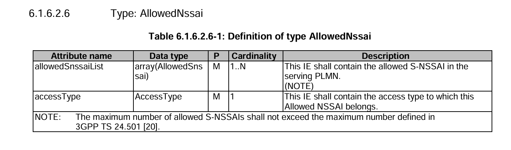
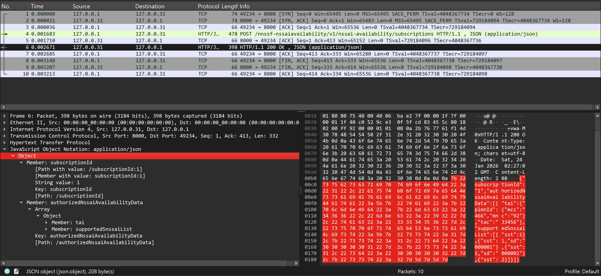

# Network Function NSSF Introduction
>[!NOTE]
> Author: Kai-Hung, Hu
> Date: 2026/01/28

## Overview

In this article, we will introduce the Network Slice Selection Function (NSSF), a key component in the 5G Core (5GC) network architecture. NSSF is responsible for enabling and managing network slicing, one of the most significant innovations brought by 5G. We will explore its role, its two primary services — `Nnssf_NSSelection` and `Nnssf_NSSAIAvailability` — and analyze the corresponding implementation within the free5GC project.

Network slicing allows operators to create multiple virtual networks on top of a shared physical infrastructure. Each slice can be tailored to specific service requirements, such as enhanced Mobile Broadband (eMBB), Ultra-Reliable Low Latency Communications (URLLC), or massive Machine-Type Communications (mMTC). The NSSF plays a central role in selecting the appropriate network slice for a given User Equipment (UE) and ensuring that the right resources are allocated.

## What is NSSF?

The Network Slice Selection Function (NSSF) is defined in 3GPP TS 29.531. Its primary responsibilities include:

1.  **Selecting the set of Network Slice instances**: Based on the UE's subscription, requested NSSAI (Network Slice Selection Assistance Information), and operator policies, the NSSF determines which slice instances should serve the UE.
2. **Determining the Allowed NSSAI and Configured NSSAI Mappings**: The NSSF determines which S-NSSAIs are permitted for the UE based on the UE's subscription (subscribed S-NSSAIs from UDM), requested NSSAI, current serving area (TA/PLMN), operator policies, and network constraints. Specifically, the NSSF:

    - **Computes the Allowed NSSAI**: The set of S-NSSAIs from the requested or subscribed list that are authorized for the UE in the current serving PLMN and registration area.
    - **Provides mapping information for the Configured NSSAI**: The NSSF returns the Configured NSSAI mapping for the serving PLMN, which the AMF then communicates to the UE via the Registration Accept or UE Configuration Update message.
    - **In roaming scenarios**, provides S-NSSAI mappings between VPLMN and HPLMN to ensure slice compatibility.
3.  **Determining the AMF Set**: In some scenarios, the NSSF can also help determine the appropriate AMF (Access and Mobility Management Function) set to serve the UE, especially when AMF re-allocation is needed.


## NSSF Services

Within the 5GC, the NSSF offers services to the AMF, SMF, NWDAF and NSSF in a different PLMN via the Nnssf service based interface (SBI). The main roles of NSSF is to provide Network Slice Information to AMF. NSSF exposes two main services via the SBI:

- **Nnssf_NSSelection**: Used by the AMF to retrieve network slice selection information.
- **Nnssf_NSSAIAvailability**: Used by the AMF to update the NSSF with information about which S-NSSAIs it supports per Tracking Area (TA) and to subscribe to availability change notifications.


**Figure 1.** NSSF Services (source: [3GPP TS 29.531](https://www.etsi.org/deliver/etsi_ts/129500_129599/129531/17.11.00_60/ts_129531v171100p.pdf))

## Nnssf_NSSelection Service

The `Nnssf_NSSelection` service is the cornerstone service for slice selection. It is invoked by the AMF (and in roaming scenarios, by NSSF from a different PLMN) during UE registration, PDU session establishment, or UE configuration update to query the NSSF for the allowed slices and related network slice information.

> [!NOTE]
> Although the AMF is not the only NF that can consume this service (as shown in the diagram above), this article focuses primarily on the AMF as the NF service consumer.

### Workflow: NSSelection for Registration

The following diagram illustrates the high-level workflow when the AMF queries NSSF during UE initial registration:


```
+----+              +-----+                                    +------+
| UE |              | AMF |                                    | NSSF |
+----+              +-----+                                    +------+
   |                   |                                           |
   | 1. Registration   |                                           |
   |   Request         |                                           |
   |------------------>|                                           |
   |                   |                                           |
   |                   | 2. GET /nnssf-nsselection/v2/             |
   |                   |    network-slice-information              |
   |                   |------------------------------------------>|
   |                   |                                           |
   |                   |                                           | 3. NSSF validates consumer,
   |                   |                                           |    checks TAI/PLMN, processes
   |                   |                                           |    Requested NSSAI vs Subscribed.
   |                   |                                           |
   |                   | 4. 2a. 200 OK (AuthorizedNetworkSliceInfo)|
   |                   |    2b. 403 Forbidden (ProblemDetails)     |
   |                   |    Or 4xx/5xx (ProblemDetails) Or 3xx     |
   |                   |<------------------------------------------|
   |                   |                                           |
```

**Step-by-Step Breakdown:**

1.  **UE sends Registration Request**: The UE initiates a registration request with the AMF. This request may include a Requested NSSAI, indicating the slices the UE wishes to use.

2. **AMF queries NSSF via GET Request**: The AMF sends an HTTP `GET` request to the NSSF's `Nnssf_NSSelection` service endpoint at:
	  - Mandatory query parameters:
	    - `nf-type`: The type of the calling NF (e.g., AMF)
	    - `nf-id`: The NF instance identifier
	  - Conditional query parameters (depending on the use case):
	    - `slice-info-request-for-registration`: Contains `RequestedNssai`, `SubscribedNssai`, `DefaultConfiguredSnssaiIndication`, etc. (used during registration or EPS to 5GS handover)
	    - `tai` (Tracking Area Identifier): Required for requests in the serving PLMN
	    - `home-plmn-id`: Required for roaming scenarios to identify the UE's Home PLMN
	    - `supported-features`: Optional feature support indication

3. **NSSF Processes the Request**: The NSSF performs several validation and decision steps:
    - Verifies the NF service consumer is authorized (only AMF and NSSF from a different PLMN are allowed)
    - Validates that required parameters (`tai` or `home-plmn-id` for roamers) are provided
    - Checks if the requested S-NSSAIs are supported in the TAI and PLMN
    - Compares `RequestedNssai` against `SubscribedNssai` (obtained from UDM) to compute the `AllowedNssai`
    - Determines the `ConfiguredNssai` mapping for the serving PLMN
    - For roaming scenarios, computes the S-NSSAI mappings between VPLMN and HPLMN
    - Identifies NSI IDs and associated NRF addresses for the allowed slices

4. **NSSF Returns HTTP 200 OK with AuthorizedNetworkSliceInfo**: The NSSF responds with a `200 OK` status code and an `AuthorizedNetworkSliceInfo` object, which includes:
    - `AllowedNssaiList`: Array of S-NSSAIs permitted for the UE in the serving PLMN and current TA, organized by access type
    - `ConfiguredNssai`: The Configured NSSAI (list of `ConfiguredSnssai` objects) for the serving PLMN (max 16 S-NSSAIs per PLMN)
    - `RejectedNssaiInPlmn`: S-NSSAIs rejected due to PLMN-level restrictions
    - `RejectedNssaiInTa`: S-NSSAIs rejected due to TA-level restrictions
    - `NsiInformation`: Network Slice Instance information including NRF URIs and NSI IDs for service discovery within slices
    - `TargetAmfSet` or `CandidateAmfList`: For scenarios requiring AMF re-allocation
    - `MappingOfAllowedNssai` and `MappingOfConfiguredNssai`: S-NSSAI mappings between VPLMN and HPLMN (for roaming scenarios)
    - `NrfAmfSet`: NRF URI to use for discovering candidate AMFs from the target AMF Set

**Key Technical Details:**

- **HTTP Method**: The Nnssf_NSSelection service uses the **GET** method for the `network-slice-information` resource (standard query operation per REST principles)
- **API Versioning**: The URI includes `{apiVersion}` placeholder, typically `/v1/` or `/v2/` depending on 3GPP Release
- **Content Type**: Responses use `application/json` format as defined in 3GPP TS 29.531
- **Error Responses**: On failure (e.g., no authorized slices available), NSSF returns `HTTP 403 Forbidden` with application error `SNSSAI_NOT_SUPPORTED` or `NOT_AUTHORIZED`


### Code Analysis (free5GC): `nsselection_network_slice_information.go`

The core logic for the NSSelection service in free5GC is located in:
`nssf/internal/sbi/processor/nsselection_network_slice_information.go`

**Entry Point: `NSSelectionSliceInformationGet`**

This function is the handler for the `GET` request. It performs initial validation and then dispatches to either `nsselectionForRegistration` or `nsselectionForPduSession` based on the query parameters.

```go
func (p *Processor) NSSelectionSliceInformationGet(
	c *gin.Context,
	param NetworkSliceInformationGetQuery,
) {
	// ... (validation code omitted for brevity)

	// Check permission of NF service consumer
	err := checkNfServiceConsumer(param.NfType)
	if err != nil {
		// Return 403 Forbidden
	}

	if param.Tai == nil && param.HomePlmnId == nil {
		// Return 400 Bad Request - Missing mandatory IE
	}

	if param.SliceInfoRequestForRegistration != nil {
		// Network slice information is requested during the Registration procedure
		status, response, problemDetails = nsselectionForRegistration(param)
	} else {
		// Network slice information is requested during the PDU session establishment procedure
		status, response, problemDetails = nsselectionForPduSession(param)
	}

	// ...
	c.JSON(status, response)
}
```

**Core Logic: `nsselectionForRegistration`**

This function handles the slice selection logic for UE registration. Here's a simplified view of its key steps:

```go
func nsselectionForRegistration(param NetworkSliceInformationGetQuery) (
	int, *models.AuthorizedNetworkSliceInfo, *models.ProblemDetails,
) {
	authorizedNetworkSliceInfo := &models.AuthorizedNetworkSliceInfo{}

	// 1. Check if Home PLMN is supported (for roamers)
	if param.HomePlmnId != nil {
		if !util.CheckSupportedHplmn(*param.HomePlmnId) {
			// Reject all requested NSSAIs
		}
	}

	// 2. Check if TAI is supported
	if param.Tai != nil {
		if !util.CheckSupportedTa(*param.Tai) {
			// Reject all requested NSSAIs in TA
		}
	}

	// 3. Iterate through Requested NSSAIs
	for _, requestedSnssai := range param.SliceInfoRequestForRegistration.RequestedNssai {
		// Check if supported in TAI
		if param.Tai != nil && !util.CheckSupportedSnssaiInTa(requestedSnssai, *param.Tai) {
			authorizedNetworkSliceInfo.RejectedNssaiInTa = append(...)
			continue
		}

		// Compare with Subscribed NSSAIs
		for _, subscribedSnssai := range param.SliceInfoRequestForRegistration.SubscribedNssai {
			if openapi.SnssaiEqualFold(mappingOfRequestedSnssai, *subscribedSnssai.SubscribedSnssai) {
				// Match found! Add to Allowed NSSAI
				var allowedSnssaiElement models.AllowedSnssai
				allowedSnssaiElement.AllowedSnssai = new(models.Snssai)
				*allowedSnssaiElement.AllowedSnssai = requestedSnssai
				// ... add NsiInformationList, MappedHomeSnssai if applicable
				util.AddAllowedSnssai(allowedSnssaiElement, accessType, authorizedNetworkSliceInfo)
				break
			}
		}
	}

	// 4. If no requested NSSAI is allowed, use default subscribed NSSAIs
	if !checkIfRequestAllowed {
		useDefaultSubscribedSnssai(param, authorizedNetworkSliceInfo)
	}

	return http.StatusOK, authorizedNetworkSliceInfo, nil
}
```

**Key Takeaways:**

*   The NSSF validates each requested S-NSSAI against the subscribed S-NSSAIs.
*   If a match is found, it's added to the `AllowedNssai` list.
*   S-NSSAIs not matching are added to `RejectedNssaiInPlmn` or `RejectedNssaiInTa`.
*   If no requested S-NSSAIs are allowed, the NSSF falls back to using default subscribed 
    S-NSSAIs.

## Nnssf_NSSAIAvailability Service

The `Nnssf_NSSAIAvailability` service allows the AMF to inform the NSSF about which 
S-NSSAIs it supports in each Tracking Area. This is crucial because the availability of slices can vary by geographic location. Additionally, AMFs can subscribe to receive notifications when the NSSAI availability changes.

The following HTTP methods are supported for this service:

*   **PUT**: Used by the AMF to update (register) the S-NSSAIs it supports per TA.
*   **PATCH**: Used to partially update the supported S-NSSAIs.
*   **DELETE**: Used to delete the NSSAI availability information for a specific NF instance.
*   **POST**: Used to create a subscription for NSSAI availability event notifications.
*   **DELETE** (on subscription): Used to unsubscribe from notifications.

In this section, we will primarily focus on the **PUT** and **POST** methods for the `Nnssf_NSSAIAvailability` service.

### Workflow 1: Update NSSAI Availability (PUT)

```
+-----+                                       +------+
| AMF |                                       | NSSF |
+-----+                                       +------+
   |                                              |
   | 1. PUT /nnssf-nssaiavailability/             |
   |    v1/nssai-availability/{nfId}              |
   |--------------------------------------------->|
   |                                              |
   |                                              | 2. NSSF validates S-NSSAIs,
   |                                              |    updates internal store.
   |                                              |
   | 3. 204 No content /                          |
   |    200 OK (AuthorizedNssai-AvailabilityInfo) |
   |    or 4xx / 5xx (ProblemDetails)             |
   |    or 3xx                                    |
   |<---------------------------------------------|
   |                                              |
```

**Step-by-Step Breakdown:**

1.  **AMF sends PUT request**: The AMF sends an HTTP `PUT` request to the NSSF's `Nnssf_NSSAIAvailability` service. The request body contains `NssaiAvailabilityInfo`, which specifies the S-NSSAIs supported by this AMF for each TAI. According to TS 29.531, this method fully replaces any existing availability information for the NF instance. If the entry does not exist, it is created.
2.  **NSSF validates and stores**: The NSSF validates that the provided S-NSSAIs are supported in the respective PLMNs. It then updates its internal configuration store (`factory.NssfConfig.Configuration.AmfList` in free5GC) with the AMF's supported NSSAI availability data. If the AMF is new, it creates a new entry.
3.  **NSSF returns authorized data**: The NSSF responds with `AuthorizedNssaiAvailabilityInfo`, containing the authorized availability data for the TAIs that were updated.

### Workflow 2: Subscribe to NSSAI Availability Changes (POST)

```
+-----+                                            +------+
| AMF |                                            | NSSF |
+-----+                                            +------+
   |                                                   |
   | 1. POST /nnssf-nssaiavailability/                 |
   |    v1/nssai-availability/subscriptions           |
   |-------------------------------------------------->|
   |                                                   |
   |                                                   | 2. NSSF generates a
   |                                                   |    subscriptionId, stores
   |                                                   |    subscription data.
   |                                                   |
   | 3. 201 Created (NssfEventSubscriptionCreatedData) |
   |    or 4xx/5xx (ProblemDetails)                    |
   |    or 3xx                                         |
   |<--------------------------------------------------|
   |                                                   |
```

**Step-by-Step Breakdown:**

1.  **AMF sends POST request**: The AMF sends an HTTP `POST` request to subscribe to NSSAI availability event notifications. The request body contains `NssfEventSubscriptionCreateData`, which includes the list of TAIs the AMF is interested in and optionally an expiry time for the subscription. This creates a new subscription resource.
2.  **NSSF creates subscription**: The NSSF generates a unique `SubscriptionId` and stores the subscription data.
3.  **NSSF returns subscription data**: The NSSF responds with `NssfEventSubscriptionCreatedData`, which includes the `SubscriptionId`, the expiry time (if set), and the current `AuthorizedNssaiAvailabilityData` for the subscribed TAIs.

### Code Analysis (free5GC): `nssaiavailability_store.go` & `nssaiavailability_subscription.go`

**`NssaiAvailabilityNfInstanceUpdate` (PUT Handler)**

Located in `nssf/internal/sbi/processor/nssaiavailability_store.go`:

```go
func (p *Processor) NssaiAvailabilityNfInstanceUpdate(
	c *gin.Context,
	nssaiAvailabilityInfo models.NssaiAvailabilityInfo, nfId string,
) {
	// Validate that S-NSSAIs are supported in PLMN
	for _, s := range nssaiAvailabilityInfo.SupportedNssaiAvailabilityData {
		if !util.CheckSupportedNssaiInPlmn(s.SupportedSnssaiList, *s.Tai.PlmnId) {
			// Return 403 Forbidden - SNSSAI_NOT_SUPPORTED
		}
	}

	// Find AMF configuration of given NfId
	// If found, then update the SupportedNssaiAvailabilityData
	hitAmf := false
	factory.NssfConfig.Lock()
	for i, amfConfig := range factory.NssfConfig.Configuration.AmfList {
		if amfConfig.NfId == nfId {
			factory.NssfConfig.Configuration.AmfList[i].SupportedNssaiAvailabilityData = 
				nssaiAvailabilityInfo.SupportedNssaiAvailabilityData
			hitAmf = true
			break
		}
	}
	factory.NssfConfig.Unlock()

	// If no AMF record is found, create a new one
	if !hitAmf {
		var amfConfig factory.AmfConfig
		amfConfig.NfId = nfId
		amfConfig.SupportedNssaiAvailabilityData = nssaiAvailabilityInfo.SupportedNssaiAvailabilityData
		factory.NssfConfig.Lock()
		factory.NssfConfig.Configuration.AmfList = append(factory.NssfConfig.Configuration.AmfList, amfConfig)
		factory.NssfConfig.Unlock()
	}

	// Return authorized NSSAI availability info
	// ...
	c.JSON(http.StatusOK, response)
}
```

**`NssaiAvailabilitySubscriptionCreate` (POST Handler)**

Located in `nssf/internal/sbi/processor/nssaiavailability_subscription.go`:

```go
func (p *Processor) NssaiAvailabilitySubscriptionCreate(
	c *gin.Context,
	createData models.NssfEventSubscriptionCreateData,
) {
	var subscription factory.Subscription

	// Get an unused subscription ID
	tempID, err := getUnusedSubscriptionID()
	if err != nil {
		// Return error
	}

	subscription.SubscriptionId = tempID
	subscription.SubscriptionData = new(models.NssfEventSubscriptionCreateData)
	*subscription.SubscriptionData = createData

	// Store the subscription
	factory.NssfConfig.Subscriptions = append(factory.NssfConfig.Subscriptions, subscription)

	// Prepare response
	response.SubscriptionId = subscription.SubscriptionId
	if subscription.SubscriptionData.Expiry != nil && !subscription.SubscriptionData.Expiry.IsZero() {
		response.Expiry = new(time.Time)
		*response.Expiry = *subscription.SubscriptionData.Expiry
	}
	response.AuthorizedNssaiAvailabilityData = util.AuthorizeOfTaListFromConfig(subscription.SubscriptionData.TaiList)

	c.JSON(http.StatusOK, response)
}
```

**Key Takeaways:**

*   The `PUT` method allows AMFs to register or update their supported S-NSSAIs per TA.
*   The `POST` subscription method allows AMFs to receive notifications about NSSAI availability changes.
*   Internal state is managed via the `factory.NssfConfig` configuration structure.

## Capturing NSSF Requests and Responses in free5GC with tcpdump

This section demonstrates how to capture and analyze NSSF SBI traffic using `tcpdump`. We will record packets for the following APIs:

- **NSSelectionGet**: `GET /nnssf-nsselection/v2/network-slice-information`
- **NSSAIAvailabilityPut**: `PUT /nnssf-nssaiavailability/v1/nssai-availability/{nfId}`
- **NSSAIAvailabilityPost**: `POST /nnssf-nssaiavailability/v1/nssai-availability/subscriptions`

> [!NOTE]
> To ensure a successful response from NSSF, I have updated the configurations as follows:
>
> 1. **Add new settings in `nssfcfg.yaml` (新增配置):**
> ```yaml
> supportedPlmnList:
>   - mcc: 466
>     mnc: 92
> supportedNssaiInPlmnList:
>   - plmnId:
>       mcc: 466
>       mnc: 92
>     supportedSnssaiList:
>       - sst: 1
>         sd: 000001
>       - sst: 1
>         sd: 000002
>       - sst: 1
>       - sst: 2
> ```
>
> 2. **Modify setting in `nrfcfg.yaml` (修改配置):**
> ```yaml
> configuration:
>   # ...
>   oauth: false # Disable OAuth
> ```

### Start tcpdump

Capture SBI traffic on the NSSF interface:

```bash
# Run free5GC locally
sudo tcpdump -i lo -w nssf.pcap \
    'tcp port 8000 and host 127.0.0.31'
```

### Trigger NSSF Requests

Start free5GC first, then open a new terminal to trigger the API requests:

#### Test Case 1: NSSelectionGet (Network Slice Selection)

```bash
curl -v -G "http://127.0.0.31:8000/nnssf-nsselection/v2/network-slice-information" \
    --data-urlencode "nf-type=AMF" \
    --data-urlencode "nf-id=469de254-2fe5-4ca0-8381-af3f500af77c" \
    --data-urlencode 'slice-info-request-for-registration={"requestedNssai":[{"sst":1,"sd":"000002"}],"subscribedNssai":[{"subscribedSnssai":{"sst":1,"sd":"000002"},"defaultIndication":true}]}' \
    --data-urlencode 'tai={"plmnId":{"mcc":"466","mnc":"92"},"tac":"33456"}'
```

#### Test Case 2: NSSAIAvailabilityPut (Update NSSAI Availability)

```bash
curl -v -X PUT "http://127.0.0.31:8000/nnssf-nssaiavailability/v1/nssai-availability/469de254-2fe5-4ca0-8381-af3f500af77c" \
    -H "Content-Type: application/json" \
    -d '{
        "supportedNssaiAvailabilityData": [
            {
                "tai": {
                    "plmnId": {"mcc": "466", "mnc": "92"},
                    "tac": "33456"
                },
                "supportedSnssaiList": [
                    {"sst": 1, "sd": "000001"},
                    {"sst": 1, "sd": "000002"}
                ]
            }
        ]
    }'
```

#### Test Case 3: NSSAIAvailabilityPost (Subscribe to NSSAI Availability)

```bash
curl -v -X POST "http://127.0.0.31:8000/nnssf-nssaiavailability/v1/nssai-availability/subscriptions" \
    -H "Content-Type: application/json" \
    -d '{
        "nfNssaiAvailabilityUri": "http://127.0.0.1:8080/callback",
        "taiList": [
            {
                "plmnId": {"mcc": "466", "mnc": "92"},
                "tac": "33456"
            }
        ]
    }'
```

### Analyze the Capture packets

Stop the tcpdump capture with `Ctrl+C`, then analyze the results:

#### Test Case 1: NSSelectionGet (Network Slice Selection)


**Figure 2.** NSSelectionGet

The response shows that the `AuthorizedNetworkSliceInfo` contains the attribute `allowedNssaiList`. We can see the format of `allowedNssaiList`, which data type is array(AllowedNssai) in 3GPP TS 29.531. Then, we can see that the response body matches the data type of `AuthorizedNetworkSliceInfo`.


**Figure 3.** AllowedSnssai (source: [TS 29.531](https://www.etsi.org/deliver/etsi_ts/129500_129599/129531/17.11.00_60/ts_129531v171100p.pdf))


**Figure 4.** AllowedNssai (source: [TS 29.531](https://www.etsi.org/deliver/etsi_ts/129500_129599/129531/17.11.00_60/ts_129531v171100p.pdf))

#### Test Case 2: NSSAIAvailabilityPut (Update NSSAI Availability)


**Figure 5.** NSSAIAvailabilityPut

The response shows that the `AuthorizedNssaiAvailabilityInfo` contains the attribute `authorizedNssaiAvailabilityData`.
We can see the format of `authorizedNssaiAvailabilityData`, which data type is array(AuthorizedNssaiAvailabilityData) in 3GPP TS 29.531. Then, we can see that the response body matches the data type of `AuthorizedNssaiAvailabilityInfo`.


**Figure 6.** AuthorizedNssaiAvailabilityInfo (source: [TS 29.531](https://www.etsi.org/deliver/etsi_ts/129500_129599/129531/17.11.00_60/ts_129531v171100p.pdf))


**Figure 7.** AuthorizedNssaiAvailabilityData (source: [TS 29.531](https://www.etsi.org/deliver/etsi_ts/129500_129599/129531/17.11.00_60/ts_129531v171100p.pdf))


#### Test Case 3: NSSAIAvailabilityPost (Subscribe to NSSAI Availability)


**Figure 8.** NSSAIAvailabilityPost

The successful subscription creation will return `NssfEventSubscriptionCreatedData`. We can see the format of `NssfEventSubscriptionCreatedData` in 3GPP TS 29.531. Then, we can see that the response body matches the definition of `NssfEventSubscriptionCreatedData`.


**Figure 9.** NssfEventSubscription Response (source: [TS 29.531](https://www.etsi.org/deliver/etsi_ts/129500_129599/129531/17.11.00_60/ts_129531v171100p.pdf))


**Figure 10.** NssfEventSubscriptionCreatedData (source: [TS 29.531](https://www.etsi.org/deliver/etsi_ts/129500_129599/129531/17.11.00_60/ts_129531v171100p.pdf))

## Summary

The NSSF (Network Slice Selection Function) is a critical component in 5G networks that enables the power of network slicing. By providing services like `Nnssf_NSSelection` and `Nnssf_NSSAIAvailability`, it enables:

*   **Dynamic Slice Selection**: The AMF can query the NSSF to determine which network slices a UE is allowed to use based on subscription, location, and operator policies.
*   **Slice Availability Management**: AMFs can inform the NSSF about which slices they support in their serving areas, ensuring that the NSSF has accurate, up-to-date information for slice selection decisions.
*   **Subscription-based Notifications**: AMFs can subscribe to be notified about changes in NSSAI availability, allowing for dynamic adaptation to network conditions.

In free5GC, the NSSF implementation follows the 3GPP specifications, providing a practical, open-source example of how network slicing can be realized in a 5G core.

## Reference

- [3GPP TS 29.531 - 5G System; Network Slice Selection Services](https://www.etsi.org/deliver/etsi_ts/129500_129599/129531/17.11.00_60/ts_129531v171100p.pdf)
- [3GPP TS 23.501 - System architecture for the 5G System (5GS)](https://www.etsi.org/deliver/etsi_ts/123500_123599/123501/17.15.00_60/ts_123501v171500p.pdf)
- [free5GC NSSF Repository](https://github.com/free5gc/nssf)

## About

Hello! I'm Kai-Hung Hu, and I'm just starting my exploration of 5G technology and the free5GC community. I hope this blog post has been informative. If you have ideas for further discussion, please don't hesitate to get in touch.

## Connect with Me

- GitHub: [carlhus](https://github.com/carlhus)
