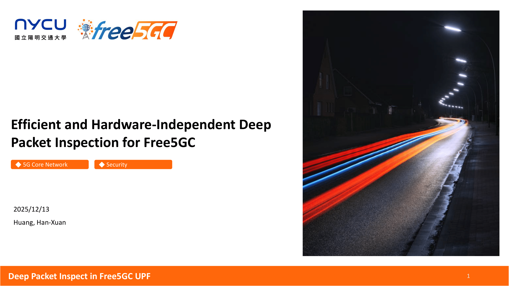
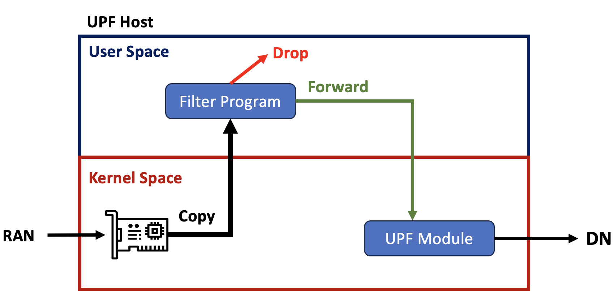
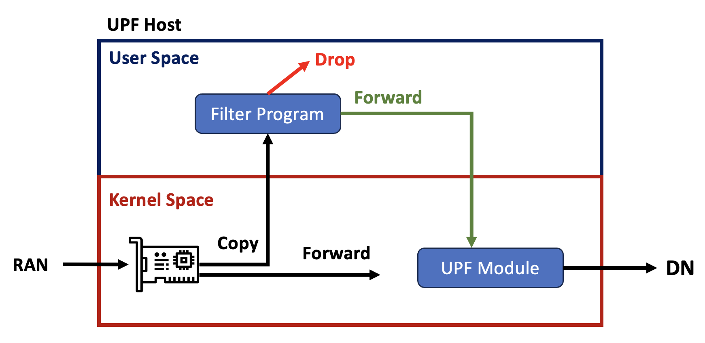
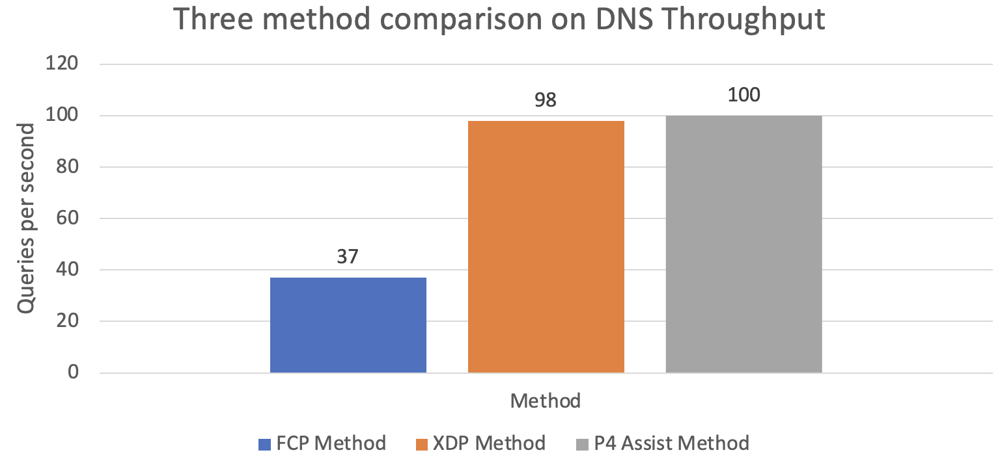

# Efficient and Hardware-Independent Deep Packet Inspection for Free5GC

>[!NOTE]
> Author: Han-Xuan Huang
> Date: 2026/02/03



Thanks Free5GC having me to write this blog. This is my personal research project started in 2025 fall. I gather a team to collaborate this project.

## Preface

Since [Ian Chen](https://www.linkedin.com/in/ian-chen-88b70b1aa) mentioned that Free5GC UPF doesn't have Deep Packet Inspection (DPI) feature in CNDI course, it caught my interest to implement a DPI feature. 
After doing some research, most DPI feature is handle with hardware support such as P4 programmable switch. I just happend to have a P4 switch in our Lab, so it's a perfect timing to start this research project.

Construct hardware-support DPI solution is easy and straight forward. It's easy for me to construct this since I have some experience on P4 Switch. 
To make it more challenge, I trying to find a Hardware-Independent solution that can achieve efficient as same as hardware-support solution (Like, P4 Switch). 
It's interesting that discovery a hardware-independent solution and it increase the possibility that we can integrate into Free5GC UPF. 

Let's start to discover this project.

## Introduce

DPI usually inspect on packet payload, like QNAME in unencrypted DNS packet, or payload in DHCP packet. For our target, we target with unencrypted GTP-U DNS Packet.

I aims to have a DPI feature that achieve these feature:

 - Hardware Independent.
 - Efficient (Consider with link throughput and packet blocking-rate).
 - Block all invalid request.

The mechanism looks like this. When the packet is valid, it will forward to DN through RAN and UPF, drop the packet otherwise.


Since DPI may damange the link throughput and packet blocking-rate with inproper implementation. The affect of link throughput and packet blocking-rate should be noticed.

### Why DPI affect the link throughput?

If you have experience that driving in expressway in Taiwan earlier, you may met the tollbooth (收費站 in Chinese). It may caused the traffic jam since all car need to wait the tollbooth staff operating. 
Like our implementation, if we implement a mechanism that will check the packet one-by-one to find the packet is invalid, it will caused the latency.

The queue network interface is limited, if the packet need more time to operating, it will caused the queueing delay on packet. It also caused full out on queue in short time, and caused packet loss. 
It'll damage the link throughtput since our system can not handle the packet with such latency. Therefore, the DPI mechanism that affect the link throughput should be noticed.

A good approach to solve this issue is, we may isolate the interest packet out of main datapath, to decrease the latency affect on the packet in main datapath. 
It looks like:

```sh
Packet -------> Main Datapath --------------------------------------|-> DN
DNS Packet ---> Main Datapath                                       |
                     |---------> DNS Datapath ---> Packet Filter -->|
```

The latency caused by Packet filter only caused on DNS packet. It should be imporve the link throughput that not affect by the DPI mechanism.

To talk about "how" the DPI mechanism affect the link throughtput, you can see the result on Full Copy Program Method below. It caused the latency on all packet, you should see the poor link throughput on this mechanism.

## Mechanism

To achieve the DPI, we purpose these method:

 - P4 Assist Method (Hardware-support solution)
 - Full Copy Program (FCP) Method (Latency-careness solution)
 - XDP Method (Hardware-Independent solution)

I'll introduce these method one-by-one.

### P4 Assist Method

To make GTP-U DNS packet out of main datapath, one of good approach is using P4 Switch to achieve this. P4 Assist Switch with P4 Program can specific the output port with Match-Action table.
We can write a P4 program that parse the packet first, confirm the packet is GTP-U DNS packet (Check outer UDP port is 2152, and inner UDP port is 52), and specific ingress port. 
It's efficient to achieve packet isolation from main datapath. The architecture look like this:


When the packet is isolate to another datapath (we'll call it validate path in later), it will enter into filter program host. The filter program host will fecth packet and check QNAME is valid or not.
If the packet is valid, it will forward to UPF, drop otherwise.

It should be efficient since it's almost-zero latency on packet isolation. But the cons is hard to deploy this solution since not everyone is able to afford P4 Switch (it cost $10000~$30000 USD), so, software-based solution is necessary.
The hardware-support solution can be our baseline that our hardware-independent solution should achieve.

Next, I would like to introduce the improper software-based solution that caused latency on all packet.

### Full Copy Program (FCP) Method

To achieve an easy, straight-forward software solution, we can simply copy all packet from kernel space to user space, and check the packet one-by-one. The architecture look like this:



Like previous method, valid then forward and invalid then drop. 

The copy operation will caused huge latency and increase the queueing delay and have poor link throughput. So, it's improper implementation that have poor performance on 5G core network.
Since this solution is bad, but it still interesting that finding what the actual link throughput when deploy this mechanism.

### Key Idea: Is it possible to classify packet on kernel space?

FCP method is easy to implement but have huge latency issue that damange link throughput. 
To improve this mechanism, I trying to find how to only copy GTP-U DNS packet into user space and keep other packet forward to network stack.

It looks like:




After search a while, I found that it can be achieved by XDP. It's based on eBPF library that can attach tiny XDP program to network interface directly.
It's a good finding, and make the third method happend.

### XDP Method

XDP can forward or redirect the packet by few condition structrue. It looks like:

```c
struct {
    __uint(type, BPF_MAP_TYPE_XSKMAP);
    __uint(max_entries, 64);
    __type(key, __u32);
    __type(value, __u32);
    __uint(pinning, LIBBPF_PIN_BY_NAME);
} xsks_map SEC(".maps");

SEC("xdp")
int xdp_prog_simple(struct xdp_md *ctx){
    void *data = (void*)(long)ctx->data;
    void *data_end = (void*)(long)ctx->data_end;

    if (<some condition>){
        return XDP_PASS;
    }

    return bpf_redirect_map(&xsks_map, ctx->rx_queue_index, 0);
}
```

If the packet that met some condition, we can forward to network stack. We can redirect the packet to user space program with `bpf_redirect_map` also. 
It achieve the packet classify on kernel space, and we can copy the packet we interest only.

Therefore, we can deploy this solution to achieve DPI.


When the packet is GTP-U DNS packet, it will forward the packet to filter program in user space, and the filter program will verify the packet. 
If the packet is valid, it will send the packet back to network interface and forward to network stack.

The reason why we need to send the packet back is, the verify operation is working on user space. 
It seems impossible to forward the packet to network stack directly, so we need to send the packet back to network interface.

It caused another issue: how to tell XDP program that packet is valid to prevent infinite verify loop?

### Identify Packet Is Legal

Since it's impossible that modify some packet content becaused checksum issue, we need to have a mechanism that XDP program can identify the packet is valid.

To achieve this, I found that we can have a map that can share information between user space and kernel space.

The full mechanism look like this:


We can construct allow map to kernel space and pin into user space. 
If the packet is valid, it will write the element into allow map with 4-tuple as key and DNS transaction ID as value. 
When we send the packet back to network interface, the XDP program can lookup map by 4-tuple fetch by packet, and check the DNS transaction ID is match.

It can successfully to identify valid packet and forward to network stack. So far, we already have a software solution that can forward valid packet. 
The next issue is, how to determine valid and invalid?

### Blocklist

To determine the packet is valid or invalid, we have a blocklist that can use to determine QNAME is valid or invalid. 
We sample almost 100k rows from Fake and NSFW dataset by [hagezi/dns-blocklists](https://github.com/hagezi/dns-blocklists).

In our expectation, we would like to ban all subdomain if domain is invalid, that is, if suffix is match. 
For example, if `xiaohongshu.com` is invalid, `aaa.xiaohongshu.com`, `www.xiaohongshu.com` should be invalid also.
It make our project more challenge since the domain comparison not sutible using hash match, it need to supoprt wildcard match.

To achieve this, I found that we can use Trie data structure to improve the query time on dataset. It inspire with JSON implementation that can efficient find the key by path.

```sh
com |
    | ---- xiaohongshu
    | ---- c1ydeh
    | ---- fake-website-or-something

net |
    | ---- mmm
    | ---- nnn
    | ---- networking-is-interesting
```

The approach is we can reverse the domain and insert to Trie, and reverse the domain before query. 
It improve the time-cost on query and make our user-space program more efficient, represent that it can handle more DNS request.

## Experiment

Since we already have strong methodology, it's excited to do expriment and see the result.

### Experiment Setup

We setup a P4 Programmable Swtich and connect 4 Host with 6 wires. Each wire support 10Gbps link throughput. 


For UE host, we prepare [PacketRusher](https://github.com/HewlettPackard/PacketRusher) for UE-RAN emulator, [DNSPerf](https://github.com/DNSPerf/dnsperf) for DNS client, and [iperf3](https://github.com/esnet/iperf) for link throughput client. 
For UPF host, we prepare [Free5GC](https://github.com/free5gc/free5gc) in UPF host that contains all function of 5G Control Plane and UPF. Moreover, we prepare [iperf3](https://github.com/esnet/iperf) for link throughput server.
Finally, for Filter Host, we prepare a packet filter program. It simply copy packet to user space and check QNAME one-by-one, forward the packet if valid and drop the packet if invalid.

We will use this setup for all method, and adjust the policy on P4 switch to make it fit method requirement. For example, the GTP-U DNS packet will output to Filter Host for P4 Assist Swtich method, and GTP-U DNS packet will output to UPF Host directly for XDP method.

### Experiment

For the experiment, I would like to test these:

 - The valid packet still forward to DN properly.
 - All invalid packet will block by mechanism.
 - The link throughput should not drop by DPI mechanism.
 - The DNS throughput on user space program.

To combine these target into one experiment, we run these step simultaneously:

 - Send 4Gbps throughput to DN.
 - Create a DNSPerf client with 1000-window invalid request.
 - Create a DNSPerf client with 20-window valid request

The 1000-window and 20-window means, if the client receive the response, it will send next request immediately and keep not exceed 20/1000 request.

We expected that:

 - All valid packet should receive response successfully.
 - All invalid packet should be blocked and timeout.
 - The link throughput should keep 4Gbps.

We call this experiment "High Concurrency Mix Request", and do the experiment on three different method. We can take a look about result now!

## Result

### Link Throughput

For the link throughput, <strong>we surprisly that XDP Method have the same link throughput as P4 Assist Method.</strong> 
Since the bottleneck happend in UE-RAN emulator that only support 4Gbps sending-rate, it's still possible to increase sending-rate to 10Gbps with traffic generator and see if XDP method still maintain link throughput as same as P4 Switch.


For the FCP Method, it have poor link throughput that only remain 16 Mbps link throghput (0.3% link throughput of P4 Assist Switch Method). It shows that the latency will damange the link throughput seriously.

### Blocking Rate

For the blocking rate, all method achieve 100%. It's not surprise since it will detain the packet and verify the packet. The invalid packet is impossible to forward without forward operation by validator.


### DNS Throughput Comparison

For the DNS throughput, it shows that our system can accept how much DNS packet in parallel. For XDP and P4 Switch, it almost have 100 qps (queries per second). 



For FCP method, since poor link throughput, we only test valid DNS packet with 1-windows, and invalid DNS packet with 1-window. The result indicate it can handle 37 packet in a second.

## Summary

We achieve the efficient and hardware-independent DPI solution in 5G Core Network with XDP method. The link throughput and blocking rate is equals to P4 Assist Method.

There still have some improvement can do:

- Improve the efficient on user space program to handle more DNS throughput.
- Test with high sending rate with multiple-UE or traffic generator.

Actually, we have a plan to integrate user space program (written in C) in Free5GC UPF. 
But due to lack of XDP library in Go, it's hard to integrate user space program and need to porting lot of XDP function.
If Free5GC plan to have DPI feature in UPF, it can be a good driven to complete this.

## Epilogue

I'm very enjoy on this project. It's interesting in get to know how to apply XDP into real network system like 5G Core, and share these work to the attendee in course or conference.

This project already present in these course/event:

 - [sciwork conference 2025](https://conf.sciwork.dev/program)
 - [2025 NMS course in NYCU](https://timetable.nycu.edu.tw/?r=main/crsoutline&Acy=114&Sem=1&CrsNo=535606&lang=zh-tw)
 - [2025 CNDI course in NYCU](https://timetable.nycu.edu.tw/?r=main/crsoutline&Acy=114&Sem=1&CrsNo=535607&lang=zh-tw)

We got lot of feedback and it's useful to improve our work.

It's glad to have lot of team member also, huge thanks to our teammate Cheng-Yun (kiki), Yu-Hsuan, Yu-Sheng (John), and Jun-Hong (jhcheng). 
It also receive lot of help from Ian Chen (CNDI Prof.), Du Fong (CNDI TA), and Prof. Chi-Yu Li (NMS Prof.).

## About

Hello! I'm Han-Xuan Huang. From Tainan, Taiwan. You can call me Clyde.
I'm interested in Networking, Cybersecurity (Sandbox and Malware), and Network Security. I am proactively developing a wide range of interests.

## Connect with Me

- My Website: [c1ydeh's page](https://c1ydeh.net)
- GitHub: [c1ydehhx](https://github.com/c1ydehhx)
- LinkedIn: [Han-Xuan Huang](https://www.linkedin.com/in/han-xuan-huang-3b50b4238/)
