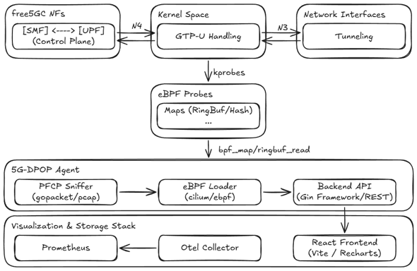
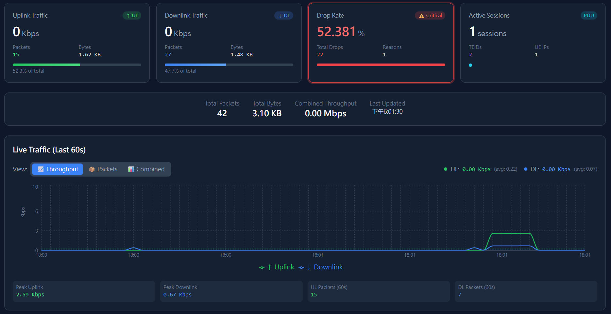
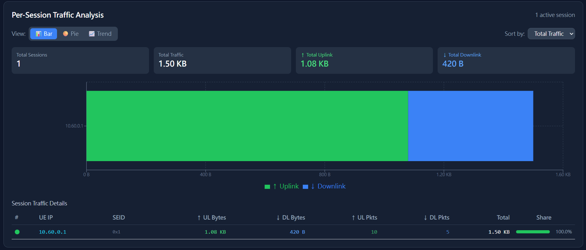

# 5G-DPOP: eBPF-Based UPF Data Plane Observability Platform

>[!NOTE]
> Author: [Yu-Chen, Chan](https://github.com/solar224)
> Date: 2026/02/11

---

## 1. Introduction

In the 5G Core Network architecture, the User Plane Function (UPF) handles all user data plane packet forwarding. However, the UPF's packet processing logic runs in Linux Kernel space (via the gtp5g kernel module), making it difficult for traditional user-space monitoring tools to observe its internal behavior.

When network issues occur, engineers often face the following challenges:

- **Packet loss is hard to trace**: Unknown where packets are dropped and why
- **Inaccurate traffic statistics**: Only interface-level statistics are available, unable to distinguish actual user traffic within GTP tunnels
- **Session correlation is difficult**: Hard to associate traffic data with specific PDU Sessions or UEs

**5G-DPOP (Data Plane Observability Platform)** attempts to address these issues. This project leverages Linux eBPF technology to directly hook into key functions of the gtp5g kernel module, enabling:

- **Real-time traffic monitoring**: Precise Uplink/Downlink packet count and traffic statistics
- **Packet drop detection**: Capture every dropped packet and record the drop reason
- **PFCP Session correlation**: Build TEID-to-Session mappings by listening to PFCP messages
- **Network topology visualization**: Automatically generate UE → gNB → UPF → DN topology diagrams

---

## 2. System Architecture


**Figure 1.** 5G-DPOP System Architecture

5G-DPOP uses a modular design consisting of the following components:

| Component | Tech Stack | Description | Port |
|-----------|------------|-------------|------|
| **eBPF Agent** | Go + cilium/ebpf | Load eBPF programs, read Kernel Maps, export Metrics | 9100 |
| **PFCP Sniffer** | Go + gopacket | Listen to PFCP messages, parse Sessions, build TEID mappings | 8805 |
| **API Server** | Go + Gin | Provide REST API and WebSocket real-time streaming | 8080 |
| **Web Frontend** | React + TypeScript + Vite | Visualization dashboard | 3000 |
| **Prometheus** | Docker | Time-series database for Metrics storage | 9090 |
| **Otel Collector** | Docker | OpenTelemetry collector | 4317 |

### 2.1 eBPF Agent

The eBPF Agent is the core of the platform, responsible for collecting data at the Kernel level.

#### Hook Mechanism

The Agent uses eBPF kprobe mechanism to hook two key functions in the gtp5g kernel module:

| Hook Point | Function Name | Purpose |
|------------|---------------|---------|
| Uplink Entry | `gtp5g_encap_recv` | Capture packets entering UPF from gNB |
| Downlink Exit | `gtp5g_dev_xmit` | Capture packets sent from UPF to gNB |

Additionally, we modified the gtp5g kernel module to add tracepoints for tracking packet drop events. When a packet is dropped, gtp5g triggers the tracepoint and passes the drop reason code. The eBPF program captures this and sends it to User Space via Ring Buffer.

#### BPF Maps

The Agent uses various BPF Maps to store and transfer data:

| Map Type | Name | Purpose |
|----------|------|---------|
| `PERCPU_ARRAY` | `traffic_stats` | Store Uplink/Downlink traffic counters, avoiding lock contention |
| `RINGBUF` | `drop_events` | Send packet drop events to User Space |
| `RINGBUF` | `packet_events` | Send detailed packet information (optional) |
| `HASH` | `teid_session_map` | TEID-to-Session mapping, populated by PFCP Sniffer |
| `HASH` | `teid_stats` | Per-TEID traffic statistics |
| `HASH` | `ue_ip_stats` | Per-UE IP traffic statistics |

#### Packet Drop Reason Codes

The gtp5g module defines various drop reasons, which the eBPF program records:

| Code | Name | Description |
|------|------|-------------|
| 3 | `NO_ROUTE` | No route to destination |
| 6 | `NO_PDR` | No matching PDR rule found |
| 8 | `UL_GATE_CLOSED` | Uplink QoS Gate closed |
| 9 | `DL_GATE_CLOSED` | Downlink QoS Gate closed |
| 14 | `IP_XMIT_FAIL` | IP layer transmission failed |

### 2.2 PFCP Sniffer

The PFCP Sniffer listens to PFCP messages between SMF and UPF, parsing Session information and building TEID mappings.

#### Monitored PFCP Message Types

| Message Type | Purpose |
|--------------|---------|
| Session Establishment Request/Response | Create new Session, extract F-SEID, F-TEID, UE IP |
| Session Modification Request/Response | Update Session, may add or modify TEIDs |
| Session Deletion Request/Response | Delete Session, clean up related mappings |

#### Session Data Structure

Each Session contains the following key information:

```go
type Session struct {
    SEID         uint64    // Session Endpoint ID
    UEIP         net.IP    // UE IP Address
    UPFIP        net.IP    // UPF IP Address
    GNBIP        net.IP    // gNB IP Address
    TEIDs        []uint32  // Associated GTP TEID list
    DNN          string    // Data Network Name
    QFI          uint8     // QoS Flow Identifier
    CreatedAt    time.Time
    // Traffic statistics
    BytesUL, BytesDL     uint64
    PacketsUL, PacketsDL uint64
}
```

#### Session State Tracking

The Sniffer tracks Session establishment states:

- **Pending**: Session Establishment Request received, waiting for completion
- **Established**: Session Modification received, Session is fully established
- **Failed**: Timed out without completion (possibly N1N2 signaling failure)

### 2.3 API Server

The API Server provides REST API and WebSocket interfaces for frontend queries and real-time data subscriptions.

#### REST API Endpoints

| Endpoint | Description |
|----------|-------------|
| `GET /api/v1/health` | Health check |
| `GET /api/v1/sessions` | Get all PDU Sessions |
| `GET /api/v1/topology` | Get network topology |
| `GET /api/v1/metrics/traffic` | Get traffic statistics |

#### WebSocket Streaming

The frontend subscribes to real-time data updates via WebSocket connection:

- Traffic statistics pushed every second
- Packet drop events pushed in real-time
- Session state changes notified immediately

### 2.4 Data Flow

The overall data flow is as follows:

**Kernel Space:**

1. gtp5g module processes GTP-U packets
2. eBPF programs (kprobe/tracepoint) capture packet events
3. Data is sent to User Space via Ring Buffer

**User Space:**

1. **PFCP Sniffer** captures PFCP messages → extracts Session/TEID mappings
2. **eBPF Agent** reads BPF Maps → exports metrics to Prometheus
3. **API Server** aggregates data → provides REST API + WebSocket
4. **Web Frontend** subscribes to WebSocket → displays real-time dashboard

---

## 3. Feature Demonstration

### 3.1 Real-time Traffic Monitoring

The Dashboard homepage provides real-time Uplink/Downlink traffic charts for observing traffic trends.


**Figure 2.** Real-time Traffic Monitoring Charts

### 3.2 PDU Session Information

The system automatically tracks all established PDU Sessions, displaying SEID, UE IP, TEID, and other details.


**Figure 3.** PDU Session Details

Per-Session traffic statistics can also be viewed independently:


**Figure 4.** Per-Session Traffic Statistics

### 3.3 Network Topology Visualization

Based on captured packet information, the system automatically generates network topology diagrams showing connections between UE, gNB, UPF, and DN.


**Figure 5.** Auto-generated Network Topology

### 3.4 Packet Drop Detection

When packets are dropped within the UPF, the system captures and records the drop reason in real-time for subsequent troubleshooting.


**Figure 6.** Real-time Packet Drop Detection

The system also provides drop reason statistics to help locate the root cause:


**Figure 7.** Packet Drop Reason Analysis

Common drop reasons include:
- `NO_PDR`: No matching PDR rule found
- `UL_GATE_CLOSED` / `DL_GATE_CLOSED`: QoS Gate closed
- `NO_ROUTE`: No route to destination

---

## 4. Demo Videos

### Basic Operation Demo

Shows traffic monitoring and session tracking in action.

<iframe width="100%" height="500" src="https://www.youtube.com/embed/q5S6spIqfPg" title="demo single" frameborder="0" allow="accelerometer; autoplay; clipboard-write; encrypted-media; gyroscope; picture-in-picture; web-share" referrerpolicy="strict-origin-when-cross-origin" allowfullscreen></iframe>

### Packet Drop Test

Demonstrates drop detection and reason analysis.

<iframe width="100%" height="500" src="https://www.youtube.com/embed/ntuTbTNDHSk" title="Drop test" frameborder="0" allow="accelerometer; autoplay; clipboard-write; encrypted-media; gyroscope; picture-in-picture; web-share" referrerpolicy="strict-origin-when-cross-origin" allowfullscreen></iframe>

---

## 5. Quick Start

### Requirements

| Item | Requirement |
|------|-------------|
| Operating System | Ubuntu 25.04 (Kernel 6.14+ with BTF support) |
| Go | 1.21+ |
| Node.js | 18+ LTS |
| Docker | 24+ |

### Prerequisites

Ensure gtp5g kernel module and free5gc-compose environment are installed:

```bash
# Verify BTF support
ls -la /sys/kernel/btf/vmlinux

# Verify gtp5g module is loaded
lsmod | grep gtp5g
```

### Installation Steps

```bash
# 1. Clone the project
git clone https://github.com/solar224/5G-DPOP.git
cd 5G-DPOP

# 2. Run environment setup script
chmod +x scripts/setup_env.sh
./scripts/setup_env.sh

# 3. Generate vmlinux.h and compile
sudo bpftool btf dump file /sys/kernel/btf/vmlinux format c > internal/ebpf/bpf/vmlinux.h
make all

# 4. Install frontend dependencies
cd web && npm install && cd ..
```

### Starting Services

> [!IMPORTANT]
> **Startup order matters**: You must start 5G-DPOP before starting free5GC.
> This is because DPOP needs to capture PFCP Session Establishment messages during UE registration.

```bash
# Terminal 1: Start infrastructure (Prometheus, Redis)
docker compose -f deployments/docker-compose.yaml up -d

# Terminal 2: Start Agent (requires root privileges)
sudo ./bin/agent -pfcp-iface br-free5gc

# Terminal 3: Start API Server
./bin/api-server

# Terminal 4: Start Web Frontend
cd web && npm run dev
```

After startup, open a browser and visit **http://localhost:3000** to see the monitoring dashboard.

### Verify Service Status

```bash
# Check health status of each service
curl http://localhost:9100/health       # Agent
curl http://localhost:8080/api/v1/health # API Server
curl http://localhost:9090/-/healthy     # Prometheus
```

---

## 6. Summary

5G-DPOP provides a UPF data plane observability solution. Through eBPF technology, we can:

- **Deep Kernel-level access**: Directly observe gtp5g module packet processing behavior
- **Real-time monitoring**: Millisecond-level traffic statistics and event notifications
- **Problem diagnosis**: Precisely locate packet drop positions and reasons
- **Visualization**: Intuitive Dashboard and network topology diagrams

For 5G Core Network developers and operators, 5G-DPOP serves as a practical diagnostic and monitoring tool that helps reduce troubleshooting time.

---

## References

- [gtp5g - 5G GTP-U Kernel Module](https://github.com/free5gc/gtp5g)
- [eBPF - Extended Berkeley Packet Filter](https://ebpf.io/)
- [cilium/ebpf - Go library for eBPF](https://github.com/cilium/ebpf)
- [free5GC - Open Source 5G Core Network](https://free5gc.org/)
- [3GPP TS 29.244 - PFCP Specification](https://www.etsi.org/deliver/etsi_ts/129200_129299/129244/15.05.00_60/ts_129244v150500p.pdf)

---

## About

Hello, I'm Yu-Chen Chan. I'm a contributor to the free5GC project, focusing on 5G Core Network technologies. I hope this project and blog post have been helpful. If you have any questions, suggestions, or would like to discuss further, please don't hesitate to reach out.

### Connect with Me

- GitHub: [solar224](https://github.com/solar224)
