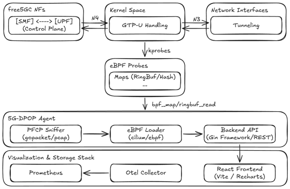
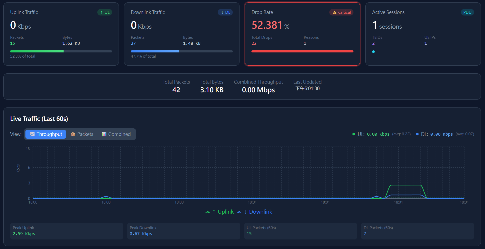
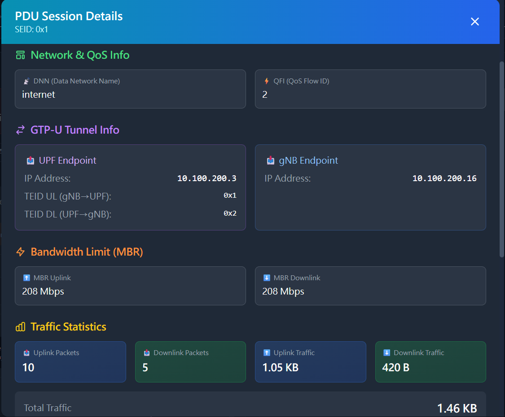
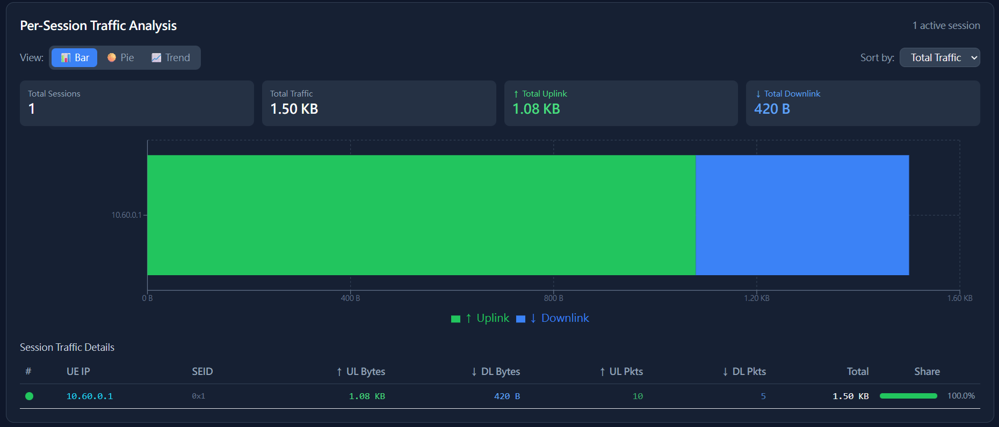
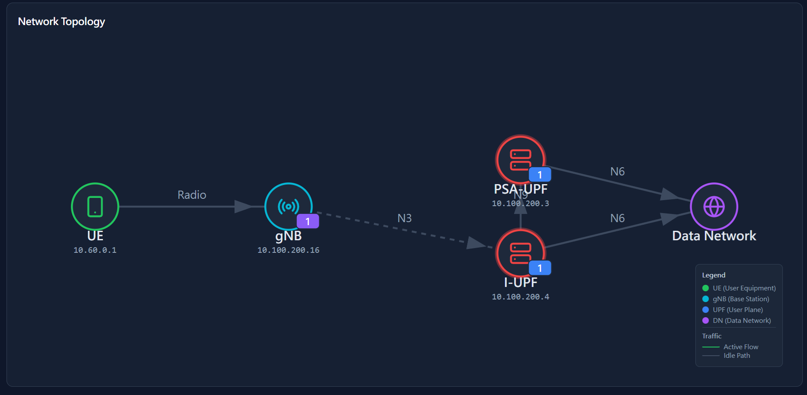
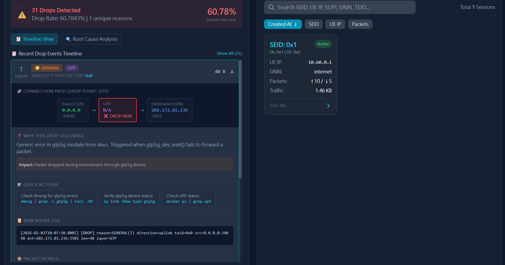
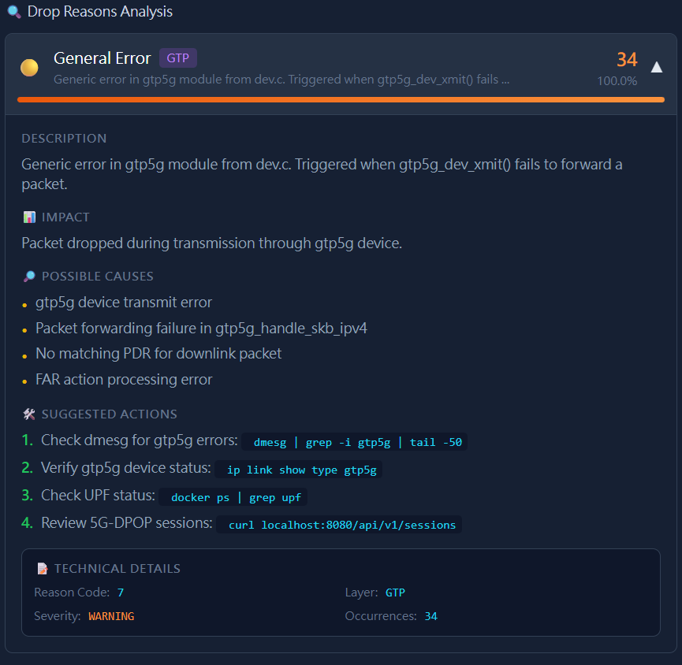

# 5G-DPOP: eBPF-Based UPF Data Plane Observability Platform

> [!NOTE]
> Author: [Yu-Chen Chan](https://github.com/solar224)
> Date: 2026/02/11

---

## 1. Introduction

In the 5G Core Network architecture, the User Plane Function (UPF) handles user data-plane packet forwarding. However, the UPF's packet-processing logic runs in Linux kernel space through the `gtp5g` kernel module, making its internal behavior difficult to observe with traditional user-space monitoring tools.

When network issues occur, engineers often face the following challenges:

- **Packet loss is hard to trace**: It is often unclear where a packet was dropped and why.
- **Traffic statistics lack context**: Interface-level counters cannot identify individual UE or GTP tunnel traffic.
- **Session correlation is difficult**: Traffic is hard to associate with a specific PDU session or UE.

**5G-DPOP (Data Plane Observability Platform)** brings that hidden processing path into view by attaching eBPF programs to key functions in the `gtp5g` kernel module:

- **Real-time traffic monitoring**: Show how much UE traffic passes through the user plane in each direction.
- **Packet-drop visibility**: Turn `gtp5g` drop signals into structured events with a reason and available packet context.
- **PFCP session correlation**: Connect observed traffic to the PDU session and forwarding rules that explain it.
- **Network topology visualization**: Present both direct UE → gNB → UPF → DN paths and multi-UPF N9 paths.

---

## 2. System Architecture



*Figure 1. 5G-DPOP system architecture*

Each component answers a different operational question: what happened in the kernel, which session it belongs to, how the data should be delivered, and how an operator can explore it.

| Component | Tech Stack | Description | Port |
|-----------|------------|-------------|------|
| **eBPF Agent** | Go + cilium/ebpf | Load eBPF programs, read kernel maps, and export metrics | 9100 |
| **PFCP Sniffer** | Go + gopacket | Capture PFCP messages and build session and forwarding-rule correlations | UDP 8805 (observed) |
| **API Server** | Go + Gin | Provide REST APIs and WebSocket updates | 8080 |
| **Web Frontend** | React + TypeScript + Vite | Provide the visualization dashboard | 3000 |
| **Prometheus** | Docker | Optional time-series metrics storage | 9090 |
| **Otel Collector** | Docker | Optional OpenTelemetry collector | 4317 |

### 2.1 eBPF Agent

The eBPF Agent observes the points where `gtp5g` receives, forwards, or rejects traffic. This gives the rest of the platform direct evidence from the UPF data path instead of treating the kernel module as a black box.

#### Hook Mechanism

The following hooks provide complementary views of forwarding and failure:

| Hook Point | Function Name | Purpose |
|------------|---------------|---------|
| Uplink Entry | `gtp5g_encap_recv` | Measure GTP-U traffic arriving from a gNB or an upstream UPF |
| Downlink Exit | `gtp5g_dev_xmit` | Measure traffic entering `gtp5g` for tunnel transmission |
| Primary Drop Hook | `gtp5g_trace_drop` | Preserve the explicit reason reported by `gtp5g` |
| Uplink PDR Lookup | `pdr_find_by_gtp1u` | Show whether an uplink TEID resolves to a PDR |
| Downlink PDR Lookup | `pdr_find_by_ipv4` | Show whether a downlink UE address resolves to a PDR |

The compatible `gtp5g-DPOP` module adds `gtp5g_trace_drop` so that an internal forwarding decision can become an observable event. Its reason code and available packet context are delivered through a ring buffer, giving the dashboard enough evidence to explain the failure without presenting unrelated kernel activity as a UPF drop.

#### BPF Maps

BPF maps bridge the kernel and user-space parts of the platform. Counters remain efficient on the packet path, while event maps carry the context needed for session and topology correlation.

| Map Type | Name | Purpose |
|----------|------|---------|
| `PERCPU_ARRAY` | `traffic_stats` | Store uplink/downlink counters without adding a shared lock to the packet path |
| `RINGBUF` | `drop_events` | Deliver structured drop events to user space |
| `RINGBUF` | `packet_events` | Send packet metadata used for traffic and path correlation |
| `HASH` | `teid_session_map` | Connect a TEID to the session context learned from PFCP |
| `HASH` | `teid_stats` | Per-TEID traffic statistics |
| `HASH` | `ue_ip_stats` | Per-UE IP traffic statistics |

#### Packet Drop Reason Codes

The drop reason code turns a generic packet-loss symptom into an actionable category. The following examples cover routing, rule lookup, policy, and transmission failures:

| Code | Name | Description |
|------|------|-------------|
| 3 | `NO_ROUTE` | No route to destination |
| 6 | `NO_PDR` | No matching PDR rule found |
| 8 | `UL_GATE_CLOSED` | Uplink QoS Gate closed |
| 9 | `DL_GATE_CLOSED` | Downlink QoS Gate closed |
| 14 | `IP_XMIT_FAIL` | IP layer transmission failed |

### 2.2 PFCP Sniffer

eBPF shows what happened to a packet; PFCP explains which session and forwarding policy the packet belongs to. By observing N4 messages between the SMF and UPF, the PFCP Sniffer adds UE, tunnel, PDR, FAR, and path context to the raw data-plane events.

#### Monitored PFCP Message Types

| Message Type | Purpose |
|--------------|---------|
| Session Establishment Request/Response | Create the observed session and extract F-SEID, F-TEID, and UE IP evidence |
| Session Modification Request/Response | Update forwarding rules, tunnel identifiers, and session state |
| Session Deletion Request/Response | Remove the session and its related correlations |

#### Session Data Structure

A session must keep protocol identifiers, topology evidence, counters, and state separate so that one value is never presented as another. The following excerpt shows how those views are brought together:

```go
type Session struct {
    SEID          uint64   // Internal observation key; not a PFCP SEID
    CPSEID        uint64   // Control-plane F-SEID
    UPSEID        uint64   // User-plane F-SEID
    UEIP          net.IP
    UPFIP         net.IP
    UPFN3IP       net.IP
    GNBIP         net.IP
    N9PeerIP      net.IP
    TEIDs         []uint32
    DNN           string
    QFI           uint8
    FlowRules     []FlowRule

    BytesUL, BytesDL     uint64
    PacketsUL, PacketsDL uint64

    EstablishmentStatus string
    DataPlaneStatus     string
}
```

This separation ensures that the dashboard presents each protocol identifier only when it was observed, while the internal `SEID` key simply keeps related records organized.

#### Session State Tracking

The session state distinguishes an incomplete signalling procedure from a working tunnel or an idle data plane:

- **Pending**: A Session Establishment Request was observed and is waiting for confirmation.
- **Established**: A successful Session Establishment Response or a later Session Modification was observed.
- **Failed**: The pending session timed out without successful confirmation.

### 2.3 API Server

The API Server turns low-level observations into a stable contract for the dashboard. REST endpoints expose detailed records, while WebSocket updates keep the overview responsive during live traffic.

#### REST API Endpoints

| Endpoint | Description |
|----------|-------------|
| `GET /api/v1/health` | Health check |
| `GET /api/v1/sessions` | Get all PDU Sessions |
| `GET /api/v1/topology` | Get network topology |
| `GET /api/v1/metrics/traffic` | Get traffic statistics |

#### WebSocket Streaming

The API Server refreshes traffic, drop, and session summaries from the Agent and broadcasts an updated view every second. This allows an operator to watch new traffic or a drop appear without manually refreshing the page.

### 2.4 Data Flow

Reading the architecture from kernel to browser shows how a forwarding event becomes information an operator can act on:

**Kernel Space:**

1. The `gtp5g` module processes GTP-U packets.
2. eBPF hooks capture traffic, lookup, and drop evidence at the relevant processing points.
3. BPF maps and ring buffers carry counters and events to user space.

**User Space:**

1. The **PFCP Sniffer** adds session and forwarding-rule context.
2. The **eBPF Agent** correlates that context with kernel observations and exports live data.
3. The **API Server** builds session, traffic, drop, and topology responses.
4. The **Web Frontend** turns those responses into an interactive operational view.

---

## 3. Feature Demonstration

### 3.1 Real-time Traffic Monitoring

The dashboard makes uplink and downlink behavior visible while a ping, download, or application flow is running. Packet and byte trends help an operator see whether traffic reaches the UPF and whether both directions are active.



*Figure 2. Real-time traffic monitoring charts*

### 3.2 PDU Session Information

The session view answers a practical question: which tunnel and forwarding rules belong to this UE traffic? It keeps the observation ID, CP F-SEID, UP F-SEID, local F-TEID, and outer-header TEID distinct, and displays each protocol identifier only when the corresponding PFCP evidence was captured.



*Figure 3. PDU session details*

Per-session traffic statistics provide a focused view of the traffic attributed to each observed session:



*Figure 4. Per-session traffic statistics*

### 3.3 Network Topology Visualization

The topology view turns the same evidence into an end-to-end route through UE, gNB, UPF, N3, N9, N6, and DN nodes. Because UPF roles and DN selectors come from observed forwarding behavior, the visualization can adapt to single-UPF and ULCL deployments without changing the frontend for each topology.



*Figure 5. Evidence-derived network topology*

### 3.4 Packet Drop Detection

The drop view turns a low-level `gtp5g` signal into a troubleshooting starting point. It presents the reported reason together with the originating hook and available packet or session context, so an operator can decide whether to investigate routing, PFCP rules, QoS policy, or transmission.



*Figure 6. Real-time packet-drop detection*

The system also provides drop reason statistics to help locate the root cause:



*Figure 7. Packet-drop reason analysis*

Common drop reasons include:

- `NO_PDR`: No matching PDR rule was found.
- `UL_GATE_CLOSED` / `DL_GATE_CLOSED`: A QoS gate is closed.
- `NO_ROUTE`: No route to the destination is available.

---

## 4. Demo Videos

### Basic Operation Demo

The first video shows how live traffic and session tracking appear during normal operation.

<iframe width="100%" height="500" src="https://www.youtube.com/embed/q5S6spIqfPg" title="demo single" frameborder="0" allow="accelerometer; autoplay; clipboard-write; encrypted-media; gyroscope; picture-in-picture; web-share" referrerpolicy="strict-origin-when-cross-origin" allowfullscreen></iframe>

### Packet Drop Test

The second video demonstrates how a reported drop becomes a reason-oriented troubleshooting view.

<iframe width="100%" height="500" src="https://www.youtube.com/embed/ntuTbTNDHSk" title="Drop test" frameborder="0" allow="accelerometer; autoplay; clipboard-write; encrypted-media; gyroscope; picture-in-picture; web-share" referrerpolicy="strict-origin-when-cross-origin" allowfullscreen></iframe>

---

## 5. Quick Start

To reproduce the demonstrations in this article, follow the maintained [5G-DPOP Quick Start](https://github.com/solar224/5G-DPOP/blob/main/docs/quick-start.md). It guides you from environment preparation to UE traffic generation and the first verified dashboard result, with diagnostics collected after the main workflow.

---

## 6. Summary

5G-DPOP combines kernel evidence with PFCP context so that traffic, sessions, topology, and drops can be understood as parts of the same user-plane story:

- **Kernel-level visibility** shows where `gtp5g` receives, forwards, and rejects traffic.
- **Session-aware correlation** connects counters and events to the relevant UE, tunnel, and forwarding rules.
- **Adaptive topology** presents direct and multi-UPF paths from observed behavior.
- **Focused troubleshooting** turns a packet-loss symptom into a smaller set of routing, policy, or session checks.

For 5G Core Network developers and operators, this approach shortens the path from “traffic is not working” to evidence that explains where to investigate next.

---

## References

- [5G-DPOP - eBPF-Based UPF Data Plane Observability Platform](https://github.com/solar224/5G-DPOP)
- [gtp5g-DPOP - 5G-DPOP-Compatible GTP-U Kernel Module](https://github.com/solar224/gtp5g-DPOP)
- [eBPF - Extended Berkeley Packet Filter](https://ebpf.io/)
- [cilium/ebpf - Go library for eBPF](https://github.com/cilium/ebpf)
- [free5GC - Open Source 5G Core Network](https://free5gc.org/)
- [3GPP TS 29.244 - PFCP Specification](https://www.etsi.org/deliver/etsi_ts/129200_129299/129244/15.05.00_60/ts_129244v150500p.pdf)

---

## About

Hello, I'm Yu-Chen Chan. I'm a contributor to the free5GC project, focusing on 5G Core Network technologies. I hope this project and blog post have been helpful. If you have any questions, suggestions, or would like to discuss further, please don't hesitate to reach out.

### Connect with Me

- GitHub: [solar224](https://github.com/solar224)
