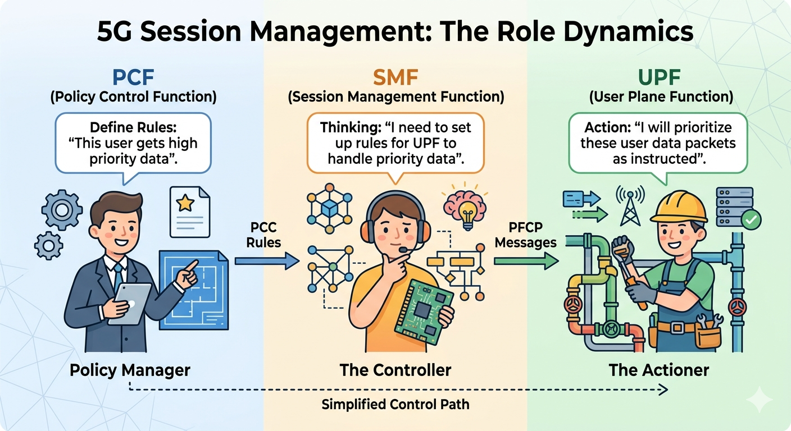
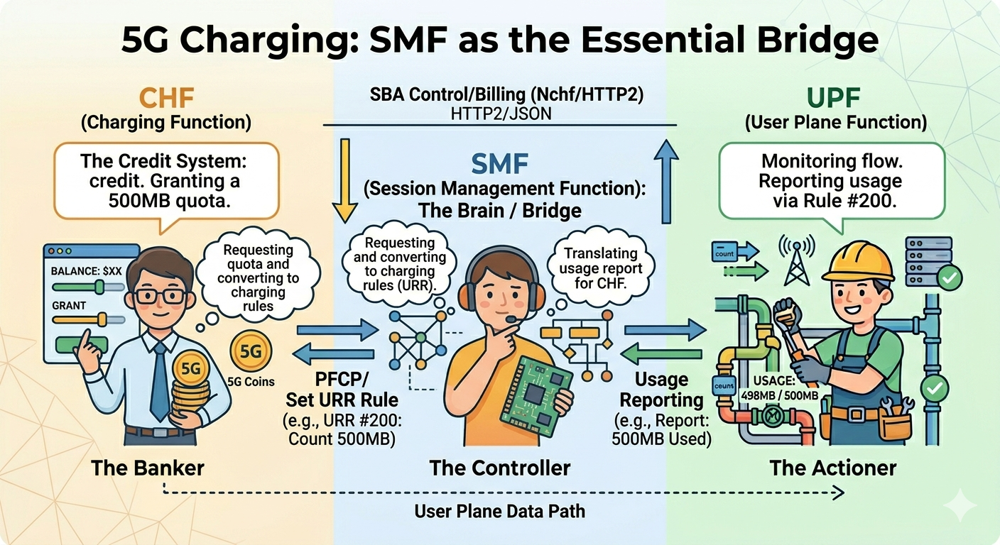

# Refactoring 5G Charging Logic: How I Fixed Resource Leaks and ID Overlaps in free5GC SMF
>[!NOTE]
> Author: HUANG, YUAN-CHUN
> Date: 2026/03/22
## 1. Introduction
The evolution of a robust 5G core often relies on the strictness of its individual components. A recent critical update in go-upf [PR #87](https://github.com/free5gc/go-upf/pull/87)
introduced more rigorous validation for PFCP rules, specifically treating duplicate Usage Reporting Rule (URR) creations as explicit errors. 
``` go
// HasCreateURR checks if the plan contains a CreateURR with the given URR ID
func (p *ModificationPlan) HasCreateURR(urrid uint32) bool {
	for _, u := range p.CreateURRs {
		if u.URRID == urrid {
			return true
		}
	}
	return false
}
```

This change acted as a catalyst, exposing a fundamental flaw in how the free5gc SMF handled charging rules derived from the PCF. Previously, the SMF would frequently generate redundant URR requests within the same PFCP session, leading to integration failures under the new UPF standards. 

This realization prompted a deep dive into the SMF's internal state management. In this post, I will walk through the refactoring process in SMF [PR #195](https://github.com/free5gc/smf/pull/195), where I overhauled the URR recording mechanism to ensure proper resource release and resolved a critical bug where identical URR IDs were incorrectly shared across multiple UPF instances—effectively streamlining the PFCP message generation for a more stable and standards-compliant core network.

### 1.1 Understanding 5G Charging: Offline, Online, and the Core Network Symphony
Before diving into the code refactor, it is essential to understand how charging actually works in a 5G Service-Based Architecture (SBA). In 3GPP standards, charging is categorized into two primary modes:

- **Offline Charging:** The network collects resource usage information (like data volume or duration) and generates Charging Data Records (CDR). These records are typically processed later for billing (e.g., your monthly post-paid bill).

- **Online Charging:** This is a real-time interaction. The network must request "quota" (credit) from the charging system before providing service. If the user runs out of balance, the service is immediately throttled or terminated (e.g., a pre-paid SIM card).

**The Four Key Players**
To orchestrate this, four main Network Functions (NFs) must work in perfect synchronization:

1. PCF (Policy Control Function): The "Brain." It defines the charging policies—for example, "this specific App's traffic should be billed at a premium rate." It sends these rules to the SMF.

2. SMF (Session Management Function): The "Controller." It translates PCF's high-level policies into low-level URR (Usage Reporting Rules). It is the SMF's responsibility to manage the lifecycle of these URRs and instruct the UPF via the PFCP protocol.

3. UPF (User Plane Function): The "Worker." It sits in the data path, actually counting every byte that passes through. Based on the URR it receives, it monitors usage and sends Usage Reports back to the SMF when thresholds are met.

4. CHF (Charging Function): The "Accountant." It maintains the user's billing state and quotas, communicating with the SMF via the Nchf interface to authorize service usage.






### 1.2 Defining Usage Reporting Rules (URRs)
As illustrated in our architectural breakdown, the SMF doesn't simply tell the UPF to "count data." It must provide specific, structured measurement instructions. In the language of the Packet Forwarding Control Protocol (PFCP) used on the N4 interface, these instructions are called Usage Reporting Rules (URRs).

Think of a URR as a detailed measurement job description given to the UPF worker. When traffic matches a certain profile, the UPF consults the associated URR to know how to measure it and when to report back to the SMF bridge.

A critical aspect of SMF logic—and the focus of my recent refactor—is understanding that a single PDU Session (a user's connection) rarely uses just one URR. To support complex modern billing schemes, the SMF must manage a hierarchy of URRs. This brings us to the distinction between PDU Session Level and Flow Level charging.

1. **PDU Session Level Charging: The Aggregate View**

    PDU Session Level charging is the simplest form of accounting. It measures the total volume of data (uplink and downlink combined, or separated) passing through the entire PDU Session, regardless of which specific application or service generated that traffic.

    - How it works: The SMF creates one main URR (e.g., URR ID 1) that is applied to all traffic within the session.

    - Use Case: This is typically used for enforcing total monthly data caps (e.g., your base 20GB allowance).

    In previous free5gc implementations, managing this single ID was straightforward. However, modern networks require more granularity.

2. **Flow Level Charging (SDF): The Granular View**

    Flow Level Charging, often associated with Service Data Flows (SDFs), allows operators to apply different billing rates or policies to specific types of traffic (e.g., video streaming vs. web browsing vs. messaging). This is achieved through the interaction of Packet Detection Rules (PDRs) and multiple URRs.

    - How it works: The SMF defines specific PDRs to identify flows (e.g., traffic matching Netflix IP addresses). It then links that specific flow to a dedicated URR (e.g., URR ID 2). Standard internet traffic might simultaneously be counted by URR ID 3.

    - Use Case: This enables complex schemes like "zero-rating" WhatsApp traffic (counting it but not charging for it) while charging a premium for 4K video streaming, or providing a dedicated data quota for gaming.

## 2. The Root of the Problem: Architectural Flaws in URR Management
While the theory of 5G charging is sound, the implementation in a complex topology like **Uplink Classifier (ULCL)** revealed a significant architectural oversight in the SMF. To understand the bug, we must look at how the SMF handles **Policy and Charging Control (PCC) Rules**.

In free5gc, PCC rules are categorized into `PDU Session Level` and `Flow Level`. The problem arises because of a fundamental mismatch: **A single PCC Rule typically defines only one Data Path, but in a ULCL scenario, multiple Data Paths must be accounted for simultaneously**.

**The Flawed Execution Flow**

By tracing the SMF logic, I identified a problematic sequence in the way rules are applied to the User Plane. When a PCC rule is triggered, the SMF follows this simplified call stack:

``` Plaintext
├─ ApplyPccRules()                [sm_context_policy.go]
│   ├─ CreatePccRuleDataPath()       [sm_context.go]
│   │   ├─ ...
│   │   ├─ AddChargingRules()        [datapath.go]  <-- URR is linked to the primary path
│   │   └─ ...
│   └─ addPduLevelChargingRuleToFlow() [sm_context_policy.go] <-- The "Force-Add" Logic
```
Here is where the logic breaks down:

1. `AddChargingRules()`: This function attaches the URR specified by the PCC rule to the Packet Detection Rules (PDRs) of the primary data path.

2.  `addPduLevelChargingRuleToFlow()`: Because ULCL requires every branch (every path to an Anchor UPF) to be charged at the PDU level, the SMF attempts to "copy" the PDU-level URR into all other existing paths.

**The "Shared URR" Crisis**
The fatal error is that the SMF treats the URR as a **global object** rather than a **per-UPF resource**.

In a ULCL structure, you have multiple Anchor UPFs. By using the logic above, the SMF assigns the exact same URR (with the same ID and state) to different UPF instances. This creates a "Shared URR" scenario that leads to two major issues:

1. **Duplicate Creation Errors:** Following the recent update in go-upf (PR #87), the User Plane now strictly validates PFCP messages. When the SMF tries to "create" the same URR across different paths or repeatedly within the same session, the UPF flags this as an illegal duplicate creation, causing the session establishment to fail.

2. **Resource Overlap & Inaccuracy:** Because multiple UPFs are reporting usage against the same URR ID, the SMF cannot distinguish which volume came from which UPF. If one UPF reports 50MB and another reports 50MB using the same ID, the SMF's internal state becomes a race condition, leading to corrupted charging data sent to the CHF.

This discovery made it clear: the SMF needed a complete refactor of how it records and dispatches URRs. It needed to stop "sharing" and start "managing" the lifecycle of every rule for every specific UPF.

### 2.1 The Solution: Implementing a Robust URR Lifecycle Manager
To fix the shared ID conflicts and resource leaks, I introduced a fundamental shift in how the SMF manages Charging Rules. Instead of relying on a loosely managed global state, the SMF now treats every **Usage Reporting Rule (URR)** as a tracked entity with a strictly managed lifecycle tied to specific **UPF instances**.

1. The `UrrEntry`: Granular Tracking
The core of the refactor is the introduction of the `UrrEntry` struct. This structure allows the SMF to maintain a "Source of Truth" for every URR currently deployed on the User Plane.

```Go
type UrrEntry struct {
    Rule     *URR       // The actual rule content (Rating Group, Thresholds...)
    State    RuleState  // The deployment state (INITIAL, CREATE, REMOVE...)
    RefCount int        // How many PDRs are currently referencing this URR
    PDRIDs   []uint16   // Traceability: Which PDR IDs are using this rule?
}
```
Two fields here are critical for stability:

- `RefCount`: This prevents premature deletion. Since multiple Packet Detection Rules (PDRs) can point to the same URR (especially in complex flow-based charging), we only mark a URR for removal when the reference count hits zero.

- `PDRIDs`: This provides essential observability. If a developer needs to debug why a URR isn't being released, they can trace exactly which PDRs are still "holding" it.

2. Transitioning from "Reuse" to "Release"

    Previously, free5gc SMF lacked a formal mechanism to release URRs from the UPF once a session was modified or terminated. It relied on a "reuse" concept that often led to stale rules hanging in the UPF's memory.

    In PR #195, I implemented a formal //Reference Counting** and State Management flow:

- `PDRAppendURRs`: When a new data path is established, the SMF registers the URR to a specific upfId and increments its RefCount. This ensures that even in ULCL scenarios, URRs are tracked uniquely per UPF.

- `PDRReleaseURRs`: When a PDR is removed or a path is deactivated, the SMF decrements the count.

- Automatic Removal: Once the `RefCount` reaches zero, the URR state is set to `RULE_REMOVE`.

### 2-2 The Two-Pass Solution: Orchestrating URR Injection
To resolve the architectural flaw where multiple Anchor UPFs were incorrectly sharing the same URR instances, I refactored the `ApplyPccRules()` and `AddChargingRules()` logic into a **Two-Pass execution structure**.

The Core Challenge: PDU-Level Dependencies

In a 5G session, a Flow-level rule (SDF) doesn't exist in a vacuum; it must also contribute to the overall PDU Session-level charging quota. In a ULCL topology, where traffic is split across different Anchor UPFs, each UPF must have its own unique instance of the PDU-level URR to maintain the integrity of the PFCP session.

The legacy implementation tried to "force-inject" these rules in a single pass, which led to SMF attempting to reuse the exact same URR object across different UPF boundaries. This is what caused the "Duplicate Creation" errors and data corruption.

**Pass 1: Establishing the PDU-Level Baseline**

The first stage of the refactor focuses exclusively on rules identified as `PduSessionCharging`.

```go
// Pass 1: Pdu Session level charging rules
for id, pcc := range pduRulesToProcess {
    if err := processRule(id, pcc, nil); err != nil {
        return err
    }
}
```
During this pass, the SMF creates the primary charging rules for the session.Crucially, we do not try to link these rules to other flow-level paths yet. Once Pass 1 is complete, we perform a Collection Phase, where we gather all successfully created PDU-level `ChargingData` into a temporary repository (`pduChgDatas`).

**Pass 2: Flow-Level Injection with Context**

In the second pass, we process the `Flow level charging rules`. However, instead of processing them in isolation, we "inject" the collected PDU-level charging definitions into the creation process of each flow-level path.

``` Go
// Pass 2: Flow level charging rules, applying PDU-level charging data
for id, pcc := range flowRulesToProcess {
    if err := processRule(id, pcc, pduChgDatas); err != nil {
        return err
    }
}
```
**Refactoring** `AddChargingRules`: From Sharing to Intelligent Retrieval
The real magic happens inside the refactored `AddChargingRules()` in `datapath.go`. Instead of blindly copying a URR ID, the function now takes the list of `pduChgDatas` as an argument.

As the SMF iterates through the data path, it only applies charging rules to Anchor UPFs. For each specific UPF node, it uses a new method, `GetOrCreateUrr()`, to handle the PDU-level requirements.

``` Go
if chgLevel != PduSessionCharging && len(pduChgDatas) > 0 {
    for _, pduData := range pduChgDatas {
        // Ensure this specific UPF gets its own URR instance for the PDU data
        if pduUrr := p.GetOrCreateUrr(smContext, currentUPF, pduData, PduSessionCharging); pduUrr != nil {
            urrsToAttach = append(urrsToAttach, pduUrr)
		}
    }
}
```
**Why This Architecture Wins**

By decoupling the definition of a charging rule from its instance on the UPF, we achieved three major improvements:

1. UPF Isolation: `GetOrCreateUrr()` ensures that if a flow-level rule requires a PDU-level counter on Anchor UPF-B, it creates (or retrieves) a URR ID that is valid only for UPF-B.

2. Order of Operations: The Two-Pass structure ensures that all session-wide charging definitions are fully resolved and available before any granular flow-level rules are constructed.

3. Strict Compliance: This eliminates the duplicate creation errors in the User Plane (go-upf), as the SMF no longer tries to "leak" URR objects from one data path into another.

## 2-3 The "Logic Bomb": When Correctness Unmasks a Bug
After implementing this rigorous lifecycle management, I encountered an unexpected side effect: connection drops during rule updates. Through deep debugging, I discovered a "logic bomb" hidden in the interaction between the SMF and the CHF (Charging Function).

**The Mechanism of Failure**

In my refactored SMF, when a rule is updated, the old URR is explicitly released via `PDRReleaseURRs`. When the UPF receives the PFCP removal command, it sends a "Final" Usage Report back to the SMF. The SMF then forwards this to the CHF as an `Update `request with a final usage flag.

- The CHF Behavior: Upon receiving a "Final" report for a specific Rating Group, the CHF enters a Debit Mode to settle the balance.

- The Bug: Once the CHF processed this settlement, it failed to transition back to an authorization state for that session. Consequently, when the SMF immediately requested a new Quota for the newly created URR (part of the same update procedure), the CHF refused to grant it. Without a quota, the SMF couldn't activate the rules, leading to a dropped connection.

**Why the Legacy SMF Survived**
Interestingly, the legacy free5gc SMF never encountered this because its URR management was "lazy." It relied on reusing URR IDs and rarely performed an explicit release. Because it didn't strictly clean up old rules, it rarely sent the "Final" usage report that triggered the CHF’s problematic debit-settlement state.

By making the SMF’s resource management "correct" and standards-compliant, I inadvertently exposed a state-machine flaw in the CHF. This highlights a fundamental truth in 5G Core development: **improving the robustness of one Network Function often uncovers hidden fragilities in the rest of the Service-Based Architecture (SBA)**.

## 3. Looking Ahead: The Vision for a Dynamic URR Quota Manager
While the refactoring in PR #195 successfully resolved the immediate crisis of URR ID conflicts and resource leaks, it also laid the groundwork for a more advanced challenge in 5G charging: **intelligent quota distribution**. ### The Current Limitation: Independent Silos
In the current implementation of free5gc, every URR instance is effectively a silo. When the SMF establishes multiple data paths—such as in an **Uplink Classifier (ULCL)** or Multi-homing scenario—it creates independent URRs for each Anchor UPF.

However, the **Charging Function (CHF)** usually grants a single, unified quota for a specific Rating Group (e.g., "You have 1GB for Video Streaming"). Currently, the SMF lacks a sophisticated way to "slice" this 1GB across different paths. If one path becomes heavily congested while another remains idle, the quota distribution can become inefficient, leading to premature service interruptions or excessive signaling back to the CHF.

The Proposal: A Centralized URR Quota Manager

The next evolution of the free5gc SMF should involve a Centralized URR Quota Manager. This internal component would sit above the UrrTable and act as the "Financial Controller" for the PDU Session.

Key features of this proposed manager would include:

- Dynamic Quota Slicing: Instead of static allocation, the manager could monitor real-time traffic trends on each data path. It could then dynamically distribute slices of the total CHF quota to specific URRs based on their current load.

- Predictive Rebalancing: If URR-A (at Anchor UPF 1) is consuming data rapidly while URR-B (at Anchor UPF 2) is dormant, the manager could "recall" unused quota from URR-B and reassign it to URR-A without needing a new `Nchf_ConvergedCharging_Update` request.

- Global-Local Sync: It would maintain a "Global View" of the session's total remaining balance while ensuring each "Local" URR on the User Plane has enough threshold to operate smoothly.

## Conclusion
Refactoring the charging logic was about more than just fixing a bug; it was about bringing architectural precision to how the SMF handles its most critical resources. By implementing the Two-Pass structure and rigorous lifecycle management, free5gc is now better equipped for complex multi-UPF deployments.

If you're interested in the code details, check out the full PR at https://github.com/free5gc/smf/pull/195/. Let's keep building a better open-source 5G together!