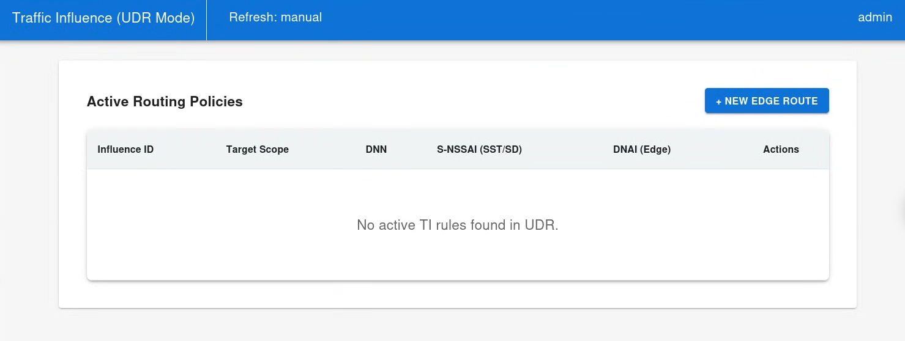
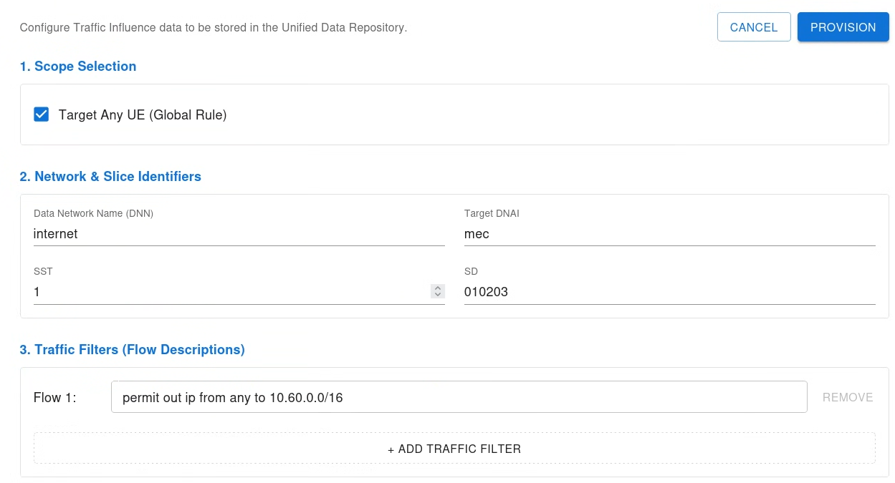
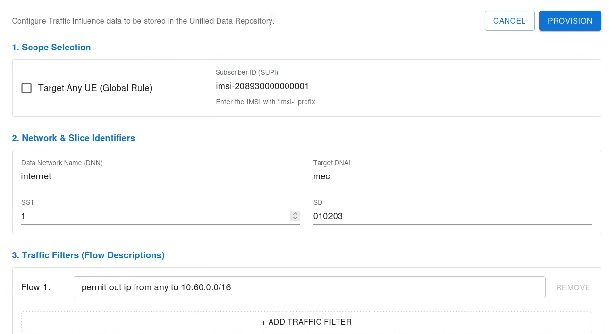
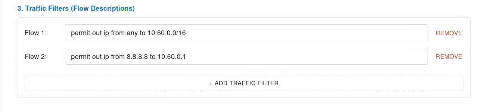

# Simplifying 5G Edge Routing: The free5GC Traffic Influence WebUI Project
>[!NOTE]
> Author: Chia-Hui, Chen
> Date: 2026/03/25
---
## **Overview**
Multi-access Edge Computing (MEC) is the cornerstone of 5G’s promise for ultra-low latency. To ensure user data reaches local edge servers instead of traveling to a distant central cloud, the 5G Core (5GC) introduces the Traffic Influence (TI) mechanism. By steering traffic toward a specific Data Network Access Identifier (DNAI), TI allows for seamless Local Breakout (LBO) and dynamic routing. In the free5GC ecosystem, one of the most powerful and direct ways to trigger this process is through the Unified Data Repository (UDR).

### The Pain Point
Despite the rigorous definitions in 3GPP specifications, managing these policies in a real-world deployment is often a nightmare. Currently, most open-source 5GC implementations lack a dedicated graphical interface for TI. Developers and network administrators are forced to:

* Manually craft complex JSON payloads for RESTful APIs.

* Use command-line tools like curl to trigger routing changes, which is highly prone to syntax errors.

* Operate in a "blind" state where there is no centralized dashboard to visualize which rules are active or which User Equipment (UE) is being steered.
### Bridging the Gap with a GUI
To solve this problem, we developed a specialized Traffic Influence WebUI within the free5GC project. This article explores how we designed a user-centric interface that encapsulates 3GPP complexity into an intuitive dashboard, enabling one-click edge routing management.

## **Architecture & Feature**
In the 5G Service-Based Architecture (SBA), Traffic Influence data can be stored directly in the UDR. When information is stored or updated in the UDR, it triggers a chain reaction: UDR notifies PCF, which then decides the policy and informs SMF to reconfigure the UPF (specifically inserting an ULCL or branching point).

Our WebUI acts as a management console, interacting directly with the UDR's SBI to manage these policies.


### Key Features of the WebUI:
* **GUI-Driven Provisioning**: Replaces complex JSON/CLI operations with an intuitive web form.
* **Flexible Steering Scope**: Supports both Global routing (applying to all UEs via "Any UE") and Individual routing (targeting specific users via SUPI).
* **Granular Traffic Filtering**: Allows administrators to define precise Flow Descriptions (e.g., 5-tuple IP rules) to intercept exact MEC traffic.
* **Direct UDR Manipulation**: Synchronizes directly with the core network's database, ensuring the UI always reflects the true runtime state.


## **Implementation Detail**
The WebUI provides a unified form that maps user input directly to the UDR's TrafficInfluData structure.

The TrafficInfluData structure:
```go
// Represents the Traffic Influence Data.
type TrafficInfluData struct {
	// Contains the Notification Correlation Id allocated by the NEF for the UP path change notification.
	UpPathChgNotifCorreId string `json:"upPathChgNotifCorreId,omitempty" yaml:"upPathChgNotifCorreId" bson:"upPathChgNotifCorreId,omitempty"`
	// Identifies whether an application can be relocated once a location of the application has been selected.
	AppReloInd bool `json:"appReloInd,omitempty" yaml:"appReloInd" bson:"appReloInd,omitempty"`
	// Identifies an application.
	AfAppId string `json:"afAppId,omitempty" yaml:"afAppId" bson:"afAppId,omitempty"`
	// String representing a Data Network as defined in clause 9A of 3GPP TS 23.003;  it shall contain either a DNN Network Identifier, or a full DNN with both the Network  Identifier and Operator Identifier, as specified in 3GPP TS 23.003 clause 9.1.1 and 9.1.2. It shall be coded as string in which the labels are separated by dots  (e.g. \"Label1.Label2.Label3\").
	Dnn string `json:"dnn,omitempty" yaml:"dnn" bson:"dnn,omitempty"`
	// Identifies Ethernet packet filters. Either \"trafficFilters\" or \"ethTrafficFilters\" shall be included if applicable.
	EthTrafficFilters []EthFlowDescription `json:"ethTrafficFilters,omitempty" yaml:"ethTrafficFilters" bson:"ethTrafficFilters,omitempty"`
	Snssai            *Snssai              `json:"snssai,omitempty" yaml:"snssai" bson:"snssai,omitempty"`
	// String identifying a group of devices network internal globally unique ID which identifies a set of IMSIs, as specified in clause 19.9 of 3GPP TS 23.003.
	InterGroupId string `json:"interGroupId,omitempty" yaml:"interGroupId" bson:"interGroupId,omitempty"`
	// String identifying a Supi that shall contain either an IMSI, a network specific identifier, a Global Cable Identifier (GCI) or a Global Line Identifier (GLI) as specified in clause  2.2A of 3GPP TS 23.003. It shall be formatted as follows  - for an IMSI \"imsi-<imsi>\", where <imsi> shall be formatted according to clause 2.2    of 3GPP TS 23.003 that describes an IMSI.  - for a network specific identifier \"nai-<nai>, where <nai> shall be formatted    according to clause 28.7.2 of 3GPP TS 23.003 that describes an NAI.  - for a GCI \"gci-<gci>\", where <gci> shall be formatted according to clause 28.15.2    of 3GPP TS 23.003.  - for a GLI \"gli-<gli>\", where <gli> shall be formatted according to clause 28.16.2 of    3GPP TS 23.003.To enable that the value is used as part of an URI, the string shall    only contain characters allowed according to the \"lower-with-hyphen\" naming convention    defined in 3GPP TS 29.501.
	Supi string `json:"supi,omitempty" yaml:"supi" bson:"supi,omitempty"`
	// Identifies IP packet filters. Either \"trafficFilters\" or \"ethTrafficFilters\" shall be included if applicable.
	TrafficFilters []FlowInfo `json:"trafficFilters,omitempty" yaml:"trafficFilters" bson:"trafficFilters,omitempty"`
	// Identifies the N6 traffic routing requirement.
	TrafficRoutes []*RouteToLocation `json:"trafficRoutes,omitempty" yaml:"trafficRoutes" bson:"trafficRoutes,omitempty"`
	TraffCorreInd bool               `json:"traffCorreInd,omitempty" yaml:"traffCorreInd" bson:"traffCorreInd,omitempty"`
	// string with format 'date-time' as defined in OpenAPI.
	ValidStartTime *time.Time `json:"validStartTime,omitempty" yaml:"validStartTime" bson:"validStartTime,omitempty"`
	// string with format 'date-time' as defined in OpenAPI.
	ValidEndTime *time.Time `json:"validEndTime,omitempty" yaml:"validEndTime" bson:"validEndTime,omitempty"`
	// Identifies the temporal validities for the N6 traffic routing requirement.
	TempValidities []TemporalValidity `json:"tempValidities,omitempty" yaml:"tempValidities" bson:"tempValidities,omitempty"`
	NwAreaInfo     *NetworkAreaInfo   `json:"nwAreaInfo,omitempty" yaml:"nwAreaInfo" bson:"nwAreaInfo,omitempty"`
	// String providing an URI formatted according to RFC 3986.
	UpPathChgNotifUri string `json:"upPathChgNotifUri,omitempty" yaml:"upPathChgNotifUri" bson:"upPathChgNotifUri,omitempty"`
	// Contains the headers provisioned by the NEF.
	Headers          []string          `json:"headers,omitempty" yaml:"headers" bson:"headers,omitempty"`
	SubscribedEvents []SubscribedEvent `json:"subscribedEvents,omitempty" yaml:"subscribedEvents" bson:"subscribedEvents,omitempty"`
	DnaiChgType      DnaiChangeType    `json:"dnaiChgType,omitempty" yaml:"dnaiChgType" bson:"dnaiChgType,omitempty"`
	AfAckInd         bool              `json:"afAckInd,omitempty" yaml:"afAckInd" bson:"afAckInd,omitempty"`
	AddrPreserInd    bool              `json:"addrPreserInd,omitempty" yaml:"addrPreserInd" bson:"addrPreserInd,omitempty"`
	// Unsigned Integer, i.e. only value 0 and integers above 0 are permissible.
	MaxAllowedUpLat int32 `json:"maxAllowedUpLat,omitempty" yaml:"maxAllowedUpLat" bson:"maxAllowedUpLat,omitempty"`
	// Indicates whether simultaneous connectivity should be temporarily maintained for the source and target PSA.
	SimConnInd bool `json:"simConnInd,omitempty" yaml:"simConnInd" bson:"simConnInd,omitempty"`
	// indicating a time in seconds.
	SimConnTerm int32 `json:"simConnTerm,omitempty" yaml:"simConnTerm" bson:"simConnTerm,omitempty"`
	// A string used to indicate the features supported by an API that is used as defined in clause  6.6 in 3GPP TS 29.500. The string shall contain a bitmask indicating supported features in  hexadecimal representation Each character in the string shall take a value of \"0\" to \"9\",  \"a\" to \"f\" or \"A\" to \"F\" and shall represent the support of 4 features as described in  table 5.2.2-3. The most significant character representing the highest-numbered features shall  appear first in the string, and the character representing features 1 to 4 shall appear last  in the string. The list of features and their numbering (starting with 1) are defined  separately for each API. If the string contains a lower number of characters than there are  defined features for an API, all features that would be represented by characters that are not  present in the string are not supported.
	SupportedFeatures string `json:"supportedFeatures,omitempty" yaml:"supportedFeatures" bson:"supportedFeatures,omitempty"`
	// String providing an URI formatted according to RFC 3986.
	ResUri   string   `json:"resUri,omitempty" yaml:"resUri" bson:"resUri,omitempty"`
	ResetIds []string `json:"resetIds,omitempty" yaml:"resetIds" bson:"resetIds,omitempty"`
}
```

### Create & Update: Dynamic Payload Mapping
In UDR Mode, the system validates identifiers such as SUPI (IMSI) or the Any UE flag.

### Global Steering: 
By setting interGroupId to "AnyUE", the rule applies to all UEs within a specific DNN and S-NSSAI.


### Individual UE Steering (SUPI):
If the "Any UE" option is disabled, administrators can provide a specific SUPI (Subscription Permanent Identifier), typically formatted as imsi-<208930000000001>.

* Mechanism: The WebUI maps this value to the supi field in the UDR. When the specific UE establishes a PDU session, the PCF retrieves this data and instructs the SMF to apply the TI policy only for that user. This is crucial for developer testing or dedicated edge routing for VIP subscribers.


### Traffic Filters: 
We support multiple Flow Descriptions (e.g., permit out ip from any to 10.60.0.0/16) to define which traffic should be offloaded to the MEC.


### Read & Delete: Targeted Resource Cleanup
* Read: The system performs a direct database lookup in MongoDB (applicationData.influenceData), ensuring the UI reflects the "Source of Truth."

* Delete: The WebUI sends an SBI DELETE request to the UDR. Once removed, the PCF automatically triggers a routing update to revert traffic to the default path.

### SBI Authentication & Secure Communication

* In the 5G SBA, Network Functions (NFs) must authenticate before communicating. The WebUI cannot simply send an HTTP request to the UDR. Instead, it must act as a legitimate NF:

* Token Retrieval: The WebUI requests an OAuth2 access token from the NRF using webuiSelf.GetTokenCtx(models.ServiceName_NUDR_DR, ...).

* Request Binding: The token is bound to the HTTP headers.

* Execution: The authorized PUT or DELETE request is then sent to the UDR's /nudr-dr/v2/application-data/influenceData/{influenceId} endpoint.

### Validation via free5GC ci-test 
To verify that the WebUI can precisely inject Traffic Influence (TI) rules into the 5G Core, we employed a "semi-automated" validation approach using the free5GC ci-test framework.

#### Testing Mechanism and Underlying Behavior
We utilized a modified version of the built-in test script:
```bash
./ci-operation.sh test ulcl-ti
```
When this command is executed, the script performs several automated background operations:

Subscriber Provisioning: It automatically registers a test subscriber with specific S-NSSAI and DNN profiles in the database.

Environment Deployment: It triggers a free-ran-ue container to simulate a real UE performing 5G Registration and PDU Session Establishment.

Traffic Simulation: The UE simultaneously pings both N6 (Remote DN) and MEC (Local DN) endpoints to monitor data path steering.

#### Experimental Design: Shifting Control to the WebUI
In its original state, the TestULCLTrafficInfluence script automatically configures TI rules via curl. To validate our WebUI, we modified the script logic:

Disabling Auto-Configuration: We commented out the lines responsible for automatic API calls, forcing the system to remain in its default "non-offloaded" state.

Dual-Phase Validation:

* Phase 1 (Baseline Test): We execute the script without any prior configuration. As expected, the UE can only reach the N6 destination, and the ping to the MEC endpoint fails, confirming a "clean" environment.

* WebUI Manual Setup: While the core network remains active, we manually input and submit the Traffic Influence parameters via the WebUI.

* Phase 2 (Post-Configuration Test): We re-run the test script. This time, the script detects a successful ping to the MEC endpoint, indicating that the rules were successfully applied.
```go
func TestULCLTrafficInfluence(t *testing.T) {
	// FreeRanUe
	fru := freeRanUE.NewFreeRanUe()
	fru.Activate()
	defer fru.Deactivate()

	time.Sleep(3 * time.Second)

	// // before TI
	// t.Run("Before TI", func(t *testing.T) {
	// 	pingN6gwSuccessMecFailed(t)
	// })

	// // post TI
	// tiOperation(t, "put")

	// after TI
	t.Run("After TI", func(t *testing.T) {
		pingN6gwFailedMecSuccess(t)
	})

	// // delete TI
	// tiOperation(t, "delete")

	// // reset TI
	// t.Run("Reset TI", func(t *testing.T) {
	// 	pingN6gwSuccessMecFailed(t)
	// })

	// // flow level ping
	// t.Run("Flow Level Ping", func(t *testing.T) {
	// 	pingOneOneOneOne(t)
	// })

	// // check charging record
	// t.Run("Check Charging Record", func(t *testing.T) {
	// 	checkChargingRecord(t)
	// })
}
```
#### Demo Video
The video below demonstrates the transition from a Test Failed status to a Test PASSED status following the WebUI configuration.
<iframe 
  src="https://drive.google.com/file/d/1tLFcEJpyTojiJrL5R933SIQWgiJyXjD7/preview" 
  width="100%" 
  height="480" 
  allow="autoplay; fullscreen" 
  allowfullscreen="true">
</iframe>

## **Future Work: Observability**
While not currently a built-in feature of the official free5GC, this branch provides a clear direction and solid foundation for future development. A potential next step would be implementing UP Path Management Event Notifications. By subscribing to Nudr/SMF events, future iterations could feature:

* Real-time Tracking: Receiving instant updates whenever a DNAI change occurs or a PDU session is modified.

* Status Correlation: Correlating the "Configured State" (rules provisioned via the UI) with the "Runtime State" (how the core network actually routes traffic).

By transforming these asynchronous notifications into a visual dashboard, the WebUI could eventually evolve from a simple configuration tool into a comprehensive diagnostic platform for 5G Edge Computing.

## **Conclusion**
The Traffic Influence WebUI transforms an opaque, command-line process into a transparent graphical workflow.

## **Project Repository**
If you're interested, you can find my forked repository here: 
[webconsole-Traffic-Influence-WebUI](https://github.com/chchen7/webconsole/tree/feat/ti-gui)


**References**

- [free5GC](https://github.com/free5gc/free5gc)
- [free5GC/ci test](https://github.com/free5gc/ci-test)
- [free5GC/webconsole](https://github.com/free5gc/webconsole)
- [free5gc guide: Influence Traffic Routing](https://free5gc.org/guide/8-traffic-influence/)
- [free-ran-ue](https://github.com/free-ran-ue)

**About Me**
Hi, I'm Chia-Hui Chen. I'm currently diving into 5G technology and the free5gc project. I hope you find this blog valuable! Feel free to reach out if you have any feedback or would like to discuss anything further.