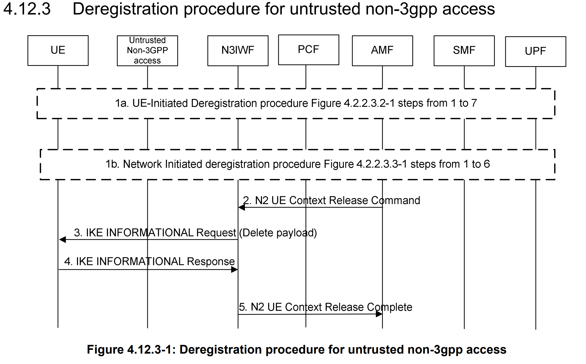
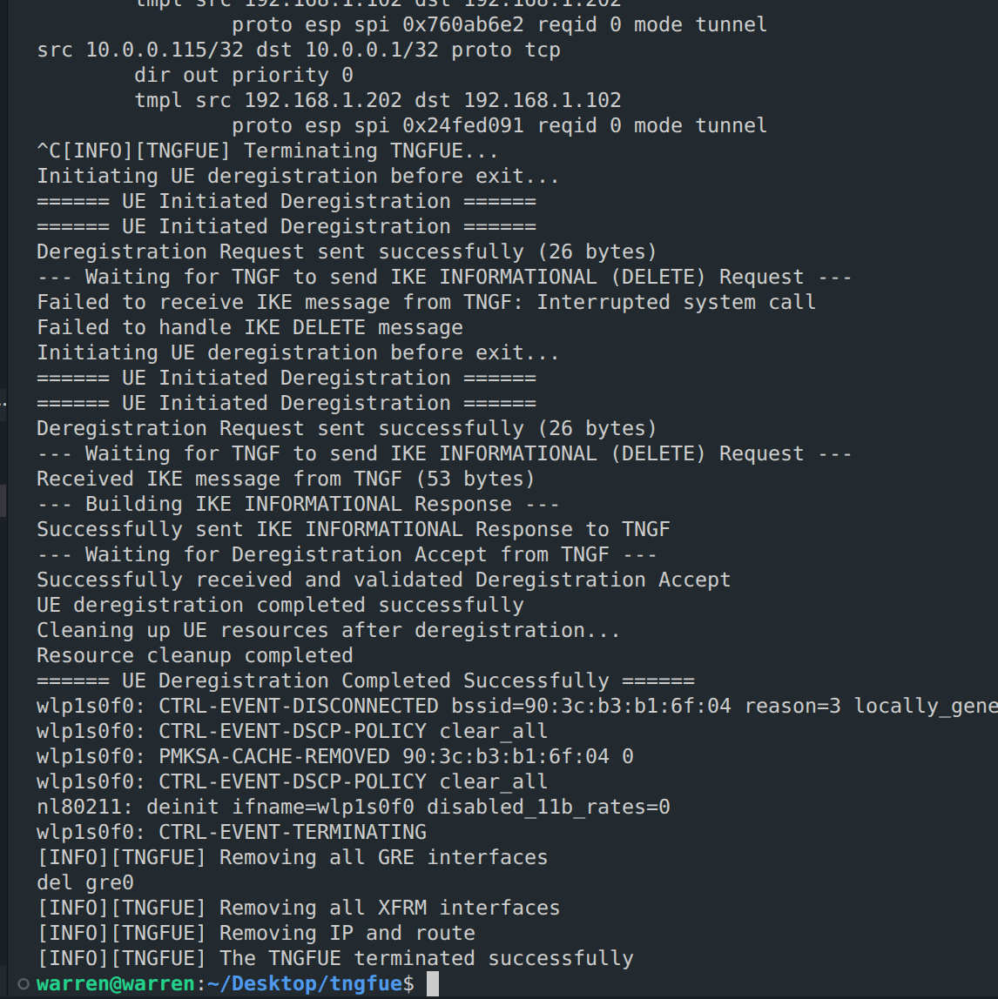
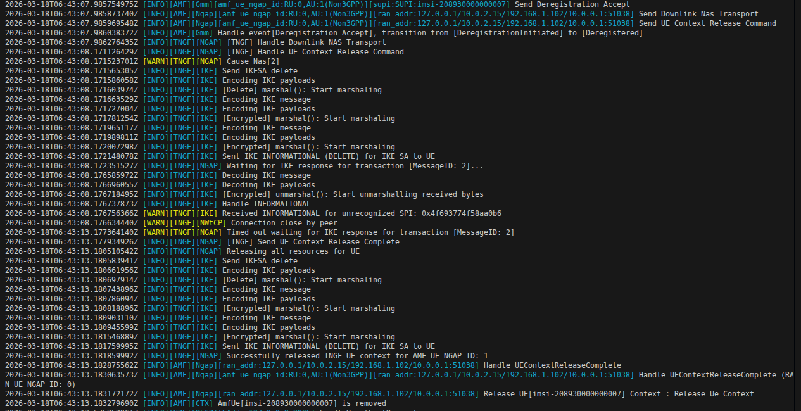

# free5GC TNGF UE Deregistration and IKE/RADIUS Parser DoS Mitigation

>[!NOTE]
> **Author:** [Ng Warren](https://github.com/warren0813)  
> **Date:** 2026/04/17

---

## Introduction

In free5GC deployments that expose **Trusted Non-3GPP access**, the **TNGF (Trusted Non-3GPP Gateway Function)** is the control and security hinge between trusted Wi-Fi access and the 5G Core.

It terminates and coordinates multiple protocols at once:

- **IKEv2/IPsec** for control-plane protection over untrusted transport semantics.
- **NAS over TCP** framing between UE and TNGF.
- **NGAP over N2** toward the AMF.
- **GTP-U context coupling on N3** toward the UPF through TEID and tunnel lifecycle state.

This article has a dual focus:

1. The **normal UE deregistration path** in `tngf-deregister-feat` (what should happen).
2. The **adversarial parser path** (what malformed IKEv2/RADIUS input can do, and how to harden against DoS).

---

## TNGF Role in Deregistration: Why Ordering Matters

UE deregistration in Non-3GPP access is not a single NAS transaction. It is a coordinated teardown across three state machines:

- **NAS mobility state** at AMF.
- **IKE SA and Child SA state** at TNGF and UE.
- **TNGF UE context and transport state** (N2/N3 references, TCP signaling, TEID mappings).

If the order is wrong, common failure modes include:

- UE context removed too early while an IKE transaction is still in flight.
- IKE delete completed but no `UEContextReleaseComplete` sent on N2.
- Deregistration Accept delayed because downlink NAS was cached but not flushed promptly.

---

## TNGF Deregister Flow Overview 

Before diving into implementation details, here is the short deregistration sequence adapted for TNGF in Trusted Non-3GPP access:




2. **Step 2 - N2 UE Context Release Command**
The AMF sends an N2 UE Context Release Command to the TNGF to release the UE's N2 signaling context.

3. **Step 3 - IPsec SA Release Request (NWt)**
The TNGF sends an IKE INFORMATIONAL Request carrying a DELETE payload to the UE, requesting IPsec SA teardown on the NWt side.

4. **Step 4 - IPsec SA Release Response**
The UE acknowledges with an IKE INFORMATIONAL Response, confirming the SA release transaction.

5. **Step 5 - N2 UE Context Release Complete**
After local teardown is confirmed (or timeout fallback is reached), the TNGF sends N2 UE Context Release Complete to the AMF.

This ordering is the key: clean IKE/IPsec shutdown first, then deterministic N2 completion, so the UE does not get stuck in a half-released state.

---

## UE Deregistration Call Flow Through TNGF

Below are only the core code paths that actually control success/failure of UE deregistration.

### 1) UE-side orchestration (single control point)

```c
/* src/eap_peer/eap_vendor_test.c */
void eap_vendor_test_initiate_deregistration(struct eap_sm *sm, void *priv)
{
    ...
    if (eap_vendor_test_send_deregistration(sm, data, ngksi, guti, guti_len) != 0)
        return;
    if (eap_vendor_test_handle_ike_delete(sm, data) != 0)
        return;
    if (eap_vendor_test_process_deregistration_accept(sm, data) != 0)
        return;
}
```

What is happening:

- The UE runs deregistration as a strict 3-step state machine.
- If any step fails, the flow stops immediately instead of continuing with half-valid state.
- This function is the best starting point when debugging UE-side failures.

### 2) UE sends secured NAS with Non-3GPP envelope

```c
/* src/eap_peer/eap_vendor_test.c */
static int eap_vendor_test_send_deregistration(...)
{
    struct wpabuf *dereg_req = eap_vendor_test_build_deregistration_request(...);
    struct wpabuf *secured = BuildSecureNAS(
        SecurityHeaderTypeIntegrityProtectedAndCiphered,
        dereg_req,
        data,
    );
    return send(data->s_tcp, wpabuf_head(secured), wpabuf_len(secured), 0) < 0 ? -1 : 0;
}

static struct wpabuf * BuildSecureNAS(...)
{
    ...
    wpabuf_put_be16(length, wpabuf_len(result));
    result = wpabuf_concat(length, result); /* [2-byte length][NAS payload] */
    return result;
}
```

What is happening:

- Deregistration NAS is integrity-protected and ciphered before transmission.
- The 2-byte length prefix creates the TS 24.502 NAS envelope required on the TCP signaling path.
- If this envelope is wrong, TNGF cannot parse Deregistration Request/Accept reliably.

### 3) TNGF gates N2 release on IKE response (with timeout fallback)

```go
/* internal/ngap/handler/handler.go */
doneChan := make(chan bool, 1)
messageID := ike_handler.SendIKESADeletion(tngfUe.TNGFIKESecurityAssociation)
if messageID == 0 {
    ngap_message.SendUEContextReleaseComplete(amf, tngfUe, nil)
    _ = releaseTngfUeAndIkeSa(tngfUe)
    return
}

tngfUe.TransactionChannels[messageID] = doneChan
select {
case <-doneChan:
case <-time.After(5 * time.Second):
}

ngap_message.SendUEContextReleaseComplete(amf, tngfUe, nil)
_ = releaseTngfUeAndIkeSa(tngfUe)
```

What is happening:

- TNGF sends IKE SA DELETE and tracks that transaction with `MessageID`.
- NGAP release completion waits for IKE response, but only up to 5 seconds.
- This prevents indefinite blocking and still guarantees eventual cleanup.

### 4) MessageID correlation + downlink NAS direct-write/cache logic

```go
/* pkg/ike/handler/handler.go */
if isResponse {
    if doneChan, find := ue.TransactionChannels[message.MessageID]; find {
        doneChan <- true
        close(doneChan)
        delete(ue.TransactionChannels, message.MessageID)
    }
}
```

```go
/* internal/ngap/handler/handler.go + internal/nwtcp/service/service.go */
nasEnv := encapNasMsgToEnvelope(nasPDU)
if tngfUe.TCPConnection != nil {
    _, _ = tngfUe.TCPConnection.Write(nasEnv)
} else {
    tngfUe.TemporaryCachedNASMessage = nasEnv
}

if ue.TemporaryCachedNASMessage != nil {
    _, _ = connection.Write(ue.TemporaryCachedNASMessage)
    ue.TemporaryCachedNASMessage = nil
}
```

What is happening:

- IKE response `MessageID` unblocks the exact waiting NGAP release transaction.
- Deregistration Accept is delivered immediately if TCP is up; otherwise it is cached and flushed on reconnect.
- This is the key mechanism that avoids lost downlink NAS during short signaling races.

These four snippets are the minimum core needed to understand why deregistration is robust in this implementation.

---

## Actual Deregistration Results (TNGFUE and TNGF/AMF)

### TNGFUE Side Deregistration Result



Based on `tngfue-deregister.png`, the UE executes this sequence:

1. **Initiation**
On termination, TNGFUE triggers UE-initiated deregistration and sends the Deregistration Request NAS message.

2. **IKE SA Deletion Receipt**
The UE waits for an IKE INFORMATIONAL (DELETE) request from TNGF to tear down the NWt IPsec tunnel. The log also shows one initial interruption/failure before a successful retry.

3. **IKE SA Deletion Acknowledgment**
The UE builds and sends an IKE INFORMATIONAL Response to acknowledge SA deletion.

4. **Deregistration Acceptance**
The UE waits for and validates the Deregistration Accept from the network.

5. **Local Resource Cleanup**
After successful deregistration, TNGFUE disconnects Wi-Fi (`wlp1s0f0`) and removes GRE interfaces, XFRM interfaces, IP addresses, and routing entries before termination.

### Core Network (TNGF/AMF) Side Deregistration Result



Based on `tngf-deregister.png`, the core side executes this sequence:

1. **Deregistration Accept and N2 Release**
AMF transitions UE state to `Deregistered`, sends Deregistration Accept (Downlink NAS Transport), then sends N2 UE Context Release Command to TNGF.

2. **IKE SA Deletion Request**
TNGF handles the N2 release command and sends IKE INFORMATIONAL (DELETE) to the UE.

3. **IKE Wait and Timeout**
TNGF waits for the IKE transaction response. In this run, an INFORMATIONAL with unrecognized SPI is observed, and the expected response times out.

4. **N2 Release Complete**
After timeout fallback, TNGF sends N2 UE Context Release Complete and releases local UE resources.

5. **Context Removal at AMF**
AMF processes UEContextReleaseComplete and removes the UE context (`AmfUe[...] is removed`).

---

## The Threat: IKEv2 and RADIUS Parser DoS in TNGF

The TNGF sits at a protocol edge where hostile inputs are realistic. Two high-risk parser surfaces are IKEv2 and RADIUS/EAP-5G decoding.

### Attack Surface A: IKEv2 UDP/4500 pre-parse assumptions

When handling NAT-T traffic, code often assumes a 4-byte non-ESP marker exists. If a short packet is accessed without length checking, an out-of-range panic can terminate service and create an easy DoS primitive.

### Attack Surface B: RADIUS AN-Parameter parsing with variable-length fields

In EAP-5G parsing, UE Identity contains nested length semantics. If a parser slices fields (for IEI, length, identity bytes) without strict bounds and consistency checks, malformed attributes can trigger:

- slice-out-of-range panic,
- memory pressure via malformed lengths,
- parser desynchronization and repeated CPU-heavy error handling.

### Attack Surface C: Resource exhaustion via transaction fan-out

Even with correct syntax handling, a flood of malformed or incomplete exchanges can exhaust channel maps, goroutines, CPU, or socket resources if timeout and cleanup paths are weak.

This is why **5G cybersecurity** at the TNGF edge is both protocol-correctness and defensive-runtime engineering.

---

## Code-Level Mitigation: Hardened Parser and Teardown Patterns

Below are concrete hardening patterns and enhancement cases for TNGF.

### Case 1: Guard UDP/4500 non-ESP marker parsing

**Before (vulnerable pattern)**

```go
if localAddr.Port == 4500 {
    for i := 0; i < 4; i++ {
        if msg[i] != 0 {
            return
        }
    }
    msg = msg[4:]
}
```

**After (hardened pattern)**

```go
if localAddr.Port == 4500 {
    if len(msg) < 4 {
        ikeLog.Warnf("Drop short UDP/4500 packet: len=%d", len(msg))
        return
    }

    for i := 0; i < 4; i++ {
        if msg[i] != 0 {
            ikeLog.Warn("Non-IKE UDP/4500 payload (likely ESP), ignore")
            return
        }
    }
    msg = msg[4:]
}
```

Security impact: prevents panic-on-short-input DoS and cleanly drops malformed probes.

### Case 2: Harden UE Identity decoding in RADIUS EAP-5G parser

**Before (vulnerable pattern)**

```go
parameterValue := anParameterField[2:]
parameterValue = parameterValue[:parameterLength]

iei := parameterValue[0]
valLen := binary.BigEndian.Uint16(parameterValue[1:3])
ueIdentity.SetMobileIdentity5GSContents(parameterValue[3:])
```

**After (hardened pattern)**

```go
if parameterLength < 3 {
    return 0, nil, nil, errors.New("invalid UEIdentity parameter: too short")
}

parameterValue := anParameterField[2:]
if len(parameterValue) < int(parameterLength) {
    return 0, nil, nil, errors.New("error formatting")
}
parameterValue = parameterValue[:parameterLength]

if len(parameterValue) < 3 {
    return 0, nil, nil, errors.New("invalid UEIdentity parameter: missing IEI/length")
}

iei := parameterValue[0]
valLen := binary.BigEndian.Uint16(parameterValue[1:3])
mobileIdentityContents := parameterValue[3:]
if int(valLen) != len(mobileIdentityContents) {
    return 0, nil, nil, errors.New("invalid UEIdentity parameter: length mismatch")
}

ueIdentity := nasType.NewMobileIdentity5GS(iei)
ueIdentity.SetLen(valLen)
ueIdentity.SetMobileIdentity5GSContents(mobileIdentityContents)
```

Security impact: closes parser panic vectors and enforces semantic consistency, core to **RADIUS DoS mitigation**.

### Case 3: Enforce strict IKE message/payload bounds checks

A robust IKE parser should validate:

- minimum IKE header length,
- header-advertised total length equality,
- minimum payload header size,
- per-payload length sanity before slicing.

This significantly reduces exploitability of **IKEv2 parser vulnerability** classes (truncation, length mismatch, malformed nested payloads).

### Case 4: Transaction correlation with timeout and cleanup

For deregistration and delete exchanges, use MessageID-correlated channels with timeout fallback and deterministic map cleanup.

This protects both correctness and availability by preventing indefinite blocking and stale transaction state accumulation.

---

## Why These Enhancements Matter for free5GC Security

The improved patterns above are not cosmetic refactors. They directly reduce production risk in edge-facing protocol handlers:

- panic-based process termination is converted into safe packet drops,
- malformed attribute handling becomes explicit and auditable,
- timeout-driven release logic avoids deadlock/stuck-context conditions,
- deregistration remains functional while parser hardening is tightened.

This is exactly the kind of engineering required for **free5GC security** in high-exposure environments.

---

## Testing and Verification Strategy

To verify both security and protocol correctness, combine positive and adversarial testing as summarized below.

| Test Area | What to Execute | Expected Result | Evidence to Collect |
|---|---|---|---|
| Functional regression (normal UE deregistration) | UE sends Deregistration Request -> TNGF sends IKE INFORMATIONAL(DELETE) -> UE replies with matching MessageID -> TNGF sends UE Context Release Complete over N2 -> UE receives Deregistration Accept -> local context/tunnel artifacts are cleared | End-to-end deregistration succeeds with correct signaling order and clean teardown | TNGF logs (NGAP/IKE/NWtCP), packet captures (NAS + IKE), post-check for stale xfrm/TEID/GRE state |
| Negative testing (malformed packet generation) | Inject malformed inputs at parser edges: truncated UDP/4500 packets, IKE payload length mismatches, malformed RADIUS AN-Parameters and UEIdentity lengths | No panic, bounded error handling, malformed packets dropped with explicit logs | Error logs showing rejection path and service continuity during malformed traffic |
| Fuzzing parser entry points | Run Go fuzzers for decode paths (for example IKE decode and EAP-5G unmarshal helpers) | No panic, no unbounded memory growth, deterministic parser error behavior | Fuzzer crash-free runs, reproducible corpus cases, stable memory/CPU trends |
| Capacity and resilience checks | Run malformed traffic bursts and sustained stress against parser and transaction paths | Goroutine count remains bounded, transaction channels cleaned on timeout/response, no sustained CPU saturation | Runtime telemetry (goroutines/CPU/memory), timeout cleanup logs, long-run stability data |

This table provides a practical baseline for **5G cybersecurity** validation in CI and pre-production.

---

## Conclusion

The TNGF deregistration path shows how tightly coupled Non-3GPP control-plane state is across NAS, IKEv2, NGAP, and N3-related context lifecycle. The same code paths that ensure clean UE deregistration are also the code paths exposed to parser-level DoS risk.

Robust length validation, nil-safe handling, strict decode contracts, MessageID-correlated teardown, and timeout-based cleanup are the difference between a recoverable malformed packet and a control-plane outage.


## **Credits**
A huge thank you to my colleague for their collaboration, insights, and support on this journey:

- 🙌 [Peggy Cheng](https://github.com/HiImPeggy) for collaborating on TNGF-Deregistration


## **References**
- [5G; Procedures for the 5G System (5GS) (3GPP TS 23.502 version 16.7.0 Release 16)](https://www.etsi.org/deliver/etsi_ts/123500_123599/123502/16.07.00_60/ts_123502v160700p.pdf)
- [Github: TNGF (feat-ue-deregister)](https://github.com/HiImPeggy/tngf/tree/feat-ue-deregister)
- [Github: TNGFUE (feat-ue-deregister)](https://github.com/warren0813/tngfue/tree/feat-ue-deregister)


## **About**
Hey it's Warren! currently exploring 5G Core and working with free5GC. I’m just learning how things work in practice and building as I go. Still early in the journey, but enjoying the process and learning a lot along the way. I would love to connect with you!

## **Connect with Me**
- GitHub: [Ng Warren](https://github.com/warren0813)

