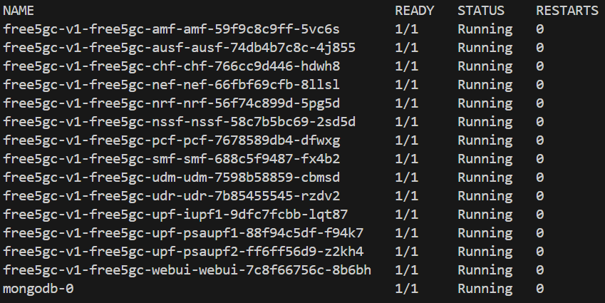

# CNTi & free5gc-helm Integration
>[!NOTE]
> Author: Fang-Kai Ting
> Date: 2026/04/15
---
This guide provides a step-by-step walkthrough for integrating [**free5gc-helm**](https://github.com/free5gc/free5gc-helm) with the [**CNTi (Cloud Native Telecom Initiative)**](https://github.com/lfn-cnti) test suite. It demonstrates how to optimize Helm Chart configurations to align with cloud-native best practices—such as removing Multus-CNI dependencies, enhancing container security, and implementing robust resource limits—to transform free5GC into a carrier-grade Cloud Native Network Function (CNF). By refining these configurations, we move closer to meeting the rigorous technical requirements for official LFN certification.

## Introduction of CNTi test-suite

The Cloud Native Telecom Initiative (CNTi) Test Suite is an open-source testing framework designed to evaluate networking applications and platforms against Kubernetes and cloud-native best practices. Managed under the Linux Foundation Networking (LFN), it provides developers with actionable feedback to ensure their telecom workloads are truly cloud-native. The suite comprises 67 comprehensive tests organized into categories such as compatibility, state, observability, and security. Among these, it highlights 19 critical standard tests that serve as the fundamental benchmarks for compliance. By running these automated checks, organizations can verify that their Cloud Native Network Functions (CNFs) are robust, scalable, and ready for modern telecommunications environments.

[Testcase spec](https://github.com/lfn-cnti/testsuite/blob/main/docs/TEST_DOCUMENTATION.md#latest-tag)

### 19 certification test

| Category | Testcase | Category | Testcase |
| --- | --- | --- | --- |
| Upgradability  | [increase_decrease_capacity](https://github.com/lfn-cnti/testsuite/blob/main/docs/TEST_DOCUMENTATION.md) | Configuration  | [hostport_not_used](https://github.com/lfn-cnti/testsuite/blob/main/docs/TEST_DOCUMENTATION.md) |
| State | [node_drain](https://github.com/lfn-cnti/testsuite/blob/main/docs/TEST_DOCUMENTATION.md) |  | [hardcoded_ip_addresses_in_k8s_runtime_configuration](https://github.com/lfn-cnti/testsuite/blob/main/docs/TEST_DOCUMENTATION.md) |
| Security  | [privileged_containers](https://github.com/lfn-cnti/testsuite/blob/main/docs/TEST_DOCUMENTATION.md) |  | [latest_tag](https://github.com/lfn-cnti/testsuite/blob/main/docs/TEST_DOCUMENTATION.md) |
|  | [non_root_containers](https://github.com/lfn-cnti/testsuite/blob/main/docs/TEST_DOCUMENTATION.md) | Microservice | [specialized_init_system](https://github.com/lfn-cnti/testsuite/blob/main/docs/TEST_DOCUMENTATION.md) |
|  | [cpu_limits](https://github.com/lfn-cnti/testsuite/blob/main/docs/TEST_DOCUMENTATION.md) |  | [single_process_type](https://github.com/lfn-cnti/testsuite/blob/main/docs/TEST_DOCUMENTATION.md) |
|  | [memory_limits](https://github.com/lfn-cnti/testsuite/blob/main/docs/TEST_DOCUMENTATION.md) |  | [zombie_handled](https://github.com/lfn-cnti/testsuite/blob/main/docs/TEST_DOCUMENTATION.md) |
|  | [hostpath_mounts](https://github.com/lfn-cnti/testsuite/blob/main/docs/TEST_DOCUMENTATION.md) |  | [sig_term_handled](https://github.com/lfn-cnti/testsuite/blob/main/docs/TEST_DOCUMENTATION.md) |
|  | [container_sock_mounts](https://github.com/lfn-cnti/testsuite/blob/main/docs/TEST_DOCUMENTATION.md) | Reliability | [readiness](https://github.com/lfn-cnti/testsuite/blob/main/docs/TEST_DOCUMENTATION.md) |
|  | [selinux_options](https://github.com/lfn-cnti/testsuite/blob/main/docs/TEST_DOCUMENTATION.md) |  | [liveness](https://github.com/lfn-cnti/testsuite/blob/main/docs/TEST_DOCUMENTATION.md) |
| Observability  | [log_output](https://github.com/lfn-cnti/testsuite/blob/main/docs/TEST_DOCUMENTATION.md) |  |  |

## Testbed

- OS: ubuntu 20.04
- K8s platform: microk8s
- Two VMs (one cluster, two nodes)
- free5GC-helm NFs version: 4.2.2
- CNF TestSuite version: v1.5.1

## How to install test-suite

1. Install free5gc-helm
    1. It is recommended to first complete the installation following the [official documentation](https://free5gc.org/guide/7-free5gc-helm/) and ensure all Pods are in a running state before proceeding.
        
        
        
2. Install [cnf-testsuite](https://github.com/lfn-cnti/testsuite) according to the [official tutorial](https://github.com/lfn-cnti/testsuite/blob/main/INSTALL.md) 
    1. `source <(curl -s https://raw.githubusercontent.com/lfn-cnti/testsuite/main/curl_install.sh)`
    2. `curl -fsSL https://crystal-lang.org/install.sh | sudo bash` (Not used in the tests below, but included in the minimal install on the official website)
    3. `cnf-testsuite setup`
        
        ```bash
        free5gc@free5gc:~$ cnf-testsuite setup
        CNF TestSuite version: v1.5.1
        Successfully created directories for cnf-testsuite
        Global kubectl found. Version: 1.35
        Global kubectl client is more than 1 minor version ahead/behind server version
        No Local kubectl version found
        KUBECONFIG is set as /home/free5gc/.kube/config.
        Global helm found. Version: 3.20.2
        Local helm not found
        Global git found. Version: 2.25.1
        No Local git version found
        All prerequisites found.
        Dependency installation complete
        ```
        
3. Create testsuite config: `~/free5gc-helm/charts/cnf-testsuite.yml`
    
    ```yaml
    config_version: "v2"
    common:
      hardcoded_ip_exceptions:
        - ip: 8.8.8.8
    deployments:
      helm_dirs:
        - name: free5gc-v1               # Corresponding to the Helm Release Name.
          helm_directory: ./free5gc      # [User must confirm] The Chart directory path relative to this configuration file.
          namespace: free5gc             # Corresponding to helm install -n free5gc.
    ```
    
4. Install the CNF Sandbox environment
    1. `~/free5gc-helm/charts$ cnf-testsuite cnf_install cnf-config=./cnf-testsuite.yml`
        
        
        
        
5. Execute the CNTi certification test cases
    1. `cnf-testsuite cert cnf-config=./cnf-testsuite.yml` (This should be used, but it will hang due to the sig_term_handled bug in the test script)
    2. Because execution will hang at `sig_term_handled`, a script is provided below to skip these three test cases.
        
        ```bash
        #!/bin/bash
        # The following comments are three failed test cases:
        # non_root_containers
        # node_drain
        # sig_term_handled
        
        CONFIG_FILE="./cnf-testsuite.yml"
        test_cases=(
            "specialized_init_system"
            "single_process_type"
            "zombie_handled"
            "increase_decrease_capacity"
            "liveness"
            "readiness"
            "hostport_not_used"
            "hardcoded_ip_addresses_in_k8s_runtime_configuration"
            "privileged_containers"
            "cpu_limits"
            "memory_limits"
            "hostpath_mounts"
            "log_output"
            "container_sock_mounts"
            "selinux_options"
            "latest_tag"
        )
        
        # --- Execution Loop ---
        echo "🚀 Starting cnf-testsuite tests one by one..."
        
        for test_name in "${test_cases[@]}"; do
            echo "🎬 Testing: [${test_name}]"
            # Execute test command
            cnf-testsuite "${test_name}" cnf-config="${CONFIG_FILE}"
            
            # Check the exit code of the previous command. If not 0 (failure), pause.
            if [ $? -ne 0 ]; then
                echo "❌ Test [${test_name}] failed. Script paused. Please check the error message."
                # Uncomment the following line if you want the script to exit immediately on error
                # exit 1
            fi
            echo "--------------------------------------------------"
        done
        
        echo "✅ All tests completed!"
        ```
        

## Test result

Currently, 16 test cases can be passed. Three cases cannot be passed due to test script bugs or the free5gc-helm architecture:

- non_root_containers
- node_drain
- sig_term_handled

```bash
free5gc@free5gc:~/free5gc-helm/charts$ ./test-workload.sh 
🚀 Starting cnf-testsuite tests one by one...
🎬 Testing: [specialized_init_system]
✔️  🏆PASSED: [specialized_init_system] Containers use specialized init systems 🖥️ 🚀
--------------------------------------------------
🎬 Testing: [single_process_type]
✔️  🏆PASSED: [single_process_type] Only one process type used ⚖👀
--------------------------------------------------
🎬 Testing: [zombie_handled]
✔️  🏆PASSED: [zombie_handled] Zombie handled ⚖👀
--------------------------------------------------
🎬 Testing: [increase_decrease_capacity]
✔️  🏆PASSED: [increase_decrease_capacity] Replicas increased to 3 and decreased to 1 📦📈📉
--------------------------------------------------
🎬 Testing: [liveness]
✔️  🏆PASSED: [liveness] All workload resources have at least one container with a liveness probe ⎈🧫
--------------------------------------------------
🎬 Testing: [readiness]
✔️  🏆PASSED: [readiness] All workload resources have at least one container with a readiness probe ⎈🧫
--------------------------------------------------
🎬 Testing: [hostport_not_used]
✔️  🏆PASSED: [hostport_not_used] HostPort is not used 
--------------------------------------------------
🎬 Testing: [hardcoded_ip_addresses_in_k8s_runtime_configuration]
✔️  🏆PASSED: [hardcoded_ip_addresses_in_k8s_runtime_configuration] No hard-coded IP addresses found in the runtime K8s configuration 
--------------------------------------------------
🎬 Testing: [privileged_containers]
✔️  🏆PASSED: [privileged_containers] No privileged containers 🔓🔑
--------------------------------------------------
🎬 Testing: [cpu_limits]
✔️  🏆PASSED: [cpu_limits] Containers have CPU limits set 🔓🔑
--------------------------------------------------
🎬 Testing: [memory_limits]
✔️  🏆PASSED: [memory_limits] Containers have memory limits set 🔓🔑
--------------------------------------------------
🎬 Testing: [hostpath_mounts]
✔️  🏆PASSED: [hostpath_mounts] Containers do not have hostPath mounts 🔓🔑
--------------------------------------------------
🎬 Testing: [log_output]
✔️  🏆PASSED: [log_output] Resources output logs to stdout and stderr 📶☠️
--------------------------------------------------
🎬 Testing: [container_sock_mounts]
✔️  🏆PASSED: [container_sock_mounts] Container engine daemon sockets are not mounted as volumes 🔓🔑
--------------------------------------------------
🎬 Testing: [selinux_options]
✔️  🏆PASSED: [selinux_options] Pods are not using custom SELinux options that can be used for privilege escalations 🔓🔑
--------------------------------------------------
🎬 Testing: [latest_tag]
✔️  🏆PASSED: [latest_tag] Container images are not using the latest tag
```

## What issue met & how to fix

For detailed information on all changes, please refer to: [feat: cnti best practice by qawl987 · Pull Request #14 · free5gc/free5gc-helm](https://github.com/free5gc/free5gc-helm/pull/14)

Below is an analysis of the problems encountered with the original free5gc-helm during the certification test cases and how I fixed them. Test cases that did not encounter issues are not analyzed.

### 3 Failed testcase

1. [sig_term_handled](https://github.com/lfn-cnti/testsuite/blob/main/docs/TEST_DOCUMENTATION.md):
    1. Description: This tests if the PID 1 process of containers handles SIGTERM.
    2. Expectation: Sigterm is handled by PID 1 process of containers.
    3. Encountered two bugs in the test scripts.
        - Fixed issue: Script failed to detect subprocess-closed MongoDB. Now standalone MongoDB passes.
            - [[BUG] sig_term_handled test fails for MongoDB · Issue #2326 · lfn-cnti/testsuite](https://github.com/lfn-cnti/testsuite/issues/2326)(Fixed & Closed)
        - Remained issue: In full deployment with free5GC NFs, the script still misses MongoDB despite NFs logging “pass,” causing infinite test loops
            - [[BUG] sig_term_handled cannot detect MongoDB while other NFs are detected · Issue #2345 · lfn-cnti/testsuite](https://github.com/lfn-cnti/testsuite/issues/2345)(Open)
2. [non_root_containers](https://github.com/lfn-cnti/testsuite/blob/main/docs/TEST_DOCUMENTATION.md)
    1. Expectation: Checks if the CNF has runAsUser and runAsGroup set to a user id greater than 999. Also checks that the allowPrivilegeEscalation field is set to false for the CNF.
    2. Modification: Restrict user PID to 1000 and change SBI port from 80 to 8080.
        - Previous
            ```
            service:
                type: ClusterIP
                port: 80
            podSecurityContext: {}
            securityContext: {}
            ```
        - New
            ```
            service:
                type: ClusterIP
                port: &Port 8080
            podSecurityContext:
                runAsUser: 1000
                runAsGroup: 1000
                runAsNonRoot: true
                fsGroup: 1000
            securityContext:
                allowPrivilegeEscalation: false
            ```
    3. Result: Because the gtp5g kernel module requires root privileges, modifying the podSecurityContext prevents the UPF from running and causes the test to fail, as root privileges are required to create the gtp5g interface.
        
3. [node_drain](https://github.com/lfn-cnti/testsuite/blob/main/docs/TEST_DOCUMENTATION.md)
    1. Description: A node is drained and workload resources rescheduled to another node, passing with a liveness and readiness check. This will skip when the cluster only has a single node. 
    2. Problem: 
        1. The free5gc-helm tutorial utilizes microk8s hostpath-storage, which does not satisfy the requirements for cross-node storage testing; therefore, Longhorn was used for deployment in this test case.
        2. The original architecture used cert-pvc shared among all NFs to store OAuth keys. If the AMF runs on Node 1 and the SMF runs on Node 2, both need to mount cert-pvc. In this scenario, Longhorn throws a Multi-Attach error. However, using a PV to store OAuth keys is an unusual design, as PVs should be used for persistent and frequently changing data like databases. Thus, the first issue was resolved by switching the OAuth key storage to a Kubernetes Secret.
        3. Regarding the second issue, MongoDB still relies on PV/PVC for data storage, but the current MongoDB design utilizes only a single replica with RWO (ReadWriteOnce) mode. When MongoDB is migrated from Node A to Node B, the disk must be detached from Node A before it can be attached to Node B. A timing race condition occurs if the detachment from Node A is slightly delayed or the startup of Node B is too rapid. When Node B attempts to access the disk while Node A still holds the lock, a Multi-Attach error occurs. The success rate is approximately 13/14, resulting in one or two failures per test run. Since the test requires a 100% success rate, ensuring a pass will require modifying the configuration to a dual-replica MongoDB in the future.
    3. Modification: 
        1. Use Longhorn for cross-node storage to handle NF migration during node drain.
        2. Removing shared cert-pvc (RWX) for NFs OAuth keys caused multi-attach errors; replaced with Secrets.
            1. free5gc-helm/charts/free5gc/templates/nf-secrets.yaml: Reads the OAuth keys from free5gc-helm/charts/free5gc/cert and creates secrets for each NF.
            2. [Relevant Commits](https://github.com/qawl987/free5gc-helm/commit/25332427fbf3d839dc54c2dc4902777bcba4adff)
    4. Result:
        1. Without two MongoDB replicas, this race condition persists; however, there are currently no plans to change the standalone MongoDB deployment.

### **10 Tests passed after changes**

1. [hardcoded_ip_addresses_in_k8s_runtime_configuration](https://github.com/lfn-cnti/testsuite/blob/main/docs/TEST_DOCUMENTATION.md)
    1. Description: The hardcoded ip address test will scan all of the CNF's workload resources and check for any static, hardcoded ip addresses being used in the configuration.
    2. Problem: Previous free5gc-helm used multus-cni to create Nx network interfaces; however, the configmaps (for SMF, AMF, etc.) required the IP addresses of these Nx interfaces. Hardcoding these IP addresses resulted in a failure to pass the test cases.
        
        
        
    3. Modification:
        1. Removed Multus-CNI dependency; Embraced K8s native network.
        
        
        
    4. detailed modification:
        1. Deleted Network Attachment Definition (NAD) Files
        2. Removed Multus Annotations
        3. Created Headless Services (For Nx interface)
        4. uses Pod IP for its own interfaces (For Nx interface)
        5. Used ConfigMap dynamic headless-service discovery to resolve Pod IPs as Nx interface IPs, eliminating all hardcoded IP issues.
        6. Implemented Dynamic IP Configuration
        `Ex: UPFB_IP=$(getent hosts {{ $.Release.Name }}-free5gc-upf-upfb-service 2>/dev/null | awk '{print $1}' | head -1)`
        7. gNB connects to AMF via Service DNS name

2. [increase_decrease_capacity](https://github.com/lfn-cnti/testsuite/blob/main/docs/TEST_DOCUMENTATION.md)
    1. Description: HPA (horizontal pod autoscaler) will autoscale replicas to accommodate when there is an increase of CPU, memory or other configured metrics to prevent disruption by allowing more requests by balancing out the utilisation across all of the pods.
    2. Modification: Same as the previous one.
3. [single_process_type](https://github.com/lfn-cnti/testsuite/blob/main/docs/TEST_DOCUMENTATION.md)
    1. Description: This verifies that there is only one process type within one container. This does not count against child processes.
    2. Modification: Passed the test after replacing the shell with the NF binary using `exec`
        1. `/free5gc/upf -c {{ .volume.mount }}/upfcfg.yaml` → `exec /free5gc/upf -c {{ .volume.mount }}/upfcfg.yaml`
4. [specialized_init_system](https://github.com/lfn-cnti/testsuite/blob/main/docs/TEST_DOCUMENTATION.md)
    1. Description: This tests if containers in pods have dumb-init, tini or s6-overlay as init processes. 
    2. Expectation: Container images should use specialized init systems for containers.
    3. Modification: Passed after installing `tini` as the entrypoint process
        1. before
            
            ```bash
            command: ["./amf"]
            args: ["-c", "./config/amfcfg.yaml"]
            ```
            
        2. after
            
            ```bash
            command:
              - "/sbin/tini"
              - "--"
              - "./amf"
            args:
              - "-c"
              - "./config/amfcfg.yaml"
            ```
            
5. [zombie_handled](https://github.com/lfn-cnti/testsuite/blob/main/docs/TEST_DOCUMENTATION.md)
    1. Description: This tests if the PID 1 process of containers handles/reaps zombie processes.
    2. Expectation: Zombie processes are handled/reaped by PID 1 process of containers.
    3. Modification: Tini install fixed this issue
6. [readiness](https://github.com/lfn-cnti/testsuite/blob/main/docs/TEST_DOCUMENTATION.md) & [liveness](https://github.com/lfn-cnti/testsuite/blob/main/docs/TEST_DOCUMENTATION.md)
    1. Description: This test verifies that each workload resource includes at least one container with a readiness probe configured. 
    2. Expectation: Each workload resource should have at least one container with a readiness probe defined.
    3. Modification:
        1. Listen on SBI HTTP port 8080 for readiness and liveness probes.
        2. `grep -q ':2265 .* 07 ' /proc/net/udp` (UPF)
        3. `grep -q ':1F90 .* 0A ' /proc/net/tcp` (Other NFs)
    4. Attempted to use the NF's "hello world" API as a probe, but it caused excessive logging; furthermore, some NFs do not have a "hello world" API.
7. [privileged_containers](https://github.com/lfn-cnti/testsuite/blob/main/docs/TEST_DOCUMENTATION.md)
    1. Description: Checks if any containers are running in privileged mode. 
    2. Expectation: Containers should not run in privileged mode
    3. Modification:
        1. `allowPrivilegeEscalation: false`
8. [cpu_limits](https://github.com/lfn-cnti/testsuite/blob/main/docs/TEST_DOCUMENTATION.md) & [memory_limits](https://github.com/lfn-cnti/testsuite/blob/main/docs/TEST_DOCUMENTATION.md)
    1. Check if there is a `containers[].resources.limits.cpu` field defined for all pods in the CNF.
    2. Expectation: Containers should have cpu limits defined
    3. Modification:
        1. Add limits to NFs: mostly 0.1 CPU, with 0.15-0.3 CPU for AMF, SMF, and UPF.
        2. Add limits to NFs: 256M

### Conclusion of free5gc-helm improvement

1. Single process per Pod
    1. Specialized init system
    2. Zombie process handling
    3. SIGTERM handling
2. Liveness & readiness probes
3. Non-root containers setting
4. CPU & memory limits
5. Node drain supported
    1. Migrated non-compliant cert-pvc storage to K8s Secrets
6. Removed Multus-CNI dependency
    1. Eliminated hardcoded IPs
    2. HPA supported
    3. Scaling up/down supported

## How we get certification

According to the [official terms](https://github.com/lfn-cnti/certification/blob/main/Certified_CNTi_Terms.md) by LFN-CNTi Certification, passing 16 out of 19 certification test cases meets the eligibility requirements to apply for certification. Currently, certification has not yet been obtained and is pending response from CNTi and LFN. They stated that we can first claim that we have passed the tests.

# Conclusion

This guide summarized the implementation of advanced cloud-native optimizations within the free5gc-helm project. By addressing key architectural areas like single-process management, dynamic service discovery, and specialized init systems, we successfully passed 16 out of 19 certification test cases. These refinements ensure that free5GC remains a reliable, secure, and highly scalable foundation for automated 5G core deployments, fulfilling the eligibility requirements to apply for official CNTi certification.

### About me

Hi, I’m Fang-Kai Ting, currently conducting research on Network Slicing. Let me know without hesitation if there is any mistake in the article.

### Connect with Me

Github: [qawl987](https://github.com/qawl987)

Linkedin: [www.linkedin.com/in/方凱-丁-a26a7925a](http://www.linkedin.com/in/%E6%96%B9%E5%87%B1-%E4%B8%81-a26a7925a)